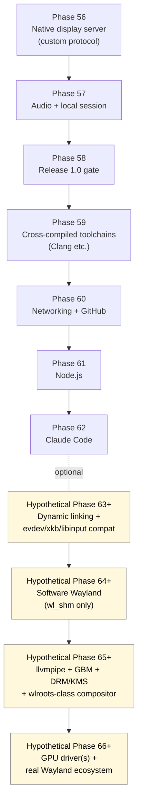
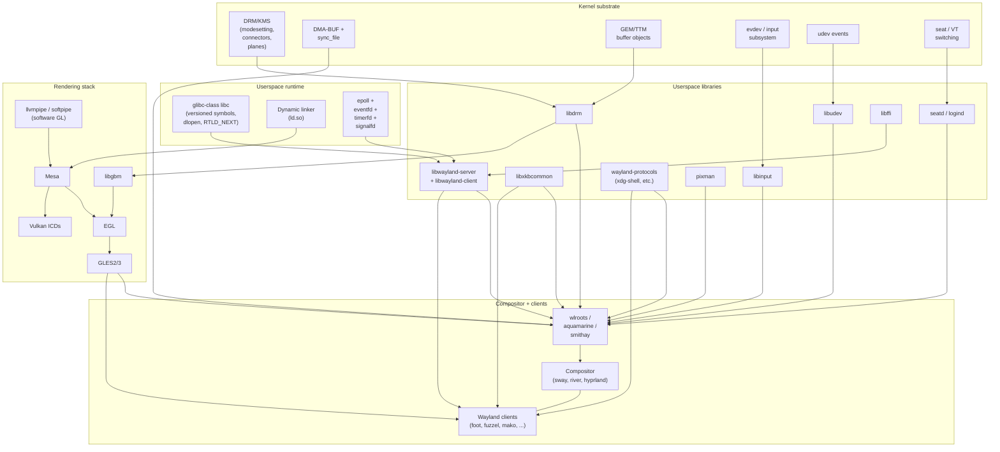

# Wayland Gap Analysis

**Status:** Research / non-binding
**Updated:** 2026-04-18
**Related phases:** [Phase 56](../../roadmap/56-display-and-input-architecture.md),
[Phase 57](../../roadmap/57-audio-and-local-session.md),
[Phase 58](../../roadmap/58-release-1-0-gate.md),
[Phase 59–62](../../roadmap/README.md)
**Companion docs:** [tiling-compositor-path.md](./tiling-compositor-path.md),
[`docs/evaluation/gui-strategy.md`](../../evaluation/gui-strategy.md)

## Bottom line

The official roadmap does not put Wayland in any phase, including the post-1.0
Phases 59–62. `docs/evaluation/gui-strategy.md` explicitly recommends *not*
adopting Wayland early and treats it as a much later concern after a m3OS-native
display server is real.

This document exists to make the cost of a Wayland direction concrete — what
the substrate gap actually looks like, layered top to bottom, and what three
realistic paths into Wayland would each require.

The short version:

- **Phase 56's deliverable is an Orbital-style native compositor**, not a
  Wayland compositor. It defines its own client protocol over m3OS IPC and
  shared buffers. Nothing in 56 obligates the project toward Wayland later.
- A **minimum-credible Wayland surface** (software-only, `wl_shm` clients) is
  one large, well-scoped phase of work after the native compositor stabilizes
  and after a few cross-cutting prerequisites land (dynamic linking, evdev
  compat, xkbcommon, libwayland port).
- A **full Wayland stack** (libwayland + wlroots/aquamarine + Mesa + GPU
  driver) is a multi-year program comparable in size to several roadmap phases
  combined, and currently has no slot.

## Where this fits on the roadmap

The dashed phases are not on the roadmap. They are sketched here only to make
the magnitude visible.

## What Phase 56 actually ships (and doesn't)

Per `docs/roadmap/56-display-and-input-architecture.md`:

Ships:

- One userspace process owns the framebuffer and arbitrates which client
  surfaces are visible.
- A **m3OS-native client protocol** built on existing IPC primitives (capability
  grants, AF_UNIX sockets, page-grant buffer transport from Phase 50).
- A keyboard + mouse event model routed through userspace with focus awareness.
- Crash/recovery semantics for the display service via the Phase 51 supervision
  baseline.

Does not ship:

- DRM/KMS-equivalent kernel mode-setting interface.
- DMA-BUF, GEM-style buffer objects, or any GPU-aware buffer transport.
- Any GPU driver, Mesa, or hardware acceleration.
- libinput-equivalent device library or evdev event codes.
- xkbcommon or any keymap library.
- Wayland wire protocol support (server or client).
- Dynamic linking; everything still ships statically linked.
- Multiple seats, VT switching, or seat management (`logind`/`seatd`).

Phase 56 also explicitly defers (per its "Deferred Until Later" section) rich
toolkit ecosystems, hardware-accelerated composition, broader USB HID, and
desktop polish such as clipboard managers and notifications.

## Anatomy of a real Wayland system

To make the gap concrete it helps to picture the layer cake of a working
Wayland system today, then strike out the lines that don't yet exist on m3OS.

Of those boxes, **m3OS today has parts of `K`, parts of `R`, and none of
`U`/`G`/`C`**. The rest of this document walks the gap by layer.

## Layer-by-layer gap analysis

### 1. Kernel substrate

| Need | Linux/Wayland expectation | m3OS today | Gap |
|---|---|---|---|
| Mode setting | DRM/KMS: enumerate connectors, set modes, atomic commits, page flips | Linear framebuffer set up by bootloader; `kernel/src/fb` owns it; no enumeration, no mode change after boot | Build a DRM-equivalent (does not need to be wire-compatible) — connector enumeration, mode listing, atomic mode set, page flip, vblank events |
| Cross-process buffers | DMA-BUF FDs passed via SCM_RIGHTS; importable by GPU and display | Phase 50 page-grant transport exists, but it is capability-shaped, not FD-shaped | Either give the page-grant a file-descriptor face, or implement a DMA-BUF-equivalent FD type with map/unmap/import semantics |
| GPU buffer objects | GEM/TTM-style ref-counted GPU memory | None | Either build (only meaningful with a GPU) or skip until GPU work begins |
| Input | evdev character devices delivering `input_event` structs with `linux/input-event-codes.h` codes | Phase 56 designs a m3OS-native input event protocol over IPC | Add an evdev-shaped emitter (either kernel device nodes or a userspace shim) so libinput-class code can run unmodified |
| Hotplug events | udev/uevent over netlink | None | Either provide a udev-equivalent enumeration source or stub it (single-display systems can mostly ignore hotplug) |
| Seat / VT | `/dev/tty*`, VT_ACTIVATE ioctls; logind D-Bus or seatd socket | Single console, no VT switching | Either implement multi-seat / VT switching or constrain Wayland to a single seat (probably acceptable for a long time) |
| Vblank / present timing | DRM vblank events delivered to compositor for frame pacing | Single hardware blit; no vsync tracking | Add a vsync interrupt path and an event to userspace for it |

The biggest item in this table is **DRM-equivalent mode setting and a
DMA-BUF-equivalent buffer transport**. Without them, Wayland is constrained to
a single client buffer model copied through CPU memory — workable for software
clients, but a hard ceiling.

### 2. Userspace runtime

| Need | Wayland expectation | m3OS today | Gap |
|---|---|---|---|
| Dynamic linking | Mesa, libwayland, libxkbcommon all ship as shared libraries; Mesa loads DRI/Vulkan ICDs via `dlopen` | All-static; no `ld.so`; `dlopen` not implemented | Build a dynamic linker (ELF DT_NEEDED, GOT/PLT, lazy resolution) and a runtime loader. This is a whole sub-project of its own; `usability-roadmap.md` flags it as a Stage 3 gap. |
| libc compatibility | glibc-isms: versioned symbols, `dlopen`/`dlsym`/`dlvsym`, `RTLD_NEXT`, `__attribute__((constructor))`, TLS, `pthread_*`, NSS hooks | musl-cross + a custom syscall layer; pthreads via Phase 40; partial | Audit each library's libc demands; add musl-on-m3OS shims for missing pieces; accept that some glibc-only paths (NSS, `dlmopen`) won't be available |
| Event loop primitives | `epoll`, `eventfd`, `timerfd`, `signalfd`, `pipe2(O_CLOEXEC \| O_NONBLOCK)` | `epoll` from Phase 37; signalfd/timerfd/eventfd unclear (likely missing or partial); CLOEXEC/NONBLOCK on AF_UNIX after Phase 54a | Add the missing `*fd` syscalls; verify CLOEXEC across all FD-creation paths |
| FD passing | `SCM_RIGHTS` over AF_UNIX; required for buffer/keymap/clipboard handoff | Phase 39 ships AF_UNIX; SCM_RIGHTS support needs verification | Confirm SCM_RIGHTS on stream and dgram; add it if missing |
| `mmap` semantics | `MAP_SHARED` cross-process for buffer pools | Phase 36 shipped expanded mmap; cross-process MAP_SHARED needs verification for the wl_shm use case | Confirm or add cross-process MAP_SHARED with refcounted backing pages |
| Filesystem layout | `/run/user/UID`, `/dev/dri/cardN`, `/dev/input/event*`, `/usr/share/X11/xkb`, `/usr/share/wayland-protocols` | None of these by convention | Decide on FHS adherence; create the directories the libraries expect; ship the keymap data files |

**The gating items here are dynamic linking and the small `*fd` syscalls.**
Everything else is plumbing that gets resolved as ports surface needs.

### 3. Protocol and library layer

| Library | Purpose | Approximate size | Port difficulty on m3OS |
|---|---|---|---|
| libwayland (server + client) | Wire protocol marshalling, event loop integration, FD passing | ~10–15k LoC C | Medium. Pure C, depends on libffi and basic POSIX. The hard part is matching its event loop assumptions (`wl_event_loop` uses `epoll` + `signalfd`/`timerfd` style FDs). |
| wayland-protocols | XML protocol files (xdg-shell, layer-shell, etc.); compiled at build time | Headers/data, no runtime | Trivial — just files. |
| libffi | Function-call dispatch for libwayland's marshaller | ~5k LoC C/asm per arch | Already ports to almost anything; small but architecture-specific. |
| libxkbcommon | Keymap compilation and key event interpretation | ~30k LoC C | Medium. Needs filesystem access for XKB config files (`/usr/share/X11/xkb`). No GUI dependency. |
| pixman | Software pixel composition primitives | ~70k LoC C | Medium. CPU-only; main risk is SIMD assumptions vs. m3OS's `-mmx,-sse` policy — likely needs scalar-only build. |
| libdrm | Userspace DRM ioctl wrapper | ~30k LoC C | Hard if you build a real DRM substrate; trivial to stub if you don't. |
| libinput | Input device handling on top of evdev | ~50k LoC C | Hard. Demands udev, libudev, evdev, libwacom. Replacing it with a m3OS-native shim is probably easier than porting. |
| libudev | Device enumeration and hotplug | ~40k LoC C | Hard. Tied to Linux netlink uevent infrastructure. Stub or replace. |
| seatd | Session/seat management daemon | ~3k LoC C | Easy if you don't need multi-seat; can stub the protocol and always return "you have the seat". |

**Cumulative**: a software-only Wayland stack (libwayland + xkbcommon + pixman
+ stubbed libinput/udev/seatd) is in the **150–200k LoC C port** range. Big
but bounded.

### 4. Rendering stack

| Component | Purpose | Notes |
|---|---|---|
| Mesa | Umbrella project providing OpenGL, GLES2/3, Vulkan | ~2M LoC C/C++. Heavy build system (Meson + Python). Needs `dlopen` for DRI driver loading. |
| llvmpipe | Software OpenGL backend in Mesa | ~250k LoC C++. Depends on LLVM. Standalone-ish, but still requires Mesa scaffolding. |
| swrast | Older software rasterizer in Mesa | Smaller but legacy; not viable for modern Wayland clients. |
| GBM | Generic Buffer Management — links DRM and EGL | Small (~5k LoC) but assumes DRM + DMA-BUF in kernel. |
| EGL | Window-system binding for OpenGL ES | Small interface; implementation lives in Mesa. |
| GLES2/3 | The actual graphics API clients use | Implemented inside Mesa. |
| LLVM | Required by llvmpipe | ~10M LoC C++. Effectively a separate sub-project to bring up. Phase 59 plans Clang/LLVM in the toolchain layer; runtime use is more demanding. |

The rendering layer is the largest single block of work. Even *software-only*
modern Wayland realistically wants Mesa + llvmpipe + LLVM, because most
clients use EGL/GLES2 by default. A serious Wayland milestone implies
shipping Mesa.

### 5. Toolchain

| Need | Reason |
|---|---|
| Cross-compile or in-OS C99 + C++17/20 toolchain | libwayland (C99), wlroots (C11), Mesa (C11/C++17), Hyprland (C++23), Sway (C11), River (Zig) |
| C++ runtime (libc++ or libstdc++) | Anything in C++ needs an STL implementation, exception handling, RTTI |
| Meson + Ninja + Python 3 | All of Mesa, wlroots, sway, hyprland use Meson |
| pkg-config | Universal in Wayland builds |
| LLVM | Required by llvmpipe; probably easier than GCC for the project |

Phase 59 (cross-compiled toolchains) is the closest thing the roadmap has to
this — but it's scoped to git/Python/Clang, not to building Mesa. The
distance between "Phase 59 lands" and "we can build Mesa" is non-trivial,
mostly in C++ runtime and Meson + Python ergonomics.

### Aggregate gap heatmap

```mermaid
flowchart LR
    subgraph today["What m3OS has today"]
        T1["Linear framebuffer"]
        T2["Phase 56 native protocol<br/>(planned)"]
        T3["AF_UNIX, mmap, epoll"]
        T4["musl-cross, static linking"]
    end

    subgraph small["Small, scoped work"]
        S1["evdev shim"]
        S2["libxkbcommon port"]
        S3["pixman port (scalar)"]
        S4["libwayland port"]
        S5["wl_shm cross-process buffers"]
    end

    subgraph medium["Medium, multi-phase work"]
        M1["Dynamic linker + libc shims"]
        M2["DRM-equivalent + DMA-BUF FDs"]
        M3["wlroots-class compositor port"]
        M4["seatd/udev replacements"]
    end

    subgraph large["Large, multi-year work"]
        L1["Mesa + llvmpipe<br/>(software GL)"]
        L2["LLVM runtime"]
        L3["GPU driver(s)"]
        L4["Full Wayland app ecosystem<br/>(GTK/Qt level)"]
    end

    today --> small --> medium --> large
```

## Three concrete paths

### Path A — minimum credible Wayland (software, `wl_shm` only)

**Goal:** unmodified Wayland clients that use only `wl_shm` (e.g. simple
terminals like `foot --no-bold`, basic test apps) can connect to a m3OS
compositor.

Required additions, in order:

1. Dynamic linker + libc shims for the libwayland set.
2. Small evdev emitter on top of Phase 56 input.
3. libxkbcommon port + a stock keymap data drop.
4. pixman port (scalar build — m3OS disables MMX/SSE per `.cargo/config.toml`).
5. libwayland port (server + client).
6. Cross-process `MAP_SHARED` semantics suitable for `wl_shm` pools, including
   refcounted backing pages.
7. SCM_RIGHTS verification on AF_UNIX (audit gap).
8. A m3OS-native compositor that grows a Wayland-server backend alongside its
   native protocol surface.

Excluded:

- Any GLES/EGL surface support. Clients that want GL will not work.
- Hardware acceleration of any kind.
- Multi-seat, VT switching, hotplug.
- xdg-decoration negotiation, fractional scaling, primary selection,
  text-input-v3, and other "expected but optional" protocols (add later).

**Estimated size:** one large phase if a m3OS-native compositor already exists
to graft the Wayland backend onto. Closer to two phases if dynamic linking
isn't done yet.

### Path B — full software Wayland (Mesa + llvmpipe, no GPU driver)

**Goal:** unmodified Wayland clients including those using GLES2 (most
toolkits) work; everything renders on the CPU.

On top of Path A, add:

1. LLVM runtime brought up to a buildable, runnable state in m3OS.
2. Mesa + llvmpipe ported, including its build system (Meson + Python), and
   the GBM/EGL surface back-ends adapted to m3OS's buffer model.
3. DRM-equivalent kernel substrate (mode setting, page flip, vblank events) —
   even llvmpipe wants a DRM-shaped `/dev/dri/cardN` to talk to via libdrm/GBM
   in the standard Wayland flow.
4. DMA-BUF-equivalent FD type passable via SCM_RIGHTS.
5. seatd shim (single-seat).
6. Honest libudev replacement that enumerates the one display.

**Estimated size:** multiple phases, dominated by Mesa+LLVM. Probably the same
order of magnitude as Phases 31 (Compiler Bootstrap) + 32 (Build Tools)
combined, maybe more.

### Path C — full hardware-accelerated Wayland

**Goal:** Wayland clients render on the GPU; compositor uses GPU for
composition; modern Wayland apps work at expected performance.

On top of Path B, add:

1. At least one real GPU driver. Realistic options on QEMU first:
   - virtio-gpu (already partly there in QEMU; needs DRM + driver).
   - Intel i915 on bare metal (very large) or AMD amdgpu (also very large).
2. Real DRM atomic mode setting (planes, cursors, overlays).
3. Sync primitives (`sync_file`, `dma-fence`).
4. Full multi-monitor, hotplug, output management protocols.
5. Power management for GPUs.
6. The ongoing maintenance cost of tracking Mesa + driver releases.

**Estimated size:** multi-year, comparable to several roadmap phases combined.
Out of scope for any current planning horizon.

## Decision matrix

| Dimension | Path A (wl_shm) | Path B (software Wayland) | Path C (hw Wayland) |
|---|---|---|---|
| Kernel changes | Small (cross-proc MAP_SHARED, SCM_RIGHTS verify) | Large (DRM + DMA-BUF) | Larger (GPU driver, sync) |
| Userspace runtime | Dynamic linker, evdev shim, libc gap-fill | + Meson/Python build environment | + GPU driver runtime |
| Library ports | libwayland, xkbcommon, pixman | + Mesa, libdrm, GBM, libudev, seatd | + GPU userspace stack |
| Apps that work | Simple software clients (foot, basic widgets) | Most Wayland apps (slow) | Most Wayland apps (fast) |
| Time-to-first-result | One phase (~quarter scale) | Multiple phases | Multi-year |
| Architectural risk | Low | Medium (Mesa/LLVM size) | High (GPU drivers) |
| Maintenance burden | Low | Medium | High (track upstream Mesa + drivers) |
| Strategic value | Compatibility hook for niche clients | "We run Wayland" claim is real | True desktop-class system |

## Open questions

1. **Is Wayland-app compatibility actually a goal**, or is it just an
   aesthetic alignment because Wayland is the modern Linux thing? If the
   answer is "we want ecosystem reuse", Path B is the floor. If the answer is
   "we want a Hyprland-shaped UX", that is a *separate* question answered by
   [tiling-compositor-path.md](./tiling-compositor-path.md), and it does not
   require Wayland at all.
2. **Where does dynamic linking land?** It is a Stage-3 gap in
   `usability-roadmap.md` but no phase owns it. Without it, every Path here is
   stuck at Step 1.
3. **Should the m3OS-native compositor be designed with a future Wayland
   backend in mind?** Specifically: should its surface/buffer/event model be
   shaped so a Wayland adapter is a thin layer rather than a parallel
   reimplementation?
4. **Does the project want Mesa, or does it want a smaller native software
   rasterizer for its own GLES-equivalent?** Path B's biggest cost is Mesa.
5. **What about X11 instead?** XWayland is the standard answer for X11 apps,
   but a tiny in-house X server (think `Xvnc` minus the network) might be
   easier to port than Mesa. This is its own investigation.

## What this is not

This document is **not** a Wayland implementation plan. It is a sizing
exercise. Adopting any of the three paths requires a dedicated phase doc that
follows the template in `docs/appendix/doc-templates.md` and an explicit
roadmap update.

## References

- [`docs/roadmap/56-display-and-input-architecture.md`](../../roadmap/56-display-and-input-architecture.md)
- [`docs/roadmap/57-audio-and-local-session.md`](../../roadmap/57-audio-and-local-session.md)
- [`docs/evaluation/gui-strategy.md`](../../evaluation/gui-strategy.md) §
  "Option space" and "Recommendation"
- [`docs/evaluation/usability-roadmap.md`](../../evaluation/usability-roadmap.md)
  Stage 3 § "Runtime/distribution"
- [`docs/evaluation/microkernel-path.md`](../../evaluation/microkernel-path.md)
- Wayland reference: <https://wayland.freedesktop.org/docs/html/>
- wlroots architecture overview: <https://gitlab.freedesktop.org/wlroots/wlroots>
- `weston/libweston` for a clean libwayland-based reference compositor
