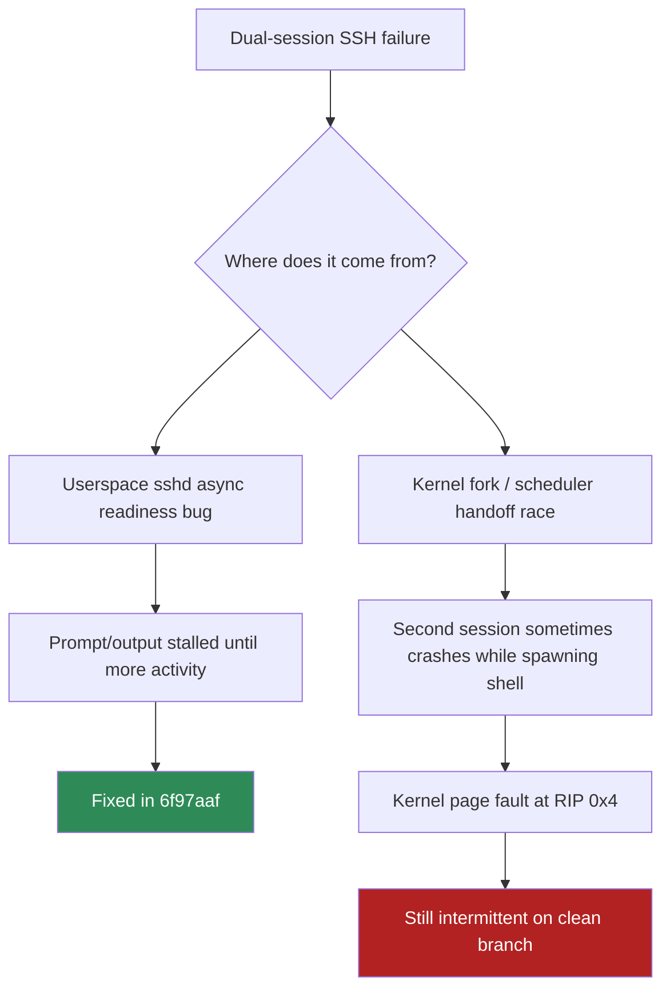
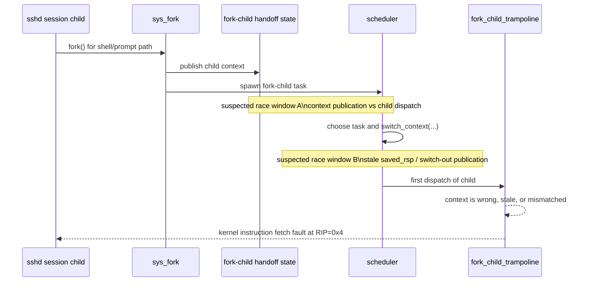
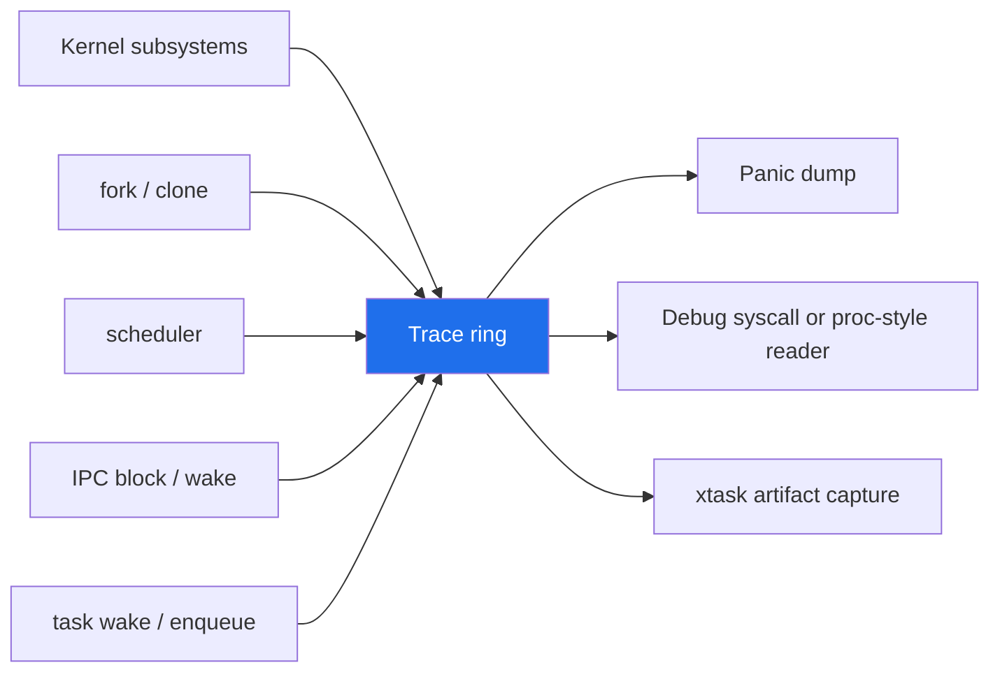
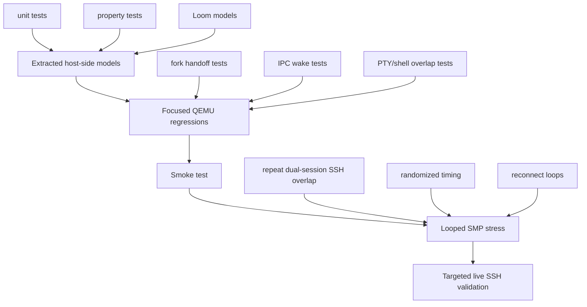
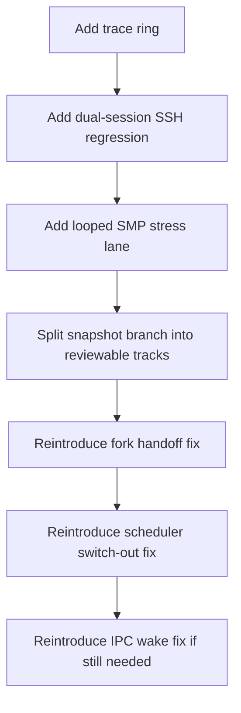

# Kernel Race Debugging and Testing Strategy

**Date:** 2026-04-05  
**Branch:** `feat/kernel-debugging-infra` (branched from `docs/phase-43-task-list`)  
**Related branches:** `fix/fork-handoff-investigation-snapshot` (`906bc99`)  
**Related notes:** [`sshd-multi-task-debug.md`](./sshd-multi-task-debug.md), [`sshd-hang-analysis.md`](./sshd-hang-analysis.md), [`testing.md`](./testing.md)

> This note separates the now-fixed sshd userspace wakeup issue from the still-intermittent kernel fork/handoff failure and records concrete recommendations for making these bugs easier to debug and less likely to escape.

## Executive summary

The recent SSH work uncovered **two different problems**:

1. A **userspace sshd async wakeup bug** that caused overlapping sessions to stall. That bug was fixed and validated on this branch.
2. A still-intermittent **kernel fork/scheduler handoff failure** that shows up during overlapping SSH sessions as a kernel instruction-fetch fault (`RIP=0x4`) followed by process death.

The second issue means the branch is not fully stable yet, even though the sshd-specific fix is real.

The strongest next move is **not** to merge the saved kernel investigation bundle wholesale. Instead:

1. keep the clean SSH fix isolated,
2. preserve the kernel investigation separately,
3. improve observability and reproducibility,
4. add focused regressions and stress lanes,
5. then reintroduce the kernel fixes in smaller, explainable slices.

## Current problem decomposition

## What the current evidence suggests

| Evidence | What it implies |
| --- | --- |
| The clean branch still logs `fork()` followed by a kernel instruction fetch at `RIP=0x4` during overlapping SSH session bring-up. | The remaining failure is below sshd userspace and is consistent with a corrupted or stale kernel handoff path. |
| The clean branch still uses a global `FORK_CHILD_QUEUE`, raw `saved_rsp` pointers passed to `switch_context()` after the scheduler lock is dropped, and the older IPC block paths. | The code still contains the exact areas that were under suspicion during the fork/scheduler investigation. |
| The saved snapshot branch moves fork context from a global queue into task-local state and adds `switching_out` / deferred wake handling in the scheduler. | Some of the moved kernel changes are plausible fixes for this crash class, even though the bundle as a whole is not yet proven. |
| The IPC change in the snapshot branch is about `block_current_*_unless_message()`. | That is more likely a lost-wakeup / hang fix than the direct cause of a `RIP=0x4` crash. |
| The extra `fork-test`, `pty-test`, and `xtask` changes add nested and overlapping regressions. | Those tests are useful regardless of whether the exact kernel implementation changes are kept. |

## Likely failure shape

The exact race is not fully proven, but the failure signature matches a bad handoff between fork child setup, scheduler context switching, and first dispatch.

Two specific code shapes deserve extra suspicion:

1. **Global fork-child queueing**: if the wrong child consumes the wrong handoff record, the first ring transition can jump to nonsense.
2. **Raw `saved_rsp` pointer handoff after unlocking the scheduler**: if task storage changes or wakeup timing gets ahead of publication, the next dispatch can return through a stale stack frame.

## Why this is hard to debug today

The repository already has a solid base:

- fast host-side `kernel-core` tests,
- QEMU kernel tests via `cargo xtask test`,
- broader system validation via `cargo xtask smoke-test`.

That is good enough to catch many problems, but these fork/scheduler races are still painful because they are:

- **timing-sensitive**,
- **SMP-sensitive**,
- **cross-layer** (scheduler, process, IPC, userspace launch),
- and currently observed mostly through **ad hoc serial logs**.

That makes it too easy to answer the wrong question:

- "Did sshd hang?"
- instead of
- "Which exact scheduler/fork/IPC transition happened immediately before the crash?"

## What Linux and Redox do that is worth copying

### Linux-style ideas to adapt

| Linux practice | Why it helps | m3OS-sized version |
| --- | --- | --- |
| KUnit | White-box tests for kernel internals | Keep extracting scheduler/fork/IPC state machines into host-testable Rust modules. |
| syzkaller | Finds bad syscall interleavings and weird timing | Start with a smaller syscall stress/fuzz harness tailored to m3OS syscalls. |
| lockdep | Detects bad lock ordering and deadlock patterns | Add a debug-only lockdep-lite for spinlocks and important kernel locks. |
| KASAN / KCSAN | Finds memory corruption and race bugs | Add debug allocator poisoning, redzones, and race-oriented assertions before chasing full sanitizer equivalents. |
| tracepoints / ftrace | Gives structured runtime visibility | Add a kernel event trace ring instead of relying on scattered logs. |
| kgdb / gdbstub | Stop-and-inspect debugging | Improve the existing QEMU gdbstub workflow with `xtask` helpers and canned breakpoints. |

### Redox-style ideas to adapt

| Redox practice | Why it helps | m3OS-sized version |
| --- | --- | --- |
| QEMU + GDB/LLDB as a normal workflow | Makes crash triage reproducible | Add explicit `xtask` debug modes for `-s -S` and recommended breakpoints. |
| Layered suites (small, medium, full-system) | Keeps feedback fast but still covers boot/runtime issues | Formalize host tests, focused QEMU regressions, smoke tests, and stress lanes as separate tiers. |
| Frequent VM-based system tests in CI | Prevents long gaps between regression runs | Add repeated SMP overlap regressions, not just single-pass smoke. |

## Highest-value improvement: a structured kernel trace ring

The single best debugging improvement is a compact in-memory trace ring for fork, scheduler, and IPC events.

Recommended event types:

- `ForkCtxPublish(pid, rip, rsp, core)`
- `ForkTaskSpawned(pid, task_idx, assigned_core)`
- `SwitchOutBegin(task_idx, core, saved_rsp_ptr)`
- `SwitchOutCommit(task_idx, core, saved_rsp)`
- `WakeTask(task_idx, state_before, switching_out)`
- `RunQueueEnqueue(task_idx, core)`
- `RecvBlock(task_idx, ep)`
- `ReplyBlock(task_idx, ep)`
- `MessageDelivered(task_idx, ep)`

This is much more useful than free-form logs because it gives a **recent, ordered history** of the exact transitions leading into a fault.

## Recommended test stack

## Better frameworks and tools to bring in

| Tool | Fit | Best use here |
| --- | --- | --- |
| `proptest` | High | Host-side scheduler/fork/IPC state machine properties. |
| `loom` | High for extracted host models | Explore wake/block/switch-out interleavings without running a full kernel. |
| `cargo-nextest` | Medium | Faster host-test iteration, especially once more logic is extracted. |
| QEMU gdbstub helpers in `xtask` | High | Make crash triage repeatable for fork/scheduler bugs. |
| Small syscall stress/fuzz harness | Medium-high | Repeated overlapping `fork`, `waitpid`, PTY, and socket activity. |
| Full syzkaller-style fuzzing | Longer-term | Valuable eventually, but too much machinery for the next debugging step. |

## Concrete recommendations

### Immediate

1. **Add the kernel trace ring** for fork/scheduler/IPC events.
2. **Promote the dual-session SSH overlap flow into `xtask`** as a named regression.
3. **Add a looped SMP stress lane** that repeats overlapping login / command / disconnect cycles.
4. **Add `xtask` debug modes for QEMU gdbstub** with suggested breakpoints for `sys_fork`, `fork_child_trampoline`, `switch_context`, and scheduler wake paths.
5. **Keep the snapshot branch split from the clean SSH branch** until the kernel work is reintroduced in smaller pieces.

### Near-term

1. Extract more fork/scheduler/IPC logic into host-testable code.
2. Add `proptest` coverage for state-machine invariants like:
   - no task becomes runnable before its handoff state is published,
   - wake-before-block does not lose a message,
   - switch-out publication happens before reuse.
3. Add `loom` models for the smallest possible wake/block/switch-out scenarios.
4. Build a lockdep-lite checker for debug kernels.

### Longer-term

1. Add allocator poisoning / redzones for debug kernels.
2. Add a simple syscall stress/fuzzer lane specialized for m3OS.
3. Capture trace-ring dumps automatically in failed QEMU runs.

## Recommended re-entry plan for the saved kernel investigation

Do **not** merge `fix/fork-handoff-investigation-snapshot` as one commit.

Instead, split it into at least these tracks:

1. **Fork handoff publication**
   - task-local fork context vs global queue
   - `spawn_fork_task(...)`
2. **Scheduler switch-out safety**
   - `switching_out`
   - deferred wake/enqueue
   - per-core saved-RSP publication
3. **IPC lost-wakeup fix**
   - `block_current_*_unless_message()`
4. **Regression-only improvements**
   - `fork-test`
   - `pty-test`
   - `xtask` coverage

That split will make it possible to answer:

- which piece fixes the crash,
- which piece fixes hangs,
- and which pieces are only helpful tests.

## Suggested next implementation order

## Bottom line

The project does **not** need one giant new framework to get better at these bugs.

It needs a tighter combination of:

- **structured observability**,
- **focused regressions**,
- **looped stress**,
- **host-side model testing**,
- and **smaller, cleaner kernel change sets**.

That is the same general shape used by mature kernels: layered tests, strong tracing, and deliberate stress of bad interleavings rather than relying on one broad smoke test to catch everything.
