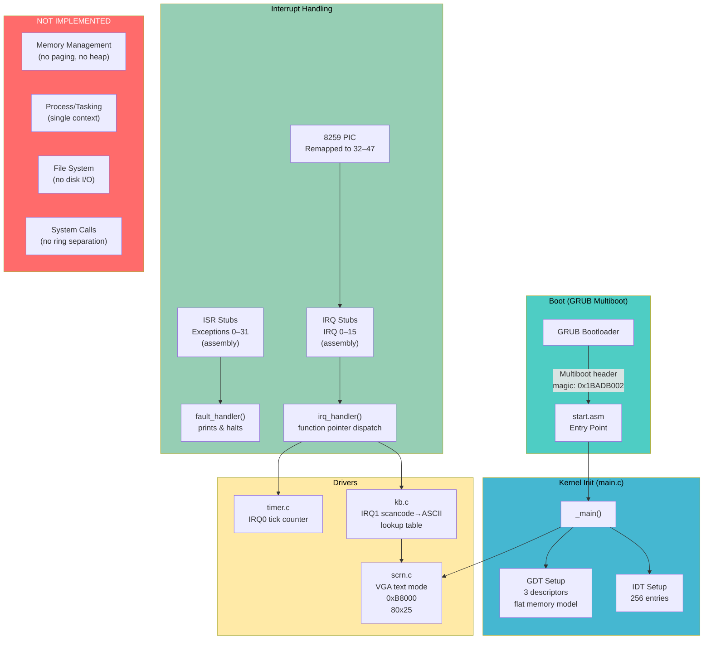
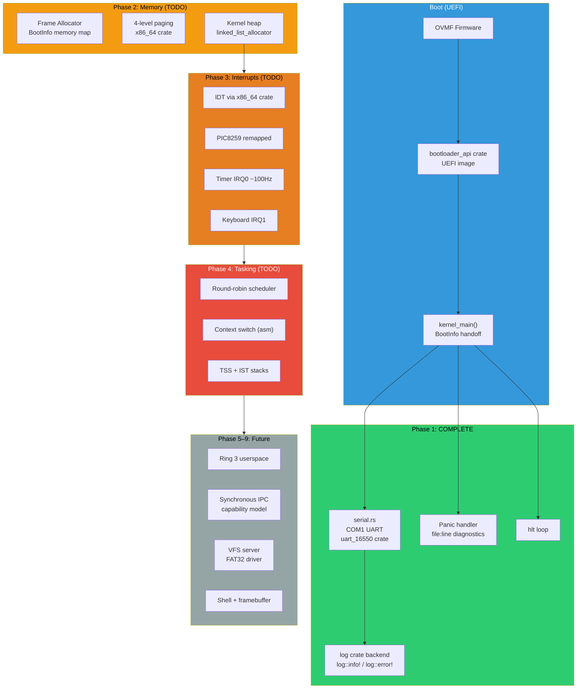
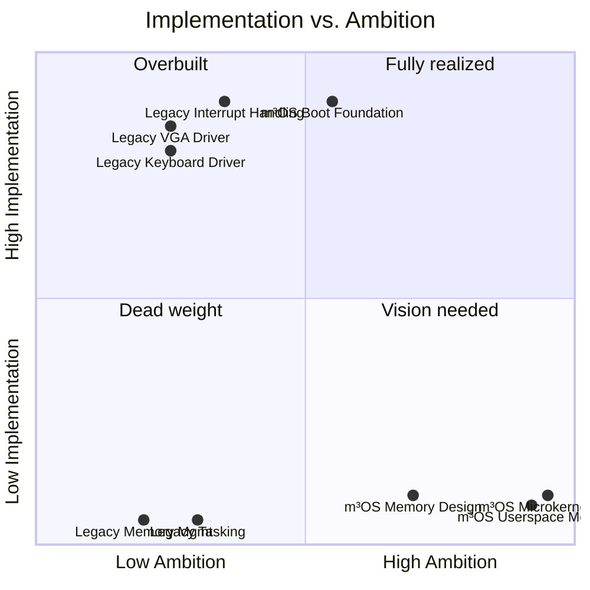
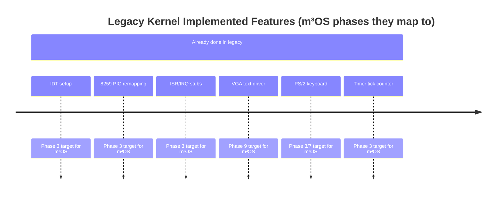
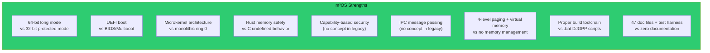

# Legacy C Kernel vs. m³OS: Comparative Analysis

## Overview

This document evaluates the legacy x86 C kernel at `~/projects/oldprojects/os/kernel` against the current Rust OS (m³OS), covering architecture, implementation progress, design decisions, and actionable recommendations.

---

## Legacy C Kernel Architecture

### Legacy Kernel: What's Implemented

| Component | Status | Notes |
|-----------|--------|-------|
| GRUB Multiboot boot | Complete | Via `start.asm`, magic `0x1BADB002` |
| GDT (3 entries) | Complete | Flat model: NULL, Code, Data |
| IDT (256 entries) | Complete | Exceptions 0–31, IRQs 32–47 |
| ISR stubs (32) | Complete | Assembly stubs, saves all registers |
| IRQ stubs (16) | Complete | Dynamic handler registration |
| 8259 PIC remapping | Complete | Master/slave, EOI handling |
| VGA text driver | Complete | 80x25, color, hardware cursor |
| Keyboard driver | Complete | Scancodes, two lookup tables (plain/shift) |
| Timer driver | Complete | Tick counter only |
| String utilities | Complete | memset, memcpy, strlen, etc. |
| Memory management | **None** | No paging, no heap |
| Process/tasking | **None** | Timer says "this is where we would schedule..." |
| File system | **None** | No disk I/O |
| System calls | **None** | Everything in ring 0 |
| Networking | **None** | Not started |

---

## m³OS (Rust OS) Architecture

### m³OS: What's Implemented

| Component | Status | Notes |
|-----------|--------|-------|
| UEFI boot via bootloader_api | Complete | Phase 1 done |
| COM1 serial + log facade | Complete | Phase 1 done |
| Panic handler | Complete | Phase 1 done |
| xtask build system | Complete | UEFI image, VHDX, QEMU |
| Frame allocator | **Planned Phase 2** | — |
| 4-level paging | **Planned Phase 2** | — |
| Kernel heap | **Planned Phase 2** | — |
| IDT + exceptions | **Planned Phase 3** | — |
| Timer + keyboard IRQs | **Planned Phase 3** | — |
| Context switching + scheduler | **Planned Phase 4** | — |
| Ring 3 + syscalls | **Planned Phase 5** | — |
| IPC + capabilities | **Planned Phase 6** | — |
| Core servers (console, kbd) | **Planned Phase 7** | — |
| VFS + FAT32 | **Planned Phase 8** | — |
| Framebuffer + shell | **Planned Phase 9** | — |

---

## Head-to-Head Comparison

### Feature Comparison Table

| Feature | Legacy C Kernel | m³OS Rust | m³OS Advantage |
|---------|----------------|-------------|-----------------|
| **Architecture** | x86 32-bit protected mode | x86_64 long mode | 64-bit addressing, larger memory |
| **Boot standard** | GRUB Multiboot (BIOS) | UEFI via bootloader_api | Modern firmware, no BIOS quirks |
| **Language** | C + NASM assembly | Rust + inline asm | Memory safety, no UB |
| **Kernel model** | Monolithic (everything ring 0) | Microkernel (drivers in ring 3) | Isolation, fault tolerance |
| **Memory mgmt** | None (direct physical access) | Designed: 4-level paging + heap | Full virtual memory |
| **Process model** | None | Designed: preemptive round-robin | True multitasking |
| **Interrupt handling** | **Fully working** | Designed (Phase 3) | Legacy wins here |
| **VGA/serial output** | **VGA text mode working** | Serial working; VGA Phase 9 | Legacy has more display features |
| **Keyboard input** | **Working (scancode tables)** | Designed (Phase 3/7) | Legacy wins here |
| **System calls** | None | Designed: syscall ABI + capability system | m³OS has better design |
| **File system** | None | Designed: VFS + FAT32 | Same (neither implemented) |
| **Build system** | .bat scripts (DJGPP/DOS) | Cargo xtask (cross-platform) | m³OS dramatically better |
| **Documentation** | None | 47 markdown files + Mermaid diagrams | m³OS dramatically better |
| **Testing** | None | QEMU ISA debug exit harness | m³OS better |
| **Safety** | Manual, C, undefined behavior risk | Rust ownership, bounded unsafe | m³OS dramatically better |

---

## Where the Legacy Kernel is Ahead

The legacy kernel has **working, runnable code** for things m³OS hasn't implemented yet:

Specifically, the legacy kernel is working code you can study for:

1. **8259 PIC initialization and remapping** — The exact port sequences, master/slave configuration, and EOI logic in `irq.c` are directly applicable to Phase 3.
2. **PS/2 keyboard scancode tables** — The `kbdus[]` and `kbdus2[]` arrays in `kb.c` are complete and tested. You can port these directly.
3. **VGA text mode cursor control** — Port sequences for hardware cursor (`0x3D4`/`0x3D5`) in `scrn.c` are reusable if you add a legacy text mode fallback.
4. **IDT entry structure** — The packed struct layout and `lidt` dance in `idt.c` mirrors what `x86_64` crate handles, but reading the manual implementation clarifies what the crate does.

---

## Where m³OS is Ahead

Key advantages of m³OS's **design** over the legacy kernel's **implementation**:

- **No memory management in legacy** means it can never run multiple processes, load programs, or have a heap. This is a fundamental architectural ceiling.
- **Monolithic ring 0** in the legacy kernel means a buggy keyboard driver crashes the whole system. m³OS's microkernel model isolates this.
- **32-bit mode** caps addressable RAM at 4GB and lacks modern CPU features (NX bit properly, PCID, etc.).
- **BIOS boot** is a dead-end for modern hardware; UEFI is the path forward.

---

## Design Choices: Adopt or Reject

### Adopt from the Legacy Kernel

| Pattern | Where in Legacy | Recommendation |
|---------|----------------|----------------|
| **PIC remapping sequence** | `irq.c` lines 1–35 | Adopt verbatim (same hardware sequence needed in Phase 3) |
| **ISR assembly stub pattern** | `start.asm` lines 107–301 | Understand the pattern; the `x86_64` crate automates this but knowing the mechanism matters |
| **Function pointer IRQ dispatch table** | `irq.c` `irq_routines[16]` | Already planned in m³OS (Phase 3); validates the approach |
| **Keyboard scancode lookup tables** | `kb.c` `kbdus[]` | Port to Rust in kbd_server (Phase 7) |
| **Scroll-on-overflow VGA logic** | `scrn.c` `scroll()` | Useful if you add a VGA text fallback; the `memmove` trick is correct |
| **EOI signaling logic** | `irq.c` `irq_handler()` | Master-only vs. master+slave EOI based on IRQ number — port this logic exactly |

### Reject from the Legacy Kernel

| Pattern | Where in Legacy | Why to Reject |
|---------|----------------|---------------|
| **Flat memory model / no paging** | Entire kernel | Can never have process isolation or virtual memory |
| **All code in ring 0** | Entire kernel | One bug anywhere crashes the system |
| **No heap / static allocation only** | Entire kernel | Cannot load programs, cannot grow data structures |
| **32-bit protected mode** | `start.asm`, `gdt.c` | Obsolete; 64-bit is universal; m³OS is already on x86_64 |
| **BIOS/Multiboot boot** | `start.asm` header | Dead end; UEFI is correct path |
| **`.bat` build scripts** | `build.bat` | Not portable; Cargo xtask is the right approach |
| **Halt-on-all-exceptions** | `isrs.c` `fault_handler()` | Fine for early boot, but eventually should kill the offending task, not the whole OS |
| **Hardcoded VGA address `0xB8000`** | `scrn.c` | Use framebuffer from BootInfo instead; more portable |
| **No separation between ISR and handler** | `isrs.c` | m³OS correctly plans to deliver IRQs to userspace handlers |

---

## Suggestions for m³OS

Based on comparing both projects:

### 1. Use the Legacy Kernel as a Phase 3 Reference

When implementing interrupts in Phase 3, use `irq.c` and `isrs.c` as the ground truth for:
- The exact bytes written to PIC initialization ports
- The IRQ → EOI decision logic
- The timing of `sti` vs. handler setup

The `x86_64` crate and `pic8259` crate abstract this, but having the raw C to compare against prevents subtle bugs.

### 2. Port the Keyboard Scancode Tables Early

The legacy `kbdus[]` and `kbdus2[]` tables are complete and battle-tested. When building `kbd_server` in Phase 7, these tables (128 entries each, plain + shifted) should be ported directly rather than recreated.

### 3. Keep the GDT Simpler Than You Think

The legacy kernel uses 3 GDT entries (null, code, data) with a flat model and it works perfectly for a monolithic kernel. m³OS needs slightly more (TSS entry for ring 3, user code/data segments), but resist over-engineering the GDT — 5–6 entries is enough for the full microkernel design.

### 4. Add a VGA Text Mode Fallback (Optional)

The legacy kernel's VGA driver is complete and simple. Consider adding an optional `vga_text` module that can be enabled when the bootloader doesn't provide a framebuffer. This gives you a visual output path that doesn't depend on Phase 9's framebuffer work.

### 5. The Legacy Kernel's Tick Counter Pattern is Fine

The comment "this is where we would schedule..." in `timer.c` is exactly the hook m³OS needs. The pattern (IRQ0 handler increments global tick, calls a function) is correct — Phase 4's scheduler just needs to replace that function call with a real context switch. Don't overthink the timer interface.

### 6. Don't Try to Match the Legacy Kernel's "Working Demo" Too Early

The legacy kernel feels more functional because it has a visible keyboard + VGA demo. m³OS is making a harder bet: building it right first. The serial output in Phase 1 is less visually impressive but architecturally far more sound. Stick to the plan.

### 7. Consider Adding a `debug_print` Syscall Shadow in Early Phases

The legacy kernel has no way to debug userspace code. m³OS's syscall design includes `sys_debug_print` (syscall 12) as a debug-only path to serial. This is the right call — don't remove it until you have a real console_server working.

---

## Architecture Evolution Diagram

---

## Progress Summary

```mermaid
gantt
    title OS Project Progress
    dateFormat X
    axisFormat %s

    section Legacy C Kernel
    GDT + IDT           :done, 0, 1
    ISR/IRQ Stubs       :done, 1, 2
    VGA Text Driver     :done, 2, 3
    Keyboard Driver     :done, 3, 4
    Timer (tick only)   :done, 4, 5
    Memory Mgmt         :crit, 5, 6
    Tasking             :crit, 6, 7
    File System         :crit, 7, 8
    System Calls        :crit, 8, 9

    section m³OS (Rust)
    Boot Foundation     :done, 0, 1
    Serial + Logging    :done, 1, 2
    Memory Basics       :active, 2, 3
    Interrupts          :3, 4
    Tasking             :4, 5
    Userspace + Syscalls:5, 6
    IPC + Capabilities  :6, 7
    Core Servers        :7, 8
    VFS + FAT32         :8, 9
    Shell + Framebuffer :9, 10
```

**Key insight**: The legacy kernel got halfway through Phase 3 of m³OS's roadmap and stopped. m³OS has completed Phase 1 but has a much longer (and more ambitious) road ahead. The legacy kernel is a ceiling; m³OS is designed to blow past it.

---

*Generated 2026-03-18 — based on analysis of `/home/mikecubed/projects/oldprojects/os/kernel` vs. `/home/mikecubed/projects/m3os`*
