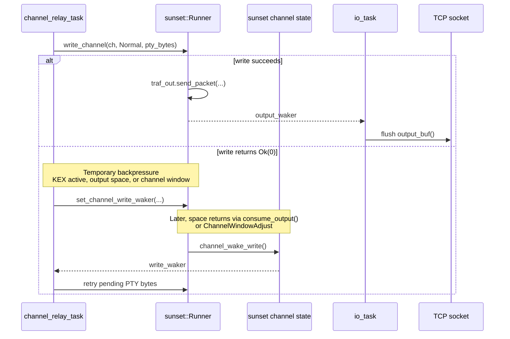
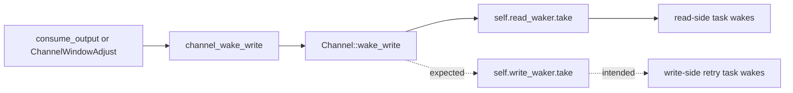

# SSHD Hang Analysis and Recommended Fix Path

**Date:** 2026-04-04  
**Branch:** `docs/phase-43-task-list`  
**Related note:** [`sshd-multi-task-debug.md`](./sshd-multi-task-debug.md)

> **Historical note:** This analysis captures the suspected root cause before the
> final session fix landed later the same day. Keep it as debugging context, not
> as the current status of Phase 43.

## Executive conclusion

The strongest branch-local explanation for the post-authentication hang is **missing write-readiness wakeup handling in the PTY relay path**, not a missing `progress()` call and not a missing socket flush.

The current relay loop handles PTY output like this:

1. Try `runner.write_channel(...)`
2. If it returns `Ok(0)`, flush what is already queued
3. Go to sleep waiting for **PTY readability** and **channel read availability**

That is the wrong wait set for a temporary **channel write backpressure** condition. Sunset already exposes `set_channel_write_waker()` for this case, but the sshd relay never registers it (`userspace/sshd/src/session.rs:728-739`). Worse, the vendored sunset `Channel::wake_write()` path currently wakes `read_waker`, not `write_waker` (`sunset-local/src/channel.rs:840-845`).

Those two facts line up with the reported symptom: **typing a key nudges output through**. A client keystroke produces channel-read activity, which wakes the relay for the wrong reason, and the relay then gets another chance to retry pending PTY output.

## What the code says

| Finding | Evidence | Implication |
|---|---|---|
| `write_channel()` already packetizes output directly | `sunset-local/src/runner.rs:477-505` | If `write_channel()` succeeds, the SSH packet is already in `traf_out`; no extra `progress()` call should be required. |
| `output_buf()` is just a direct view of `traf_out` | `sunset-local/src/runner.rs:427-440` | The packet does not need a later state transition to become visible. |
| `write_channel_ready()` intentionally returns `Ok(Some(0))` under temporary backpressure | `sunset-local/src/runner.rs:594-624` | `Ok(0)` is a normal "try again later" result, not evidence of corruption. |
| The relay breaks on `Ok(0)` and then sleeps on PTY read + channel read only | `userspace/sshd/src/session.rs:659-668`, `694-699`, `728-747` | Pending PTY data can become stranded with no write-side wakeup. |
| Sunset already has a writer wake path | `sunset-local/src/runner.rs:432-440`, `646-680`; `sunset-local/src/channel.rs:432-439` | The library expects callers to subscribe to channel write readiness. |
| The concrete wake implementation is wrong for normal writes | `sunset-local/src/channel.rs:840-845` | Even if sshd starts using `set_channel_write_waker()`, the current sunset code will not wake the correct waiter. |
| The async executor plan explicitly called for both read and write channel wakers | `docs/roadmap/tasks/42b-async-executor-tasks.md:357-369` | The current relay implementation is incomplete relative to the branch's own design. |

## Why the current output-waker fix did not solve it

`set_output_waker()` only helps **after** sunset has produced bytes in `output_buf()`. That is the fix from `004046f`, and it was the right fix for one class of stall.

But the hanging symptom described in the debug note can happen one step earlier:

- PTY output exists
- `write_channel()` cannot accept it yet and returns `Ok(0)`
- No new SSH packet is generated
- Therefore there is nothing for the I/O task to flush, even if `output_waker` is perfect

This means the remaining hang is most likely a **writer-side retry problem**, not an **output flush problem**.

## Current failure path

```mermaid
flowchart TD
    A[ion writes prompt to PTY slave] --> B[PTY master becomes readable]
    B --> C[channel_relay_task reads PTY]
    C --> D{runner.write_channel returns}
    D -->|Ok(w > 0)| E[flush_output_locked]
    E --> F[I/O task flushes SSH packet to socket]
    D -->|Ok(0)| G[stash or keep pending PTY bytes]
    G --> H[flush_output_locked]
    H --> I[register channel_read_waker only]
    I --> J[WaitReadable on PTY only]
    J --> K{What wakes relay now?}
    K -->|more PTY output| C
    K -->|client keystroke| L[channel_read_waker fires]
    L --> C
    K -->|nothing| M[session appears hung]
```

## The missing wake path

Sunset already exposes the correct hook for retrying blocked channel writes:



The branch only wires the **read** half of that contract.

## The likely vendored sunset bug

The write-side wake path exists, but its normal-data implementation currently targets the wrong stored waker:



Relevant code:

- `Runner::consume_output()` wakes writers when the output buffer drains (`sunset-local/src/runner.rs:432-440`)
- `ChannelWindowAdjust` wakes writers when remote window space grows (`sunset-local/src/channel.rs:432-439`)
- `Channel::wake_write()` uses `self.read_waker.take()` for normal data (`sunset-local/src/channel.rs:840-845`)

This is a concrete defect, not just a coordination concern.

## Evaluation of the hypotheses in the original debug note

| Hypothesis | Assessment | Reason |
|---|---|---|
| H1: output not visible until `progress()` | **Unlikely** | `write_channel()` directly calls `traf_out.send_packet()` and `output_buf()` directly exposes that buffer. |
| H2: output disappears between lock acquisitions | **Unlikely** | `progress()` does not consume `traf_out`; output is consumed by `consume_output()`. |
| H3: `output_waker` / `WaitReadable` interaction is broken | **Possible but secondary** | The relay can stall before any output packet exists, so this does not explain the keypress-nudge symptom as well. |
| H4: async mutex fairness problem | **Low probability** | The mutex is FIFO (`userspace/async-rt/src/sync/mutex.rs:64-119`), and the failure mode matches a missing event, not starvation. |
| H5: kernel TCP buffering issue | **Low probability** | The old single-loop sshd already moved SSH traffic over the same socket path. |
| H6: architecture mismatch with sunset-async | **Partly true** | The mismatch appears specific: the branch wired read-side wakes but not write-side wakes. |
| H7: revert to single-task first | **Useful as a fallback diagnostic, not the best next step** | Code inspection already points to a narrower defect with a much smaller blast radius. |

## Recommended course of action

### 1. Fix the writer wake path first

This is the highest-value next change.

- In `channel_relay_task()`, when `write_channel()` returns `Ok(0)` or `pty_pending_len > 0`, register `set_channel_write_waker()` before sleeping.
- Sleep on a wait set that covers:
  - PTY readability
  - channel read readiness
  - channel write readiness
- Retry pending PTY bytes before reading new PTY bytes.

This is the smallest change that directly addresses the observed hang.

### 2. Correct `Channel::wake_write()`

`sunset-local/src/channel.rs:840-845` should wake `write_waker` for normal write readiness, not `read_waker`.

Without this, wiring `set_channel_write_waker()` in sshd is unlikely to help.

### 3. Add one focused regression test

The best regression is not a broad SSH integration rewrite. Add a targeted test for the exact failure mode:

- fill the conditions so `write_channel()` returns `Ok(0)`
- release capacity via output consumption or window adjust
- assert the writer-side task is woken and pending PTY data is retried without client input

Then add a QEMU smoke step that verifies the first shell prompt reaches the SSH client without any extra keystroke.

### 4. Keep the current task split unless the writer wake fix fails

Nothing in the current code inspection proves the three-task model is fundamentally wrong. It looks **incomplete**, not necessarily **invalid**.

That makes a full rollback or a single-task reversion a lower-priority move than fixing the missing write-side wake contract.

## What I would not do first

1. I would **not** add more `progress()` calls outside `progress_task()`.
2. I would **not** chase mutex fairness before fixing write wakeups.
3. I would **not** revert the architecture before testing the smaller writer-waker fix.
4. I would **not** treat `flush_output_locked()` as the main suspect; it operates after packet creation, while the likely stall occurs before packet creation.

## Upstream note

The same `wake_write()` implementation shape appears in upstream `mkj/sunset` as currently published on GitHub, so this may be a vendored upstream bug rather than a branch-only local edit. Even so, the missing `set_channel_write_waker()` usage in `userspace/sshd/src/session.rs` is branch-local and should be fixed here regardless.
