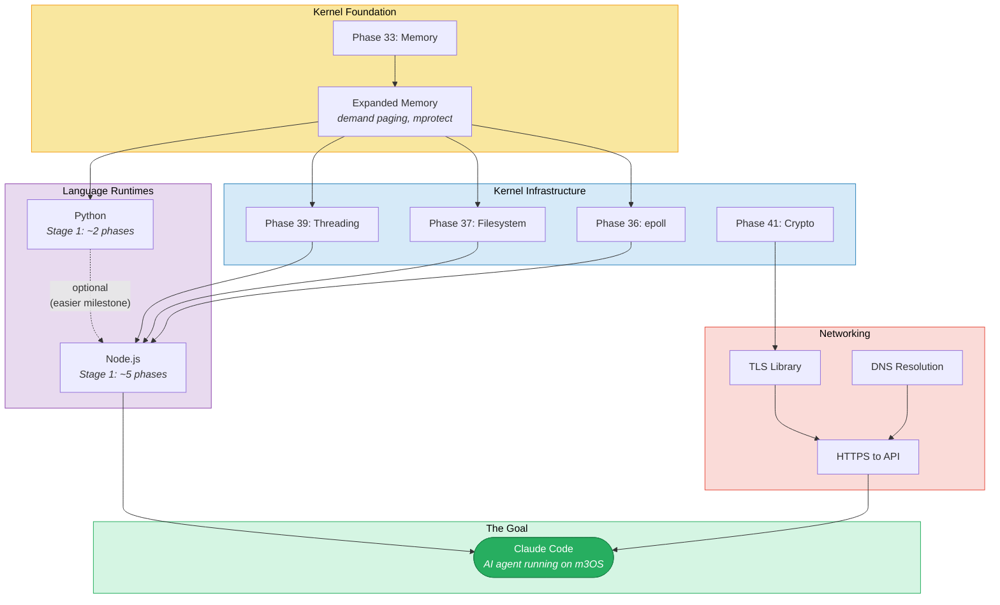
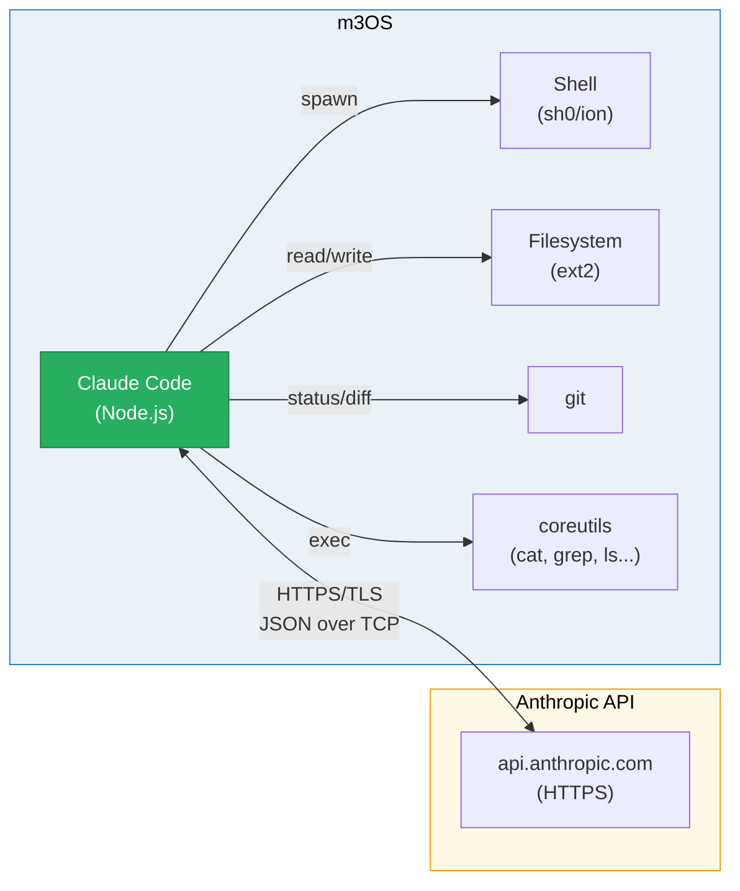
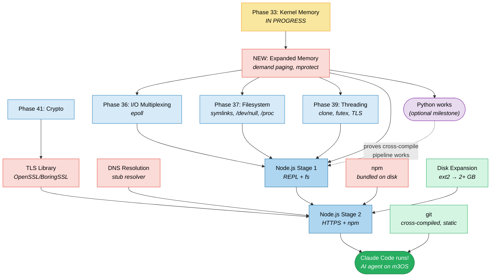

# Road to Claude Code on m3OS

This document details the path to running Claude Code -- Anthropic's AI
coding agent -- natively inside m3OS. This is the ultimate milestone:
an AI agent running on a toy OS it helped build.

## Overview



## What is Claude Code?

Claude Code is Anthropic's CLI tool for AI-assisted software development.
It runs as a Node.js application that:

1. Reads the local codebase (files, git status, project structure)
2. Sends context to the Claude API over HTTPS
3. Receives instructions and code from the API
4. Executes tools: file reads/writes, shell commands, git operations
5. Loops until the task is complete



## What Claude Code Needs from the OS

| Requirement | Component | Status |
|---|---|---|
| **Node.js runtime** | V8 + libuv | See [Node.js roadmap](./nodejs-roadmap.md) |
| **HTTPS client** | TLS + TCP sockets | Phase 41 + TLS library |
| **DNS resolution** | Resolve `api.anthropic.com` | New (stub resolver or c-ares) |
| **File I/O** | Read/write source files | Working (Phase 24) |
| **Process spawning** | Run shell commands | Working (fork/exec, Phase 11) |
| **Pipes** | Capture command output | Working (Phase 14) |
| **Environment variables** | `ANTHROPIC_API_KEY` | Working |
| **Terminal (PTY)** | Interactive UI, colors, cursor | Working (Phase 29) |
| **git** | Status, diff, log, commit | **Not available** |
| **Symlinks** | `node_modules/.bin/` | Phase 37 (planned) |
| **`/dev/null`** | Subprocess stdio | Phase 37 (planned) |
| **Disk space** | Node.js + npm + Claude Code | ~500 MB minimum |
| **RAM** | V8 + Claude Code + child processes | ~1 GB minimum |

### The git Problem

Claude Code uses git extensively for:
- `git status` / `git diff` (understanding what changed)
- `git log` (commit history)
- `git add` / `git commit` (making commits)
- `.gitignore` parsing (respecting ignored files)

**git is a ~15 MB static binary** (when cross-compiled with musl). It
requires: fork/exec, pipes, `/tmp`, file I/O, environment variables, and
a POSIX-compatible shell. Most of these already work in m3OS.

**Cross-compiling git:**
```bash
# git has minimal dependencies when built with NO_CURL, NO_OPENSSL, etc.
make CC=x86_64-linux-musl-gcc \
  LDFLAGS="-static" \
  NO_CURL=1 \
  NO_OPENSSL=1 \
  NO_PERL=1 \
  NO_PYTHON=1 \
  NO_TCLTK=1 \
  NO_GETTEXT=1 \
  NO_EXPAT=1 \
  prefix=/usr \
  install
```

---

## Prerequisites: The Full Stack

Claude Code's requirements are the union of everything the other roadmaps
need, plus a few Claude Code-specific items.

### From the Kernel Infrastructure Phases (planned)

| Phase | What it provides | Why Claude Code needs it |
|---|---|---|
| **33** | Slab/buddy allocator, munmap, OOM retry | V8 GC, large memory management |
| **36** | epoll, non-blocking I/O | libuv event loop (Node.js) |
| **37** | Symlinks, /dev/null, /proc | node_modules, subprocess, self-location |
| **39** | Threads, futex, TLS | libuv thread pool, V8 isolates |
| **41** | Crypto primitives | Foundation for TLS |

### New Phases Required

| Phase | What it provides | Why Claude Code needs it |
|---|---|---|
| **Expanded Memory** | Demand paging, mprotect, large mmap | V8 JIT, ~1 GB working set |
| **TLS Library** | HTTPS client connections | API calls to api.anthropic.com |
| **DNS Resolution** | Hostname -> IP resolution | Resolve api.anthropic.com |
| **git** | Version control | Code understanding and commits |
| **Disk Expansion** | 1+ GB ext2 partition | Node.js + npm + Claude Code + git |

### Network Path to Anthropic API

For Claude Code to reach the Anthropic API, the network path must work
end-to-end:


**Current state:** TCP sockets work end-to-end through QEMU's user-mode
networking (SLIRP). The OS can `connect()` to external hosts via QEMU's NAT.
The missing pieces are TLS and DNS.

**DNS resolution:** QEMU's user-mode networking provides a DNS forwarder at
the gateway IP (typically `10.0.2.3`). A stub resolver that sends UDP DNS
queries to this address would be sufficient.

**TLS:** The TLS library must support TLS 1.3 and the certificate chains
used by Anthropic's API servers. A root CA bundle must be bundled on the
disk image (Mozilla's CA bundle is ~200 KB).

---

## Phased Implementation Plan

### Phase A: Python on m3OS (easiest runtime milestone)

See [Python roadmap](./python-roadmap.md). Proves the cross-compilation
pipeline and memory management work.

### Phase B: Node.js on m3OS (hardest runtime prerequisite)

See [Node.js roadmap](./nodejs-roadmap.md). Gets V8 + libuv running.

### Phase C: Networking Stack for API Access

Build on top of Node.js Stage 2:

1. **DNS stub resolver** -- UDP query to QEMU gateway (10.0.2.3)
2. **TLS library** -- rebuild Node.js with OpenSSL/BoringSSL
3. **Root CA bundle** -- Mozilla CA certificates on disk
4. **Test:** `node -e "require('https').get('https://httpbin.org/get', ...)"`

### Phase D: git on m3OS

Cross-compile git with musl (static, ~15 MB). Bundle on disk image.

**Acceptance criteria:**
```bash
$ cd /home/project
$ git init
$ git add .
$ git commit -m "initial commit"
$ git log --oneline
abc1234 initial commit
$ git status
On branch main
nothing to commit, working tree clean
```

### Phase E: Claude Code Installation and First Run

```bash
# Install Claude Code via npm
$ npm install -g @anthropic-ai/claude-code

# Set API key
$ export ANTHROPIC_API_KEY="sk-ant-..."

# Run Claude Code
$ claude

# Or run with a prompt
$ claude "what files are in this directory?"
```

---

## Full Dependency Graph



## Effort Summary

```mermaid
gantt
    title Road to Claude Code on m3OS
    dateFormat X
    axisFormat %s

    section Kernel
    Phase 33 - Kernel Memory (in progress)     :active, p33, 0, 1
    NEW - Expanded Memory + mprotect           :crit, em, after p33, 1
    Phase 36 - I/O Multiplexing (epoll)        :crit, p36, after em, 1
    Phase 37 - Filesystem Enhancements         :p37, after em, 1
    Phase 39 - Threading Primitives            :crit, p39, after p36, 1

    section Runtimes
    Python (optional milestone)                :py, after em, 1
    Node.js Stage 1 (REPL + fs)               :crit, node1, after p39, 1

    section Networking
    Phase 41 - Crypto Primitives               :p41, after node1, 1
    NEW - TLS Library                          :crit, tls, after p41, 1
    NEW - DNS Resolution                       :dns, after tls, 1
    Node.js Stage 2 (HTTPS + npm)             :crit, node2, after dns, 1

    section Claude Code
    Cross-compile git                          :git, after p37, 1
    Disk Expansion (2+ GB)                     :disk, after node2, 1
    npm install claude-code                    :crit, cc, after disk, 1
```



| Milestone | Prerequisites | Complexity |
|---|---|---|
| **Python runs** | Phase 33 + Expanded Memory | Moderate |
| **Node.js REPL works** | + Phases 36, 37, 39 | Very high |
| **Node.js has HTTPS** | + Phase 41, TLS, DNS | High |
| **git works** | + cross-compile git | Low |
| **Claude Code runs** | All of the above + npm + disk | Moderate (integration) |

**Total phases from today to Claude Code: ~10** (Phase 33, Expanded Memory,
Phases 36, 37, 39, 41, TLS, DNS, git, disk expansion).

---

## The Meta Moment

When Claude Code runs on m3OS, we achieve something remarkable: an AI agent
running on an operating system it helped design, implement, and document.
Claude Code can then:

- Read its own kernel source code
- Propose and implement new kernel features
- Compile C programs with Clang (if that's also ported)
- Run tests inside the OS it's running on
- Commit changes to the git repo that contains its own OS

This is the ouroboros milestone: the AI agent becomes a native citizen of the
system it built.

## What We Explicitly Do Not Need

- **Web browser** -- Claude Code is a CLI tool
- **GUI framework** -- terminal-only interface
- **Docker/containers** -- no need for containerization
- **systemd** -- init system not required for Claude Code
- **X11/Wayland** -- no graphical display needed
- **Full POSIX compliance** -- Claude Code uses a small subset of POSIX
- **Multiple users** -- single-user operation is fine
- **Package signing** -- npm integrity checks are nice but not required
- **Node.js native addons** -- Claude Code is pure JavaScript
