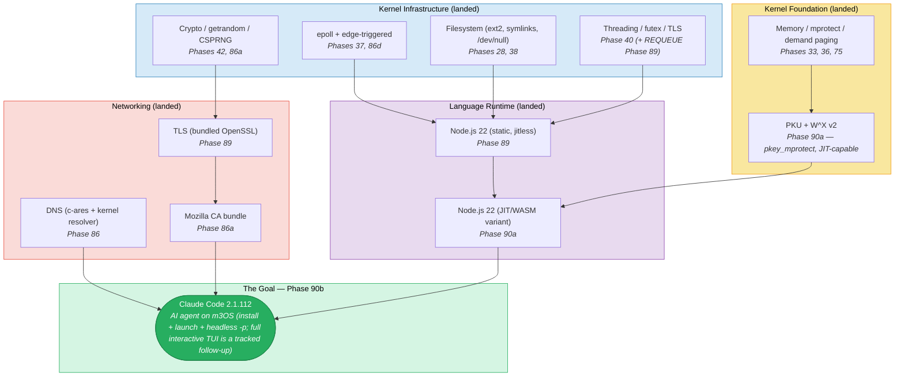
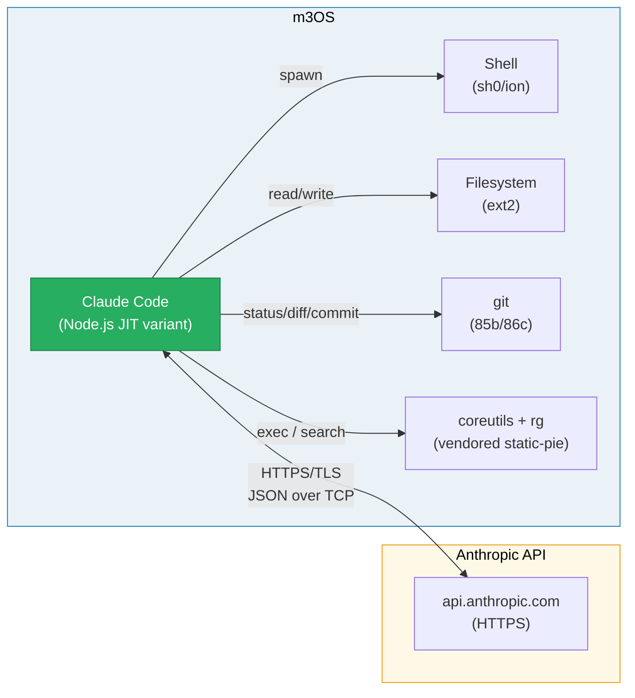

> Revived 2026-06-13 for **Phases 90a/90b — PKU JIT + Claude Code**. This is the
> per-tool reference for running Claude Code natively inside m3OS. The prerequisite
> stack the archived plan listed as missing has **all landed**: git (Phase 85b
> local / 86c HTTPS-capable), TLS + DNS + a Mozilla CA bundle (Phase 86a/86c),
> and the Node.js runtime (Phase 89 — static Node 22 with a `timerfd` event loop
> and always-on in-kernel-TCP egress). The one piece the original plan got wrong
> — assuming V8's old `mprotect` RW↔RX JIT — is resolved by **Phase 90a**:
> PKU-backed W^X v2 and a JIT/WASM-capable Node variant on which the agent's
> `yoga.wasm` TUI layout engine runs. The milestone itself — the agent installed,
> launched, authenticated, and driving headless file/shell/git workflows — is
> **Phase 90b** (the *full interactive TUI* render is a tracked follow-up; see the
> As-Built Outcome note below). Where this historical doc and the live phase docs
> disagree, the [Phase 90b design doc](./roadmap/90b-claude-code.md) and
> [Phase 90b task list](./roadmap/tasks/90b-claude-code-tasks.md) are authoritative.
>
> **As-built decisions (Phase 90b):** the supported pin is
> `@anthropic-ai/claude-code@2.1.112` — the **last** version shipping the classic
> `cli.js` (9.3 MB JS) + `yoga.wasm` (88 KB WASM TUI) + `vendor/ripgrep/` model;
> 2.1.113+ repackaged into a native Bun/JavaScriptCore single-file binary that
> does **not** use the Node runtime and so is out of scope. The supported install
> path is a **pre-bundled `.m3pkg`** (fetch + stage host-side, seal, install
> offline from `/usr/pkg/` with `DEPS=node`), **not** live `npm install -g` —
> npm's thousands of tiny files over the ~200 KB/s ring-3 VFS make a full install
> impractical, and CI has no egress; live npm survives only as an opt-in
> real-internet arm. The default bundled `node` is the **jitless** node (Phase
> 89), which runs the full CLI — so the `claude-smoke` always-on core is CI-viable
> under plain TCG; only the interactive TUI needs WASM ⇒ the **Phase 90a JIT
> variant** (`M3OS_CLAUDE_JIT=1`), and *that* arm is KVM/PKU-gated (see the
> As-Built Outcome note below). Credentials are a host-minted `claude
> setup-token` OAuth token (or `ANTHROPIC_API_KEY`) seeded at mode 0600 under
> `/root/.claude/`, never crossing serial — the Phase 86e `gh` precedent.

## As-Built Outcome (Phase 90b landed)

**Claude Code installs, launches, and runs headless on m3OS — the delivered
milestone is install + launch + headless `claude -p` + the interactive
primitives.** It installs as a sealed `.m3pkg` (`pkg install claude-code`
auto-pulls `node` dependency-first) and launches on **both** node variants: the
CI-viable **jitless** node (Phase 89) and the **JIT** node (Phase 90a).
`claude --version` → `2.1.112`, `claude --help`, the vendored static-pie `rg`,
and the A.2 SIGINT/spawn/raw-mode probes all run. The `claude-smoke` gate
**PASSES (install + launch + headless `-p` + A.2 probes): 27/27 jitless
full-install / 27/27 JIT-node serial core** (the early 24/24 was a fast-iter
reuse-disk run); the **full interactive `claude` TUI does not yet run** — its
visual render is a tracked follow-up (see below).

Four things diverged from the plan below, all in good directions:

- **The launcher is a `#!/usr/bin/env node` CJS wrapper, not a `#!/bin/sh`
  script.** m3OS's `/bin/sh` is `ion`, which intercepts `--version` and never
  runs a shebang script body (and `sh0` ignores `argv`). `/usr/bin/claude`
  instead pins the supported env (`DISABLE_AUTOUPDATER`,
  `CLAUDE_CODE_DISABLE_NONESSENTIAL_TRAFFIC`, `NODE_EXTRA_CA_CERTS`)
  **in-process** and runs `cli.js` via a dynamic `import()` (single node process,
  no fork — node is the one interpreter m3OS runs correctly with flag args).
- **One kernel fix was required** (the phase was planned as "no kernel work").
  The integration test surfaced a real **W^X-v2 cross-thread PKU gap** — exactly
  the kind of finding the phase exists to surface, and the roadmap's pre-flagged
  "SMP-PKU follow-up." A real Node process allocates a write-deny protection key
  for its V8 code space, then spawns worker threads; PKRU is per-thread, so a
  sibling thread created before the key existed DATA-reads the pkey-tagged
  *executable* code page with that key access-disabled → `PROTECTION_KEY` fault →
  process killed. The fix (`kernel/src/arch/x86_64/interrupts.rs`
  `page_fault_handler` + `leaf_pte_flag_bits`, and `pkru.rs`'s
  `grant_read_access`): read+execute of guarded code is process-wide, so on a
  `PROTECTION_KEY` **read** fault against a present, **executable** pkey-tagged
  page the handler grants the thread read access and retries. **Writes stay
  gated** (`CAUSED_BY_WRITE` excluded → W^X intact); non-executable access-deny
  **data** pages (PKU data isolation) are never granted. This unblocked `cli.js`
  on *both* node variants.
- **The gate is not KVM-gated for all arms.** The default bundles the **jitless**
  node, so the always-on core (`--version`/`--help`/`-p` + `rg` + the A.2 probes)
  is CI-viable under plain TCG. `M3OS_CLAUDE_JIT=1` selects the 90a JIT node (the
  interactive-TUI / runtime-WASM variant) and *that* arm is KVM/PKU-gated
  (skip-with-reason without `M3OS_KVM=1`).
- **The full interactive `claude` TUI does not yet run — its visual render is a
  tracked follow-up, and it is a *syscall-coverage* gap, not a JIT/PKU gap.** The
  JIT/WASM runtime the TUI needs *is* proven (claude runs on the JIT node, with
  runtime WASM via 90a's `node-jit-smoke` + the PKU fix + the A.2
  raw-mode/SIGINT/spawn primitives all passing). But a direct QMP/PPM render test
  (PR-audit, 2026-06-14) on the JIT node showed the interactive launch gets
  through onboarding (writes `/root/.claude.json`), JIT-compiles under the W^X-v2
  PKU-guarded path (`[wx] v2-guarded W+X mapping`), and spawns a ripgrep
  subprocess — then **crashes on a userspace null-deref** (`addr=0x0`,
  `rip=0x1e3464c`) right after the ripgrep `SIGCHLD`, with `unhandled syscall 25`
  (`mremap`), `425` (`io_uring_setup`), and `125` (`capget`) logged just before.
  `mremap` is an explicit **Phase 93** deferred item. The JIT/PKU substrate is
  *not* the blocker — V8 committed code under the guarded path before the crash —
  the heavy interactive path simply exercises syscalls m3OS has not yet
  implemented. The visual render therefore becomes a **one-line wire-up of the
  existing `htop-render-probe` QMP/PPM harness** once those syscall gaps close.

The narrative below predates these landings; where it disagrees, this note and
the [Phase 90b learning doc](./90b-claude-code.md) are authoritative.

# Road to Claude Code on m3OS

This document details the path to running Claude Code -- Anthropic's AI
coding agent -- natively inside m3OS. This is the ultimate milestone:
an AI agent running on a toy OS it helped build.

## Overview


```mermaid
flowchart TD
    subgraph FOUNDATION ["Kernel Foundation (landed)"]
        MEM["Memory / mprotect / demand paging<br/><i>Phases 33, 36, 75</i>"]
        PKU["PKU + W^X v2<br/><i>Phase 90a — pkey_mprotect, JIT-capable</i>"]
        MEM --> PKU
    end

    subgraph KERNEL ["Kernel Infrastructure (landed)"]
        EPOLL["epoll + edge-triggered<br/><i>Phases 37, 86d</i>"]
        FS["Filesystem (ext2, symlinks, /dev/null)<br/><i>Phases 28, 38</i>"]
        THR["Threading / futex / TLS<br/><i>Phase 40 (+ REQUEUE Phase 89)</i>"]
        CRYPTO["Crypto / getrandom / CSPRNG<br/><i>Phases 42, 86a</i>"]
    end

    subgraph RUNTIMES ["Language Runtime (landed)"]
        NODE["Node.js 22 (static, jitless)<br/><i>Phase 89</i>"]
        NODEJIT["Node.js 22 (JIT/WASM variant)<br/><i>Phase 90a</i>"]
        NODE --> NODEJIT
    end

    subgraph NETWORKING ["Networking (landed)"]
        TLS["TLS (bundled OpenSSL)<br/><i>Phase 89</i>"]
        DNS["DNS (c-ares + kernel resolver)<br/><i>Phase 86</i>"]
        CA["Mozilla CA bundle<br/><i>Phase 86a</i>"]
    end

    subgraph GOAL ["The Goal — Phase 90b"]
        CC(["Claude Code 2.1.112<br/><i>AI agent on m3OS (install + launch + headless -p; full interactive TUI is a tracked follow-up)</i>"])
    end

    PKU --> NODEJIT
    EPOLL --> NODE
    FS --> NODE
    THR --> NODE
    CRYPTO --> TLS
    TLS --> CA
    DNS --> CC
    CA --> CC
    NODEJIT --> CC

    style FOUNDATION fill:#f9e79f,stroke:#f39c12,color:#000
    style KERNEL fill:#d6eaf8,stroke:#2980b9,color:#000
    style RUNTIMES fill:#e8daef,stroke:#8e44ad,color:#000
    style NETWORKING fill:#fadbd8,stroke:#e74c3c,color:#000
    style GOAL fill:#d5f5e3,stroke:#27ae60,color:#000
    style CC fill:#27ae60,stroke:#1e8449,color:#fff
```

## What is Claude Code?

Claude Code is Anthropic's CLI tool for AI-assisted software development.
It runs as a Node.js application that:

1. Reads the local codebase (files, git status, project structure)
2. Sends context to the Claude API over HTTPS
3. Receives instructions and code from the API
4. Executes tools: file reads/writes, shell commands, git operations
5. Loops until the task is complete


```mermaid
flowchart LR
    subgraph M3OS ["m3OS"]
        CC["Claude Code<br/>(Node.js JIT variant)"]
        SHELL["Shell<br/>(sh0/ion)"]
        FS["Filesystem<br/>(ext2)"]
        GIT["git<br/>(85b/86c)"]
        TOOLS["coreutils + rg<br/>(vendored static-pie)"]

        CC -->|"spawn"| SHELL
        CC -->|"read/write"| FS
        CC -->|"status/diff/commit"| GIT
        CC -->|"exec / search"| TOOLS
    end

    subgraph CLOUD ["Anthropic API"]
        API["api.anthropic.com<br/>(HTTPS)"]
    end

    CC <-->|"HTTPS/TLS<br/>JSON over TCP"| API

    style M3OS fill:#eaf2f8,stroke:#2980b9,color:#000
    style CLOUD fill:#fef9e7,stroke:#f39c12,color:#000
    style CC fill:#27ae60,stroke:#1e8449,color:#fff
```

## What Claude Code Needs from the OS

The archived requirements table listed git, TLS, DNS, and a CA bundle as
missing. They have all landed; this table is reconciled to as-built reality.

| Requirement | Component | Status |
|---|---|---|
| **Node.js runtime** | V8 + libuv | ✅ Phase 89 (static Node 22, jitless — runs the full CLI incl. `claude -p`) — see [Node.js roadmap](./nodejs-roadmap.md) |
| **JIT / WASM (only for the interactive TUI)** | V8 TurboFan + `yoga.wasm` under PKU | ✅ Phase 90a (PKU-backed W^X v2, JIT Node variant; `M3OS_CLAUDE_JIT=1`) |
| **Cross-thread PKU read recovery** | sibling threads read pkey-tagged exec code | ✅ Phase 90b kernel fix (`page_fault_handler` `grant_read_access`; writes stay gated) |
| **HTTPS client** | TLS + TCP sockets | ✅ Phase 89 (Node's bundled OpenSSL) over Phase 16/86 TCP |
| **DNS resolution** | Resolve `api.anthropic.com` | ✅ Phase 86 (kernel resolver) + bundled c-ares |
| **Root CA bundle** | Validate Anthropic's TLS chain | ✅ Phase 86a (Mozilla bundle at `/etc/ssl/certs/ca-certificates.crt`) |
| **File I/O** | Read/write source files | ✅ Working (Phase 24 / ext2 Phase 28) |
| **Process spawning** | Run shell commands | ✅ Working (fork/exec; `child_process.spawn` — `NODE_SPAWN_OK`) |
| **Pipes** | Capture command output | ✅ Working (Phase 14) |
| **Signals (Ctrl-C)** | `process.on('SIGINT')` | ✅ Phase 89 self-pipe path, asserted `NODE_SIGINT_OK` |
| **Raw-mode terminal** | Interactive TUI, colors, cursor | ✅ Working (termios Phase 22 / PTY Phase 29; `NODE_RAWMODE_OK`) |
| **Environment variables** | `CLAUDE_CODE_OAUTH_TOKEN` / `ANTHROPIC_API_KEY` | ✅ Working |
| **git** | status, diff, log, commit | ✅ Phase 85b (local) / 86c (HTTPS-capable) |
| **ripgrep (`rg`)** | File-search tool | ✅ Vendored `vendor/ripgrep/x64-linux/rg` (static-pie, no `PT_INTERP`) runs directly — `rg --version` confirmed on-OS in `claude-smoke` |
| **Symlinks** | `node_modules/.bin/` | ✅ Phase 38 |
| **`/dev/null`** | Subprocess stdio | ✅ Phase 38 |
| **Disk space** | Node JIT variant + Claude Code | ~130 MB bundled (`M3OS_WITH_CLAUDE`) |
| **RAM** | V8 + Claude Code + child processes | ~1 GB recommended |

### The git Problem (solved)

The archived plan flagged git as the one hard prerequisite to cross-compile.
It landed in **Phase 85b** (a static musl `git`, local-only) and was made
**HTTPS-capable in Phase 86c** (rebuilt with a static `libcurl --with-mbedtls`
validating GitHub's TLS chain against the 86a CA bundle). Claude Code uses git
exactly as the archived plan described — `git status` / `git diff` / `git log`
to understand changes, `git add` / `git commit` to make them, `.gitignore`
parsing to respect ignored files — and all of it works on m3OS. The Phase 90b
file/shell/git workflow arm asserts a `claude -p`-driven commit *outside* the
agent via `git log --oneline`.

---

## Prerequisites: The Full Stack (as built)

Claude Code's requirements are the union of everything the other roadmaps need.
The original plan estimated "~10 phases from today"; in the as-built timeline the
stack was delivered across Phases 28–90a, and Phase 90b is the integration layer
on top.

### From the Kernel Infrastructure Phases (all landed)

| Phase | What it provides | Why Claude Code needs it |
|---|---|---|
| **33 / 36 / 75** | Buddy/slab allocator, demand paging, `mprotect` | V8 GC, large working set |
| **90a** | PKU `pkey_mprotect` + W^X v2 | V8 JIT code pages + WASM (the TUI's `yoga.wasm`) under a hardware-guarded W+X |
| **37 / 86d** | epoll + edge-triggered `epoll_pwait` | libuv event loop |
| **28 / 38** | ext2, symlinks, `/dev/null`, `/proc` | `node_modules`, subprocess stdio, self-location |
| **40 (+89)** | clone/futex/TLS (+ `FUTEX_CMP_REQUEUE`) | libuv thread pool, V8 isolates |
| **42 / 86a** | Crypto, CSPRNG, `getrandom` | TLS foundation, V8 entropy bootstrap |
| **89** | `timerfd` event-loop timers | libuv timer wheel |

### Network Path to the Anthropic API (working)

For Claude Code to reach the Anthropic API, the network path works end-to-end:


```mermaid
flowchart LR
    CC["Claude Code"]
    NODE["Node.js https<br/>(bundled OpenSSL)"]
    TLS["TLS 1.3"]
    TCP["TCP stack<br/>(kernel)"]
    VIRTIO["virtio-net<br/>(kernel)"]
    QEMU["QEMU user net<br/>(SLIRP NAT)"]
    API["api.anthropic.com<br/>:443"]

    CC --> NODE --> TLS --> TCP --> VIRTIO --> QEMU --> API

    style CC fill:#27ae60,stroke:#1e8449,color:#fff
    style TLS fill:#fadbd8,stroke:#e74c3c,color:#000
    style QEMU fill:#fef9e7,stroke:#f39c12,color:#000
    style API fill:#d6eaf8,stroke:#2980b9,color:#000
```

**Current state:** the full path is live. TCP works end-to-end through QEMU's
SLIRP NAT; DNS resolves via the Phase 86 kernel resolver + Node's bundled
c-ares; TLS 1.3 rides Node's **bundled OpenSSL** (the Phase 89 MSS fix made the
first real >MTU outbound TLS ClientHello work); and the **Phase 86a Mozilla CA
bundle** at `/etc/ssl/certs/ca-certificates.crt` validates Anthropic's cert chain
(pinned via `NODE_EXTRA_CA_CERTS` in the `/usr/bin/claude` launcher). The live
`claude -p` API round-trip (`CLAUDE_API_OK`) is the Phase 90b opt-in arm.

---

## Phased Implementation Plan (reconciled)

The archived plan's lettered phases A–E map onto the as-built numbered phases.
**Phase E in the archive was "npm install -g @anthropic-ai/claude-code"; that
plan is replaced** — see the install-path note below.

### Phase A: Python on m3OS (landed — Phase 85c)

A fully-static CPython 3.12, proving the cross-compilation pipeline. See the
[Python roadmap](./python-roadmap.md).

### Phase B: Node.js on m3OS (landed — Phase 89)

Static Node 22 with V8 (jitless), libuv, the `timerfd` event loop, and always-on
in-kernel-TCP egress. See the [Node.js roadmap](./nodejs-roadmap.md). The
JIT/WASM variant the TUI needs is **Phase 90a**.

### Phase C: Networking Stack for API Access (landed — Phases 86a/86c, 89)

DNS (Phase 86), TLS (Node's bundled OpenSSL, Phase 89), and the Mozilla CA
bundle (Phase 86a). `node -e "require('https').get('https://example.com/', …)"`
works under `M3OS_NODE_NET=1`.

### Phase D: git on m3OS (landed — Phases 85b/86c)

Static musl `git`, local-only in 85b and HTTPS-capable in 86c.

**Acceptance criteria (met):**
```bash
$ cd /home/project
$ git init
$ git add .
$ git commit -m "initial commit"
$ git log --oneline
abc1234 initial commit
$ git status
On branch main
nothing to commit, working tree clean
```

### Phase E (revised): Claude Code installation via a pre-bundled `.m3pkg`

**The original "Phase E: `npm install -g`" is replaced.** Phase 89 D.2 proved
live npm *launches* and *reaches the registry* over real HTTPS, but loading
npm's thousands of tiny JS files over the ~200 KB/s ring-3 VFS makes a full
`npm install` impractical (a per-file `open`/`stat`/`write` round-trip limit,
not a TLS gap), and repo CI has no egress. So the supported, reproducible path
is the same one every heavy port uses — **fetch + stage host-side, seal as a
content-addressed `.m3pkg`, install offline from `/usr/pkg/`** with `DEPS=node`:

```bash
# Host-side: build the sealed .m3pkg (fetches the pinned tarball, SHA-verified)
$ cargo xtask port build claude-code

# Build a fresh image with the opt-in bundle (claude-code + node; jitless by
# default — CI-viable under plain TCG; M3OS_CLAUDE_JIT=1 bundles the 90a JIT node)
$ M3OS_WITH_CLAUDE=1 cargo xtask image

# Inside m3OS — offline install; the solver auto-installs node first (DEPS=node)
$ pkg install claude-code
$ claude --version          # 2.1.112 — runs on jitless node (no KVM/PKU needed)
$ claude --help

# Seed credentials on the host (token minted there with `claude setup-token`)
#   M3OS_CLAUDE_TOKEN=<oauth-token>  -> /root/.claude/  (mode 0600)
#   exported in-guest as CLAUDE_CODE_OAUTH_TOKEN  (value never crosses serial)
#   M3OS_CLAUDE_KEY=<api-key>        -> ANTHROPIC_API_KEY (the billing alternative)

# Run with a prompt (headless print mode — the automation/gate path)
$ claude -p "what files are in this directory?"

# Or launch the interactive TUI — needs the 90a JIT node (M3OS_CLAUDE_JIT=1) on a
# KVM/PKU host. The JIT/WASM runtime is proven, but the full interactive TUI does
# NOT yet run: its launch crashes on unhandled mremap/io_uring syscalls (Phase 93
# syscall-gap territory) — a tracked follow-up, not a JIT/PKU gap.
$ claude
```

Live `npm install -g @anthropic-ai/claude-code` survives only as a documented
**opt-in real-internet arm**, not the supported install path.

> **The native-binary divergence (why 2.1.112).** Claude Code **2.1.113**
> repackaged into a native Bun/JavaScriptCore single-file binary (~500 MB
> per-platform; `install.cjs` copies it over a stub; no `cli.js`, no Node). That
> model does not use the Node runtime and so would invalidate this entire
> `DEPS=node` chain. **2.1.112 is the last `cli.js` + `yoga.wasm` +
> `vendor/ripgrep/` version** — the supported pin. The native binary is a
> separate future port (a Bun runtime), out of scope here.

---

## The Meta Moment

When Claude Code runs on m3OS, we achieve something remarkable: an AI agent
running on an operating system it helped design, implement, and document.
Claude Code can then:

- Read its own kernel source code
- Propose and implement new kernel features
- Compile C programs with Clang (Phase 85d) and run them in-OS
- Run tests inside the OS it's running on
- Commit changes to the git repo that contains its own OS (Phases 85b/86c)

This is the ouroboros milestone: the AI agent becomes a native citizen of the
system it built.

## What We Explicitly Do Not Support (Phase 90b non-goals)

- **Auto-update** -- `DISABLE_AUTOUPDATER=1`; the sealed `.m3pkg` is the delivery
- **Non-essential telemetry** -- disabled via `CLAUDE_CODE_DISABLE_NONESSENTIAL_TRAFFIC=1`
- **In-OS browser** -- auth is the seeded OAuth token / API key plus the `/login`
  paste-flow whose browser step happens on another device
- **MCP servers / IDE integrations / optional protocol extensions** -- out of scope
- **Multi-user / enterprise credential-management** -- credentials live only in
  0600 files under `/root/.claude/`
- **GUI integration** -- terminal-only interface
- **Offline / local-model alternatives** -- only the documented cloud-backed path
- **The native Bun-binary distribution (2.1.113+)** -- a separate future port
- **Node.js native addons** -- Claude Code 2.1.112 is pure JavaScript + `yoga.wasm`;
  `--fully-static` disables `dlopen` by design
