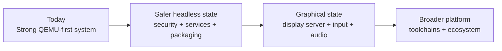

# m3OS Evaluation

This directory captures a repo-wide evaluation of m3OS as of this review pass: what is already strong, what is still missing, what blocks a safer and more usable system, and what a realistic GUI path would look like.

## Executive verdict

**m3OS is already a serious operating-system project with a strong QEMU-first workflow, but it is not yet a safely network-exposed multi-user OS or a desktop-class system.**

The project's strongest assets are:

- an unusually coherent architecture and roadmap in `docs/roadmap/`
- a large, real syscall and userspace surface in `kernel/` and `userspace/`
- a strong `kernel-core/` split for host-testable logic
- unusually good diagnostics and validation infrastructure for a project of this size

The biggest blockers are:

- security-critical trust failures around identity and entropy
- a broad ring-0 trusted computing base despite the documented microkernel ideal
- missing service-management/logging polish for a "server-ish" usable state
- no real GUI stack beyond a framebuffer text console
- QEMU-first driver coverage and limited packaging/runtime maturity

## Document map

| Document | Focus |
|---|---|
| [current-state.md](./current-state.md) | Architecture reality check, subsystem maturity, and validation snapshot |
| [security-review.md](./security-review.md) | Security posture, immediate blockers, and hardening backlog |
| [usability-roadmap.md](./usability-roadmap.md) | What it takes to become usable headless, then usable desktop |
| [gui-strategy.md](./gui-strategy.md) | Options and recommended path toward a Redox-like GUI stack |
| [rust-os-comparison.md](./rust-os-comparison.md) | Comparison with Redox and other Rust OS projects |

## Key conclusions

1. **As a serious microkernel-style OS project, m3OS is already substantial.** It goes far beyond "boot a kernel" tutorials and already demonstrates SMP, paging, process isolation, SSH, Unix sockets, PTYs, ext2, and a substantial userspace.
2. **As a secure multi-user system, it is not ready.** The current `setuid`/`setgid` behavior, entropy story, telnet default, and baked-in credentials are enough to block that claim.
3. **As a headless development or demo environment, it is close.** The live smoke path is strong, but service supervision, logging, packaging polish, and targeted regression reliability still need work.
4. **As a desktop or Redox-like GUI system, it is still at the substrate stage.** The framebuffer, raw input, mouse, audio, and display-server pieces are still roadmap items rather than an integrated graphics stack.

## Why this is already beyond "toy OS" territory

Calling m3OS a toy at this point obscures more than it clarifies. A better description is:

**a serious, still-maturing OS with unusually strong documentation and a QEMU-first deployment story.**

Concrete reasons that framing is more accurate:

| Threshold crossed | Evidence |
|---|---|
| Real process and userspace model | `docs/11-elf-loader-and-process-model.md`, `userspace/init/`, `userspace/shell/` |
| Multi-user login and permissions | `docs/27-user-accounts.md`, `userspace/login/`, `userspace/passwd/` |
| Serious VM and SMP work | `docs/25-smp.md`, `docs/33-kernel-memory.md`, `docs/36-expanded-memory.md`, `kernel/src/smp/`, `kernel/src/mm/` |
| Remote administration | `docs/roadmap/43-ssh-server.md`, `userspace/sshd/`, `userspace/init/src/main.rs` |
| Guest-side build and packaging work | `docs/31-compiler-bootstrap.md`, `docs/32-build-tools.md`, `docs/45-ports-system.md` |
| Real validation infrastructure | `docs/43c-regression-stress-ci.md`, `xtask/src/main.rs` |

## Evaluation inputs

- Repository docs: `README.md`, `docs/README.md`, `docs/roadmap/README.md`, `docs/appendix/architecture-and-syscalls.md`, `docs/43c-regression-stress-ci.md`, `docs/09-framebuffer-and-shell.md`, `docs/roadmap/46-system-services.md`, `docs/roadmap/47-doom.md`, `docs/roadmap/48-mouse-input.md`, `docs/roadmap/49-audio.md`
- Source tree: `kernel/`, `kernel-core/`, `userspace/`, `xtask/`
- Review tracks: architecture (Sonnet 4.6), security (GPT-5.4), comparative positioning (Opus 4.6), scouting/runtime passes (Haiku 4.5, GPT-4.1)
- Evaluation-session validation: `cargo xtask check`, `cargo xtask smoke-test`, and `cargo xtask regression --test fork-overlap`
