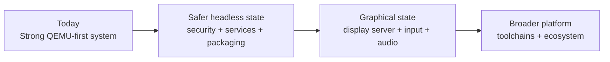

# m3OS Evaluation

This directory captures a repo-wide evaluation of m3OS as of this review pass, updated against the current base through Phase 47 / `v0.47.0`: what is already strong, what is still missing, what blocks a safer and more usable system, and what a realistic GUI path would look like. Because phases 1-47 are now the shipped base, anything still rough in that scope should be read as a maturity gap in current behavior, not as hidden future work.

## Executive verdict

**m3OS is already a serious operating-system project with a strong QEMU-first workflow, but it is not yet a safely network-exposed multi-user OS or a desktop-class system.**

The project's strongest assets are:

- an unusually coherent architecture and roadmap in `docs/roadmap/`
- a large, real syscall and userspace surface in `kernel/` and `userspace/`
- a strong `kernel-core/` split for host-testable logic
- unusually good diagnostics and validation infrastructure for a project of this size
- a real userspace service-management, logging, and admin baseline from Phase 46

The biggest blockers are:

- security-critical trust failures around identity and entropy
- a broad ring-0 trusted computing base despite the documented microkernel ideal
- an unfinished path from "microkernel design" to "properly enforced userspace-service architecture"
- remaining security and operational hardening despite the new service-management/logging baseline
- no real GUI stack beyond a framebuffer text console
- QEMU-first driver coverage and limited packaging/runtime maturity

## Document map

| Document | Focus |
|---|---|
| [current-state.md](./current-state.md) | Architecture reality check, subsystem maturity, and validation snapshot |
| [hardware-driver-strategy.md](./hardware-driver-strategy.md) | Feasibility of reusing Redox or other OS drivers, translation-layer tradeoffs, and the recommended real-hardware support path |
| [redox-driver-porting.md](./redox-driver-porting.md) | Deep dive on what parts of Redox's userspace drivers are realistically portable to m3OS and what infrastructure must exist first |
| [microkernel-path.md](./microkernel-path.md) | Detailed deficiencies in the current microkernel implementation and a staged path toward a properly enforced userspace-service architecture |
| [security-review.md](./security-review.md) | Security posture, immediate blockers, and hardening backlog |
| [usability-roadmap.md](./usability-roadmap.md) | What it takes to become usable headless, then usable desktop |
| [gui-strategy.md](./gui-strategy.md) | Options and recommended path toward a Redox-like GUI stack |
| [rust-os-comparison.md](./rust-os-comparison.md) | Comparison with Redox and other Rust OS projects |
| [roadmap/README.md](./roadmap/README.md) | Release-oriented road to 1.0 and beyond, grouping the official implementation phases into security, architecture, hardware, operations, and GUI horizons |

## Key conclusions

1. **As a serious microkernel-style OS project, m3OS is already substantial.** It goes far beyond "boot a kernel" tutorials and already demonstrates SMP, paging, process isolation, SSH, Unix sockets, PTYs, ext2, and a substantial userspace.
2. **As a secure multi-user system, it is not ready.** The current `setuid`/`setgid` behavior, entropy story, telnet default, and baked-in credentials are enough to block that claim.
3. **As a managed headless/reference system, it is materially stronger after Phase 46.** The service model, logging, cron, and admin surface are now real, but security fixes, packaging/runtime polish, and targeted regression reliability still need work.
4. **As a desktop or Redox-like GUI system, it is still at the substrate stage.** Phase 47 now provides a shipped single-app graphical proof through DOOM, but the framebuffer, routed input, audio, and display-server pieces are still not an integrated graphics stack, and the display-server/compositor gap remains open.
5. **As a documented microkernel design, the architecture is ahead of the implementation.** The project already has the right foundational primitives — ring-3 processes, per-process address spaces, capability-based IPC, notifications, and a strong roadmap story — but core services still live in ring 0 and several IPC/data paths still assume a shared kernel address space.
6. **As a real-hardware platform, the next bottleneck is driver strategy rather than just ambition.** m3OS has enough kernel substrate to begin real-hardware bringup, but it needs a deliberate sourcing strategy: public specs first, Redox as the closest reusable Rust codebase, BSD as a permissive reference, and Linux primarily as a behavior/quirk reference rather than a donor.

The hardware and driver analysis is split intentionally:

- [hardware-driver-strategy.md](./hardware-driver-strategy.md) is the **project-level recommendation**: what donor ecosystems to use, what to avoid, and what real-hardware roadmap makes sense.
- [redox-driver-porting.md](./redox-driver-porting.md) is the **Redox-specific deep dive**: what infrastructure Redox drivers assume, which classes are most portable, and why a full Redox compatibility shim is not the right first move.

The concrete 1.0-and-beyond planning overlay lives in
[roadmap/README.md](./roadmap/README.md). That subdirectory does **not** replace
the official `docs/roadmap/` implementation phases; it groups them into a
release-oriented sequence for security, microkernel convergence, hardware
enablement, operability, and the optional GUI/local-system milestone.

## The microkernel question

The most important architectural question in this evaluation pack is not whether m3OS has strong microkernel ideas — it clearly does. The real question is whether the project wants to **fully enforce** those ideas in the implementation.

That distinction matters because "microkernel-inspired" and "properly enforced microkernel" are not the same thing:

| State | What it means in practice |
|---|---|
| **Microkernel-inspired** | the project uses capabilities, IPC, notifications, and ring-3 processes, but still keeps major policy and services in the kernel |
| **Properly enforced microkernel** | the kernel is narrow by construction, while filesystems, drivers, network stacks, and higher-level system services run outside ring 0 |

[microkernel-path.md](./microkernel-path.md) is the detailed answer to that question. It names the current deficiencies, explains why they matter, and lays out a realistic migration path that does not require a destructive rewrite.

## Why this is already beyond "toy OS" territory

Calling m3OS a toy at this point obscures more than it clarifies. A better description is:

**a serious, still-maturing OS with unusually strong documentation and a QEMU-first deployment story.**

Concrete reasons that framing is more accurate:

| Threshold crossed | Evidence |
|---|---|
| Real process and userspace model | `docs/11-elf-loader-and-process-model.md`, `userspace/init/`, `userspace/shell/` |
| Multi-user login and permissions | `docs/27-user-accounts.md`, `userspace/login/`, `userspace/passwd/` |
| Serious VM and SMP work | `docs/25-smp.md`, `docs/33-kernel-memory.md`, `docs/36-expanded-memory.md`, `kernel/src/smp/`, `kernel/src/mm/` |
| Remote administration | `docs/roadmap/43-ssh-server.md`, `userspace/sshd/`, `userspace/init/src/main.rs` |
| Managed services and logs | `docs/roadmap/46-system-services.md`, `userspace/init/src/main.rs`, `userspace/syslogd/src/main.rs`, `userspace/crond/src/main.rs` |
| Guest-side build and packaging work | `docs/31-compiler-bootstrap.md`, `docs/32-build-tools.md`, `docs/45-ports-system.md` |
| Real validation infrastructure | `docs/43c-regression-stress-ci.md`, `xtask/src/main.rs` |

## Evaluation inputs

- Repository docs: `README.md`, `docs/README.md`, `docs/roadmap/README.md`, `docs/appendix/architecture-and-syscalls.md`, `docs/43c-regression-stress-ci.md`, `docs/09-framebuffer-and-shell.md`, `docs/roadmap/46-system-services.md`, `docs/roadmap/47-doom.md`, `docs/roadmap/55-hardware-substrate.md`, `docs/roadmap/56-display-and-input-architecture.md`, `docs/roadmap/57-audio-and-local-session.md`
- Source tree: `kernel/`, `kernel-core/`, `userspace/`, `xtask/`
- Review tracks: architecture (Sonnet 4.6), security (GPT-5.4), comparative positioning (Opus 4.6), scouting/runtime passes (Haiku 4.5, GPT-4.1)
- Evaluation-session validation: `cargo xtask check`, `cargo xtask smoke-test`, and `cargo xtask regression --test fork-overlap`
