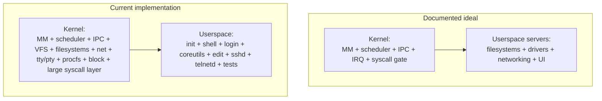

# Current State and Architecture Reality Check

## Bottom line

m3OS is best understood as a **well-structured, heavily documented, QEMU-first Rust OS with microkernel ambitions, a surprisingly deep userspace, a now-real service-management/logging layer, and a shipped single-app graphics proof**.

The central architectural truth is:

- **the documentation describes a minimal microkernel ideal**
- **the shipped system currently concentrates much more policy and functionality in ring 0**

That tension does not make the project bad. It makes the project **pragmatic**. But it does shape what "usable", "secure", and "GUI-ready" should mean.

Phase 46 materially improves the headless story by adding a real userspace service manager, logging daemon, cron daemon, and admin commands. Phase 47 adds a real userspace graphical proof by running DOOM end to end through the framebuffer path. Those are meaningful maturity jumps, but they do **not** by themselves narrow the kernel, resolve the security floor, or create a display-server architecture.

A useful framing change after `v0.47.0` is that phases 1-47 are the shipped base. If something expected from that scope still feels rough, it is best described as a quality or integration gap in current behavior, not as pre-47 roadmap debt hiding elsewhere.

## What is already strong

| Area | What is good | Why it matters |
|---|---|---|
| Documentation | `docs/roadmap/README.md` plus per-phase docs/tasks make the system unusually understandable | New work can be planned and reviewed against explicit scope |
| Core architecture | `kernel-core/` extracts pure logic from hardware-facing code | Host tests and property tests are possible without QEMU |
| Syscall/userspace surface | `kernel/src/arch/x86_64/syscall/` (decomposed into 8 subsystem modules), `userspace/`, and `userspace/coreutils-rs/` provide real breadth | m3OS is beyond a kernel demo and into OS territory |
| SMP and VM | `kernel/src/smp/`, `kernel/src/mm/`, `docs/25-smp.md`, `docs/33-kernel-memory.md`, `docs/36-expanded-memory.md` | The project has already crossed major "serious OS" milestones |
| Diagnostics/testing | `docs/43c-regression-stress-ci.md`, trace-ring and crash-diag docs | Failures are observable, not opaque |
| System operations baseline | Phase 46 adds a real PID 1 service manager, service definitions, `syslogd`, `crond`, and admin commands | The headless/reference-system story is now built on shipped lifecycle plumbing rather than aspiration |

## Architectural reality check

### 1. The microkernel story is strong in design, partial in enforcement

`docs/appendix/architecture-and-syscalls.md` describes a kernel limited to memory management, scheduling, IPC, and interrupt routing, with drivers/filesystems/networking in userspace servers.

The current tree still places substantial functionality in ring 0:

- filesystems in `kernel/src/fs/`
- networking in `kernel/src/net/`
- TTY/PTY and signal handling in `kernel/src/tty.rs`, `kernel/src/pty.rs`, and `kernel/src/signal.rs`
- a large syscall surface in `kernel/src/arch/x86_64/syscall/` (now decomposed into subsystem modules with ownership classification)

That means the current system is architecturally closer to a **modular monolith with microkernel-compatible ideas** than to a fully enforced seL4/Redox-style userspace-services model.

### 2. The best design choice in the repo may be `kernel-core/`

The split between `kernel/` and `kernel-core/` is one of the project's highest-leverage structural decisions. It keeps algorithms and state machines testable on the host while leaving hardware setup, paging, traps, and device I/O in the real kernel.

If m3OS keeps evolving, this split is likely to matter more than whether every subsystem eventually moves out of ring 0.

### 3. Syscall decomposition and ownership classification (Phase 49)

The former single-file `syscall.rs` has been decomposed into `kernel/src/arch/x86_64/syscall/` with eight subsystem modules (fs, mm, process, net, signal, io, time, misc). Each module carries an ownership header classifying it as kernel-mechanism, transitional, or future-userspace.

A keep/move/transition matrix in `docs/appendix/architecture-and-syscalls.md` formally classifies every kernel subsystem by long-term ownership. A userspace-first rule is now adopted: new policy-heavy behavior defaults to ring 3 unless a clear ring-0 requirement exists.

### 4. The microkernel deficiencies are concrete, not abstract

The microkernel gap is visible in specific repo seams, not just in high-level rhetoric.

| Deficiency | Concrete evidence | Architectural effect |
|---|---|---|
| Core services still live in the kernel | `kernel/src/main.rs` spawns `console_server_task`, `kbd_server_task`, `fat_server_task`, and `vfs_server_task` | The system keeps service logic inside the trusted kernel address space |
| Service IPC still depends on shared-address-space shortcuts | `kernel/src/ipc/mod.rs` documents kernel-task IPC assumptions for service registration; `kernel/src/main.rs` passes kernel pointers in console IPC | A true ring-3 server conversion cannot be finished until these assumptions are removed |
| Bulk data path is unfinished | `docs/06-ipc.md` still defers page-capability grants and bulk transfers | Filesystems, graphics, and networking still lack a clean microkernel-grade data path |
| Filesystem and network policy remain ring-0 code | `kernel/src/fs/`, `kernel/src/net/`, `kernel/src/tty.rs`, `kernel/src/pty.rs` | The kernel blast radius remains much larger than the docs imply |
| Future server crates are still not active workspace members | `Cargo.toml` comments out `userspace/console_server`, `userspace/vfs_server`, `userspace/fat_server`, and `userspace/kbd_server` | The intended service topology is still only partially realized |

This is the main reason the current system reads as "microkernel-aimed" rather than "properly enforced microkernel." The detailed migration plan is in [microkernel-path.md](./microkernel-path.md).

## Subsystem maturity snapshot

| Subsystem | Current state | Evidence |
|---|---|---|
| Boot/build/run | Mature for QEMU workflows | `README.md`, `CLAUDE.md`, `xtask/src/main.rs` |
| Memory/process/threading | Strong and non-trivial | `docs/11-elf-loader-and-process-model.md`, `docs/33-kernel-memory.md`, `docs/40-threading-primitives.md` |
| IPC/capabilities | Architecturally clean, not yet the dominant app-facing model | `docs/06-ipc.md`, `kernel/src/ipc/`, `kernel-core/src/ipc/` |
| Storage/filesystems | Strong for a project at this maturity | `docs/24-persistent-storage.md`, `docs/28-ext2-filesystem.md`, `kernel/src/fs/` |
| Networking | Solid system infrastructure, still not full product networking | `docs/16-network.md`, `docs/23-socket-api.md`, `docs/39-unix-domain-sockets.md`, `kernel/src/net/` |
| Userspace tooling | Far beyond the kernel-demo stage | `userspace/`, `userspace/coreutils-rs/`, `docs/32-build-tools.md`, `docs/45-ports-system.md` |
| Service model | Real Phase 46 baseline, but still not the same thing as a clean graph of restartable ring-3 core services | `docs/roadmap/46-system-services.md`, `userspace/init/src/main.rs`, `userspace/syslogd/src/main.rs`, `userspace/crond/src/main.rs` |
| Graphics/UI | Framebuffer text console plus a shipped single-app graphics proof; still no multi-client display/input architecture | `docs/09-framebuffer-and-shell.md`, `docs/47-doom.md`, `kernel/src/fb/mod.rs`, `docs/roadmap/47-doom.md`, `docs/roadmap/56-display-and-input-architecture.md` |
| Hardware breadth | Still QEMU-centric | `kernel/src/blk/`, `kernel/src/net/virtio_net.rs`, `docs/roadmap/55-hardware-substrate.md`, `docs/roadmap/57-audio-and-local-session.md` |

## Why m3OS is already more than "just a toy"

The right mental model is not "small kernel experiment." The right mental model is:

**a serious operating-system project that still lacks several product layers.**

Concrete reasons:

| Capability | Why it changes the classification | Evidence |
|---|---|---|
| SSH and remote login | Remote administration moves the project into real operating-system territory | `docs/roadmap/43-ssh-server.md`, `userspace/sshd/`, `userspace/init/src/main.rs` |
| Multi-user accounts and permissions | UID/GID, `/etc/passwd`, `/etc/shadow`, and permission checks are system-level concerns | `docs/27-user-accounts.md`, `kernel/src/arch/x86_64/syscall/` |
| PTYs, Unix sockets, threads, and epoll | These are meaningful maturity markers for shells, daemons, and ports | `docs/29-pty-subsystem.md`, `docs/39-unix-domain-sockets.md`, `docs/40-threading-primitives.md`, `docs/37-io-multiplexing.md` |
| ext2, procfs, and ports/build tools | The system can host a non-trivial userland rather than booting one static demo binary | `docs/28-ext2-filesystem.md`, `docs/38-filesystem-enhancements.md`, `docs/45-ports-system.md` |
| Smoke/regression/stress infrastructure | The project already behaves like something expecting ongoing maintenance and release discipline | `docs/43c-regression-stress-ci.md`, `xtask/src/main.rs` |

## Evaluation-session validation snapshot

The local validation signal from this review was mixed in a useful way:

| Command | Result | Takeaway |
|---|---|---|
| `cargo xtask check` | Passed | Baseline build, formatting, clippy, and host-test path are healthy |
| `cargo xtask smoke-test` | Passed | Full-system QEMU flow is good enough for broad end-to-end demo coverage |
| `cargo xtask regression --test fork-overlap` | Failed before the shared boot/login gate | There is still targeted reliability or harness fragility worth treating seriously |

Two details from the failed regression matter:

1. the failure happened at the common **boot-to-login** path defined in `xtask/src/main.rs`, before the actual fork workload began
2. the saved regression serial log was empty, which looks more like a pre-serial boot/harness failure than a deterministic fork bug

Also noted during that run: the ports fetch path emitted a `zlib` source-download 404 and skipped the port, which suggests some ecosystem/package inputs are still brittle.

## So how usable is m3OS right now?

### Already usable for:

- QEMU-driven kernel and userspace development
- documentation-backed learning and experimentation
- smoke-tested demos of login, shell, file editing, compilation, and remote access
- exploring OS subsystems in a codebase that is still understandable by one person

### Not yet usable as:

- a safe network-exposed multi-user system
- a general-purpose desktop OS
- a broad hardware platform
- a stable target for larger third-party software ecosystems

## What matters most next

1. **Close the security blockers** in [security-review.md](./security-review.md).
2. **Decide how serious the project is about enforcing the microkernel boundary** in [microkernel-path.md](./microkernel-path.md), because that choice affects storage, networking, GUI, and long-term security all at once.
3. **Harden and validate the shipped "system operations" layer** in [usability-roadmap.md](./usability-roadmap.md): services, logging, shutdown/reboot, packaging polish.
4. **Pick a graphics direction before adding more graphics APIs** in [gui-strategy.md](./gui-strategy.md).
5. **Keep m3OS honest about its niche** in [rust-os-comparison.md](./rust-os-comparison.md): it should lean into being a serious reference OS with unusually strong pedagogy rather than pretending to be a near-term Redox replacement.
