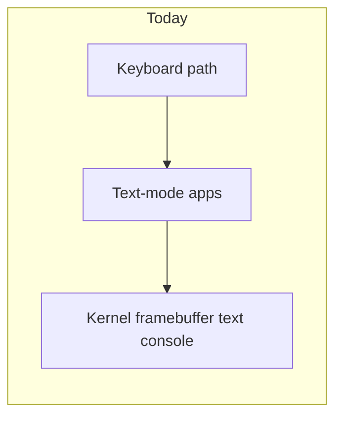
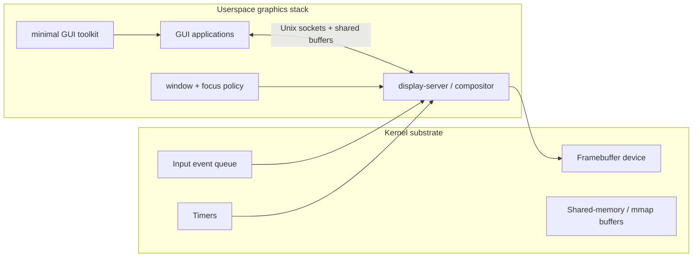

# GUI Strategy: From Framebuffer Console to a Redox-Like Desktop

## Bottom line

If the goal is "something like Redox", the right target is **not** "map the framebuffer into apps and stop there." The right target is a **userspace display server/compositor with a small kernel graphics/input substrate**.

**Status update (Phase 56):** the userspace-display-server recommendation is **no
longer hypothetical**. Phase 56 has landed: the
[`docs/roadmap/tasks/56-display-and-input-architecture-tasks.md`](../roadmap/tasks/56-display-and-input-architecture-tasks.md)
task list exists, all tracks (A–H) shipped, and the four Goal-A contract points
are delivered:

1. **Layout module contract** (Goal-A decision 1) → A.7 / E.1 — `LayoutPolicy` trait
   plus `FloatingLayout` plus a substitutability contract suite.
2. **Keybind grab hook** (Goal-A decision 2) → A.5 / D.4 — bind table evaluated
   before focus routing, with control-socket-driven `register-bind` /
   `unregister-bind` verbs.
3. **Layer-shell-equivalent surface roles** (Goal-A decision 3) → A.6 / E.2 —
   `Toplevel` / `Layer` / `Cursor` roles with anchor / exclusive-zone /
   keyboard-interactivity semantics.
4. **Control socket** (Goal-A decision 4) → A.8 / E.4 — separate AF_UNIX socket
   speaking the same length-prefixed framing as the client protocol, with the
   minimum verb set (`version`, `list-surfaces`, `focus`, `register-bind`,
   `unregister-bind`, `subscribe`, `frame-stats`).

The remaining graphical roadmap (tiling-first UX, animation engine, native bar /
launcher / lockscreen client implementations, native graphical terminal) is
**Phase 56b / 57 / 57b / 57c work** — additive on top of Phase 56's contract
surface, not part of Phase 56 itself.

The current repo is now "graphical architecture, no graphical UX" — exactly the
Phase 56 milestone:

- `kernel/src/fb/mod.rs` keeps the framebuffer text console as a pre-init / panic
  / failover surface
- `docs/09-framebuffer-and-shell.md` documents that framebuffer ownership now
  transfers to `display_server`
- `docs/roadmap/47-doom.md` anchors the shipped single-app graphics proof from Phase 47
- `docs/56-display-and-input-architecture.md` is the live learning doc for the
  Phase 56 architecture (replaces the earlier "later display, input, audio, and
  session work" placeholder language for Phase 56)
- `docs/roadmap/57-audio-and-local-session.md` defines the next audio + local-session phase
- Phase 46 supplies the service/logging/admin baseline that the Phase 56
  `display_server` is supervised under

## Why this needs detailed planning

A GUI effort here is not "just add windows." A serious desktop path touches multiple layers at once:

| Layer | What is needed |
|---|---|
| Display ownership | one process or service controls presentation |
| Buffer exchange | apps need a way to hand pixels to the compositor efficiently |
| Input model | keyboard and mouse events need focus-aware routing |
| Session/lifecycle | graphical login, launcher, and shutdown semantics |
| Text/fonts | terminal emulation, rasterization, and text layout |
| Toolkit/widgets | buttons, lists, menus, dialogs, scrolling, focus |
| App conventions | clipboard, file chooser, settings, notifications, window controls |
| Packaging/runtime | enough ecosystem to ship graphical apps without heroic per-app effort |

## Why GUI work is also microkernel work

The display stack is not just a user-facing feature area. For m3OS, it is also the most natural place to **start enforcing the microkernel boundary more seriously**.

Why:

1. a display server is naturally a userspace service
2. focus, composition, and window policy obviously do not belong in ring 0
3. the graphics path forces the project to solve real shared-buffer and input-routing problems instead of relying on kernel-pointer shortcuts
4. the same infrastructure needed for a real display server is useful for other serverized subsystems

That means GUI work is not separate from microkernel work. It is one of the cleanest paths into it. Phase 46 improves the starting point because the project already has PID 1 supervision and logging in userspace, which makes it easier to treat a future display server as a real managed service. The broader migration context is in [microkernel-path.md](./microkernel-path.md).

## Starting point

That is enough for:

- framebuffer text UI
- the shipped DOOM-style "one app owns the screen" milestone

It is not enough for:

- multiple windows
- focus management
- mouse routing
- clipping and damage tracking
- compositing
- a graphical login/session

## Option space

| Option | What it is | Good for | Main downside | Recommendation |
|---|---|---|---|---|
| Raw framebuffer mmap | Map the linear framebuffer directly into one app | DOOM, demos, bring-up | Becomes an ABI dead end for multi-app graphics | Use only as a short-term proof point |
| `fbdev`-like `/dev/fb0` | Device API plus mmap/ioctl-style control | Cleaner than one-off syscalls; easier for ports | Still fundamentally single-client | Better than raw mmap, but still not a desktop model |
| Orbital-like display server | One userspace server owns display, input focus, and composition | Best fit for m3OS and closest to Redox | Requires protocol design and software composition | **Recommended direction** |
| Wayland compositor first | Adopt a modern ecosystem protocol immediately | Future ecosystem alignment | Massive dependency and toolchain burden too early | Too early for m3OS right now |

## Recommended target architecture

This matches m3OS better than a Wayland-first approach because:

1. Unix domain sockets already exist (`docs/roadmap/39-unix-domain-sockets.md`).
2. `mmap`, `munmap`, and related VM machinery already exist (`docs/33-kernel-memory.md`, `docs/36-expanded-memory.md`).
3. The project already documents a microkernel philosophy where high-level services belong outside the kernel.
4. The display server is one of the easiest places to turn that philosophy into an enforced boundary.
5. A Redox-like path is philosophically closer to a small custom display server than to pulling in a large Linux graphics stack early.

## Practical staged plan

In the official roadmap, the current baseline now includes **Phase 47**
(DOOM / shipped graphics proof). The next architectural steps are **Phase 56**
(display and input architecture), **Phase 57** (audio and local session), and
the **Phase 58** release decision about whether 1.0 includes the local-system
branch or remains headless-first.

### Phase A: shipped single-app graphics proof

Purpose: establish, and now preserve, proof that graphical applications can run at all.

Suggested scope:

- expose framebuffer access through a device-style API rather than a custom long-term syscall contract
- expose raw keyboard input for one foreground graphical client
- keep the shipped DOOM milestone positioned as a proof of graphical capability, not as the desktop architecture

### Phase B: input and event model

Purpose: stop treating input as a one-off keyboard shortcut path.

Suggested scope:

- finish PS/2 mouse support for QEMU
- define a unified input event format early, even if it is initially minimal
- route focus and input ownership through one foreground graphics service

### Phase C: display server

Purpose: enable more than one graphical client.

Suggested scope:

- one display server process owns the framebuffer
- clients submit buffers or damage rectangles
- the server composites and presents
- basic focus, stacking order, and pointer routing live in userspace
- the shared-buffer path should be designed in a way that can later serve storage and networking too, rather than becoming a graphics-only special case

### Phase D: desktop usability layer

Purpose: make the GUI feel like a system instead of a demo.

Suggested scope:

- terminal emulator
- graphical launcher or session menu
- graphical editor or file browser
- clipboard, font rendering, icons, and image decoding
- graphical login/session startup

### Phase E: ecosystem bridge

Purpose: make the GUI stack worth investing in for more than one showcase app.

Suggested scope:

- stable client protocol for surfaces/windows/input
- at least one reusable toolkit layer
- packaging story for graphical applications
- a clear stance on whether m3OS wants a custom GUI ecosystem first or compatibility bridges later

## What Redox has that m3OS does not

Redox already has the key "middle layer" m3OS lacks:

- a working desktop/windowing story
- a display server/window manager instead of raw-fb-only demos
- enough graphics-facing ecosystem support to run real GUI applications

That does **not** mean m3OS needs to clone Redox exactly. It does mean the shortest path to "GUI like Redox" is to copy the **shape** of the solution:

- small kernel substrate
- userspace display ownership
- a protocol for windows/surfaces/input

## What not to do

1. **Do not freeze a raw framebuffer syscall as the long-term API.**
2. **Do not jump straight to Wayland or wlroots before the basic graphics substrate exists.**
3. **Do not treat DOOM as the desktop architecture.** It is a milestone, not the windowing model.
4. **Do not leave session management and service supervision out of the graphics plan.** GUI systems need those just as much as headless ones.

## Recommendation

The best path was:

1. treat shipped Phase 47 DOOM/raw-framebuffer work as the **graphics bring-up milestone** ✅
2. immediately follow with **input abstraction** ✅ (Phase 56 D.1 / D.2 / D.3 — `kbd_server` typed events, `mouse_server` PS/2 AUX, focus-aware dispatch)
3. then design and build a **userspace display server/compositor** ✅ (Phase 56 C.1–C.5, E.1–E.4)
4. only after that consider higher-level compatibility layers or larger GUI toolkits — **Phase 56b / 57 / 57b / 57c**

That path was followed. Phase 56 is the substrate; the graphical UX layer
(tiling-first compositor, animation engine, native bar / launcher /
notification daemon / lockscreen, native graphical terminal) is Phase 56b /
57 / 57b / 57c work, additive on top of Phase 56's four contract points
without any protocol rework.

For the staging of the additive graphical UX, see
[`docs/appendix/gui/tiling-compositor-path.md`](../appendix/gui/tiling-compositor-path.md);
for the deliberate non-Wayland framing, see
[`docs/appendix/gui/wayland-gap-analysis.md`](../appendix/gui/wayland-gap-analysis.md).
