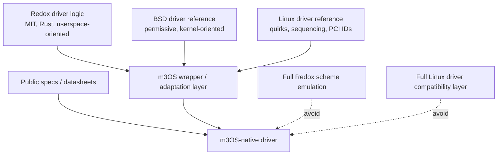

# Real Hardware Support and Driver Portability Strategy

## Bottom line

**Yes, m3OS can benefit from Redox drivers. No, it should not expect those drivers to drop in unchanged.**

The most realistic driver strategy for m3OS is:

1. **public specs and datasheets first**
2. **Redox second, as the closest Rust and microkernel-oriented donor**
3. **BSD third, as a permissive reference when Redox or specs are insufficient**
4. **Linux primarily as a behavior and quirk reference, not as a code donor**

The most important practical conclusion is:

**m3OS should not build a Linux driver compatibility layer or a full Redox scheme-emulation layer. It should build a small m3OS-native hardware-access layer and selectively port the device-specific logic that sits above it.**

## Why this matters now

m3OS already has enough low-level substrate to start real hardware support in a serious way:

- UEFI boot
- GOP framebuffer handoff
- ACPI parsing
- APIC and I/O APIC
- PCI enumeration
- VirtIO block and network drivers
- a substantial userspace and syscall surface

But the current tree is still heavily **QEMU- and VirtIO-centric**:

> **Phase 55 update (kernel v0.55.0).** The "Current reality" rows below
> describe the pre-Phase-55 state that motivated the strategy recorded in
> this doc. After Phase 55, PCIe MCFG is parsed, MSI/MSI-X is routed, a
> reusable hardware-access layer (BAR mapping, DMA, device-IRQ
> installation, device claim) exists, and the project has shipped native
> NVMe and Intel 82540EM classic e1000 drivers. The donor strategy in this
> doc was followed: specs first, Redox second — and neither the NVMe nor
> the e1000 driver imported code from Redox. See
> [Phase 55 — Hardware Substrate](../55-hardware-substrate.md) for the
> current state. The rows below are kept as historical context.

| Current capability | Current reality (pre-Phase 55) |
|---|---|
| PCI discovery | `kernel/src/pci/mod.rs` still uses legacy config-space I/O via ports `0xCF8/0xCFC`, not PCIe MCFG MMIO |
| Device inventory | the kernel stores up to 64 discovered PCI functions in a static array |
| Interrupt delivery | legacy PCI INTx via the I/O APIC is present; MSI/MSI-X is still deferred in the docs |
| Block/network | current real drivers are `virtio-blk` and `virtio-net`, both using legacy/transitional VirtIO over BAR0 I/O ports |
| Input and graphics | framebuffer text console exists, but mouse, audio, and a real GUI stack are still roadmap items |

That means the question is no longer "does m3OS need drivers?" The question is:

**which source ecosystems are realistic donors, and how much infrastructure must m3OS build before those drivers can be useful?**

## What Redox offers

Redox is the most relevant outside project for m3OS because it is:

- Rust-based
- microkernel-oriented
- already committed to userspace drivers
- broad enough to have practical driver coverage
- MIT-licensed in its `redox-os/drivers` repository

For a deeper Redox-only analysis, including driver-architecture details and class-by-class portability notes, see [redox-driver-porting.md](./redox-driver-porting.md).

### Redox driver architecture

Redox drivers are typically:

- standalone user-space daemons
- connected to the rest of the system through Redox-specific schemes and event APIs
- bound to PCI devices through `pcid`
- given controlled access to interrupts and physical memory mapping

Representative Redox infrastructure:

| Redox concept | Role |
|---|---|
| `pcid` | PCI discovery, BAR mapping, and device binding layer for user-space drivers |
| `redox-daemon` | daemon/process lifecycle helper |
| `redox_event` | event loop integration for IRQs and scheme operations |
| `redox_syscall` / `libredox` | Redox-specific system APIs |
| `redox_scheme` | file-like/resource IPC interface that drivers expose to the rest of the system |

### Redox driver coverage relevant to m3OS

The Redox drivers tree already contains storage, network, graphics, input, USB, and audio drivers, including:

- storage: `ahcid`, `nvmed`, `ided`, `virtio-blkd`, `usbscsid`
- network: `e1000d`, `rtl8139d`, `rtl8168d`, `ixgbed`, `virtio-netd`, `alxd`
- graphics: `vesad`, `virtio-gpud`, `bgad`
- USB/input: `xhcid`, `usbhidd`, `inputd`, `ps2d`
- audio: `ihdad`, `ac97d`, `sb16d`

Redox's public hardware-support docs are also useful reality checks. They show meaningful progress on real hardware, but they also show that Redox itself still has incomplete ACPI, uneven USB, no Wi-Fi/Bluetooth, and limited GPU support. That matters because it shows both:

1. Redox is a credible source of practical driver work.
2. Even Redox has not "solved hardware support" in a general sense.

## How portable Redox drivers really are

Redox is the best external donor m3OS has, but direct portability still varies a lot by driver class.

### The key rule

The most reusable part of a Redox driver is usually **the device logic**, not the surrounding daemon and scheme glue.

In practice, a Redox driver often splits into two layers:

| Layer | Portability to m3OS |
|---|---|
| register programming, ring management, command structures, protocol state machines | often portable or at least adaptable |
| daemon lifecycle, Redox event loop, scheme protocol, namespace handling, `pcid` integration | not directly portable |

This is visible in representative drivers:

- `e1000d` depends on `redox-daemon`, `redox_event`, `libredox`, `pcid`, and a Redox `NetworkScheme`
- `nvmed` depends on `redox-daemon`, `redox_event`, `redox_syscall`, `pcid`, and a Redox `DiskScheme`
- `virtio-gpud` depends on Redox graphics IPC, `inputd`, Redox event delivery, and Redox-oriented display ownership

So the right mental model is:

**a Redox driver is not a drop-in unit of reuse; it is a combination of reusable device logic and non-reusable Redox integration.**

## Feasibility by driver class

### High-feasibility Redox ports

| Driver class | Feasibility | Why |
|---|---|---|
| Intel e1000/e1000e-style NICs | **High** | public hardware docs, simple ring model, Redox already has `e1000d`, QEMU can emulate e1000 |
| AHCI | **High** | well-specified, Redox has `ahcid`, fits the storage-server direction well |
| NVMe | **High** | modern queue-based design, public spec, Redox has `nvmed`, good match for m3OS's block roadmap |
| PS/2 input | **High** | small protocol surface, minimal OS glue, easy to adapt |

These are the best candidates for "extract logic, rewrite integration, keep architecture clean."

### Medium-feasibility Redox ports

| Driver class | Feasibility | Why |
|---|---|---|
| VirtIO GPU | **Medium** | good architectural reference for future GUI work, but heavily tied to Redox graphics/input plumbing |
| Intel HDA / AC97 | **Medium** | useful protocol reference, but audio routing and device exposure differ significantly |
| Realtek NICs | **Medium** | hardware coverage value is high, but documentation and quirks are rougher than Intel e1000 |
| VESA / GOP display drivers | **Medium** | useful for early framebuffer ownership and display-server experiments |

### Low-feasibility Redox ports

| Driver class | Feasibility | Why |
|---|---|---|
| xHCI + USB HID stack | **Low to medium** | the controller, hub, HID, and event-routing layers are tightly coupled and fairly complex |
| full graphics stack integration | **Low** | display server, input routing, IPC, and GUI conventions all differ |
| anything depending on Redox-specific scheme semantics | **Low** | the more the driver assumes Redox resources and namespaces, the less direct the reuse becomes |

### Low-value ports even if technically feasible

| Driver class | Why it is not a good first target |
|---|---|
| Redox VirtIO block/network | m3OS already has its own VirtIO implementations, so the main value is comparison and future userspace extraction, not wholesale reuse |
| Redox Wi-Fi-related patterns | Redox itself does not yet offer the kind of mature Wi-Fi support that would make it a strong donor |

## Why Linux is different

Linux is extremely valuable as a **knowledge base** and usually a poor **donor codebase** for m3OS.

### What Linux is good for

Linux is the best source for:

- PCI ID tables
- hardware quirks
- reset/init sequencing
- timeout and retry behavior
- error recovery ideas
- undocumented vendor behavior

In other words:

**Linux is the best "bug oracle" and hardware encyclopedia, not the best source of portable driver code.**

### Why direct Linux ports are usually the wrong move

Linux drivers usually assume:

- Linux's device model and probe/remove lifecycle
- Linux DMA APIs
- Linux PCI/ACPI/MSI helpers
- Linux workqueues, waitqueues, timers, and locking conventions
- Linux net/block/input/USB subsystems
- Linux power-management and firmware-loading assumptions

That means a Linux driver is usually attached to a large ecosystem of Linux-only abstractions. Reusing one driver often means re-creating a big part of Linux's supporting kernel personality.

### Licensing matters too

m3OS is MIT-licensed. Linux drivers are generally GPL-licensed.

That does **not** make Linux useless. It means the safest path is:

- read Linux code
- learn from it
- rewrite the logic in m3OS-native Rust

The conservative recommendation for m3OS is:

**do not import Linux driver code directly unless the project deliberately wants to accept GPL-driven licensing consequences.**

## BSD as the middle ground

BSD driver code is often the best fallback when:

- there is no good public datasheet
- Redox does not already support the hardware
- Linux is too entangled or too license-sensitive to use comfortably as a donor

BSD drivers are still not drop-in, because they assume BSD kernel subsystems such as:

- `ifnet` and `mbuf`
- `bus_dma`
- `bus_space`
- BSD storage and USB frameworks

But compared with Linux, BSD gives m3OS:

- a cleaner licensing story
- often simpler and more readable driver structure
- better "clean-room reference" material

This is also consistent with Redox's own published guidance, which explicitly points contributors toward BSD drivers as reverse-engineering references when datasheets are unavailable.

## Translation layers: what is realistic and what is not

### Full Linux driver compatibility layer

**Recommendation: do not do this.**

Why:

- it would be a project of its own
- it would pull m3OS toward Linux-shaped internals
- it would enlarge the ring-0 trusted computing base if done in-kernel
- it would actively work against the long-term microkernel path

Compatibility-layer efforts do exist in the wider systems world, but they are not lightweight. Projects such as L4Linux and Genode's driver-porting work show that this path is possible only by carrying a large compatibility environment and significant maintenance burden.

For m3OS, that is the wrong cost structure.

### Full Redox scheme-emulation layer

**Recommendation: also do not do this.**

Why:

- m3OS does not have Redox schemes, namespaces, or `pcid`
- emulating Redox's driver environment would still leave m3OS maintaining a second OS personality
- it would encourage porting daemon glue rather than designing a clean native driver model

### Narrow compatibility helpers

**Recommendation: yes, but keep them small and native.**

What m3OS *should* build is a thin hardware-access layer that gives new drivers the primitives they actually need:

| Needed primitive | Why it matters |
|---|---|
| PCI device binding and metadata | drivers need a stable way to claim and inspect devices |
| BAR mapping helpers | MMIO/PIO setup should not be hand-rolled in every driver |
| DMA buffer abstraction | queue- and descriptor-based drivers need consistent CPU/bus-address handling |
| IRQ allocation and delivery | drivers need a common interrupt model |
| event/wait integration | drivers should not invent bespoke polling models per subsystem |

That kind of layer helps both:

- newly written native drivers
- selective ports from Redox or BSD

without turning m3OS into an emulator for someone else's driver ABI.

## The most important m3OS-side prerequisites

Before ambitious real-hardware driver work, m3OS should strengthen a few platform pieces.

### 1. PCIe-era platform support

The current PCI implementation is enough for QEMU and basic discovery, but not enough for comfortable modern driver work.

High-value upgrades:

- PCIe MCFG support for extended MMIO config space
- MSI and MSI-X
- a clearer BAR mapping interface
- eventually IOMMU awareness, even if initially only as future-proof design

### 2. Better DMA discipline

VirtIO already forced m3OS to do basic DMA-oriented thinking, but more real devices will need:

- a first-class `DmaBuffer` or equivalent abstraction
- clear ownership of CPU virtual address vs device-visible bus address
- explicit alignment and size guarantees

### 3. A driver placement strategy

The microkernel ideal says drivers should end up in userspace. The project reality says that some drivers will likely start in ring 0 to move faster.

The workable compromise is:

1. keep new drivers self-contained
2. give them narrow interfaces
3. avoid deep dependencies on VFS/net/TTY internals
4. design them so they can later move into userspace services

That aligns directly with [microkernel-path.md](./microkernel-path.md).

## Recommended donor strategy by source

| Source | Legal fit | Architecture fit | Practical value | Recommended use |
|---|---|---|---|---|
| Public specs / datasheets | **Highest** | **Highest** | **Highest** when available | Primary source of truth |
| Redox drivers | **High** (MIT) | **High-ish** | **High** | Best code/architecture donor for m3OS |
| BSD drivers | **High** | **Medium** | **Medium** | Strong fallback reference |
| Linux drivers | **Low for direct reuse, high for reference** | **Low** | **High as documentation, low as donor code** | Use for quirks, sequencing, and PCI IDs |
| Compatibility layer | varies | **Poor** | **Low relative to cost** | Avoid except for very narrow helpers |

## Recommended real-hardware roadmap

This is the highest-leverage order for m3OS.

### Stage 1: verify what should already work on real hardware

- UEFI GOP framebuffer
- PS/2 keyboard path
- serial console logging on physical hardware

This step matters because it may reveal that "real hardware support" starts with validation rather than with writing a new driver immediately.

### Stage 2: NVMe

Best first real storage target because:

- it is now the dominant storage interface
- it is queue-based and conceptually close to VirtIO
- it has a public spec
- Redox already has `nvmed` for architectural reference
- QEMU supports NVMe for pre-hardware validation

### Stage 3: Intel e1000/e1000e-class Ethernet

Best first real NIC target because:

- public Intel documentation exists
- QEMU emulates e1000
- Redox already has `e1000d`
- the ring model is understandable and a good match for m3OS's current maturity

### Stage 4: xHCI + USB HID

Important because modern machines depend on USB for input, but should come later because:

- the controller is significantly more complex
- the stack spans controller, hub, and HID behavior
- integration work is much broader than a single NIC or NVMe driver

Redox is valuable here as a reference, but this is still not a "quick port."

### Stage 5: Realtek gigabit Ethernet

Worth adding after Intel NIC support because it broadens coverage for commodity desktop and mini-PC hardware.

### Stage 6: AHCI/SATA

Still useful for older systems and certain mini-PCs, but lower priority than NVMe.

### Stage 7: Intel HDA audio

Desirable for a desktop path, but not a bringup blocker.

### Stage 8: Wi-Fi

Defer heavily. Wi-Fi is a high-complexity, firmware-heavy, low-QEMU-value area and should not be an early hardware-support target.

## Concrete recommendations

1. **Do not build a Linux driver compatibility layer.**
2. **Do not build a Redox scheme-emulation layer.**
3. **Add a small, native hardware-access layer for BAR mapping, DMA, IRQs, and device binding.**
4. **Use Redox as the primary external driver donor and reference set.**
5. **Prefer Intel e1000/e1000e and NVMe as the first serious real-hardware ports.**
6. **Treat USB/xHCI as a second-wave effort, not the first proof point.**
7. **Use BSD and Linux as references when public specs are incomplete, but keep the implementation native to m3OS.**
8. **Keep new drivers structurally extractable into future userspace services.**

## Anti-recommendations

1. **Do not start with Wi-Fi.**
2. **Do not start with modern desktop GPU drivers.**
3. **Do not expand ring 0 just to make foreign driver code fit.**
4. **Do not confuse "MIT-licensed Redox code" with "drop-in portability."**
5. **Do not treat Linux syscall compatibility as meaning Linux driver compatibility.**

## The shortest honest answer

If the question is:

**"Could m3OS port Redox drivers?"**

the answer is:

**yes, selectively, and often profitably — but mostly by reusing device logic and redesigning the OS integration around m3OS.**

If the question is:

**"Could m3OS port Linux drivers or build a translation layer?"**

the answer is:

**it is possible in theory, but it is the wrong strategy for this project unless m3OS deliberately wants a Linux-shaped compatibility subsystem and the cost that comes with it.**

The best path is therefore:

**specs first, Redox second, BSD third, Linux as reference only, and small native abstractions instead of giant foreign-ABI shims.**
