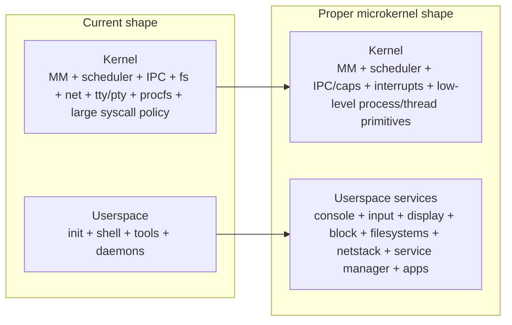
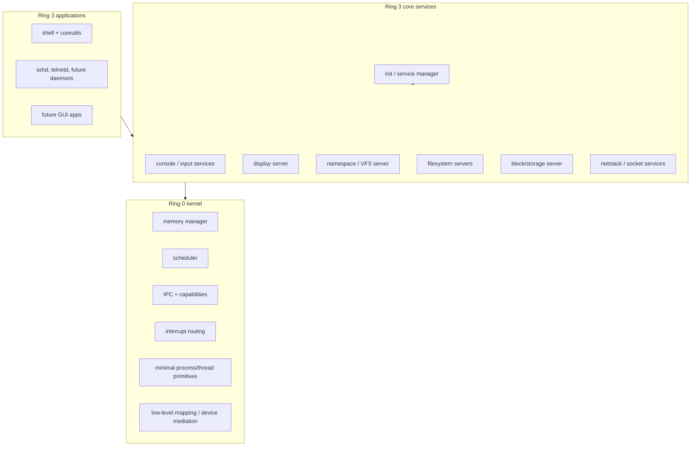

# Path to a Proper Microkernel Design

## Bottom line

m3OS already contains many of the right **microkernel primitives**:

- ring-3 process support
- per-process page tables
- capability tables
- synchronous rendezvous IPC
- notification objects for IRQ delivery
- a clear conceptual split between kernel mechanisms and higher-level services

But it does **not yet fully enforce** the boundary that its architecture docs describe. The current system is best described as:

**a serious OS with strong microkernel foundations, but still a broad ring-0 implementation.**

That gap is not cosmetic. It is the difference between:

- "the kernel could eventually host userspace services"
- and "the kernel is already small because it has no choice"

Phase 46 narrows one operational gap: m3OS now has a real userspace service manager, logging daemon, restart behavior, and admin surface for ordinary daemons. That improves the system story, but it does **not** yet convert the kernel-resident console/input/storage/network services into restartable ring-3 servers.

## What "proper microkernel" should mean for m3OS

For this project, "proper microkernel" should not mean "minimal for its own sake." It should mean:

1. **the ring-0 boundary is narrow and intentional**
2. **high-level policy lives outside the kernel**
3. **a crashed service is restartable without kernel corruption**
4. **data exchange between services is explicit and safe**
5. **new subsystems default to userspace unless there is a very strong reason not to**

### Kernel responsibilities in the target design

| Keep in kernel | Why |
|---|---|
| Address-space management and low-level VM | page tables, mapping rules, fault handling, frame ownership |
| Scheduler and thread/process primitives | context switching, run queues, CPU-local scheduling state |
| Capability/object management | endpoints, notifications, task/thread objects, mapping rights |
| IPC fast path | rendezvous, reply/reply_recv, shared-buffer/map-grant primitives |
| Interrupt routing and low-level controller work | APIC/IOAPIC, IRQ delivery, minimal ISR logic |
| Low-level hardware mediation | privileged MMIO mapping, DMA-safe region setup, low-level device exposure |

### Move to userspace in the target design

| Move to userspace | Why |
|---|---|
| Console, keyboard, input translation | policy and event routing do not require ring 0 |
| Display server / compositor | ideal microkernel-style service boundary |
| Filesystem servers and namespace management | high-level policy, restartability, fault containment |
| Block device policy and storage services | can be isolated behind driver/storage servers |
| Network stack and socket policy | large, bug-prone surface that benefits from isolation |
| Service manager and daemon supervision | naturally a PID-1/userspace concern |
| POSIX adaptation layers where feasible | keeps policy and compatibility logic out of the kernel |

## Current microkernel deficiencies

These are the concrete ways the current repo still falls short of a properly enforced microkernel.

| Deficiency | Evidence | Why it matters |
|---|---|---|
| Core servers are still kernel tasks | `kernel/src/main.rs` spawns `console_server_task`, `kbd_server_task`, `fat_server_task`, and `vfs_server_task`; `docs/07-core-servers.md` and `docs/08-storage-and-vfs.md` explicitly call this out | Fault isolation is not real if core services still share ring-0 state |
| IPC still assumes a shared kernel address space in places | `kernel/src/ipc/mod.rs` says service-registry syscalls still assume kernel-task callers; `kernel/src/main.rs` passes kernel pointers in console IPC; `docs/07-core-servers.md` and `docs/08-storage-and-vfs.md` explain this limitation | The system cannot fully serverize while message payloads still depend on shared in-kernel pointers |
| Capability grant and bulk shared-data path are unfinished | `docs/06-ipc.md` defers page-capability grants and bulk data transfers | Serious userspace servers need a safe, zero-copy or bounded-copy way to exchange file blocks, framebuffer regions, packets, and strings |
| Filesystem, networking, TTY, PTY, procfs, and related policy still live in ring 0 | `kernel/src/fs/`, `kernel/src/net/`, `kernel/src/tty.rs`, `kernel/src/pty.rs`, `kernel/src/signal.rs` | The kernel TCB is much larger than the documented architecture suggests |
| POSIX/Linux ABI policy is concentrated in the kernel | `kernel/src/arch/x86_64/syscall.rs` is still the giant compatibility/policy surface | This makes the kernel the place where policy keeps accumulating |
| Future userspace service crates are still commented out | `Cargo.toml` lists `userspace/console_server`, `userspace/vfs_server`, `userspace/fat_server`, and `userspace/kbd_server` as future work | The workspace structure itself reflects that the serverized design is still aspirational |
| Core-service lifecycle and restartability are still incomplete | Phase 46 provides supervision for ordinary userspace daemons, but the kernel-resident services that matter most for the microkernel claim are not yet extracted into that model | A real microkernel needs restartable userspace services, not one-shot kernel tasks |
| The native IPC model is not yet the dominant application-facing path | most real userland behavior currently routes through Linux-style syscalls instead of service IPC | The more POSIX policy stays in the kernel, the harder it becomes to fully enforce userspace services later |

## The hardest design question: POSIX compatibility in a microkernel

The most difficult part of the migration is not "move code out of the kernel." The hardest part is:

**who owns the POSIX and Linux-ABI compatibility story once services move to userspace?**

Today, musl-linked applications call a Linux-like syscall ABI, and the kernel directly implements much of that behavior. A more proper microkernel has three broad options:

| Option | Description | Pros | Cons |
|---|---|---|---|
| Kernel compatibility facade | Keep the current syscall ABI, but have the kernel turn those syscalls into calls on userspace servers | Incremental; preserves existing apps | Less pure; kernel still mediates more than an ideal microkernel |
| Userspace libc/runtime translation | Move more POSIX translation into libc or a dedicated userspace compatibility service | Cleaner long-term boundary; truer microkernel | Larger porting effort; harder short-term migration |
| Big-bang ABI break | Replace the current compatibility model all at once | Architecturally clean on paper | Too disruptive; would slow the project dramatically |

### Recommended approach

The best path for m3OS is a **hybrid incremental strategy**:

1. **preserve the current syscall ABI for now**
2. **move the implementation behind that ABI out to userspace services where practical**
3. **refuse to add new large policy subsystems directly into the kernel unless absolutely necessary**
4. **later decide whether more of the POSIX adaptation layer should leave the kernel entirely**

That approach is not perfectly pure, but it is realistic and protects the current guest software story.

## Recommended staged migration path

### Stage 0: make the target explicit and stop digging the hole deeper (COMPLETE -- Phase 49)

Before moving subsystems, m3OS should make the target architecture explicit in code and docs.

**Goals**

- clearly distinguish **current architecture** from **target architecture**
- split `syscall.rs` into subsystem modules so the current kernel is easier to unwind
- define a rule that new high-level policy defaults to userspace unless it truly belongs in ring 0

**Concrete work**

- break `kernel/src/arch/x86_64/syscall.rs` into `syscall/{fs,mm,process,net,signal,io,time,misc}.rs`
- document which syscalls are "fundamental kernel primitives" versus "compatibility shims"
- add evaluation/roadmap notes about which in-kernel services are temporary, transitional, or intended to stay

**Completion status (Phase 49)**

| Deliverable | Status | Reference |
|---|---|---|
| Syscall decomposition | Complete | `kernel/src/arch/x86_64/syscall/` (mod.rs + 8 subsystem modules: fs, mm, process, net, signal, io, time, misc) |
| Ownership matrix | Complete | `docs/appendix/architecture-and-syscalls.md` -- Keep/Move/Transition Matrix section |
| Syscall classification | Complete | `docs/appendix/architecture-and-syscalls.md` -- Syscall Ownership Classification section |
| Userspace-first rule | Complete | `docs/appendix/architecture-and-syscalls.md` -- Userspace-First Rule section |
| Architecture review checklist | Complete | `docs/appendix/architecture-and-syscalls.md` -- Architecture Review Checklist section |

**Deferred items:** None. All three Stage 0 goals are addressed. The actual code movement (extracting subsystems to userspace) is the subject of Stages 1--5 and is not part of Stage 0.

### Stage 1: complete the IPC model for real ring-3 servers (COMPLETE -- Phase 50)

This is the real prerequisite for the rest.

**Goals**

- make IPC safe for fully isolated userspace services
- remove all remaining shared-address-space assumptions from core service paths
- give userspace services a practical data path, not just a message-control path

**Concrete work**

- implement capability grants and page- or buffer-sharing primitives
- replace kernel-pointer payload conventions with grant/mapping or validated copy paths
- fix service-registry syscalls so they are ring-3-safe
- define a stable message/buffer contract for strings, file blocks, framebuffer spans, and packet buffers
- connect service registration, death handling, and restart semantics to the existing Phase 46 supervisor so extracted services can actually be managed

**Completion status (Phase 50, v0.50.0)**

| Deliverable | Status | Reference |
|---|---|---|
| Capability grants (`sys_cap_grant`, `CapabilityTable::grant`) | Complete | `kernel-core/src/ipc/capability.rs`, `kernel/src/ipc/mod.rs` |
| Grant capability variant for page transfers | Complete | `Capability::Grant { frame, page_count, writable }` |
| Message cap field for in-band capability delivery | Complete | `kernel-core/src/ipc/message.rs` |
| Buffer validation (`validate_user_buffer`) | Complete | `kernel-core/src/ipc/buffer.rs` |
| `copy_from_user` in IPC register/lookup | Complete | `kernel/src/ipc/mod.rs` |
| Owner-tracked registry with re-registration | Complete | `kernel-core/src/ipc/registry.rs` |
| Registry capacity increased (8 to 16) | Complete | `kernel-core/src/ipc/registry.rs` |
| IPC syscall dispatch module | Complete | `kernel/src/arch/x86_64/syscall/ipc.rs` |
| Server-loop failure semantics | Complete | `docs/06-ipc.md` |
| IPC cleanup on task exit | Complete | `kernel/src/ipc/endpoint.rs` |
| Console server validated data path | Complete | `kernel/src/main.rs` |

**Deferred items:** None. All five Stage 1 goals are addressed. Actual service extraction to ring-3 processes is the subject of Stages 2--5.

**Why this stage matters**

Without it, every later "userspace server" migration either becomes fake isolation or forces awkward, special-case kernel escapes.

### Stage 2: move the simplest and highest-value services first

The first real serverization targets should be the services that are already conceptually server-shaped:

- console
- keyboard/input translation
- eventually display ownership

**Why start here**

- the conceptual model already exists in docs and code
- these services are naturally event-driven
- they create immediate pressure to solve real userspace IPC, restartability, and buffer ownership
- they also line up with the GUI path

**Concrete work**

- turn `console_server_task` and `kbd_server_task` into real userspace binaries
- move focus/input policy out of kernel-space task glue
- treat the future display server as part of this family, not as a special later exception

### Stage 3: serverize storage and namespace management

This is where m3OS starts behaving much more like a proper microkernel.

**Targets**

- block-server
- filesystem servers (ramdisk/tmpfs/FAT/ext2 policy)
- VFS / mount / namespace server

**Hard part**

The kernel today still owns much of the file-descriptor and pathname compatibility story. During migration, the kernel will likely need to keep a thin fd/object facade while delegating the real work outward.

**Concrete work**

- represent open files as kernel-visible references to userspace server-owned objects
- move path resolution, mount routing, and file policy outward
- move filesystem-specific logic out of ring 0
- stop treating current IPC file payloads as same-address-space shortcuts

### Stage 4: move network and socket policy outward

Networking is both a security issue and a microkernel issue.

**Targets**

- NIC driver service
- netstack daemon
- socket/service endpoints
- eventually DNS/DHCP/user-facing network services

**Why this matters**

Large protocol stacks are a classic argument for microkernels: they are complex, stateful, and bug-prone, and they should not necessarily share ring-0 fate with the scheduler and memory manager.

### Stage 5: narrow the kernel and freeze the rule

At this stage, the question is no longer "can m3OS host userspace services?" It becomes "what is left in ring 0, and why?"

**Desired end state**

- kernel retains only mechanism-heavy, privilege-sensitive responsibilities
- high-level policy lives in restartable userspace services
- new subsystems are userspace-first by default
- architecture docs describe the system that actually ships, not the system it once intended to become

## A realistic target architecture for m3OS

## What not to do

1. **Do not attempt a big-bang rewrite.**
2. **Do not add new complex policy to the kernel while simultaneously claiming a microkernel migration.**
3. **Do not serverize storage or graphics before the buffer/grant model is ready.**
4. **Do not equate "uses IPC" with "is already a proper microkernel."**
5. **Do not let compatibility convenience erase the long-term boundary.**

## Why this path is realistic here

This migration is hard, but m3OS is better positioned for it than many projects would be:

- the architecture docs already describe the intended end state
- the IPC/capability foundations already exist
- the `kernel-core/` split creates a natural extraction layer for logic
- the QEMU-first target reduces hardware variability during early serverization
- the repo already has smoke/regression/stress infrastructure to catch behavior drift

The path is therefore not "invent a microkernel from scratch." The path is:

**finish enforcing the microkernel the project already says it wants.**
