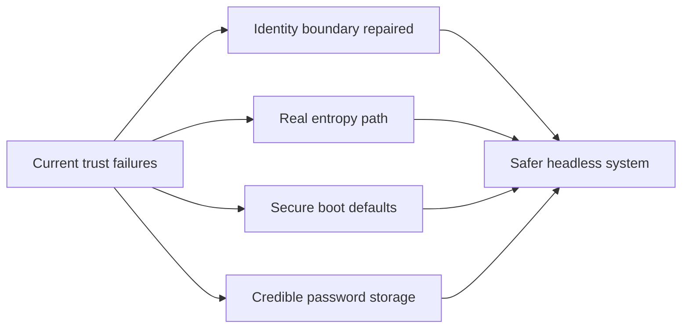

# Release Phase R01 — Security Foundation

**Status:** Proposed  
**Depends on:** none  
**Official roadmap phases covered:** [Phase 27](../../roadmap/27-user-accounts.md),
[Phase 30](../../roadmap/30-telnet-server.md),
[Phase 42](../../roadmap/42-crypto-primitives.md),
[Phase 43](../../roadmap/43-ssh-server.md),
[Phase 46](../../roadmap/46-system-services.md)  
**Primary evaluation docs:** [Security Review](../security-review.md),
[Current State](../current-state.md),
[Usability Roadmap](../usability-roadmap.md)

## Why This Phase Exists

m3OS already has meaningful things to protect: user accounts, persistent files,
network services, SSH keys, and a substantial userspace. That means the current
P0 issues are not "normal early-project rough edges." They directly break the
system's most important trust claims.

This phase exists to repair the **security floor** before more features are used
to imply maturity that the implementation has not yet earned. Until this phase
lands, the project should be framed as a controlled development and evaluation
system, not as a safely exposed multi-user OS.

## Current vs. required vs. later

| Area | Current state | Required in this phase | Later hardening |
|---|---|---|---|
| Identity | `setuid`/`setgid` are unconditional | Kernel-enforced credential transition rules | Finer-grained privilege separation and service identities |
| Entropy | `getrandom()` is not backed by trustworthy entropy | Hardware-seeded CSPRNG and explicit seeding pipeline | Persistent entropy pool, richer health checks |
| Remote access | Telnet and default credentials undermine the story | SSH-first default boot; no baked-in plaintext credentials | Rate limiting, better auditability, stronger key lifecycle |
| Passwords | Plain SHA-256 with deterministic salts | Slow password hashing with real random salts | Optional stronger account policy and rotation features |

## Detailed workstreams

| Track | What changes | Why now |
|---|---|---|
| Identity boundary repair | Enforce root-only or otherwise authorized `setuid`/`setgid` transitions in the kernel and remove userspace trust shortcuts | Without this, user isolation is not real |
| Entropy pipeline | Replace time-based pseudo-random output with a real seed source and explicit mixing path for `getrandom()` | SSH, salts, and future TLS all depend on this |
| Boot exposure policy | Disable telnet by default, remove default passwords, and define a first-boot credential story | Remote access exists already, so defaults matter now |
| Password storage | Move off fast unsalted or weakly salted hashing toward a credible password-hash scheme | The account model is otherwise easy to defeat offline |
| Threat-model hygiene | Update docs and defaults so the project's security posture is described honestly | 1.0 claims need to match shipped behavior |

## How This Differs from Linux, Redox, and production systems

- **Linux** already has decades of hardening around credentials, service users,
  entropy, and remote administration. m3OS does not need to copy Linux's full
  machinery, but it does need to stop violating the most basic expectations.
- **Redox** benefits from keeping more services outside the kernel, but that
  architectural advantage does not automatically solve account or entropy
  handling. m3OS must still make good default choices.
- **Production systems** usually fail closed, not open. This phase is about
  getting m3OS onto that side of the line.

## What This Phase Teaches

This phase teaches the difference between **interesting mechanisms** and a
**credible threat model**. An OS can have capabilities, SSH, user accounts, and
good documentation and still be unsafe if a few default behaviors collapse the
entire trust story.

It also teaches an important release lesson: some defects do not mean "polish
later." Some defects invalidate the claim you want to make today.

## What This Phase Unlocks

After this phase, m3OS can start talking about a **safer headless system**
without immediately contradicting itself. That in turn makes later work on
service management, packaging, and hardware support more meaningful, because the
foundation is no longer obviously compromised.

## Acceptance Criteria

- `setuid` and `setgid` no longer allow unprivileged escalation paths
- `getrandom()` is backed by a documented and materially stronger entropy source
- Telnet is not enabled in the default boot path
- Images do not ship with baked-in default login credentials
- Password hashes use a modern slow hash with random salts, or a clearly
  documented temporary fallback that still materially improves the current state
- The top-level security documentation matches the actual shipped defaults

## Key Cross-Links

- [Security Review](../security-review.md)
- [Path to a Usable State](../usability-roadmap.md)
- [Phase 27 — User Accounts](../../roadmap/27-user-accounts.md)
- [Phase 42 — Crypto Primitives](../../roadmap/42-crypto-primitives.md)
- [Phase 43 — SSH](../../roadmap/43-ssh-server.md)

## Open Questions

- Should password hashing jump directly to Argon2id, or use a smaller interim
  step such as bcrypt/PBKDF2 if implementation complexity dominates?
- Should first-boot credential setup happen interactively, at image-build time,
  or through generated one-time secrets?
