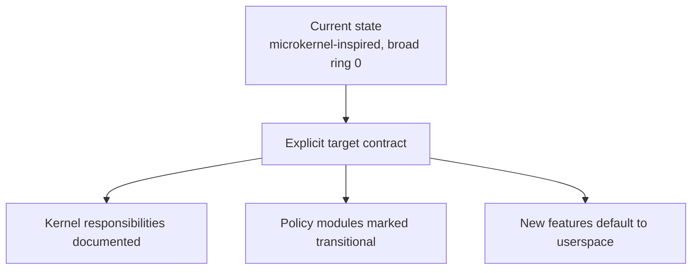

# Release Phase R02 — Architectural Declaration

**Status:** Complete (Phase 49)  
**Depends on:** none  
**Official roadmap phases covered:** [Phase 6](../../roadmap/06-ipc-core.md),
[Phase 7](../../roadmap/07-core-servers.md),
[Phase 8](../../roadmap/08-storage-and-vfs.md),
[Phase 11](../../roadmap/11-process-model.md),
[Phase 12](../../roadmap/12-posix-compat.md),
[Phase 20](../../roadmap/20-userspace-init-shell.md)  
**Primary evaluation docs:** [Path to a Proper Microkernel Design](../microkernel-path.md),
[Current State](../current-state.md),
[Rust OS Comparison](../rust-os-comparison.md)

## Why This Phase Exists

m3OS already speaks the language of a microkernel: capabilities, synchronous
IPC, notifications, ring-3 processes, and a conceptual split between kernel
mechanism and system services. But the implementation still keeps a large amount
of policy and subsystem ownership inside ring 0.

This phase exists to make the target architecture explicit in a way that changes
future decisions. It is less about moving code immediately and more about
stopping architectural drift before the later migrations begin.

## Current vs. required vs. later

| Area | Current state | Required in this phase | Later extension |
|---|---|---|---|
| Kernel scope | Broad, with large policy concentration in `syscall.rs` and subsystem modules | Clear keep/move/transition declaration | Actual code movement out of ring 0 |
| Syscall surface | Large compatibility and policy surface in one place | Decompose by subsystem and classify primitives vs. shims | Potentially move more POSIX translation outward |
| Documentation | Strong intent, but reality and target are easy to blur | Separate current architecture from target architecture explicitly | Keep docs aligned as code migrates |
| Engineering rule | New code can still drift into ring 0 by convenience | Userspace-first rule for new high-level policy | Tighten review and architecture checks around the rule |

## Detailed workstreams

| Track | What changes | Why now |
|---|---|---|
| Kernel contract | Write down what permanently belongs in ring 0 and what is transitional | Later phases need a stable target |
| Syscall decomposition | Split `kernel/src/arch/x86_64/syscall.rs` into subsystem modules and identify compatibility shims | The current layout hides policy growth |
| Mechanism vs. policy audit | Tag major kernel modules as mechanism, transitional policy, or future userspace service | Prevents "temporary" kernel code from becoming permanent by accident |
| Compatibility stance | Decide which Linux/POSIX behaviors remain kernel facades during migration | This is the hardest boundary question in the whole roadmap |
| Documentation alignment | Make docs describe both the current system and the target system separately | Honest architecture docs help release honesty |

## How This Differs from Linux, Redox, and production systems

- **Linux** is monolithic on purpose. It does not need this phase because its
  architectural answer is already clear.
- **Redox** enforced its boundary earlier through scheme-based userspace
  services and driver daemons. m3OS has the right primitives, but not yet the
  same enforced boundary.
- **Production microkernels** are usually strict about what remains in the
  kernel. m3OS does not need instant purity, but it does need a rule that keeps
  the kernel from expanding while the migration is under way.

## What This Phase Teaches

This phase teaches the difference between an architecture that is **admired in
docs** and an architecture that **constrains implementation choices**. A system
does not become microkernel-like merely by using IPC. It becomes microkernel-like
when the kernel is small because it has no easy way to absorb more policy.

It also teaches that "make the design explicit" is real engineering work. Good
roadmaps do not just add features; they remove ambiguity.

## What This Phase Unlocks

Once the target is explicit, later phases can finish IPC, build a service
manager, and extract subsystems without arguing from scratch about what m3OS is
trying to be. That dramatically reduces the risk of halfway migrations.

## Acceptance Criteria

- **There is a clear and maintained statement of ring-0 vs. ring-3 ownership**
  -- Satisfied by the Keep/Move/Transition Matrix in
  `docs/appendix/architecture-and-syscalls.md`, which classifies every major
  kernel subsystem as permanent ring-0 mechanism, transitional, or targeted for
  userspace extraction.

- **`syscall.rs` is decomposed enough that kernel mechanisms and compatibility
  facades are visibly distinct**
  -- Satisfied by the syscall decomposition in
  `kernel/src/arch/x86_64/syscall/` (mod.rs dispatcher + 8 subsystem modules:
  fs, mm, process, net, signal, io, time, misc). The Syscall Ownership
  Classification section in the architecture doc tags each syscall as
  fundamental primitive or compatibility shim.

- **New high-level subsystem work defaults to userspace unless there is a
  written exception**
  -- Satisfied by the Userspace-First Rule section in
  `docs/appendix/architecture-and-syscalls.md` and the corresponding
  convention entry in `AGENTS.md`. The rule requires a Ring-0 Justification
  section in any phase design doc that places policy in the kernel.

- **Key docs explicitly distinguish current implementation from target
  architecture**
  -- Satisfied by `docs/evaluation/microkernel-path.md` (current vs. target
  architecture with migration stages) and the Keep/Move/Transition Matrix
  (per-subsystem current-state and target-state columns).

- **The project can explain, in one page, what "properly enforced microkernel"
  means for m3OS specifically**
  -- Satisfied by the "What proper microkernel should mean for m3OS" section in
  `docs/evaluation/microkernel-path.md`, which defines five concrete criteria.

## Key Cross-Links

- [Path to a Proper Microkernel Design](../microkernel-path.md)
- [Current State](../current-state.md)
- [Architecture and Syscalls](../../appendix/architecture-and-syscalls.md)
- [Phase 6 — IPC Core](../../roadmap/06-ipc-core.md)
- [Phase 12 — POSIX Compatibility](../../roadmap/12-posix-compat.md)

## Open Questions (Addressed)

- **How much POSIX/Linux ABI translation should remain in the kernel for 1.0?**
  -- Deferred to later stages. The recommended approach in
  `docs/evaluation/microkernel-path.md` is a hybrid incremental strategy:
  preserve the current syscall ABI, move implementation behind it to userspace
  where practical, and refuse new large policy additions to the kernel. The
  exact POSIX surface retained at 1.0 depends on progress through Stages 1--4
  of the migration path.

- **Is there a small set of policy-heavy kernel code that is intentionally kept
  in ring 0 even after the migration, or is the long-term direction stricter?**
  -- Addressed by the Keep/Move/Transition Matrix. Some subsystems (VFS shim,
  fd table, signal delivery) are marked as transitional with long-term
  residence in ring 0 as thin kernel facades that delegate to userspace
  servers. The Userspace-First Rule ensures any such permanent placement
  requires an explicit Ring-0 Justification.
