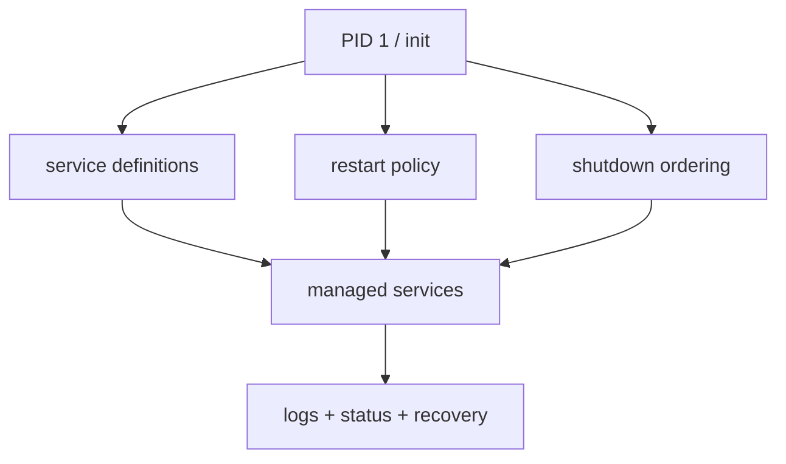

# Release Phase R04 — Service Model

**Status:** In Progress 
**Depends on:** [R01 — Security Foundation](./R01-security-foundation.md),
[R03 — IPC Completion](./R03-ipc-completion.md)  
**Official roadmap phases covered:** [Phase 20](../../roadmap/20-userspace-init-shell.md),
[Phase 29](../../roadmap/29-pty-subsystem.md),
[Phase 30](../../roadmap/30-telnet-server.md),
[Phase 34](../../roadmap/34-real-time-clock.md),
[Phase 39](../../roadmap/39-unix-domain-sockets.md),
[Phase 43](../../roadmap/43-ssh-server.md),
[Phase 46](../../roadmap/46-system-services.md),
[Phase 51](../../roadmap/51-service-model-maturity.md)  
**Primary evaluation docs:** [Usability Roadmap](../usability-roadmap.md),
[Path to a Proper Microkernel Design](../microkernel-path.md),
[Security Review](../security-review.md)

## Why This Phase Exists

m3OS already launches meaningful daemons, but "a process exists" is not the same
as "a service is managed." A release-quality system needs a model for startup
order, restart, shutdown, logging, and health, especially if later phases move
more responsibility into independent userspace services.

This phase exists to create that model before the first serious server
extractions. Otherwise each new service invents its own lifecycle, and the
microkernel story produces complexity without operability.

Phase 46 already delivers the first real answer to this problem on current
main: PID 1 now parses service definitions, starts services in dependency order,
reaps children, restarts managed daemons, coordinates shutdown, and works with
`syslogd`, `crond`, and admin commands. Phase 51 hardens this baseline with a
stable service-definition contract (including privilege and timeout fields),
restart backoff with crash classification, deterministic shutdown ordering with
per-service timeouts and orphan reaping, init-to-syslog integration, admin
surface improvements (enable/disable, richer status), and control-path
hardening. The release question is no longer whether m3OS needs a service
model; the model now exists and is maturing toward hosting extracted
microkernel services.

## Current vs. required vs. later

| Area | Current state | Required in this phase | Later extension |
|---|---|---|---|
| Startup | Phase 46 PID 1 plus `/etc/services.d` gives the system an explicit startup graph; Phase 51 replaces hardcoded config list with directory scan | Extracted core services and broader coverage fit that graph cleanly | More advanced activation models |
| Recovery | Phase 51 adds restart backoff (1s/2s/5s cap), crash classification (clean/error/signal), and guarded state transitions | Restart-on-failure semantics and service status reporting are trusted for long-lived and later extracted services | Sandboxing, service health probes |
| Logging | Phase 51 routes init lifecycle events through syslog; facility coverage expanded | Central logging path and sane operator visibility hold up as the service graph expands | Structured journaling and rotation |
| Shutdown | Phase 51 adds per-service stop timeouts, progress logging, and orphan reaping | Ordered service drain and clean restart/halt are trusted across the service graph | Richer operational controls |

## Detailed workstreams

| Track | What changes | Why now |
|---|---|---|
| Service definitions | Stabilize and extend service configuration for PID 1 | Later phases need predictable system composition |
| Supervision | Use the shipped restart policy, exit classification, and status reporting as the backbone for later extracted services | A microkernel without restartability loses most of its benefit |
| Logging | Harden the central log sink for services and operators | Operability matters before the service count grows |
| Shutdown and reboot | Prove that the service manager coordinates orderly termination across a wider service set | Real systems need controlled teardown, not just abrupt stop |
| Admin surface | Keep `service`, `shutdown`, `reboot`, and status tooling stable enough for operators and future tooling | Operators need one coherent control path |

## How This Differs from Linux, Redox, and production systems

- **Linux** commonly uses systemd, OpenRC, or another mature init stack with
  far more features than m3OS needs initially.
- **Redox** has service scripts and a more userspace-oriented system model, but
  m3OS should avoid copying Redox's exact interfaces where the underlying IPC
  and service environment differ.
- **Production systems** treat service management as foundational. m3OS should
  do the same, even if the first version is much smaller than systemd or launchd.

## What This Phase Teaches

This phase teaches that service management is not "enterprise polish." It is the
thing that makes a multi-process OS feel like a coherent system instead of a
collection of manually launched programs.

It also teaches the operational reason microkernels move policy to userspace:
once services are independent, they can be restarted, monitored, and reasoned
about without treating every bug as a kernel bug.

## What This Phase Unlocks

After this phase, the project can move real services into ring 3 without losing
basic operability. Phase 46 already provides the first half of that bridge; this
phase is about making it strong enough for architectural extraction.

## Acceptance Criteria

- PID 1 can start services from declarative configuration with dependency order
- A crashed managed service can be restarted without rebooting the machine
- Logs from managed services are visible through a coherent operator-facing path
- Shutdown and reboot drain services in a defined order
- There is a minimal admin workflow for start, stop, restart, status, and log
  inspection

## Key Cross-Links

- [Path to a Usable State](../usability-roadmap.md)
- [Path to a Proper Microkernel Design](../microkernel-path.md)
- [Phase 46 — System Services](../../roadmap/46-system-services.md)
- [Phase 51 — Service Model Maturity](../../roadmap/51-service-model-maturity.md)
- [Phase 51 Learning Doc](../../51-service-model-maturity.md)
- [Phase 43c — Regression and Stress](../../roadmap/43c-regression-stress-ci.md)

## Open Questions

- Is cron part of the first service-model milestone, or should it remain a
  strictly later convenience feature?
- Should service health be watchdog-based, heartbeat-based, or simply exit-code
  and liveness based for the first cut?
