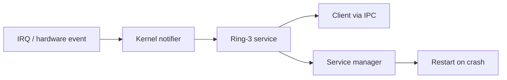

# Release Phase R05 — First Service Extractions

**Status:** Proposed  
**Depends on:** [R03 — IPC Completion](./R03-ipc-completion.md),
[R04 — Service Model](./R04-service-model.md)  
**Official roadmap phases covered:** [Phase 7](../../roadmap/07-core-servers.md),
[Phase 9](../../roadmap/09-framebuffer-and-shell.md),
[Phase 15](../../roadmap/15-hardware-discovery.md),
[Phase 20](../../roadmap/20-userspace-init-shell.md),
[Phase 46](../../roadmap/46-system-services.md)  
**Primary evaluation docs:** [Path to a Proper Microkernel Design](../microkernel-path.md),
[GUI Strategy](../gui-strategy.md),
[Current State](../current-state.md)

## Why This Phase Exists

The roadmap needs a **small, real proof** that the microkernel model works in
m3OS. Moving storage or networking first would add too many variables at once.
Console, keyboard, and early input routing are smaller, more visible, and still
important enough to validate the whole chain.

This phase exists to prove that the project can route IRQ-driven events through
the kernel, deliver them to ring-3 services, and recover from failures without
rebooting the whole OS.

Because Phase 46 now provides a real supervisor/logging baseline, these
extractions can build on an existing service model instead of inventing
lifecycle management from scratch.

## Current vs. required vs. later

| Area | Current state | Required in this phase | Later extension |
|---|---|---|---|
| Console | Conceptually service-shaped, still tied to kernel-space assumptions | Real userspace console service owns its policy | Richer display-server integration |
| Keyboard/input | Kernel-heavy translation and routing | Userspace event translation and focus routing | Unified desktop input model |
| Recovery | Core service crash can still imply kernel coupling | Service restart without reboot becomes routine | Wider restartability across storage and networking |
| Measurement | Boundary cost is easy to hand-wave | Basic IPC/latency behavior is measured and documented | Deeper profiling and tuning |

## Detailed workstreams

| Track | What changes | Why now |
|---|---|---|
| Console extraction | Turn the console server into a real ring-3 process with clear ownership of rendering policy | It is visible, event-driven, and already service-shaped |
| Keyboard extraction | Deliver scancodes or input notifications to a userspace keyboard/input service | It validates IRQ-to-service routing |
| Focus and event routing | Move input dispatch and simple focus policy outward | GUI work later will need the same structure |
| Recovery path | Ensure service-manager restart actually works for these services | Restartability is part of the architectural promise |
| Measurement and documentation | Record the latency and complexity cost of the boundary | Learning value matters here, not just correctness |

## How This Differs from Linux, Redox, and production systems

- **Linux** keeps keyboard, tty, and console behavior deep in kernel subsystems.
- **Redox** puts more of this logic in userspace and already demonstrates the
  value of treating input and display as services.
- **Production microkernels** often start with exactly these sorts of boundary
  tests, because they are small enough to debug and visible enough to prove the
  model.

## What This Phase Teaches

This phase teaches how a subsystem actually moves from ring 0 to ring 3:

1. decide what the kernel still must do
2. define the userspace service contract
3. move policy out
4. recover from failure through the service manager

It also teaches something easy to miss in design discussions: a microkernel
boundary is only convincing once a user can watch it survive a real service
crash.

## What This Phase Unlocks

After this phase, the project has a validated pattern for later storage,
networking, and display work. That is much more valuable than arguing about
microkernel purity in the abstract.

## Acceptance Criteria

- Console and keyboard/input translation run as real ring-3 services
- IRQ-to-notification-to-service delivery works for at least one real input path
- The service manager can restart a crashed console or input service without a
  reboot
- Input focus or routing policy is no longer implicitly kernel-owned
- The project has written down the performance and complexity trade-offs of the
  new boundary

## Key Cross-Links

- [Path to a Proper Microkernel Design](../microkernel-path.md)
- [GUI Strategy](../gui-strategy.md)
- [Phase 7 — Core Servers](../../roadmap/07-core-servers.md)
- [Phase 9 — Framebuffer and Shell](../../roadmap/09-framebuffer-and-shell.md)

## Open Questions

- Should the first extracted input service expose raw events, cooked events, or
  both?
- Is display ownership introduced here in a minimal form, or only in the later
  dedicated display phase?
