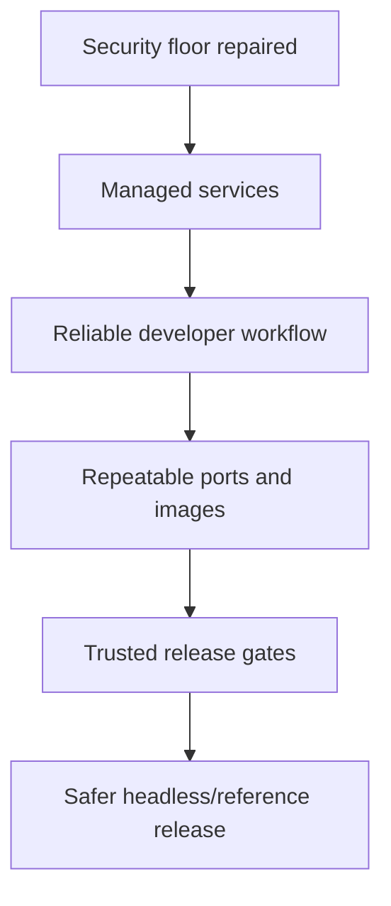

# Release Phase R06 — Hardening and Operational Polish

**Status:** In Progress 
**Depends on:** [R01 — Security Foundation](./R01-security-foundation.md),
[R04 — Service Model](./R04-service-model.md),
[R05 — First Service Extractions](./R05-first-service-extractions.md)  
**Official roadmap phases covered:** [Phase 43a](../../roadmap/43a-crash-diagnostics.md),
[Phase 43b](../../roadmap/43b-kernel-trace-ring.md),
[Phase 43c](../../roadmap/43c-regression-stress-ci.md),
[Phase 44](../../roadmap/44-rust-cross-compilation.md),
[Phase 45](../../roadmap/45-ports-system.md),
[Phase 46](../../roadmap/46-system-services.md),
[Phase 51](../../roadmap/51-service-model-maturity.md),
[Phase 53](../../roadmap/53-headless-hardening.md),
[Phase 58](../../roadmap/58-release-1-0-gate.md)
**Primary evaluation docs:** [Usability Roadmap](../usability-roadmap.md),
[Security Review](../security-review.md),
[Current State](../current-state.md)

## Why This Phase Exists

By the time the first real services have been extracted, m3OS needs to stop
feeling like a strong demo image and start feeling like a **managed system**.
That means tightening the remaining security posture, stabilizing the normal
userspace development path, and treating diagnostics and release gates as part
of the product rather than as side infrastructure.

This phase is where the project earns the right to say "the headless/reference
system is trustworthy enough to operate deliberately," even if the desktop story
is still later.

Completed Phases 44-46 mean this phase starts from a stronger baseline than the
original evaluation assumed: Rust `std` binaries run, ports exist, and the
system already has a managed-service/logging layer. Phase 51 further strengthens
the operational story with restart backoff, crash classification, per-service
shutdown timeouts, orphan reaping, init-to-syslog integration, admin surface
hardening, and service enable/disable controls. The work here is therefore
about hardening shipped capabilities and deciding which remaining gaps are true
release blockers.

The headless/reference baseline is now explicitly defined in
[Phase 53 § Supported Headless/Reference Workflow](../../roadmap/53-headless-hardening.md#supported-headlessreference-workflow)
and validated by the gate bundle in
[Phase 53 § Gate Bundle](../../roadmap/53-headless-hardening.md#gate-bundle).
This release phase succeeds when those gates pass, not when features are merely
present.

## Current vs. required vs. later

| Area | Current state | Required in this phase | Later extension |
|---|---|---|---|
| P1 hardening | Good crypto and diagnostics work exists, but security polish is incomplete | SSH, auth-file handling, and default hygiene are materially stronger | More advanced sandboxing and policy controls |
| Rust userspace | Rust std demos are in the current base, but they need to stay a clear, documented manual validation surface rather than a vague ecosystem promise | Rust std becomes a boring, bounded guest-development path | Bigger toolchains and richer ecosystem support |
| Packaging | Ports exist in the current base, but the real promise is a predictable in-repo baseline plus explicit host-cache rules for the expanded set | Ports and images are predictable enough for routine use | Package feeds, larger repos, dependency breadth |
| Remote/outbound boundary | Basic networking exists, but 1.0 release scope is not the same thing as broad client-network tooling | Make the supported remote/admin workflows explicit and keep non-essential outbound tooling out of the release gate | Full HTTPS-heavy tooling and larger online ecosystem |
| Validation | The Phase 53 automated bundle is now defined (`check`, `kernel-core`, loom, `smoke-test --timeout 300`, `regression --timeout 90`) and nightly `ssh-overlap` stress is sustaining evidence | Publish passing post-53a evidence plus the manual RC checklist | Wider hardware CI and richer telemetry |

## Detailed workstreams

| Track | What changes | Why now |
|---|---|---|
| P1 security hardening | Improve SSH hardening, auth-file update discipline, and secret hygiene | The system should not plateau immediately after the P0 fixes |
| Rust std workflow | Treat the Rust std cross-compilation path as the normal way to add serious new userspace and close remaining rough edges | This is the highest-leverage developer experience improvement |
| Ports reliability | Make the shipped build, fetch, and install behavior deterministic and observable | A platform without reliable packaging feels fragile |
| Remote-scope discipline | Decide which outbound workflows are true release needs and which are post-1.0 conveniences | Honest support boundaries are part of hardening |
| Validation and diagnostics | Tie crash diagnostics, trace rings, smoke tests, regressions, and stress runs into release discipline | Passing validation should mean something concrete |

## How This Differs from Linux, Redox, and production systems

- **Linux distributions** already have package managers, service tools, DNS/TLS
  client stacks, and enormous operational maturity.
- **Redox** has a more complete package-and-desktop story in some directions, but
  it also carries a different service model and hardware matrix.
- **Production systems** treat operations, packaging, and validation as part of
  the platform itself. m3OS needs to do the same without trying to become a full
  Linux distribution overnight.

## What This Phase Teaches

This phase teaches the large difference between **"system that boots"** and
**"system that can be maintained."** It is where build pipelines, package flows,
developer ergonomics, and diagnostic tooling stop being optional and start
becoming part of the release promise.

It also teaches a useful scope lesson: 1.0 does not need every runtime or
package in the world. It needs a small set of workflows that are dependable.

## What This Phase Unlocks

After this phase, m3OS has a strong candidate story for a **safer headless or
reference-system release**: boot, log in, manage services, build or port
software, diagnose failures, and trust the validation story enough to ship.

The claim is bounded by the [Phase 53 support boundary](../../roadmap/53-headless-hardening.md#support-boundary):
QEMU x86_64 with OVMF, SSH-first remote admin, the shipped ports and Rust std
path, and the exact gate bundle documented in Phase 53. GUI, broad hardware,
outbound HTTPS/DNS tooling, and large runtime ecosystems remain post-1.0 work.

## Acceptance Criteria

- The supported headless/reference workflow from [Phase 53](../../roadmap/53-headless-hardening.md#supported-headlessreference-workflow) is exercised end-to-end
- The full gate bundle (automated + manual checks) from [Phase 53 § Gate Bundle](../../roadmap/53-headless-hardening.md#gate-bundle) passes on a post-Phase 53a image
- Rust std demos and the ports baseline are documented as supported manual validation surfaces, while TCC remains the automated build-basics gate
- Ports and image-building behavior are deterministic enough for repeated use
- The release docs explicitly describe which remote/outbound workflows are
  supported at 1.0 (SSH-first; telnet opt-in only) and which are deferred
  (HTTPS clients, DNS, git, GitHub tooling)
- Security documentation and operator documentation match the shipped behavior
- Phase 53 is not marked complete until the gate bundle passes on the allocator-sensitive baseline after Phase 53a
- GUI/local-session work, broad hardware, and large runtime ecosystems remain explicit later-scope work rather than hidden Phase 53 blockers

## Key Cross-Links

- [Path to a Usable State](../usability-roadmap.md)
- [Security Review](../security-review.md)
- [Phase 44 — Rust Cross-Compilation](../../roadmap/44-rust-cross-compilation.md)
- [Phase 45 — Ports System](../../roadmap/45-ports-system.md)
- [Phase 51 — Service Model Maturity](../../roadmap/51-service-model-maturity.md)
- [Phase 43c — Regression and Stress](../../roadmap/43c-regression-stress-ci.md)

## Open Questions

- ~~Which networking conveniences are true 1.0 gates, and which are merely
  attractive for post-1.0 tooling?~~ **Resolved:** outbound HTTPS/TLS clients,
  DNS resolution, git, and GitHub tooling are explicitly deferred to post-1.0.
  SSH is the supported remote-admin path; telnet is opt-in only. See
  [Phase 53 § Support Boundary](../../roadmap/53-headless-hardening.md#support-boundary).
- ~~Should larger developer tools such as `gh` or full git-over-HTTPS be treated
  as 1.0 goals or as 1.x conveniences?~~ **Resolved:** deferred to post-1.0
  (Phase 59–62).
