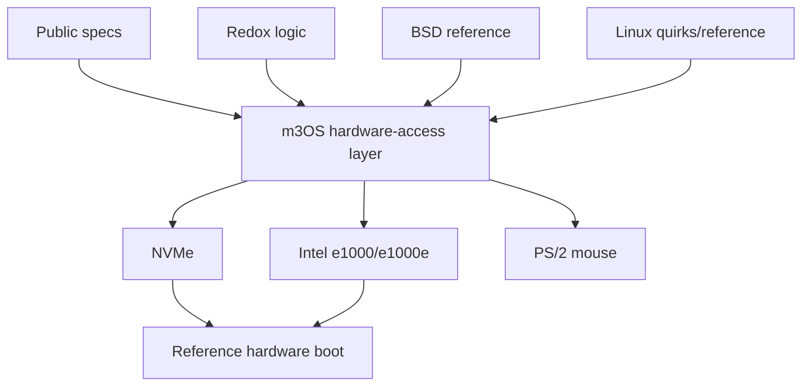

# Release Phase R08 — Hardware Substrate

**Status:** Phase 55 Complete — non-display workstreams landed; Phase 55a (IOMMU), Phase 55b (ring-3 driver host), and Phase 56 (display / input) still planned
**Depends on:** [R07 — Deep Serverization](./R07-deep-serverization.md)  
**Official roadmap phases covered:** [Phase 15](../../roadmap/15-hardware-discovery.md),
[Phase 16](../../roadmap/16-network.md),
[Phase 24](../../roadmap/24-persistent-storage.md),
[Phase 55](../../roadmap/55-hardware-substrate.md) ✅,
[Phase 55a](../../roadmap/55a-iommu-substrate.md),
[Phase 55b](../../roadmap/55b-ring-3-driver-host.md),
[Phase 56](../../roadmap/56-display-and-input-architecture.md)
**Primary evaluation docs:** [Hardware Driver Strategy](../hardware-driver-strategy.md),
[Redox Driver Porting](../redox-driver-porting.md),
[GUI Strategy](../gui-strategy.md)

## Why This Phase Exists

m3OS is no longer limited by whether it can boot or schedule tasks. It is now
limited by whether it can support a **small, deliberate set of real hardware**
without abandoning its architectural direction. The current driver story is still
QEMU- and VirtIO-heavy, which is excellent for development but too narrow for a
serious 1.0 claim.

This phase exists to turn hardware support into a disciplined program instead of
a vague ambition: choose the donor strategy, build the missing platform
primitives, and support a narrow reference hardware matrix first.

## Current vs. required vs. later

| Area | Current state | Required in this phase | Later extension |
|---|---|---|---|
| Bus/platform | Legacy PCI discovery and QEMU-friendly assumptions dominate | PCIe-era helpers, cleaner BAR mapping, stronger interrupt and DMA discipline | IOMMU awareness and wider platform maturity |
| Storage | VirtIO-first | NVMe on a reference machine or equivalent serious real-hardware path | AHCI and broader storage matrix |
| Networking | VirtIO-first | Intel e1000/e1000e-class support on reference hardware | Realtek and other NIC families |
| Input | Keyboard story exists, richer pointing-device support is still planned | Minimal pointing-device support that fits the GUI plan | USB HID and richer input devices |
| Audio/GPU | Not a release blocker yet | Clear scope line around what is and is not needed for 1.0 | Audio, richer display, later GPU work |

## Detailed workstreams

| Track | What changes | Why now |
|---|---|---|
| Hardware-access layer | Add small native abstractions for BAR mapping, DMA buffers, IRQ delivery, and device binding | Native abstractions are cheaper than foreign-ABI shims |
| Donor strategy | Use specs first, Redox second, BSD third, Linux as behavior reference only | This keeps licensing and architecture sane |
| Reference hardware matrix | Choose a small number of known-good systems and document them | 1.0 needs supportable promises, not vague "real hardware" claims |
| First serious drivers | Prioritize NVMe and Intel e1000/e1000e, with PS/2 mouse as an input bridge | These give the highest leverage for headless and later GUI work |
| Validation loop | Make real-hardware bring-up reproducible and observable, not a one-off lab success | Real support requires repeatability |

## How This Differs from Linux, Redox, and production systems

- **Linux** has the broadest hardware ecosystem in existence, but its driver
  model is tightly bound to Linux internals and licensing assumptions.
- **Redox** is the closest donor because it is Rust-based, userspace-driver
  oriented, and MIT-licensed, but its drivers are still not drop-in because they
  assume Redox-specific integration layers.
- **Production OSes** succeed on hardware by picking clear abstractions and
  maintaining them over time. m3OS needs the small version of that discipline,
  not an instant compatibility layer.

## What This Phase Teaches

This phase teaches how to separate **device logic** from **OS integration**.
That is the key to borrowing from Redox or BSD without warping m3OS into someone
else's kernel personality.

It also teaches a useful release lesson: "works on real hardware" only means
something when the project can name the hardware and explain the support level.

## What This Phase Unlocks

After this phase, m3OS can stop talking about real hardware as a future dream
and start talking about it as a narrow, testable part of the release story. That
benefits both the headless/admin path and the later local desktop path.

## Acceptance Criteria

- A small native hardware-access layer exists for BAR mapping, DMA, IRQs, and
  device binding
- The reference donor strategy is documented and followed consistently
- NVMe and Intel e1000/e1000e-class support exist on a documented reference
  machine or equivalent narrow target
- Real-hardware boot and validation steps are documented and repeatable
- No Linux compatibility layer or Redox scheme-emulation layer is introduced as
  the primary hardware strategy

## Key Cross-Links

- [Hardware Driver Strategy](../hardware-driver-strategy.md)
- [Redox Driver Porting](../redox-driver-porting.md)
- [Phase 15 — Hardware Discovery](../../roadmap/15-hardware-discovery.md)
- [Phase 55 — Hardware Substrate](../../roadmap/55-hardware-substrate.md)
- [Phase 56 — Display and Input Architecture](../../roadmap/56-display-and-input-architecture.md)

## Open Questions

- Does 1.0 require MSI/MSI-X immediately, or is a narrower interrupt story
  acceptable on the first reference matrix?
- Is PS/2 mouse enough for the first local-system milestone, or must USB HID be
  in scope before 1.0?

## Phase 55 Completion Status

Phase 55 (the non-display workstream of R08) landed in kernel v0.55.0:

- **Hardware-access layer** is live in `kernel/src/pci/bar.rs`,
  `kernel/src/mm/dma.rs`, and `kernel/src/pci/mod.rs` (device claim, driver
  registry, MSI/MSI-X vector allocation, `DeviceIrq` installation).
- **PCIe MCFG** is parsed from ACPI and extended config space is reachable
  via `pcie_mmio_config_read` / `pcie_mmio_config_write`. Legacy port-I/O
  config space remains as a fallback.
- **NVMe** (`kernel/src/blk/nvme.rs`) is the first non-VirtIO storage
  driver. Reset, admin queue, Identify, I/O queue pair, PRP-based read/write,
  and MSI/MSI-X completion all work on QEMU's NVMe controller. The
  in-kernel data-path smoke test (512-byte round-trip at LBA 0) passes on
  every bring-up.
- **Intel 82540EM classic e1000** (`kernel/src/net/e1000.rs`) is the first
  non-VirtIO network driver. Reset, TX/RX rings, INTx-only completion path
  (QEMU classic e1000 has no MSI-X), and network-stack integration via
  `net/mod.rs` all work. e1000e family, Realtek, and other NICs remain out
  of scope.
- **Validation tooling.** `cargo xtask run --device nvme` and
  `cargo xtask run --device e1000` reproduce the reference QEMU
  configurations; they can be combined. The Reference Hardware Matrix in
  [Phase 55 roadmap](../../roadmap/55-hardware-substrate.md) names the
  supported targets and their IOMMU caveat.
- **Reference hardware promise.** Phase 55 commits to QEMU emulation of
  the reference targets; physical-hardware support is deferred per the
  matrix. The donor strategy (specs first, Redox second) was followed; no
  Redox code was imported.

The PS/2 mouse and display-side workstreams remain planned under Phase 56.
USB HID is still deferred to a later phase.

Two Phase 55 deferrals are now owned by named phases rather than left as
unscheduled debt:

- **Phase 55a — IOMMU Substrate** (`docs/roadmap/55a-iommu-substrate.md`)
  parses ACPI DMAR / IVRS, installs per-device VT-d / AMD-Vi translation
  domains, and routes `DmaBuffer<T>` allocation through IOMMU-mapped IOVAs.
  It closes the IOMMU caveat the Phase 55 Reference Hardware Matrix records
  against physical-hardware validation.
- **Phase 55b — Ring-3 Driver Host** (`docs/roadmap/55b-ring-3-driver-host.md`)
  extracts the NVMe and e1000 drivers into supervised ring-3 processes
  following the Phase 54 `vfs_server` / `net_server` pattern, using
  Phase 55a's IOMMU-gated DMA so the extraction is a real isolation
  improvement and not an aesthetic rearrangement.

Phase 55a must land before Phase 55b — a ring-3 driver with raw DMA
authority and no IOMMU is a regression relative to Phase 55's ring-0
placement. Phase 55b must land before Phase 56 so Phase 56's new
display/input drivers are built on the ring-3 driver-host pattern rather
than adding to the ring-0 extraction debt.
