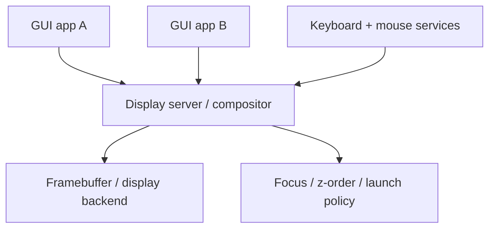

# Release Phase R09 — Display and Input Architecture

**Status:** In Progress (Phase 56 substrate complete; Phase 57 + 56b / 57b / 57c additive UX work pending)
**Depends on:** [R05 — First Service Extractions](./R05-first-service-extractions.md),
[R08 — Hardware Substrate](./R08-hardware-substrate.md)
**Official roadmap phases covered:** [Phase 9](../../roadmap/09-framebuffer-and-shell.md),
[Phase 46](../../roadmap/46-system-services.md),
[Phase 47](../../roadmap/47-doom.md),
[Phase 56](../../roadmap/56-display-and-input-architecture.md)
([learning doc](../../56-display-and-input-architecture.md),
[task doc](../../roadmap/tasks/56-display-and-input-architecture-tasks.md)),
[Phase 57](../../roadmap/57-audio-and-local-session.md)
**Primary evaluation docs:** [GUI Strategy](../gui-strategy.md),
[Path to a Proper Microkernel Design](../microkernel-path.md),
[Usability Roadmap](../usability-roadmap.md)

## Why This Phase Exists

A GUI is not "draw some pixels and add a mouse." It is a policy problem about
ownership, focus, composition, event routing, and failure containment. m3OS now
has a shipped single-app graphical proof through Phase 47 DOOM, but that still
leaves the system short of a real graphical architecture.

This phase exists to build the smallest credible graphical architecture that is
consistent with the rest of the roadmap: a userspace-owned display/input model
rather than a pile of special-case kernel code.

Phase 46 helps here indirectly: the project now has a real userspace
supervision/logging baseline that future display and session services can
reuse. What it does **not** provide is the display model itself; that still
belongs entirely to this phase.

## Implementation status

Phase 56 has **landed** the architectural substrate — the
[`docs/roadmap/tasks/56-display-and-input-architecture-tasks.md`](../../roadmap/tasks/56-display-and-input-architecture-tasks.md)
task list is complete, batches 1–5 (Tracks A–H) shipped, and the four
Goal-A contract points (layout module, keybind grab hook, surface roles,
control socket) are delivered. The unresolved gap is documented in the
Phase 56 learning doc's "Deferred follow-ups" section: a userspace
**bulk-reply drain helper** is required to make the per-event byte flow
through D.3 (input dispatcher) and E.4 (control-socket subscriber outbound
queue) end-to-end functional under load. The state machines exist and the
contract is exercised; runtime byte flow is deferred to a Phase 56
follow-on (or to Phase 57's session work, if convenient).

What Phase 56 explicitly does **not** ship — and what R09 still needs to
declare release-ready before the broader GUI claim is honest:

- A **tiling-first compositor UX** with workspaces, gaps, layouts, and a
  chord engine — Phase 56b.
- An **animation engine** (timing curves, vblank-aligned scheduling,
  damage output) — Phase 57c.
- **Native bar / launcher / notification daemon / lockscreen** client
  implementations consuming the Phase 56 `Layer` role and control-socket
  event stream — Phase 57b.
- A **native graphical terminal emulator** integrated with the existing
  PTY work — Phase 57.
- **Audio output** — Phase 57.

## Current vs. required vs. later

| Area | Current state | Required in this phase | Later extension |
|---|---|---|---|
| Display | **Phase 56 complete:** ring-3 `display_server` owns composition and presentation; kernel framebuffer console retained for pre-init / panic / failover | One userspace process owns composition and presentation ✅ | Richer desktop polish (Phase 56b tiling), animations (Phase 57c), graphics acceleration (deferred indefinitely) |
| Input | **Phase 56 complete:** typed `KeyEvent` / `PointerEvent` routed through `kbd_server` / `mouse_server` to `display_server`'s focus model | Unified keyboard/mouse event model routed through userspace ✅ | USB HID, touch, tablet (later phase, likely through `driver_runtime`-style ring-3 driver) |
| Application model | **Phase 56 complete:** AF_UNIX client protocol with documented wire format; multiple clients can coexist; reference smoke client ships as `gfx-demo` | Multiple clients can coexist under a compositor ✅ | Toolkit (Phase 57+), richer apps (Phase 57b), session polish (Phase 57) |
| Audio | Planned, not yet shipped | Phase 57 scope (next phase after 56) | Full audio server and richer media behavior (post-1.0) |

## Detailed workstreams

| Track | What changes | Status |
|---|---|---|
| Graphics proof | Build on the shipped DOOM-class raw-framebuffer proof instead of reinventing it | Phase 47 ✅ |
| Input event model | Unify keyboard and mouse events into one routable userspace model | Phase 56 D.1 / D.2 / D.3 ✅ |
| Display server | One process owns the framebuffer and composes multiple clients | Phase 56 B.1 / C.1–C.5 ✅ |
| Client protocol | Define how apps submit buffers, receive events, and manage windows | Phase 56 A.0 / B.4 / C.3 / E.2 ✅ — m3OS-native, length-prefixed binary framing, page-grant pixel transport |
| Session basics | Add minimal launch / focus / session control around the compositor | Phase 56 supervised under `init` (F.1 / F.2 / F.3) ✅; richer graphical-session UX (login, lockscreen, launcher) is Phase 57 / 57b |
| Tiling UX | Tiling layouts, workspace state machine, chord engine, default keybinds | **Phase 56b — additive on top of Phase 56's `LayoutPolicy` trait, no protocol rework** |
| Animation engine | Timing curves, vblank-aligned scheduling, damage output | **Phase 57c — deferred until a real vblank source exists** |
| Native UX clients | Bar, launcher, notification daemon, lockscreen | **Phase 57b — consume the Phase 56 `Layer` role and control-socket event stream** |
| Native graphical terminal | PTY-bridged terminal emulator with font rendering | **Phase 57 — consumes a PTY slave and renders into a Phase 56 `Toplevel`** |

## How This Differs from Linux, Redox, and production systems

- **Linux** typically relies on DRM/KMS in kernel space with Wayland or X11
  sitting above it.
- **Redox** already has Orbital, which is the nearest demonstration that a Rust
  userspace compositor can anchor a real OS desktop story.
- **Production desktop OSes** carry much richer font, input, security, and
  application stacks. m3OS should begin with a simpler compositor and event model
  that match its IPC design rather than trying to clone Wayland immediately.

## What This Phase Teaches

This phase teaches that GUI work is really **systems work**. A display server is
one of the cleanest demonstrations of mechanism-vs.-policy in the whole project:
the kernel provides memory mapping, timing, and interrupts, while userspace owns
presentation, focus, and application coordination.

It also teaches how a microkernel can make a desktop safer by isolating
applications and concentrating composition policy in restartable services.

## What This Phase Unlocks

After this phase, m3OS can move beyond "framebuffer console plus single-app
proof" and point to a real local-system substrate. That is the bridge between a
strong headless release and any Redox-like desktop ambition.

## Acceptance Criteria

- A userspace display server/compositor owns the primary display path — **Phase 56 ✅**
  (`display_server` ring-3 binary; `sys_fb_acquire` syscall transfers framebuffer
  ownership; kernel console suspends while userspace owns pixels).
- At least two graphical clients can coexist without raw-framebuffer ownership
  conflicts — **Phase 56 ✅** (AF_UNIX client protocol, page-grant pixel transport,
  surface-registry capacity for multiple concurrent surfaces; `gfx-demo` is the
  protocol-reference smoke client).
- Keyboard and mouse events are routed through a userspace-owned focus model
  — **Phase 56 ✅** (`kbd_server` / `mouse_server` typed events, focus-aware
  dispatcher in `display_server`, click-driven `Toplevel` focus + exclusive
  `Layer` preemption).
- The display/input protocol is documented well enough that new clients can be
  added without guesswork — **Phase 56 ✅**
  ([`docs/56-display-and-input-architecture.md`](../../56-display-and-input-architecture.md)
  documents the wire format, opcodes, modifier model, surface roles, and bounds).
- A compositor crash is recoverable through the service model, or the failure
  mode is at least explicitly documented as the next issue to solve — **Phase 56
  ✅** (F.2 supervised crash recovery; F.3 text-mode fallback when restart budget
  is exhausted; both documented in the learning doc).
- Audio + first real graphical-client UX (terminal emulator, native bar /
  launcher / lockscreen, login flow) — **Phase 57 / 57b pending**.

## Key Cross-Links

- [GUI Strategy](../gui-strategy.md)
- [Usability Roadmap](../usability-roadmap.md)
- [Phase 47 — DOOM](../../roadmap/47-doom.md)
- [Phase 56 — Display and Input Architecture](../../roadmap/56-display-and-input-architecture.md)
- [Phase 57 — Audio and Local Session](../../roadmap/57-audio-and-local-session.md)

## Open Questions

- ~~Should the first client protocol be entirely m3OS-native, or should it leave
  room for later compatibility shims?~~ **Resolved (Phase 56):** the Phase 56
  client protocol is entirely m3OS-native — length-prefixed binary framing,
  documented opcodes, no Wayland adapter. A `wl_shm` shim is documented as Path A
  in [`docs/appendix/gui/wayland-gap-analysis.md`](../../appendix/gui/wayland-gap-analysis.md)
  and is an optional additive phase if there is concrete demand for a specific
  Wayland-app compatibility — it has no dependency on any Phase 56 design choice.
- ~~Does a minimal launcher/terminal belong in this phase, or is that better
  treated as part of the final release gate?~~ **Resolved (Phase 56):** the
  minimal launcher / terminal does **not** belong in Phase 56. Phase 56 ships
  the `gfx-demo` protocol-reference smoke client (a colored toplevel + cursor
  motion + key/pointer event echoes); the native graphical terminal emulator
  is Phase 57, and the native launcher is Phase 57b.
