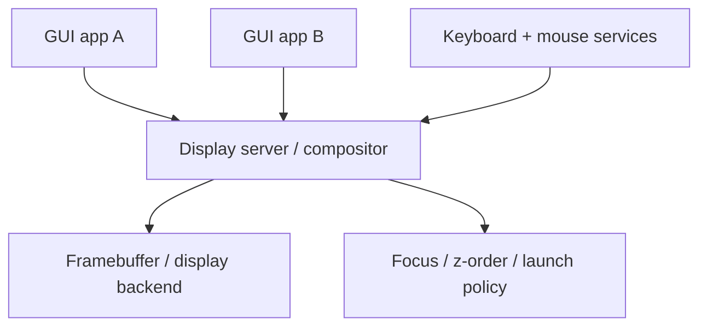

# Release Phase R09 — Display and Input Architecture

**Status:** Proposed  
**Depends on:** [R05 — First Service Extractions](./R05-first-service-extractions.md),
[R08 — Hardware Substrate](./R08-hardware-substrate.md)  
**Official roadmap phases covered:** [Phase 9](../../roadmap/09-framebuffer-and-shell.md),
[Phase 46](../../roadmap/46-system-services.md),
[Phase 47](../../roadmap/47-doom.md),
[Phase 56](../../roadmap/56-display-and-input-architecture.md),
[Phase 57](../../roadmap/57-audio-and-local-session.md)
**Primary evaluation docs:** [GUI Strategy](../gui-strategy.md),
[Path to a Proper Microkernel Design](../microkernel-path.md),
[Usability Roadmap](../usability-roadmap.md)

## Why This Phase Exists

A GUI is not "draw some pixels and add a mouse." It is a policy problem about
ownership, focus, composition, event routing, and failure containment. m3OS now
has a shipped single-app graphical proof through Phase 47 DOOM, but that still
leaves the system short of a real graphical architecture.

This phase exists to build the smallest credible graphical architecture that is
consistent with the rest of the roadmap: a userspace-owned display/input model
rather than a pile of special-case kernel code.

Phase 46 helps here indirectly: the project now has a real userspace
supervision/logging baseline that future display and session services can
reuse. What it does **not** provide is the display model itself; that still
belongs entirely to this phase.

## Current vs. required vs. later

| Area | Current state | Required in this phase | Later extension |
|---|---|---|---|
| Display | Framebuffer text console plus a shipped single-app DOOM proof | One userspace process owns composition and presentation | Richer desktop polish and graphics acceleration |
| Input | Keyboard-centric, single-foreground-client story | Unified keyboard/mouse event model routed through userspace | USB HID, touch, richer devices |
| Application model | Single-console worldview, albeit with a stronger service/session baseline from Phase 46 | Multiple clients can coexist under a compositor | Toolkit, richer apps, session polish |
| Audio | Planned but not central yet | Scoped clearly as part of the local-system story | Full audio server and richer media behavior |

## Detailed workstreams

| Track | What changes | Why now |
|---|---|---|
| Graphics proof | Build on the shipped DOOM-class raw-framebuffer proof instead of reinventing it | Good architectural experiments need visible feedback without reopening solved bring-up work |
| Input event model | Unify keyboard and mouse events into one routable userspace model | Multiple apps need a clear focus and event story |
| Display server | One process owns the framebuffer and composes multiple clients | This is the key GUI boundary |
| Client protocol | Define how apps submit buffers, receive events, and manage windows | Good GUI architecture needs a protocol, not ad hoc calls |
| Session basics | Add minimal launch/focus/session control around the compositor | A desktop is lifecycle plus pixels, not just rendering |

## How This Differs from Linux, Redox, and production systems

- **Linux** typically relies on DRM/KMS in kernel space with Wayland or X11
  sitting above it.
- **Redox** already has Orbital, which is the nearest demonstration that a Rust
  userspace compositor can anchor a real OS desktop story.
- **Production desktop OSes** carry much richer font, input, security, and
  application stacks. m3OS should begin with a simpler compositor and event model
  that match its IPC design rather than trying to clone Wayland immediately.

## What This Phase Teaches

This phase teaches that GUI work is really **systems work**. A display server is
one of the cleanest demonstrations of mechanism-vs.-policy in the whole project:
the kernel provides memory mapping, timing, and interrupts, while userspace owns
presentation, focus, and application coordination.

It also teaches how a microkernel can make a desktop safer by isolating
applications and concentrating composition policy in restartable services.

## What This Phase Unlocks

After this phase, m3OS can move beyond "framebuffer console plus single-app
proof" and point to a real local-system substrate. That is the bridge between a
strong headless release and any Redox-like desktop ambition.

## Acceptance Criteria

- A userspace display server/compositor owns the primary display path
- At least two graphical clients can coexist without raw-framebuffer ownership
  conflicts
- Keyboard and mouse events are routed through a userspace-owned focus model
- The display/input protocol is documented well enough that new clients can be
  added without guesswork
- A compositor crash is recoverable through the service model, or the failure
  mode is at least explicitly documented as the next issue to solve

## Key Cross-Links

- [GUI Strategy](../gui-strategy.md)
- [Usability Roadmap](../usability-roadmap.md)
- [Phase 47 — DOOM](../../roadmap/47-doom.md)
- [Phase 56 — Display and Input Architecture](../../roadmap/56-display-and-input-architecture.md)
- [Phase 57 — Audio and Local Session](../../roadmap/57-audio-and-local-session.md)

## Open Questions

- Should the first client protocol be entirely m3OS-native, or should it leave
  room for later compatibility shims?
- Does a minimal launcher/terminal belong in this phase, or is that better
  treated as part of the final release gate?
