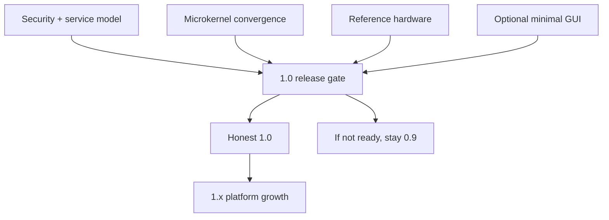

# Release Phase R10 — Release 1.0 and Beyond

**Status:** Proposed  
**Depends on:** [R06 — Hardening and Operational Polish](./R06-hardening-and-operational-polish.md),
[R08 — Hardware Substrate](./R08-hardware-substrate.md),
[R09 — Display and Input Architecture](./R09-display-and-input-architecture.md)  
**Official roadmap phases covered:** [Phase 43c](../../roadmap/43c-regression-stress-ci.md),
[Phase 47](../../roadmap/47-doom.md),
[Phase 53](../../roadmap/53-headless-hardening.md),
[Phase 55](../../roadmap/55-hardware-substrate.md),
[Phase 56](../../roadmap/56-display-and-input-architecture.md),
[Phase 57](../../roadmap/57-audio-and-local-session.md),
[Phase 58](../../roadmap/58-release-1-0-gate.md),
[Phase 59](../../roadmap/59-cross-compiled-toolchains.md),
[Phase 60](../../roadmap/60-networking-and-github.md),
[Phase 61](../../roadmap/61-nodejs.md),
[Phase 62](../../roadmap/62-claude-code.md)
**Primary evaluation docs:** [Usability Roadmap](../usability-roadmap.md),
[Rust OS Comparison](../rust-os-comparison.md),
[GUI Strategy](../gui-strategy.md)

## Why This Phase Exists

Roadmaps often spend enormous energy listing features and almost none defining
what counts as **done**. For m3OS, that would be a mistake. The project already
has enough subsystems that 1.0 is not about chasing one more shiny feature. It is
about choosing an honest release promise and refusing to claim more than the
system can actually support.

This phase exists to define that promise, ship it if the earlier work is real,
and keep post-1.0 growth from quietly turning back into uncontrolled scope.

Because Phases 44-47 are already part of the current base, that promise is less
about inventing basic developer, graphical-proof, or system-operations
capability and more about deciding how much confidence, architectural honesty,
and support boundary the project has actually earned.

## Current vs. required vs. later

| Area | Current state | Required for 1.0 | Post-1.0 direction |
|---|---|---|---|
| Release promise | Broad capability, uneven maturity | Narrow, explicit support matrix and documented claims | Wider hardware and ecosystem claims |
| Desktop/local UX | Phase 47 proves one real full-screen graphical workload, but there is still no compositor/session model | Optional minimal compositor + terminal/launcher if 1.0 aims beyond headless | Broader session UX, richer apps, audio polish |
| Toolchains | Rust std and ports/package work are part of the base but still settling | Rust std and core packaging flow are enough for the release story | Python, larger toolchains, Node.js, agent workloads |
| Hardware | QEMU-first with limited real-hardware maturity | Reference hardware is named, testable, and documented | Wider device matrix, xHCI, audio, Wi-Fi, GPU work |
| Compatibility | Linux-like syscall ABI is useful but still evolving | Clear statement about what is stable at 1.0 | Wider compatibility, versioning, and richer ecosystem support |

## Detailed workstreams

| Track | What changes | Why now |
|---|---|---|
| Release contract | Define exactly what 1.0 means, what is supported, and what is intentionally out of scope | Honest releases are easier to sustain |
| Final release gates | Tie validation, documentation, diagnostics, and hardware scope into one launch checklist | 1.0 needs measurable readiness, not just confidence |
| Optional local-system milestone | Decide whether 1.0 includes the minimal GUI path or remains headless/reference-focused | This is the biggest late-scope decision in the roadmap |
| Post-1.0 growth map | Clearly mark larger runtimes, richer packaging, wider hardware, and broader desktop polish as 1.x work | Prevents 1.0 from becoming a permanent moving target |
| Communication posture | Align README/docs/positioning with the actual shipped system | Project framing matters once a version number carries weight |

## How This Differs from Linux, Redox, and production systems

- **Linux** 1.0 and modern Linux distributions are not useful direct targets for
  scope comparison; the hardware and ecosystem scale are radically different.
- **Redox** is the nearest peer if m3OS wants to grow into a desktop-class Rust
  OS, but Redox also shows how much long-tail work lives beyond the first real
  desktop milestone.
- **Production systems** succeed by making supportable promises. That matters as
  much here as any technical subsystem.

## What This Phase Teaches

This phase teaches that release engineering is architecture, not paperwork. A
good 1.0 is defined by the promises it can keep, the failures it can diagnose,
and the scope it intentionally refuses.

It also teaches the difference between **1.0** and **everything we eventually
want**. Post-1.0 growth can be ambitious without being allowed to hold the
release hostage forever.

## What This Phase Unlocks

If successful, this phase gives m3OS a credible public identity: not "toy OS,"
not "Linux replacement," but a serious, reference-quality OS project in Rust
that enforces its architectural direction and knows its support boundaries.

## Acceptance Criteria

- The 1.0 release claim is written down in a support matrix with explicit
  non-goals
- Required validation gates, diagnostics, and documentation are all part of the
  release process
- The hardware story is narrow, named, and reproducible
- The compatibility story is explicit about what is stable and what is still
  evolving
- If a GUI is part of 1.0, the minimal compositor + terminal/launcher path is
  documented and working; otherwise the release is clearly labeled as a
  headless/reference-system milestone instead
- Post-1.0 work such as larger toolchains, Node.js, AI-agent workflows, wider
  hardware, and richer desktop polish is documented as 1.x scope rather than
  silently pulled into the 1.0 gate

## Key Cross-Links

- [Path to a Usable State](../usability-roadmap.md)
- [m3OS Compared with Redox and Other Rust OS Projects](../rust-os-comparison.md)
- [GUI Strategy](../gui-strategy.md)
- [Phase 58 — Release 1.0 Gate](../../roadmap/58-release-1-0-gate.md)
- [Phase 62 — Claude Code](../../roadmap/62-claude-code.md)

## Open Questions

- Should 1.0 be explicitly defined as a headless/reference-system release unless
  the GUI path reaches a terminal/launcher milestone?
- Which larger toolchains or ecosystem features are strategically valuable soon
  after 1.0, and which are mostly showcase items?
