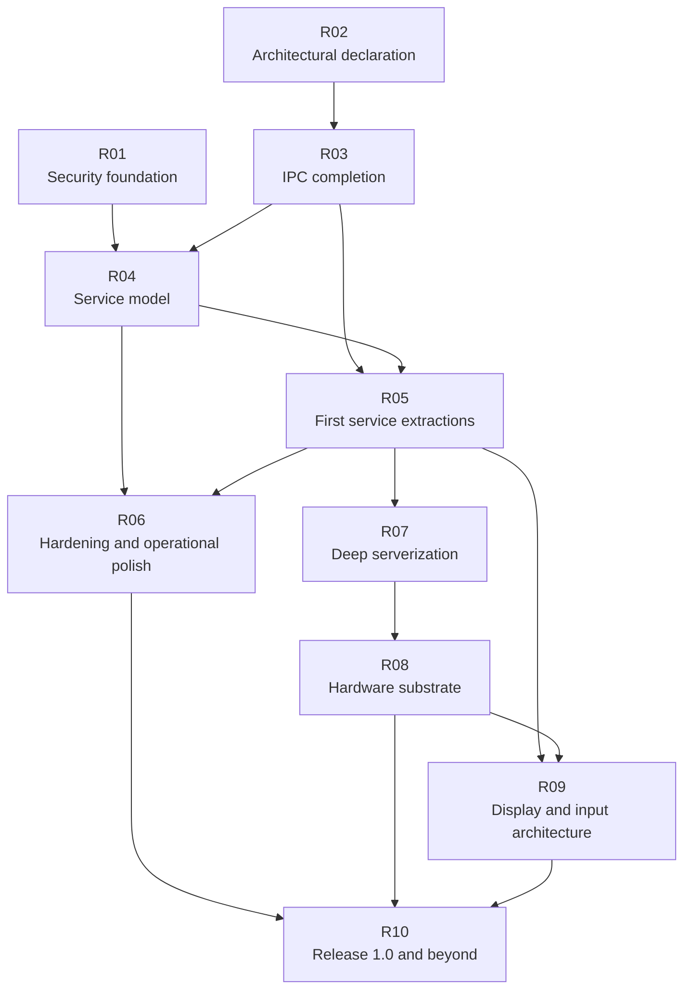

# Evaluation Roadmap — Road to 1.0 and Beyond

This directory is a **release-oriented overlay** on top of the official
[implementation roadmap](../../roadmap/README.md). The official roadmap answers
**what to build next**. This directory answers **what must become true before
m3OS can honestly claim 1.0**, what should be deferred, and how the project
gets there without losing its learning-first character.

The core judgment behind this roadmap is simple:

**early work should narrow the kernel, fix the security floor, complete the
service model, and only then broaden the hardware and desktop story.**

Completed Phases 44-47 already change the starting point for this overlay: Rust
`std`, ports, a real service/logging/admin baseline, and a shipped single-app
graphical proof are now part of the base. Those areas are no longer
hypothetical earlier-phase work; they are current capabilities that still need
hardening, integration, and clear release boundaries.

## What this directory is and is not

| Question | Official roadmap | Evaluation roadmap |
|---|---|---|
| What concrete features/subsystems get built? | Primary source of truth | Summarized only where needed |
| What has already shipped? | Detailed by implementation phase | Used as evidence for readiness claims |
| What is required for a 1.0 claim? | Mostly implicit | Made explicit |
| What should wait until after 1.0? | Mixed with planned phases | Called out directly |
| How does this compare with Linux, Redox, and other OSes? | Occasional | First-class part of the narrative |

## Recommended 1.0 definition

The safest and most defensible 1.0 claim for m3OS is:

**a serious, narrowly scoped, well-documented OS in Rust that enforces its
microkernel direction, is materially safer to operate than the current tree,
boots in QEMU and on a small reference hardware set, and has a coherent
headless service model.**

If the project also wants 1.0 to mark a **local-system milestone** rather than
just a headless/reference-system milestone, then 1.0 should additionally ship a
minimal userspace display server with at least a terminal and launcher. If that
late graphical work is not ready, it is healthier to ship **0.9** than to force
desktop scope in early and distort the earlier phases.

### What 1.0 should and should not mean

| 1.0 should mean | 1.0 should not mean |
|---|---|
| P0/P1 security blockers are closed or deliberately retired | "It has as much hardening as Linux" |
| The kernel boundary is narrower by construction, not just in prose | "Everything is already a pure microkernel" |
| Core services have supervision, restart, logging, and shutdown semantics | "It has a full systemd-class operations stack" |
| QEMU plus a documented reference hardware matrix are supported | "It runs broadly across arbitrary laptops and desktops" |
| The project has a coherent, supportable user story | "It already replaces Linux or Redox as a daily driver" |

### Current vs. 1.0 vs. post-1.0

| Area | Current state | Required for 1.0 | Post-1.0 direction |
|---|---|---|---|
| Security | Real mechanisms, but P0 trust failures remain | Trust floor repaired; SSH and account model are credible | Stronger isolation, sandboxing, richer auth |
| Architecture | Strong microkernel primitives, broad ring-0 reality | IPC/service model is real enough to enforce the direction | Deeper serverization of storage, networking, and POSIX policy |
| Hardware | QEMU/VirtIO-heavy | Narrow real-hardware story on a reference matrix | Broader device classes and hardware coverage |
| Operations | Phase 46 service lifecycle/logging baseline exists, but hardening and release confidence are incomplete | Managed services, logs, shutdown/reboot, release gates | More mature observability and packaging |
| GUI | Framebuffer text console only | Optional minimal compositor/terminal/launcher if 1.0 aims beyond headless | Broader desktop session, audio, richer apps |
| Toolchains | Rust std and ports are in the current base, but maturity and predictability still vary | Rust std is normal, ports are reliable | Bigger runtimes, package feeds, broader ecosystem |

## Phase dependency map

This ordering is intentional:

1. **Security first** so the system stops making claims its implementation
   cannot support.
2. **Architecture declaration in parallel with the security floor** so the
   project commits early to what belongs in ring 0.
3. **IPC and service lifecycle before major extraction** so later migrations are
   real, not faked with shared-address-space shortcuts.
4. **Hardware and GUI after the boundary is believable** so new work does not
   expand the kernel merely for convenience.

## Phase map

| Release phase | Focus | Main outcome |
|---|---|---|
| [R01 — Security Foundation](./R01-security-foundation.md) | Close the P0 trust failures | m3OS stops undercutting its own multi-user and SSH story |
| [R02 — Architectural Declaration](./R02-architectural-declaration.md) | Make the target microkernel boundary explicit | New policy no longer drifts into ring 0 by default |
| [R03 — IPC Completion](./R03-ipc-completion.md) | Finish capability grants and bulk-data transport | Ring-3 services get a real transport model |
| [R04 — Service Model](./R04-service-model.md) | Add supervision, restart, logging, shutdown | Services become managed rather than merely spawned |
| [R05 — First Service Extractions](./R05-first-service-extractions.md) | Move the easiest real services to ring 3 | The architecture stops being only aspirational |
| [R06 — Hardening and Operational Polish](./R06-hardening-and-operational-polish.md) | Make the headless system trustworthy and livable | Safer headless/reference-system readiness |
| [R07 — Deep Serverization](./R07-deep-serverization.md) | Push storage, namespace, and networking outward | The microkernel story becomes materially true |
| [R08 — Hardware Substrate](./R08-hardware-substrate.md) | Build a real-hardware driver strategy and substrate | Reference hardware support stops being purely virtualized |
| [R09 — Display and Input Architecture](./R09-display-and-input-architecture.md) | Create a minimal graphical substrate | The GUI path becomes architectural, not speculative |
| [R10 — Release 1.0 and Beyond](./R10-release-1-0-and-beyond.md) | Define the release promise and post-1.0 scope | m3OS ships an honest 1.0 or deliberately stays pre-1.0 |

## Reading order

If you are trying to understand the full case for this roadmap, read in this
order:

1. [Project Evaluation](../README.md)
2. [Current State](../current-state.md)
3. [Security Review](../security-review.md)
4. [Path to a Proper Microkernel Design](../microkernel-path.md)
5. This directory from `R01` through `R10`

If you care mostly about one axis:

- **Security and operating posture:** `R01`, `R04`, `R06`
- **Microkernel convergence:** `R02`, `R03`, `R05`, `R07`
- **Real hardware:** `R08`
- **GUI / Redox-like local system:** `R09`, plus the optional local-system branch inside `R10`

## Relationship to the existing implementation roadmap

The official `docs/roadmap/` phases remain the implementation authority. This
directory deliberately **groups** those phases by release purpose instead of
replacing them.

Examples:

- [Phase 46 — System Services](../../roadmap/46-system-services.md) is primarily
  part of **R04** and **R06**
- [Phase 44 — Rust Cross-Compilation](../../roadmap/44-rust-cross-compilation.md)
  is primarily part of **R06**
- [Phase 47 — DOOM](../../roadmap/47-doom.md) is the shipped graphical proof
  point that mainly informs **R09** and the optional local-system branch in
  **R10**
- [Phases 48–54](../../roadmap/48-security-foundation.md) are the main
  implementation breakdown of **R01** through **R07**
- [Phases 55–57](../../roadmap/55-hardware-substrate.md) cover the official
  hardware and local-system branch for **R08**, **R09**, and the optional GUI
  path discussed in **R10**
- [Phase 58](../../roadmap/58-release-1-0-gate.md) is the explicit official
  implementation of the **R10** release gate
- [Phases 59–62](../../roadmap/59-cross-compiled-toolchains.md) are explicitly
  **post-1.0 growth**, not hidden early release blockers

Because phases 1-47 are already complete, missing behavior in those areas should
usually be read as a quality gap in the shipped base or as explicit later-phase
scope, not as unscheduled pre-47 work hiding between roadmap lines.

That distinction matters because a good release plan is **not** just a list of
future features. It is an argument about ordering, risk, and what the project is
trying to prove.

As of `v0.47.0`, R04 is materially underway in the current base, R06 already
starts from completed Phases 43c-46 rather than blank space, and R09 now begins
from a shipped single-app graphics proof instead of a hypothetical bring-up
milestone.
