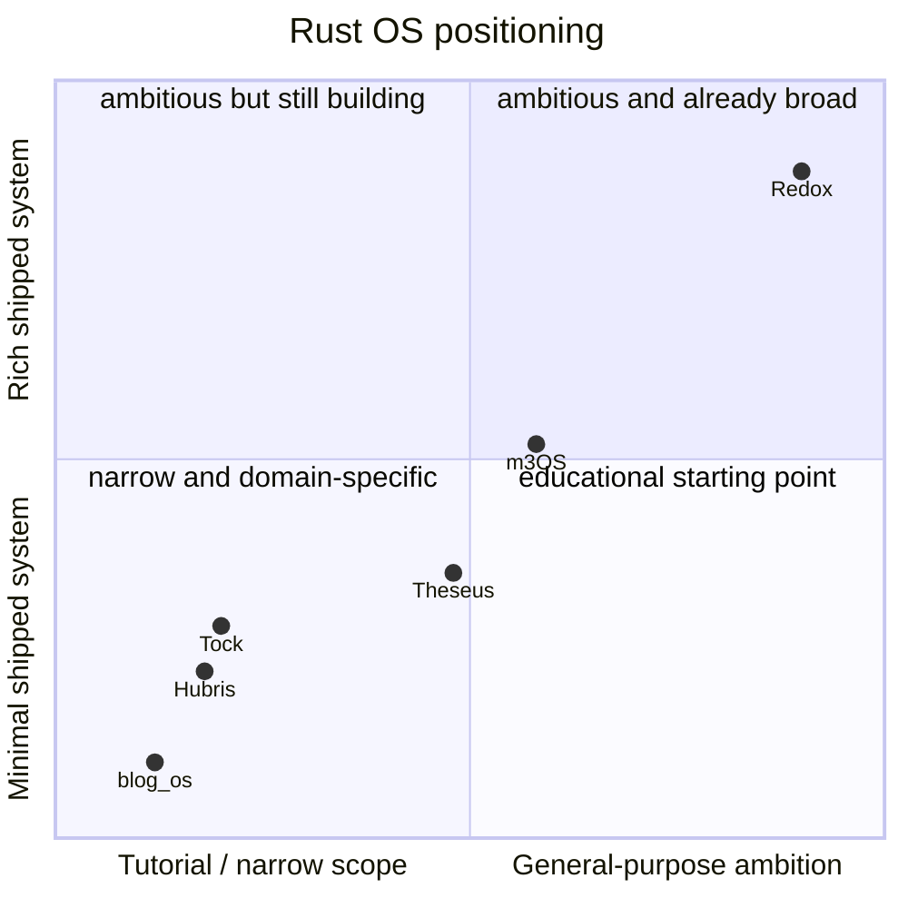

# m3OS Compared with Redox and Other Rust OS Projects

## Bottom line

The most important comparison is this:

- **Redox** is the nearest reference point if the goal is a Rust general-purpose microkernel with a GUI
- **Tock** and **Hubris** are valuable Rust OS comparisons, but they target embedded systems, not desktops
- **Theseus** is a research OS with different structural goals
- **blog_os** is a teaching path into OS development, not a peer in system capability

m3OS sits in a distinctive place: **far beyond tutorial kernels in functionality, but still pre-desktop and pre-broad-hardware compared with Redox.**

## Comparison matrix

| Project | Primary target | Architecture | GUI story | Where it leads | What m3OS can learn |
|---|---|---|---|---|---|
| **m3OS** | Serious QEMU-first general OS / reference system | Microkernel-inspired, currently broad ring-0 implementation | No real GUI yet; framebuffer console, stronger service/ops baseline, and planned graphics milestones only | Documentation, pedagogical structure, diagnostics, fast comprehension | Finish the missing product layers and decide how far to enforce the microkernel boundary |
| **Redox** | General-purpose Rust OS | True userspace-service-oriented microkernel ecosystem | Orbital desktop, GUI app ecosystem, broader desktop story | Desktop, package ecosystem, real hardware progress, windowing | A GUI needs a display server/compositor, not just raw framebuffer access |
| **Tock** | Embedded/IoT MCU OS | MPU-based embedded OS with capsules/apps | None | Isolation model for resource-constrained systems | Strong threat-model discipline and component boundaries |
| **Hubris** | Production embedded firmware | Static-task embedded OS | None | Operational rigor, narrowly scoped trusted computing base | Scope discipline and explicit security posture |
| **Theseus** | Research OS | Intralingual/state-minimizing research design | Experimental/limited | Novel structure and academic ideas | Stronger articulation of what the project is trying to prove |
| **blog_os** | Learning/tutorial | Minimal tutorial kernel | None | Accessibility as an entry point | m3OS already occupies the "what comes after tutorial kernels" niche |

## Redox: the nearest serious comparison

### Where Redox is clearly ahead

| Area | Redox advantage |
|---|---|
| GUI | Orbital/windowing story exists today |
| Ecosystem | Broader package/application base |
| Hardware | More credible non-QEMU story |
| Operating-system polish | Feels more like a full OS than a guided research platform |

Official references:

- [Redox website](https://www.redox-os.org/)
- [Redox build system README](https://github.com/redox-os/redox/blob/master/README.md)

### Where m3OS is stronger or at least unusually competitive

| Area | m3OS advantage |
|---|---|
| Documentation and roadmap | `docs/roadmap/README.md` plus per-phase task docs are unusually systematic |
| Host-testable kernel logic | `kernel-core/` is a real structural win |
| Explicit diagnostics/testing narrative | crash diagnostics, trace rings, smoke/regression/stress story are very visible |
| Headless/reference-system baseline | Phase 46 adds a real service manager, logging daemon, cron, and admin commands |
| Learning clarity | The system is easier to read as a single coherent journey |

### Practical synthesis

If someone asks "Is m3OS closer to Redox or to blog_os?", the honest answer is:

**architecturally and functionally it is much closer to Redox than to tutorial kernels, but operationally it is still much earlier than Redox.** Phase 46 improves that operational comparison on the headless side, but it does not erase the remaining desktop, hardware, or microkernel-enforcement gap.

### Microkernel enforcement comparison

One of the most useful ways to compare the Rust OS projects is not "who uses the word microkernel?" but "who actually enforces the boundary in the shipped system?"

| Project | Boundary story |
|---|---|
| **m3OS** | Strong microkernel design language and real IPC primitives, but many core services and large amounts of policy still remain in ring 0 |
| **Redox** | Much closer to an actually enforced userspace-service system, especially around the desktop and service ecosystem |
| **Tock** | Embedded rather than desktop-oriented, but very disciplined about boundary design inside its target domain |
| **Hubris** | Not a desktop OS, but highly disciplined about scope, trust boundaries, and operational constraints |
| **Theseus** | Pursues a different structural answer altogether rather than classic microkernel enforcement |

This is why Redox remains the most important comparison point for m3OS specifically. The long-form answer for m3OS is in [microkernel-path.md](./microkernel-path.md).

## Why m3OS is already beyond the "toy OS" label

Calling m3OS a toy now obscures more than it clarifies. A better description is:

**a serious, still-growing Rust OS with unusually strong documentation and a still-maturing operational/security posture.**

Reasons that framing fits better:

- it already has remote access, multi-user login, and permissions
- it already has SMP, paging, ext2, PTYs, Unix sockets, threads, and epoll
- it already carries real maintenance infrastructure through smoke/regression/stress work
- it already supports meaningful guest-side development workflows

The remaining gap is not "become an OS at all." The remaining gap is "become a safer, broader, and more polished OS."

## Why the embedded projects still matter

Tock and Hubris are not desktop competitors, but they matter as comparison points because they show a different kind of maturity:

- very clear threat models
- stronger scope discipline
- tighter operational boundaries

That is useful for m3OS because one of its biggest risks is **scope expansion without enough reduction in complexity or trust boundaries**.

Official references:

- [Tock website](https://www.tockos.org/)
- [Tock README](https://github.com/tock/tock/blob/master/README.md)
- [Hubris website](https://hubris.oxide.computer/)

## Where Theseus differs

Theseus is less about shipping a familiar general-purpose OS and more about exploring a different OS structure using Rust's type system and composition model.

That makes it a useful comparison for:

- architectural experimentation
- research positioning
- clearer articulation of what makes one Rust OS meaningfully different from another

Official references:

- [Theseus README](https://github.com/theseus-os/Theseus/blob/master/README.md)
- [Theseus book](https://www.theseus-os.com/Theseus/book/index.html)

## Strategic positioning recommendation for m3OS

The most defensible positioning for m3OS is:

### 1. Primary identity

**A serious reference-quality microkernel-style OS project in Rust, with unusually strong pedagogical value.**

That claim is strong because the repo already combines:

- large subsystem breadth
- a real userspace
- strong docs and task breakdowns
- testing/diagnostic infrastructure

### 2. Secondary identity

**A reference platform for exploring modern OS ideas in Rust.**

That includes:

- capability-based IPC
- SMP scheduling and memory-management experimentation
- richer diagnostics than many hobby systems
- staged progression from bare-metal bring-up to user-facing features

### 3. What to avoid claiming too early

- that it is already a secure general-purpose OS
- that it is close to a Redox-class desktop
- that it is ready to compete on hardware breadth or ecosystem size

## Summary judgment

If Redox is the Rust OS that already demonstrates a desktop trajectory, then m3OS is the Rust OS that most clearly demonstrates **how to learn and build toward that level without disappearing into an unreadable codebase**.

That is a real distinction, and it is worth preserving.
