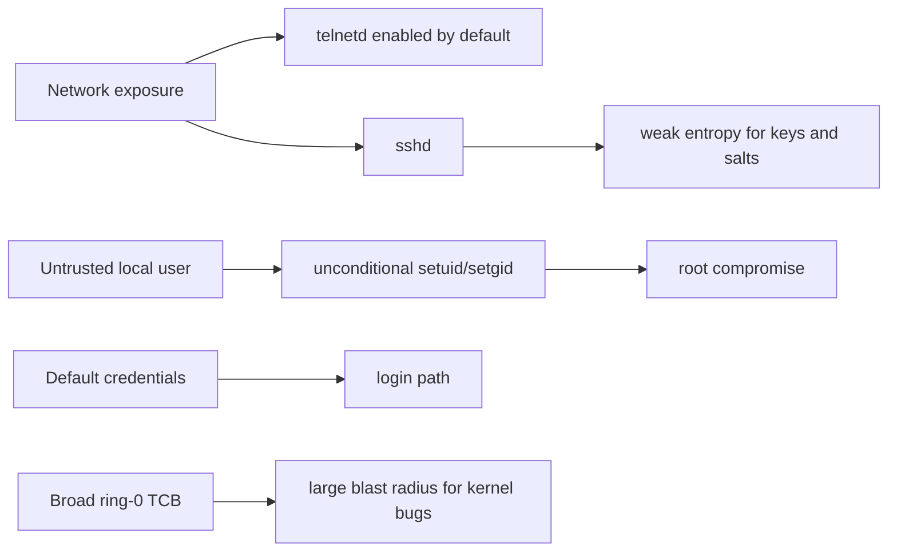
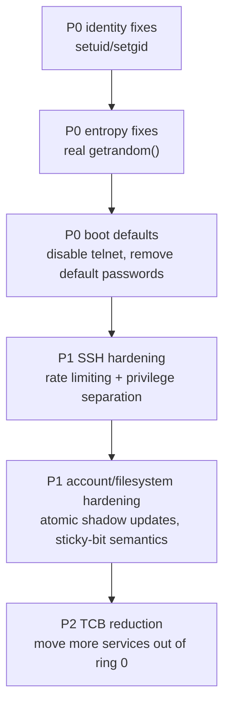

# Security Review and Hardening Priorities

## Security verdict

**m3OS should not yet be treated as a safe multi-user or internet-facing OS.**

It has real security mechanisms: Rust-heavy implementation, capability-based IPC, permission checks, `/etc/shadow`, Secure Boot signing support, and SSH with modern primitives. But several issues currently dominate the threat model more than those strengths help:

- unconditional `setuid` / `setgid`
- TSC-seeded pseudo-random output behind `getrandom()`
- telnet enabled by default at boot
- baked-in default credentials
- a broader ring-0 trusted computing base than the documented microkernel ideal

## Strengths worth keeping

| Strength | Why it matters | Evidence |
|---|---|---|
| Capability-based IPC and handle validation | A good least-authority foundation if the system keeps moving services outward | `docs/06-ipc.md`, `kernel/src/ipc/`, `kernel-core/src/ipc/` |
| Centralized file-permission model | Gives the repo one place to reason about ownership and mode checks | `docs/27-user-accounts.md`, `kernel/src/arch/x86_64/syscall.rs` |
| Modern SSH primitives | Better than many hobby OSes that stop at plaintext remote shells | `docs/roadmap/43-ssh-server.md`, `userspace/sshd/`, `userspace/crypto-lib/` |
| Secure Boot signing path | Good host-side supply-chain and real-hardware groundwork | `docs/10-secure-boot.md`, `scripts/gen-secure-boot-keys.sh`, `xtask/src/main.rs` |
| Strong user-memory validation and guarded ELF loading | Reduces a large class of user-pointer and mapping mistakes | `kernel/src/mm/user_mem.rs`, `docs/11-elf-loader-and-process-model.md` |

## P0: blockers to fix before claiming a safer multi-user system

| Issue | Why it is severe | Evidence | Recommended fix |
|---|---|---|---|
| `setuid` / `setgid` are unconditional | Any process can become root; the user/account model collapses | `kernel/src/arch/x86_64/syscall.rs` | Enforce kernel-side credential rules immediately and remove userspace-trust assumptions |
| `getrandom()` is TSC-seeded pseudo-random output | Weakens SSH host keys, user keys, salts, and any future TLS/session secrets | `kernel/src/arch/x86_64/syscall.rs`, `docs/roadmap/42-crypto-primitives.md`, `userspace/crypto-lib/src/random.rs` | Add a real entropy pipeline before treating crypto as trustworthy |
| `telnetd` starts by default | Plaintext remote access is exposed at boot next to SSH | `userspace/init/src/main.rs`, `docs/30-telnet-server.md` | Make telnet opt-in only, or remove it from the default boot path |
| Default credentials are baked into the image | `root/root` and `user/user` are unacceptable once remote access exists | `docs/27-user-accounts.md`, `xtask/src/main.rs` | Force first-boot password setup or image-time secret injection |
| Password hashing is plain SHA-256 with deterministic salts | Weak against offline cracking and does not reflect modern password storage practice | `docs/27-user-accounts.md`, `userspace/syscall-lib/src/sha256.rs` | Move to Argon2id, scrypt, bcrypt, or at least PBKDF2 with random salts |

## P1: important hardening work after P0

| Area | Current gap | Evidence | Recommended direction |
|---|---|---|---|
| SSH daemon hardening | No privilege separation, rate limiting, brute-force controls, or key re-exchange | `docs/roadmap/43-ssh-server.md` | Add daemon separation, backoff, logging, and stronger auth controls |
| Kernel/user boundary | The documented microkernel TCB is smaller than the actual ring-0 codebase | `docs/appendix/architecture-and-syscalls.md`, `kernel/src/fs/`, `kernel/src/net/`, `kernel/src/tty.rs` | Keep reducing policy in ring 0 where practical |
| Auth file updates | Account-file rewrites are simple and not obviously atomic/locked | `userspace/passwd/src/main.rs`, `userspace/adduser/src/main.rs` | Use temp+rename, consistency checks, and eventually file locking |
| Secret hygiene | `.gitignore` omits many common secret/key patterns | `.gitignore` | Add generic secret/key ignores and document key-handling workflow |
| Filesystem semantics | Sticky-bit and home-directory behavior are still rough | `docs/27-user-accounts.md`, `userspace/adduser/src/main.rs` | Tighten `/tmp` semantics and stop treating temporary paths as long-lived homes |

## How m3OS compares with Redox on security today

Compared with Redox, m3OS currently loses on the most practical security axis: **least privilege in the shipped system**.

- Redox's differentiator is not just "written in Rust"; it is that more services and drivers are truly kept outside the core kernel model.
- m3OS has some stronger educationally visible mechanisms — capability IPC, explicit docs, strong diagnostics — but the current system keeps more of the real attack surface in ring 0 and ships weaker default security choices.

That does not make the architecture wrong. It means the **implementation maturity is behind the design intent**.

## Why the security bar is now higher

Because m3OS already has remote access, multi-user state, meaningful filesystems, and a real userspace, the consequences of security shortcuts are no longer hypothetical. A project can still be early and serious at the same time; in m3OS's case, seriousness means the current shortcuts now deserve first-class attention.

## Recommended hardening sequence

## Practical policy recommendation

Until the P0 items are fixed:

- treat m3OS as a **controlled development and evaluation environment**
- do **not** present it as a safely network-exposed general-purpose system
- prefer smoke-tested local/QEMU use over unattended deployment

Once the P0 items are fixed and Phase 46-style service/logging work exists, m3OS can reasonably claim a **safer headless system**. Desktop-grade security is a later conversation and depends on the GUI/input/session architecture as much as on the kernel.
