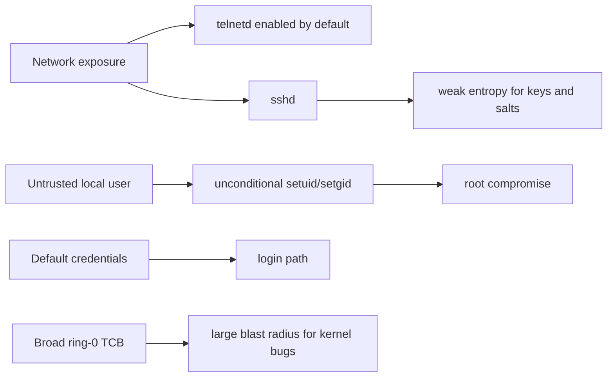
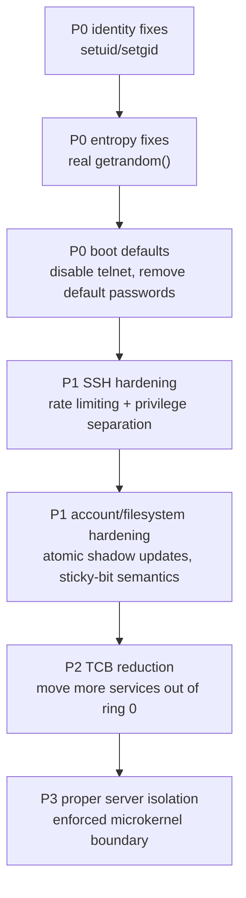

# Security Review and Hardening Priorities

## Security verdict

**m3OS has addressed its critical trust-floor issues but should still be treated
as a development and evaluation environment, not a production-hardened system.**

Phase 48 closed the most severe security gaps:

- ~~unconditional `setuid` / `setgid`~~ → kernel-enforced privilege checks
- ~~TSC-seeded pseudo-random output~~ → RDRAND-backed entropy with TSC mixing
- ~~telnet enabled by default~~ → telnet is opt-in (`--enable-telnet`)
- ~~baked-in default credentials~~ → locked accounts with first-boot setup
- ~~single-iteration SHA-256~~ → 10,000-round iterated hashing with random salts

Remaining concerns:
- a broader ring-0 trusted computing base than the documented microkernel ideal
- no privilege separation for network daemons (sshd runs as root)
- no sandboxing or namespace isolation

## Strengths worth keeping

| Strength | Why it matters | Evidence |
|---|---|---|
| Capability-based IPC and handle validation | A good least-authority foundation if the system keeps moving services outward | `docs/06-ipc.md`, `kernel/src/ipc/`, `kernel-core/src/ipc/` |
| Centralized file-permission model | Gives the repo one place to reason about ownership and mode checks | `docs/27-user-accounts.md`, `kernel/src/arch/x86_64/syscall.rs` |
| Modern SSH primitives | Better than many hobby OSes that stop at plaintext remote shells | `docs/roadmap/43-ssh-server.md`, `userspace/sshd/`, `userspace/crypto-lib/` |
| Secure Boot signing path | Good host-side supply-chain and real-hardware groundwork | `docs/10-secure-boot.md`, `scripts/gen-secure-boot-keys.sh`, `xtask/src/main.rs` |
| Strong user-memory validation and guarded ELF loading | Reduces a large class of user-pointer and mapping mistakes | `kernel/src/mm/user_mem.rs`, `docs/11-elf-loader-and-process-model.md` |
| Managed service/logging baseline | Phase 46 adds PID 1 supervision plus `syslogd` and admin tooling in the current base | Operational visibility and controlled shutdown are no longer purely aspirational | `docs/roadmap/46-system-services.md`, `userspace/init/src/main.rs`, `userspace/syslogd/src/main.rs` |

## P0: resolved by Phase 48

| Issue | Resolution | Phase 48 Track |
|---|---|---|
| `setuid`/`setgid` were unconditional | Kernel-enforced POSIX privilege checks in `kernel-core::cred` | Track B |
| `getrandom()` was TSC-seeded | RDRAND-backed seeding with TSC mixing, reseeding every 256 bytes | Track C |
| `telnetd` started by default | Removed from default image; opt-in via `--enable-telnet` | Track F |
| Default credentials baked into image | Locked-account markers with first-boot password setup | Track E |
| Password hashing was plain SHA-256 | 10,000-round iterated SHA-256 with random salts | Track D |

## P1: important hardening work after P0

| Area | Current gap | Evidence | Recommended direction |
|---|---|---|---|
| SSH daemon hardening | No privilege separation, rate limiting, brute-force controls, or key re-exchange | `docs/roadmap/43-ssh-server.md` | Add daemon separation, backoff, logging, and stronger auth controls |
| Kernel/user boundary | The documented microkernel TCB is smaller than the actual ring-0 codebase | `docs/appendix/architecture-and-syscalls.md`, `kernel/src/fs/`, `kernel/src/net/`, `kernel/src/tty.rs` | Keep reducing policy in ring 0 where practical |
| Auth file updates | Account-file rewrites are simple and not obviously atomic/locked | `userspace/passwd/src/main.rs`, `userspace/adduser/src/main.rs` | Use temp+rename, consistency checks, and eventually file locking |
| Secret hygiene | `.gitignore` omits many common secret/key patterns | `.gitignore` | Add generic secret/key ignores and document key-handling workflow |
| Filesystem semantics | Sticky-bit and home-directory behavior are still rough | `docs/27-user-accounts.md`, `userspace/adduser/src/main.rs` | Tighten `/tmp` semantics and stop treating temporary paths as long-lived homes |

## How m3OS compares with Redox on security today

Compared with Redox, m3OS currently loses on the most practical security axis: **least privilege in the shipped system**.

- Redox's differentiator is not just "written in Rust"; it is that more services and drivers are truly kept outside the core kernel model.
- m3OS has some stronger educationally visible mechanisms — capability IPC, explicit docs, strong diagnostics — but the current system keeps more of the real attack surface in ring 0 and ships weaker default security choices.

That does not make the architecture wrong. It means the **implementation maturity is behind the design intent**.

## Why the security bar is now higher

Because m3OS already has remote access, multi-user state, meaningful filesystems, and a real userspace, the consequences of security shortcuts are no longer hypothetical. A project can still be early and serious at the same time; in m3OS's case, seriousness means the current shortcuts now deserve first-class attention.

## Why the microkernel gap is also a security gap

The current microkernel deficiencies are not just architectural purity issues. They materially affect security.

| Microkernel deficiency | Security consequence |
|---|---|
| Filesystem, networking, and terminal policy remain in ring 0 | Bugs in those paths remain kernel bugs, not isolated-service bugs |
| Core service tasks still run in the kernel address space | Crash containment and restartability are weaker than the docs imply |
| Some IPC/data paths still assume shared kernel addresses | Transitional shortcuts become boundary bugs once more code moves to ring 3 |
| The syscall compatibility surface remains huge and centralized | The kernel attack surface stays broader than a properly narrowed microkernel would require |

This is why "move more services out of ring 0" is not merely an architectural cleanup item. It is also part of the long-term hardening path. The staged architecture answer is in [microkernel-path.md](./microkernel-path.md).

## Recommended hardening sequence

## Practical policy recommendation

With Phase 48's P0 fixes in place:

- m3OS can reasonably claim a **safer headless development system**
- the identity model is no longer advisory — credential transitions are kernel-enforced
- entropy quality is materially improved for SSH keys and password salts
- default boot no longer exposes plaintext remote access

Remaining cautions:
- do **not** treat m3OS as production-hardened — the ring-0 TCB is still broad
- privilege separation for network daemons is not yet implemented
- prefer controlled QEMU use over unattended network deployment
