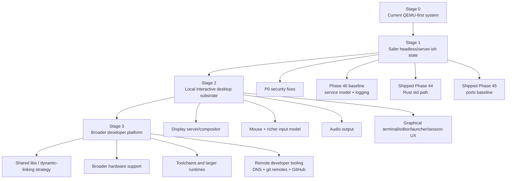

# Path to a Usable State

This document separates four different claims that are often blurred together:

1. **interesting OS project**
2. **usable QEMU development environment**
3. **safer headless/server-ish system**
4. **usable local desktop system**

m3OS already satisfies the first two in a meaningful way. The work ahead is about making the latter two explicit and staged.

Phase 46 changes Stage 1 significantly: service supervision, logging, cron, and admin tooling now exist in the current base. Stage 1 is therefore less about inventing a service model and more about hardening, validating, and learning to rely on the shipped one.

## Stage model

## Cross-cutting architectural track: microkernel convergence

The usability stages are not the whole story. If the project wants to become a **properly enforced microkernel** rather than a microkernel-inspired OS with a broad kernel, there is a second long-running track underneath them.

| Horizon | Microkernel work | Why it intersects usability |
|---|---|---|
| Near-term | make IPC/data paths ring-3-safe, decompose syscall policy, stop adding new high-level kernel policy | otherwise every new subsystem deepens the current ring-0 bias |
| Mid-term | move console/input/display and then storage services outward | these migrations are the first real tests of enforced service isolation |
| Long-term | move networking and more POSIX policy outward, narrow the kernel permanently | this is what turns the architecture docs from aspiration into reality |

The detailed version of that path is in [microkernel-path.md](./microkernel-path.md). The important usability point is that this is **not** a separate academic concern: it affects security, restartability, and how future GUI and driver work should be shaped.

## Stage 0: what m3OS already is

### Reasonable current claim

**m3OS is a strong, smoke-tested, QEMU-first operating system suitable for OS development, demos, and serious subsystem work.**

Evidence for that claim:

- the build/test workflow is mature and explicit in `README.md`, `CLAUDE.md`, and `xtask/src/main.rs`
- the feature surface already includes login, shell, editor, coreutils, networking, SSH, PTYs, ext2, Unix sockets, threads, futexes, and ports (`docs/roadmap/README.md`, `userspace/`)
- the evaluation-session `cargo xtask smoke-test` passed end-to-end

### Limits of the current claim

- it is not yet safe enough to call a secure multi-user OS
- it is not yet comfortable enough to call a server distribution
- it is not yet graphical enough to call a desktop system

## Stage 1: safer headless / server-ish state

### Must-have outcomes

| Work item | Why it matters | Evidence |
|---|---|---|
| Fix the P0 security issues | Without this, remote access and user isolation are not trustworthy | [security-review.md](./security-review.md) |
| Harden and validate the shipped service supervision, logging, shutdown/reboot layer | Real systems need PID 1 to manage daemons, logs, and lifecycle, and m3OS now has that baseline | `docs/roadmap/46-system-services.md`, `userspace/init/src/main.rs`, `userspace/syslogd/src/main.rs`, `userspace/crond/src/main.rs` |
| Stabilize the shipped Rust std path | This is the easiest path to writing more serious userspace in Rust, and it is already part of the base | `docs/roadmap/44-rust-cross-compilation.md` |
| Improve packaging/ports reliability | Tooling that silently skips sources or drifts is not a stable user story, even when the ports system already exists | `docs/45-ports-system.md`, validation-session zlib fetch issue |
| Make the remote/outbound support boundary explicit | A defensible 1.0 can stay headless/reference-focused, but it cannot be vague about what outbound workflows are in or out | `docs/16-network.md`, `docs/roadmap/52-headless-hardening.md`, `docs/roadmap/58-release-1-0-gate.md` |

Phase 46 moves Stage 1 meaningfully closer. The missing pieces are now mostly security and maturity gaps in shipped systems, not the absence of the service layer itself.

### Detailed Stage 1 work breakdown

| Track | Needed outcome | Why it belongs in Stage 1 |
|---|---|---|
| Security | root boundary actually means something | No amount of service polish matters if any process can become root |
| Operations | turn the shipped Phase 46 supervisor/logging stack into something safe to rely on unattended | This is the difference between a shell session and a real system |
| Packaging/tooling | reproducible ports and Rust std path | This is the difference between a demo image and an extensible environment |
| Networking boundary | decide which outbound/network-client workflows are true 1.0 needs and which belong after the release gate | This keeps 1.0 honest instead of quietly absorbing every remote-tooling wish |
| Architecture | ring-3-safe IPC and service boundaries | If proper microkernel design remains a real goal, this work cannot stay deferred forever |

### Readiness criteria

Call Stage 1 achieved only when all of these are true:

1. the system boots unattended to login or a supervised service state
2. SSH is the default remote-admin path and telnet is not exposed by default
3. service restart, shutdown, and reboot are first-class operations
4. logs survive long enough to diagnose failures and are accessible sanely
5. Rust std-based guest programs are part of the normal workflow
6. smoke/regression runs are reliable enough to trust as release gates

## Stage 2: local desktop substrate

### Must-have outcomes

| Work item | Why it matters | Evidence |
|---|---|---|
| Replace "graphics = raw framebuffer text console" with a display model | Multiple GUI apps need composition, focus, and ownership rules | `docs/09-framebuffer-and-shell.md`, `docs/roadmap/55-graphics-bring-up.md`, `docs/roadmap/56-display-and-input-architecture.md` |
| Add mouse input and event abstraction | A desktop cannot stay keyboard-only | `docs/roadmap/56-display-and-input-architecture.md` |
| Add audio output | Even a minimal desktop needs media and UI feedback | `docs/roadmap/57-audio-and-local-session.md` |
| Add a session/launcher/app model | Desktop usability is more than drawing pixels | `docs/roadmap/46-system-services.md`, GUI gaps in [gui-strategy.md](./gui-strategy.md) |

### Detailed Stage 2 work breakdown

| Track | Needed outcome | Why it matters |
|---|---|---|
| Display | one owner of composition and presentation | Avoids raw-framebuffer ownership conflicts |
| Input | keyboard and mouse as routable events | Needed for multiple windows and apps |
| Session | graphical login/startup/focus/launch | A desktop needs lifecycle, not just pixels |
| Applications | at least a terminal plus one native GUI app | Otherwise the GUI remains only a technology demo |
| Architecture | display server as real userspace service | The GUI path is also the cleanest opportunity to enforce a microkernel boundary |

### Readiness criteria

Call Stage 2 achieved only when all of these are true:

1. the system can boot into a graphical session, not just a framebuffer text console
2. keyboard and mouse input are routed through an event model that supports multiple apps
3. at least two graphical apps can coexist without raw-fb ownership conflicts
4. a crash in one GUI app does not take down the whole session
5. users can launch, switch, and close apps with basic session semantics

## Stage 3: broader developer platform

This is where the roadmap becomes more ambitious than many hobby OSes:

- bigger Rust and C/C++ toolchains
- Python, Node.js, git, GitHub tooling
- more capable package management
- larger application footprints

The official roadmap now treats this broader platform work as **post-1.0
growth**, primarily in Phases **59-62**.

That phase likely forces design choices that can be postponed today:

- shared libraries vs all-static distribution
- disk image growth and package storage strategy
- swap or better memory-pressure handling
- broader driver coverage for real hardware

### Detailed Stage 3 work breakdown

| Track | Needed outcome | Why it matters |
|---|---|---|
| Runtime/distribution | dynamic-linking or equally disciplined alternative | Large static-only runtimes do not scale gracefully |
| Hardware | less QEMU dependence | Broader adoption and credibility |
| Ecosystem | git, package install, richer languages | This is where m3OS starts behaving like a platform |
| Architecture | serverized storage/networking and narrower kernel claim | This is where the project either becomes a proper microkernel or settles into a broad-kernel design |

## Recommended priority order

1. **Security and system operations first.**
2. **Packaging and Rust std path second.**
3. **Display/input/audio substrate third.**
4. **Large runtimes and broader toolchains after the substrate is solid.**

The key judgment here is simple:

**m3OS does not need a GUI first. It needs to become a safer and better-operated headless system first.**

If that work is done cleanly, the GUI effort will build on a healthier base instead of papering over missing system fundamentals.
