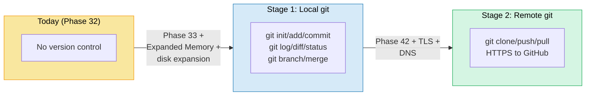
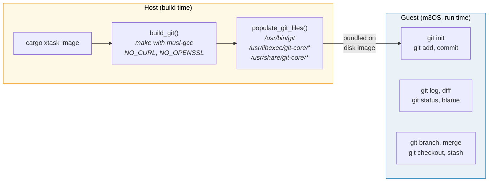
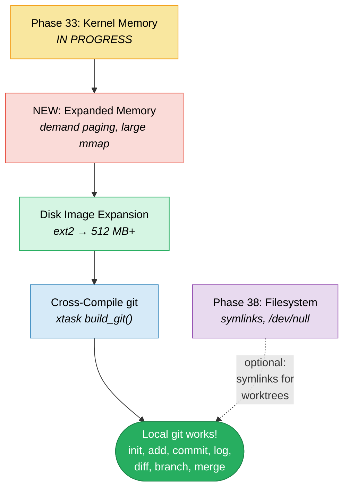
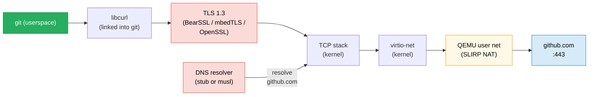
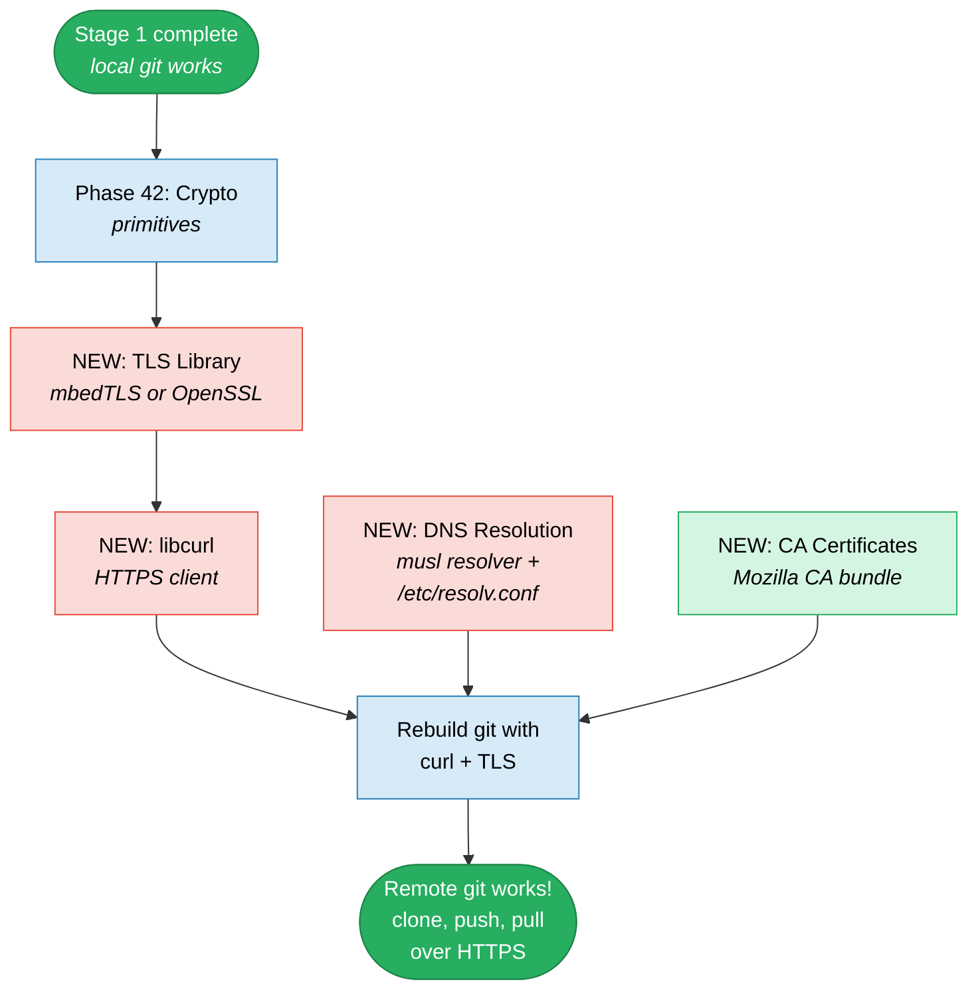

# Road to git on m3OS

This document details the path to running git natively inside m3OS. git is
essential for version control and is a prerequisite for the GitHub CLI and
Claude Code. The strategy is two stages: first get local git operations
working (init, add, commit, log, diff), then add HTTPS remote support
(clone, push, pull).

## Overview



## Why git?

git is the foundation of modern software development. On m3OS, it enables:

- **Version control for code written inside the OS** -- track changes to
  programs compiled with TCC or Clang
- **Prerequisite for Claude Code** -- Claude Code uses git extensively for
  `git status`, `git diff`, `git commit`
- **Prerequisite for GitHub CLI** -- `gh` wraps git operations
- **Self-referential development** -- version-control m3OS kernel code from
  inside the OS itself

## git's OS Requirements

git is written in C and is highly portable. When built with minimal
dependencies (`NO_CURL`, `NO_OPENSSL`, etc.), it has very few hard
requirements:

| Requirement | git component | Status in m3OS |
|---|---|---|
| File I/O (open, read, write, stat) | All of git | Working |
| `mmap()` / `munmap()` | Pack file access, index | Phase 33 (in progress) |
| `fork()` / `exec()` | Subcommands, pager, hooks | Working |
| Pipes | Subcommand communication | Working |
| `getcwd()` / `chdir()` | Repository discovery | Working |
| Environment variables | `GIT_DIR`, `HOME`, `EDITOR` | Working |
| `/tmp` directory | Temporary files during merge | Working (tmpfs) |
| `rename()` | Atomic file updates | Working |
| `chmod()` | Executable bit tracking | Working (ext2) |
| `readlink()` | Symlink resolution | Phase 38 (planned) |
| `mkstemp()` | Temporary file creation | Should work via musl |
| SHA-1 / SHA-256 | Object hashing | Built-in (no external lib needed) |
| `zlib` | Object compression, pack files | Must be statically linked |
| Regex | `git grep`, `.gitignore` | Built-in or musl regex |
| `select()` / `poll()` | Pager, interactive commands | Phase 37 (planned) |
| POSIX shell (`/bin/sh`) | git scripts, hooks | Working (sh0/ion) |
| `less` / pager | `git log`, `git diff` output | Phase 41 (planned) |

**Key insight:** Local git operations (init, add, commit, log, diff, status,
branch, merge) need almost nothing beyond what m3OS already has. The main
gaps are `mmap`/`munmap` (Phase 33) and zlib (statically linked into the
binary).

---

# Stage 1: Local git Operations

The goal: cross-compile git on the host with musl, bundle it on the disk
image, and use it for local version control inside m3OS. No remote
operations (no clone, push, pull).

## What Stage 1 Gives Us

```bash
# Initialize a repository
$ cd /home/project
$ git init
Initialized empty Git repository in /home/project/.git/

# Create and commit files
$ echo 'int main() { return 0; }' > main.c
$ git add main.c
$ git commit -m "initial commit"
[main (root-commit) abc1234] initial commit
 1 file changed, 1 insertion(+)
 create mode 100644 main.c

# View history
$ git log --oneline
abc1234 initial commit

# Branching
$ git checkout -b feature
$ echo '// new feature' >> main.c
$ git add main.c
$ git commit -m "add feature"

# Diff
$ git diff main..feature
diff --git a/main.c b/main.c
--- a/main.c
+++ b/main.c
@@ -1 +1,2 @@
 int main() { return 0; }
+// new feature

# Merge
$ git checkout main
$ git merge feature

# Status
$ git status
On branch main
nothing to commit, working tree clean

# Blame
$ git blame main.c

# Stash
$ git stash
$ git stash pop
```

## Host-Side Cross-Compilation

git builds cleanly with musl when external dependencies are disabled:

```bash
# Clone git
git clone --depth 1 --branch v2.44.0 https://github.com/git/git.git
cd git

# Cross-compile with musl, static, minimal dependencies
make -j$(nproc) \
  CC=x86_64-linux-musl-gcc \
  LDFLAGS="-static" \
  NO_CURL=1 \
  NO_OPENSSL=1 \
  NO_PERL=1 \
  NO_PYTHON=1 \
  NO_TCLTK=1 \
  NO_GETTEXT=1 \
  NO_EXPAT=1 \
  NO_ICONV=1 \
  NO_REGEX=NeedsStartEnd \
  NEEDS_LIBICONV= \
  prefix=/usr \
  DESTDIR=/tmp/git-staging \
  install

strip /tmp/git-staging/usr/bin/git
strip /tmp/git-staging/usr/libexec/git-core/*
```

Key decisions:
- **`NO_CURL=1`** -- disables HTTP/HTTPS transport (Stage 1 is local only)
- **`NO_OPENSSL=1`** -- no TLS (deferred to Stage 2)
- **`NO_PERL=1`, `NO_PYTHON=1`** -- some git subcommands use Perl/Python
  scripts; the core C commands work without them
- **Static musl linkage** -- no dynamic linker needed
- **zlib** -- git uses zlib internally; musl's toolchain typically includes
  a static zlib, or we bundle one

### Expected Sizes

| Component | Approximate size |
|---|---|
| `git` binary | ~12-15 MB (static, stripped) |
| `git-*` subcommand binaries | ~5 MB (hard-linked to main binary) |
| Git templates (`/usr/share/git-core/`) | ~1 MB |
| **Total disk footprint** | **~15-20 MB** |

### What Gets Bundled

```
/usr/
  bin/
    git               -- main git binary (~15 MB static)
  libexec/
    git-core/         -- subcommand binaries (hard-linked)
      git-add
      git-commit
      git-log
      git-diff
      git-status
      git-branch
      git-merge
      git-init
      git-checkout
      git-stash
      git-blame
      git-rebase
      git-tag
      ...
  share/
    git-core/
      templates/      -- default hooks, info/exclude
```

### xtask Integration



## Kernel/OS Prerequisites for Stage 1

### Phase 33 -- Kernel Memory Improvements (in progress, assumed ready)

**Why git needs it:** git uses `mmap()` to read pack files and the index
file. Without working `munmap()`, every git operation leaks the mapped
pages. For small repositories this is tolerable, but it accumulates.

---

### NEW: Expanded Memory Phase (shared with other roadmaps)

**Why git needs it:** For small repos, git's memory usage is modest (~10-30
MB). But demand paging is still important -- git `mmap()`s the entire pack
file (which can be many MB) and only reads portions of it.

---

### Disk Image Expansion (shared with other roadmaps)

git itself is ~15-20 MB, but repositories need space too. The ext2
partition should be at least 512 MB.

---

### Shell Compatibility

git invokes `/bin/sh` for hooks, aliases, and some subcommands. m3OS has
`sh0` and `ion`. Some git features may need a more POSIX-compatible shell.

**Potential issues:**
- `git rebase -i` invokes `$EDITOR` and shell scripts
- Git hooks are shell scripts
- `git stash` uses shell internally

**Workaround:** Set `GIT_EXEC_PATH` and ensure `sh0` handles the basics.
For advanced features, consider cross-compiling `dash` (~100 KB static) as
a minimal POSIX shell.

---

## Stage 1 Dependency Graph



**Stage 1 has the same prerequisites as Stage 1 Python** -- just Phase 33 +
Expanded Memory + disk expansion. git is pure C, no threads, no epoll, no
C++ runtime.

## Stage 1 Acceptance Criteria

```bash
# Init, add, commit
$ mkdir /home/myproject && cd /home/myproject
$ git init
$ echo "hello" > README
$ git add README
$ git commit -m "first commit"
[main (root-commit) ...] first commit

# Log and diff
$ echo "world" >> README
$ git diff
+world
$ git add README && git commit -m "update"
$ git log --oneline
def5678 update
abc1234 first commit

# Branch and merge
$ git checkout -b feature
$ echo "feature" > feature.txt
$ git add feature.txt && git commit -m "add feature"
$ git checkout main
$ git merge feature
$ ls
README  feature.txt

# Status
$ git status
On branch main
nothing to commit, working tree clean
```

---

# Stage 2: Remote git (HTTPS to GitHub)

The goal: `git clone`, `git push`, `git pull` over HTTPS. This connects
m3OS to the outside world and enables pulling code from GitHub.

## What Stage 2 Gives Us

```bash
# Clone a repository from GitHub
$ git clone https://github.com/user/repo.git
Cloning into 'repo'...
remote: Enumerating objects: 42, done.
remote: Counting objects: 100% (42/42), done.
Receiving objects: 100% (42/42), 10.24 KiB | 5.12 MiB/s, done.

# Push changes
$ cd repo
$ echo "change from m3OS" >> README.md
$ git add README.md
$ git commit -m "edit from inside m3OS"
$ git push origin main
Username for 'https://github.com': user
Password for 'https://user@github.com': <token>

# Pull updates
$ git pull origin main
Already up to date.
```

## Network Path for HTTPS



**Current state:** TCP sockets work end-to-end through QEMU's user-mode
networking (SLIRP). The OS can `connect()` to external hosts. QEMU's SLIRP
provides NAT for outbound connections and a DNS forwarder at the gateway IP
(typically `10.0.2.3`). The missing pieces are TLS and DNS at the
application level.

## Additional Prerequisites for Stage 2

### Rebuild git with curl + TLS

Stage 1 builds git with `NO_CURL=1` and `NO_OPENSSL=1`. Stage 2 removes
these flags and links against:

```bash
make -j$(nproc) \
  CC=x86_64-linux-musl-gcc \
  LDFLAGS="-static" \
  CURL_LDFLAGS="-lcurl -lssl -lcrypto -lz" \
  NO_PERL=1 \
  NO_PYTHON=1 \
  NO_TCLTK=1 \
  NO_GETTEXT=1 \
  NO_EXPAT=1 \
  prefix=/usr \
  install
```

This requires cross-compiled static libraries:
- **libcurl** (~1 MB static) -- HTTP/HTTPS client
- **A TLS library** -- one of:
  - BearSSL (~200 KB) -- minimal, recommended by Phase 42
  - mbedTLS (~500 KB) -- more complete
  - OpenSSL/LibreSSL (~3 MB) -- most compatible with curl
- **zlib** (~100 KB) -- already needed by git itself

### NEW: DNS Resolution

git needs to resolve `github.com` to an IP address.

**Options:**
1. **musl's built-in resolver** -- musl libc includes a DNS stub resolver
   that reads `/etc/resolv.conf`. Write `nameserver 10.0.2.3` to
   `/etc/resolv.conf` (QEMU's DNS forwarder). This is the simplest approach
   and works with static musl binaries automatically.
2. **c-ares** -- async DNS library. Only needed if we want non-blocking DNS
   (not required for git).
3. **Hardcoded `/etc/hosts`** -- for testing: `140.82.121.4 github.com`.

**Recommended:** musl's resolver with `/etc/resolv.conf` pointing to QEMU's
gateway. This requires:
- `getrandom()` syscall (for DNS transaction IDs) or `/dev/urandom`
- `/etc/resolv.conf` file on the ext2 partition
- UDP socket support (already working)

### NEW: TLS Library

**Options ranked by compatibility with git/curl:**

| Library | Size | TLS version | curl support | Complexity |
|---|---|---|---|---|
| OpenSSL 3.x | ~3 MB | TLS 1.3 | Native | Cross-compile is well-documented |
| LibreSSL | ~2 MB | TLS 1.3 | Native | Fork of OpenSSL, similar build |
| mbedTLS | ~500 KB | TLS 1.3 | curl backend | Smaller, easier to port |
| BearSSL | ~200 KB | TLS 1.2 | curl backend | Smallest, but TLS 1.2 only |

**Recommended:** mbedTLS or OpenSSL. GitHub requires TLS 1.2+, so BearSSL
works but lacks TLS 1.3 (which some CDNs prefer).

### NEW: Root CA Certificates

TLS requires a CA certificate bundle to verify server certificates.

```
/etc/
  ssl/
    certs/
      ca-certificates.crt   -- Mozilla CA bundle (~200 KB)
  resolv.conf                -- nameserver 10.0.2.3
```

The Mozilla CA bundle can be downloaded and bundled on the disk image.
git reads `GIT_SSL_CAINFO` or `/etc/ssl/certs/ca-certificates.crt`.

### Phase 42 -- Crypto Primitives (planned)

**Why:** Foundation for the TLS library. Phase 42 delivers the low-level
crypto (AES, ChaCha20, SHA-256, key exchange) that TLS builds on.

---

### git Credential Storage

For `git push`, the user needs to authenticate. Options:

1. **Personal access token** -- entered at the password prompt. GitHub
   requires tokens instead of passwords.
2. **`GIT_ASKPASS`** -- environment variable pointing to a credential helper
3. **`.netrc` file** -- `machine github.com login user password ghp_...`
4. **`git credential-store`** -- stores credentials in plaintext in
   `~/.git-credentials` (simple, works with no dependencies)

**Recommended for m3OS:** `.netrc` or `credential-store` for simplicity.

---

## Stage 2 Dependency Graph



## Stage 2 Acceptance Criteria

```bash
# DNS resolution works
$ python3 -c "import socket; print(socket.getaddrinfo('github.com', 443))"
# (or test via a simple C program)

# HTTPS clone
$ git clone https://github.com/torvalds/linux.git --depth 1 --single-branch
Cloning into 'linux'...
# ... completes successfully

# Push with token auth
$ cd /home/myrepo
$ git remote add origin https://github.com/user/test.git
$ git push -u origin main
Username: user
Password: ghp_xxxxxxxxxxxx
# ... push succeeds

# Pull
$ git pull origin main
Already up to date.
```

---

## Effort Summary

```mermaid
gantt
    title Road to git on m3OS
    dateFormat X
    axisFormat %s

    section Stage 1 - Local
    Phase 33 - Kernel Memory (in progress)     :active, p33, 0, 1
    NEW - Expanded Memory                      :crit, em, after p33, 1
    Disk Image Expansion                       :di, after em, 1
    Cross-Compile git (local only)             :git1, after di, 1

    section Stage 2 - Remote
    Phase 42 - Crypto Primitives               :p41, after git1, 1
    NEW - TLS Library (mbedTLS/OpenSSL)        :crit, tls, after p41, 1
    NEW - DNS + /etc/resolv.conf               :dns, after tls, 1
    NEW - libcurl + CA certs                   :curl, after dns, 1
    Rebuild git with HTTPS                     :git2, after curl, 1
```



| Stage | Phases Required | Complexity |
|---|---|---|
| **Stage 1: Local git** | Phase 33 + Expanded Memory + disk | Low-moderate |
| **Stage 2: Remote git** | Phase 42 + TLS + DNS + curl + CA | High |

**Stage 1 is very achievable** -- git is pure C, works single-threaded,
and local operations have minimal OS requirements. It shares prerequisites
with Python and Clang Stage 1.

**Stage 2 is the first time m3OS makes HTTPS connections** to the outside
world. The TLS + DNS + curl work benefits everything: git, gh, pip, npm,
and Claude Code.

## What We Explicitly Do Not Need

- **git-daemon** -- no need to host git protocol server
- **git-lfs** -- large file storage; not needed
- **Perl/Python git extensions** -- `git svn`, `git p4`, etc.
- **gitweb** -- web interface
- **SSH transport** -- HTTPS is sufficient (SSH requires Phase 43)
- **git gui / gitk** -- no GUI
- **git-send-email** -- no SMTP support
