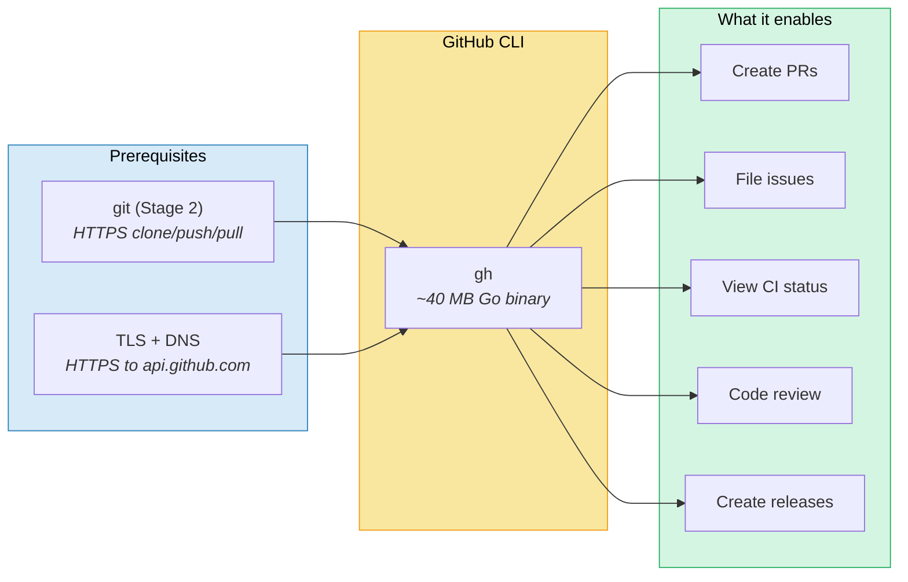
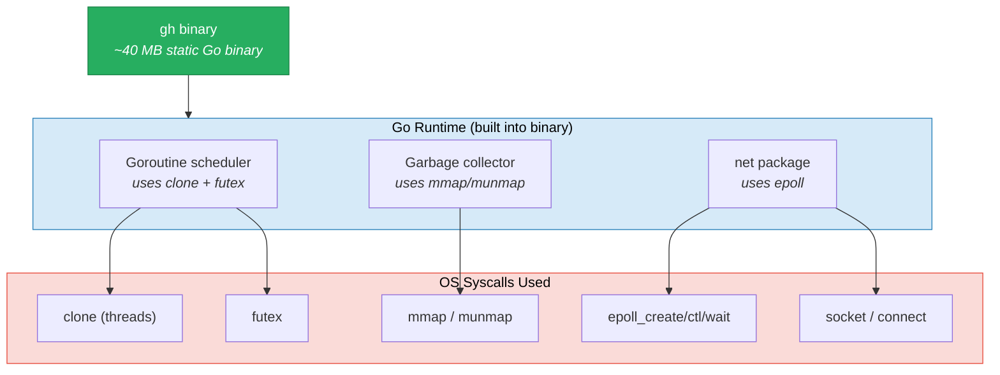
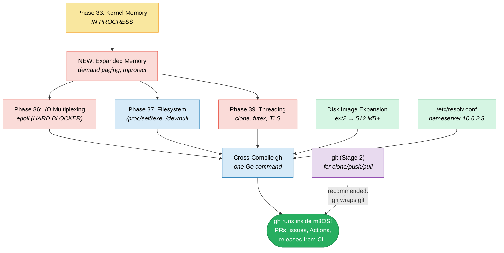
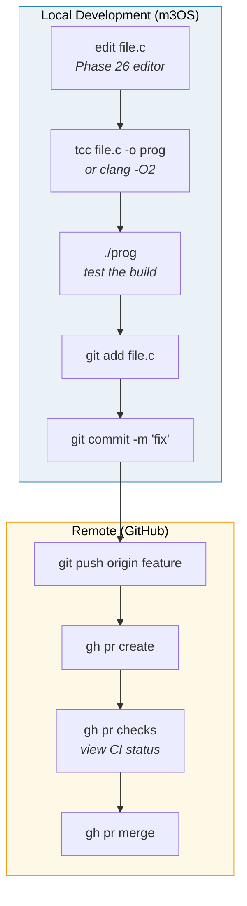

# Road to GitHub CLI (gh) on m3OS

This document details the path to running the GitHub CLI (`gh`) inside m3OS.
`gh` is a powerful interface to GitHub: issues, pull requests, releases,
Actions, and repository management from the command line. Combined with git,
it gives m3OS a complete GitHub development workflow.

## Overview



## Why gh?

With git (HTTPS) and `gh`, m3OS gets a complete GitHub workflow:

```bash
# Full development cycle inside m3OS
$ edit main.c                              # Phase 26 text editor
$ tcc main.c -o main                       # Phase 31 compiler
$ ./main                                   # test
$ git add main.c && git commit -m "fix"    # git (Stage 1)
$ git push origin feature                  # git (Stage 2)
$ gh pr create --title "Fix bug"           # gh creates a PR
$ gh pr checks                             # view CI status
$ gh pr merge                              # merge when ready
```

**What gh adds over raw git:**
- Create and manage pull requests without a web browser
- View and comment on issues
- Check CI/Actions status
- Create releases
- Browse repository contents on GitHub
- Manage repository settings
- Review and approve PRs

## gh Architecture

`gh` is written in **Go** and compiles to a single static binary. This is
actually great news for m3OS: Go binaries are self-contained, statically
linked, and have the Go runtime (including goroutine scheduler and garbage
collector) built in.



### Go Runtime OS Requirements

The Go runtime makes the same syscalls as Node.js's libuv, because it also
needs an event loop (for goroutines) and threads (for the GC and syscall
blocking):

| Requirement | Go runtime component | Status in m3OS |
|---|---|---|
| `clone(CLONE_THREAD)` | Goroutine scheduler (M:N threading) | Phase 39 (planned) |
| `futex()` | Goroutine synchronization | Phase 39 (planned) |
| `epoll_create/ctl/wait` | Network poller (netpoll) | Phase 36 (planned) |
| `mmap()` / `munmap()` | Heap, stack allocation | Phase 33 (in progress) |
| `mprotect()` | Stack guard pages | Expanded Memory (new) |
| `sigaction` / signals | Goroutine preemption (SIGURG) | Working (Phase 19) |
| `pipe2()` | Internal communication | Working |
| `getrandom()` | Crypto/rand | Needs implementation |
| Thread-local storage | Per-M state | Phase 39 (planned) |

**Key difference from Node.js:** Go does NOT need a JIT or `mmap(PROT_EXEC)`.
The Go runtime is ahead-of-time compiled. This means `gh` avoids V8's
hardest requirement.

### Comparison: gh vs Node.js

| Property | gh (Go) | Node.js |
|---|---|---|
| Language | Go (compiled, no JIT) | C++ (V8 JIT) |
| Binary size | ~40 MB | ~80 MB |
| JIT / PROT_EXEC | **Not needed** | Required |
| Threading | Required (goroutines) | Required (libuv) |
| epoll | Required (netpoll) | Required (libuv) |
| C++ runtime | **Not needed** | Required |
| TLS | Built into Go stdlib | Requires external OpenSSL |
| DNS | Built into Go stdlib | Requires c-ares |

**gh is easier to port than Node.js** because Go's stdlib includes TLS and
DNS -- no external dependencies. The binary is also smaller.

---

# Stage 1: gh with Full GitHub API Access

Unlike git (which has a useful local-only mode), `gh` is inherently a
network tool. There is no useful "local-only" stage. So Stage 1 is the
full thing: `gh` making HTTPS API calls to GitHub.

## What Stage 1 Gives Us

```bash
# Authenticate
$ export GH_TOKEN="ghp_xxxxxxxxxxxx"
# or
$ gh auth login --with-token < /home/token.txt

# Repository operations
$ gh repo clone user/repo
$ gh repo view user/repo

# Pull requests
$ gh pr create --title "Fix from m3OS" --body "Edited inside the OS"
$ gh pr list
$ gh pr view 42
$ gh pr checks 42
$ gh pr merge 42

# Issues
$ gh issue create --title "Bug report" --body "Found while testing"
$ gh issue list
$ gh issue view 123

# Actions / CI
$ gh run list
$ gh run view 12345

# Releases
$ gh release list
$ gh release create v1.0.0 --notes "Released from m3OS"

# API (raw)
$ gh api repos/user/repo/commits --jq '.[0].commit.message'
```

## Host-Side Cross-Compilation

Go makes cross-compilation trivial -- it's a first-class feature of the
toolchain:

```bash
# Clone gh
git clone --depth 1 --branch v2.47.0 https://github.com/cli/cli.git gh-cli
cd gh-cli

# Cross-compile for Linux/amd64 (static, CGO disabled)
CGO_ENABLED=0 GOOS=linux GOARCH=amd64 \
  go build -ldflags="-s -w" -o gh ./cmd/gh

# That's it. Single command. ~40 MB binary.
```

**Why this is so easy:**
- `CGO_ENABLED=0` -- pure Go, no C dependencies. Go's stdlib includes
  its own TLS implementation and DNS resolver.
- No external libraries needed (no OpenSSL, no curl, no c-ares)
- No configure step, no cmake, no make
- Cross-compilation is just setting `GOOS` and `GOARCH`
- TLS 1.3 is built into Go's `crypto/tls`
- DNS resolution is built into Go's `net` package

### Expected Sizes

| Component | Approximate size |
|---|---|
| `gh` binary | ~40 MB (static, stripped) |
| **Total disk footprint** | **~40 MB** |

Go's binary includes everything: the Go runtime, TLS, DNS, HTTP/2, JSON
parsing -- no external libraries or data files needed (CA certificates are
compiled into the binary).

### What Gets Bundled

```
/usr/
  bin/
    gh                -- GitHub CLI (~40 MB static)
```

That's it. One file. Go binaries are beautifully self-contained.

## Kernel/OS Prerequisites

gh needs the same kernel infrastructure as Node.js minus the JIT:

### Phase 33 -- Kernel Memory (in progress, assumed ready)

**Why:** Go's garbage collector uses `mmap`/`munmap` extensively.

### NEW: Expanded Memory Phase (shared with other roadmaps)

**Why:** Go's runtime reserves large virtual address regions on startup
for its heap and goroutine stacks. `mprotect()` is used for stack guard
pages (not JIT -- Go is AOT compiled).

### Phase 36 -- I/O Multiplexing (planned)

**Why:** Go's network poller (`netpoll`) uses `epoll` on Linux. All network
I/O (HTTP requests to GitHub API) goes through the netpoller. Unlike
Node.js/libuv, Go does have a `select`-based fallback (`netpoll_select.go`),
but it's not used on Linux and may not work reliably.

**This is a hard blocker** for any network operation.

### Phase 37 -- Filesystem Enhancements (planned)

**Why:**
- `/dev/null` -- Go's `os/exec` uses it for suppressed stdio
- `/proc/self/exe` -- Go reads this during initialization
- Symlinks -- used by git (gh wraps git operations)

### Phase 39 -- Threading Primitives (planned)

**Why:** Go's runtime creates OS threads (called "M"s in Go terminology)
for its goroutine scheduler. The scheduler is M:N -- many goroutines
multiplexed onto fewer OS threads. But it still needs real OS threads:
- `clone(CLONE_THREAD | CLONE_VM)` for thread creation
- `futex()` for goroutine parking/unparking
- Thread-local storage for per-M state

**Minimum threads needed:** Go creates at least 2-4 OS threads at startup
(main thread + GC threads + sysmon thread). Under load, it may create more.

---

### DNS: Built into Go

**gh does NOT need external DNS.** Go's stdlib includes a pure-Go DNS
resolver that reads `/etc/resolv.conf` and sends UDP queries. All we need
is:
```
# /etc/resolv.conf
nameserver 10.0.2.3
```

### TLS: Built into Go

**gh does NOT need an external TLS library.** Go's `crypto/tls` package
implements TLS 1.2 and 1.3 in pure Go. Root CA certificates are embedded
in the Go binary (via `crypto/x509`), with fallback to system CA files.

This is the biggest advantage of gh over git-with-HTTPS: **no OpenSSL, no
curl, no CA bundle needed.** Everything is in the binary.

---

## Dependency Graph



**Key insight:** gh needs the same kernel phases as Node.js (36, 37, 39 +
Expanded Memory) but is actually easier because:
- No JIT (no `mmap(PROT_EXEC)` needed -- just `mprotect` for guard pages)
- No C++ runtime
- No external TLS/DNS/curl libraries
- Trivial cross-compilation (one command)

## Acceptance Criteria

```bash
# Authentication
$ export GH_TOKEN="ghp_xxxxxxxxxxxx"
$ gh auth status
github.com
  ✓ Logged in to github.com as user

# List repos
$ gh repo list --limit 5
user/repo1  description...
user/repo2  description...

# Create an issue from inside m3OS
$ gh issue create --repo user/repo --title "Hello from m3OS" \
    --body "This issue was filed from inside a toy operating system"
https://github.com/user/repo/issues/42

# View a PR
$ gh pr list --repo user/repo
#1  Fix memory leak  feature-branch  OPEN

# API access
$ gh api user --jq '.login'
user

# Combined with git
$ gh repo clone user/repo
$ cd repo
$ echo "change" >> README.md
$ git add README.md && git commit -m "edit from m3OS"
$ git push origin main
$ gh pr create --title "Edit from m3OS"
```

---

## gh + git: The Complete GitHub Workflow



## Effort Summary

```mermaid
gantt
    title Road to git + gh on m3OS
    dateFormat X
    axisFormat %s

    section Local git (Stage 1)
    Phase 33 - Kernel Memory (in progress)     :active, p33, 0, 1
    NEW - Expanded Memory                      :crit, em, after p33, 1
    Disk Expansion + Cross-Compile git         :git1, after em, 1

    section Network Infrastructure
    Phase 36 - I/O Multiplexing (epoll)        :crit, p36, after em, 1
    Phase 37 - Filesystem Enhancements         :p37, after em, 1
    Phase 39 - Threading Primitives            :crit, p39, after p36, 1

    section Remote git (Stage 2)
    Phase 41 - Crypto Primitives               :p41, after p39, 1
    TLS + DNS + curl + CA certs                :crit, tls, after p41, 1
    Rebuild git with HTTPS                     :git2, after tls, 1

    section GitHub CLI
    Cross-Compile gh (one Go command)          :gh, after p39, 1
    /etc/resolv.conf                           :resolv, after gh, 1
```



| Component | Prerequisites | Complexity |
|---|---|---|
| **git (local)** | Phase 33 + Expanded Memory + disk | Low-moderate |
| **git (HTTPS)** | + Phase 41, TLS, DNS, curl, CA | High |
| **gh** | Phase 33 + Expanded Memory + Phases 36, 37, 39 | Moderate |

**Ordering recommendation:**
1. git Stage 1 (local) -- comes for free with Phase 33 + Expanded Memory
2. gh -- comes for free once Phases 36, 37, 39 are done (no extra TLS/DNS work!)
3. git Stage 2 (HTTPS) -- needs TLS + curl + DNS (same work benefits pip, npm, Claude Code)

**gh is actually easier to get working than git HTTPS** because Go bundles
its own TLS and DNS. Once the kernel has epoll + threads, gh just works.

## What We Explicitly Do Not Need

- **gh extensions** -- plugin system; not needed
- **gh codespace** -- cloud development environments; not applicable
- **gh secret** -- repository secrets management (can use if desired)
- **SSH for gh** -- HTTPS token auth is sufficient
- **GitHub App authentication** -- personal access tokens are enough
- **gh alias** -- nice to have but not required
- **Completion scripts** -- shell completion for sh0/ion; optional
