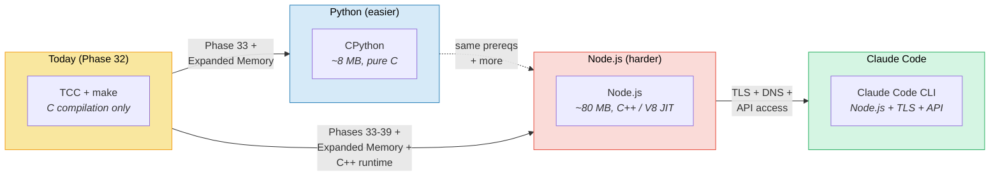
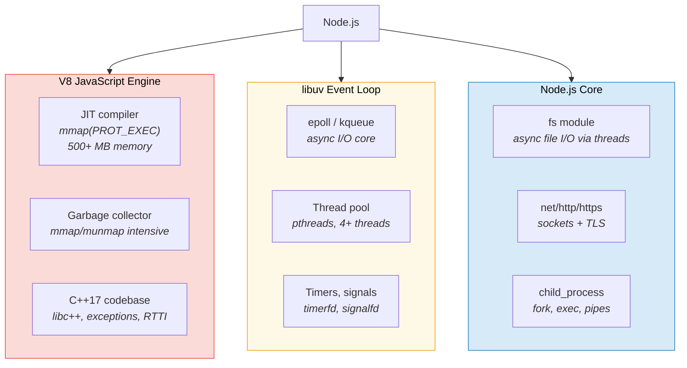
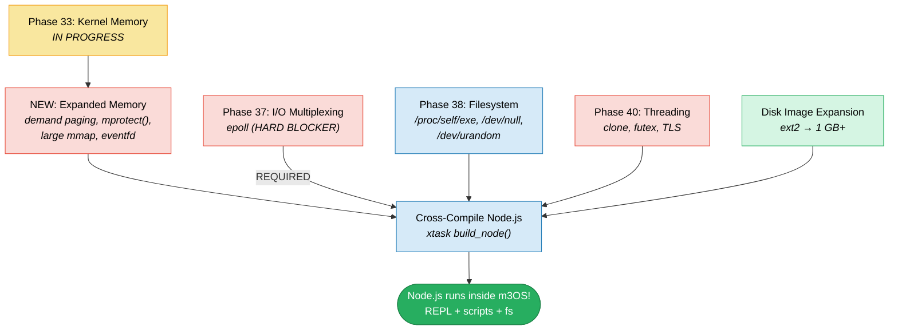
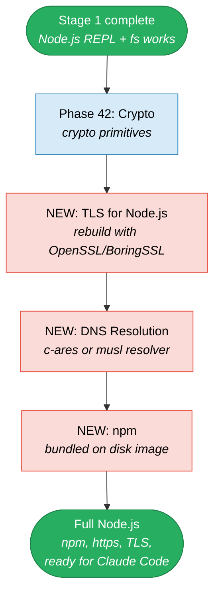

# Road to Node.js on m3OS

This document details the path to running Node.js inside m3OS via
cross-compilation. Node.js is substantially harder to port than Python --
it requires a C++ runtime, a JIT compiler (V8), threading, and an event
loop (libuv) that expects `epoll`. But it's the prerequisite for the
ultimate goal: running Claude Code inside m3OS.

## Overview



## Why Node.js is Hard

Node.js combines three complex components, each with significant OS
requirements:



### Comparison with CPython

| Requirement | CPython | Node.js |
|---|---|---|
| Language | C | C++ (V8 + Node core) |
| Binary size (static) | ~8 MB | ~80 MB |
| C++ runtime | Not needed | Required (libc++, exceptions, RTTI) |
| JIT / executable memory | No (bytecode interpreter) | Yes (V8 JIT, `mmap(PROT_EXEC)`) |
| Threading (hard requirement) | No (GIL, single-threaded ok) | **Yes** (libuv thread pool) |
| epoll (hard requirement) | No (`select` fallback) | **Yes** (libuv event loop core) |
| Memory usage | ~50-100 MB | ~200-500 MB |
| mmap/munmap intensity | Moderate | Very high (V8 GC) |
| `mprotect()` | Not needed | **Yes** (V8 JIT: RW -> RX transitions) |

## Current State Gaps

| OS Feature | Status | Node.js Component |
|---|---|---|
| Working `munmap()` | Phase 33 (in progress) | V8 GC, libuv |
| Demand paging | Not yet planned | V8 (reserves huge virtual regions) |
| `mmap(PROT_EXEC)` | Working (Phase 31) | V8 JIT code emission |
| `mprotect()` | Not implemented | V8 JIT (RW -> RX page transitions) |
| C++ runtime (libc++) | Not available | All of Node.js and V8 |
| `epoll_create/ctl/wait` | Phase 37 (planned) | libuv event loop |
| `clone(CLONE_THREAD)` | Phase 40 (planned) | libuv thread pool |
| `futex()` | Phase 40 (planned) | libuv synchronization |
| Thread-local storage | Phase 40 (planned) | V8 isolates |
| `/dev/urandom` / `getrandom()` | Not implemented | crypto module, V8 |
| `eventfd()` | Not implemented | libuv async handles |
| `timerfd_create()` | Not implemented | libuv timers |
| `signalfd()` | Not implemented | libuv signal handling |
| `pipe2(O_NONBLOCK)` | Partially (no O_NONBLOCK) | libuv IPC |
| Symlinks | Phase 38 (planned) | npm, node_modules |
| `/proc/self/exe` | Phase 38 (planned) | Node.js binary location |
| `/dev/null` | Phase 38 (planned) | subprocess, testing |
| DNS resolution | Not implemented | `dns` module, `net.connect()` |
| TLS/SSL | Phase 42 + new | `https`, `tls` modules |

---

# Stage 1: Minimal Node.js (REPL + Scripts)

The goal: cross-compile a static Node.js binary on the host and run
JavaScript inside m3OS. Basic `fs`, `path`, `console`, `process` modules
work. No networking, no npm.

## What Stage 1 Gives Us

```bash
# Node.js REPL
$ node
> console.log('hello from m3OS!')
hello from m3OS!
> const fs = require('fs')
> fs.writeFileSync('/tmp/test.txt', 'written by Node.js\n')
> fs.readFileSync('/tmp/test.txt', 'utf8')
'written by Node.js\n'
> process.platform
'linux'
> process.arch
'x64'

# Run scripts
$ node /usr/src/hello.js
hello, world

# JSON processing
$ node -e "console.log(JSON.stringify({os: 'm3OS', runtime: 'node'}, null, 2))"
{
  "os": "m3OS",
  "runtime": "node"
}
```

## Host-Side Cross-Compilation

Building a static Node.js is significantly more complex than CPython. V8 uses
its own build system (GN/Ninja), and the entire build must be configured for
musl static linkage.

```bash
# Clone Node.js
git clone --depth 1 --branch v20.12.0 https://github.com/nodejs/node.git
cd node

# Cross-compile with musl, static, minimal configuration
CC=x86_64-linux-musl-gcc \
CXX=x86_64-linux-musl-g++ \
LDFLAGS="-static" \
./configure \
  --prefix=/usr \
  --dest-cpu=x64 \
  --fully-static \
  --without-npm \
  --without-inspector \
  --without-intl \
  --without-ssl \
  --without-cares \
  --with-arm-float-abi=default \
  --openssl-no-asm

make -j$(nproc)
strip out/Release/node
```

Key decisions:
- **`--fully-static`** -- static binary with musl, no shared libraries
- **`--without-npm`** -- npm needs networking; deferred to Stage 2
- **`--without-ssl`** -- TLS needs crypto libraries; deferred to Stage 2
- **`--without-cares`** -- c-ares DNS library; deferred to Stage 2
- **`--without-inspector`** -- Chrome DevTools protocol; not needed
- **`--without-intl`** -- ICU internationalization library (~25 MB); not needed

### Expected Sizes

| Component | Approximate size |
|---|---|
| `node` binary | ~50-80 MB (static, stripped, no ICU) |
| Node.js built-in modules | Compiled into binary |
| Test scripts | ~1 MB |
| **Total disk footprint** | **~80 MB** |

### What Gets Bundled

```
/usr/
  bin/
    node              -- Node.js interpreter (~80 MB static)
  src/
    hello.js          -- test script
    fibonacci.js      -- test script
```

## Kernel/OS Prerequisites for Stage 1

Node.js has **much heavier** kernel requirements than Python or Clang due to
V8's JIT and libuv's event loop.

### Phase 33 -- Kernel Memory Improvements (in progress, assumed ready)

**Why:** V8's garbage collector is extremely `mmap`/`munmap` intensive. It
allocates and frees memory pages constantly during garbage collection cycles.

---

### NEW: Expanded Memory Phase (shared with Clang/Python roadmaps)

**Why:** V8 reserves large virtual address regions (256+ MB) on startup for
its heap. With demand paging, only touched pages consume physical RAM.
Without it, V8 cannot even initialize.

**Additional Node.js-specific needs:**
- **`mprotect()`** -- V8's JIT compiler emits machine code into pages
  mapped as `RW`, then transitions them to `RX` via `mprotect()`. This
  is non-negotiable -- V8 cannot run without `mprotect()`.
- **`eventfd()`** -- libuv uses `eventfd` for async notifications between
  threads. Can potentially be stubbed for single-threaded use.

---

### Phase 37 -- I/O Multiplexing (planned)

**Why:** libuv's event loop is built on `epoll` (Linux). Without `epoll`,
libuv cannot function. There is no `select()` fallback -- libuv assumes
`epoll` on Linux.

**This is a hard blocker.** Node.js literally cannot process events
(timers, I/O callbacks, promises) without `epoll`.

---

### Phase 38 -- Filesystem Enhancements (planned)

**Why:**
- `/proc/self/exe` -- Node.js uses this to find its own binary path
- `/dev/null` -- used by `child_process` for stdio suppression
- `/dev/urandom` -- V8 seeds its random number generator from this

---

### Phase 40 -- Threading Primitives (planned)

**Why:** libuv creates a thread pool (default 4 threads) for file system
operations. All `fs.readFile()`, `fs.writeFile()`, `fs.stat()`, DNS lookups,
and crypto operations run in this thread pool.

**Can we avoid this?** Partially. libuv can be configured with
`UV_THREADPOOL_SIZE=0`, but this makes all file operations synchronous and
blocking. Some Node.js modules assume threaded operation.

**Minimum thread support needed:**
- `clone(CLONE_THREAD | CLONE_VM)`
- `futex()` for synchronization
- Thread-local storage (V8 isolates use TLS)

---

### C++ Runtime (shared with Clang roadmap)

**Why:** Node.js and V8 are written in C++17. The cross-compiled binary
statically links libc++, libunwind, and libc++abi. The binary itself handles
C++ exceptions internally. However, programs that `require()` native addons
would need the OS to support C++ exceptions -- not needed for Stage 1.

---

## Stage 1 Dependency Graph



**Unlike Python, Stage 1 Node.js requires Phases 37, 38, AND 40.** There are
no viable workarounds -- libuv's architecture fundamentally depends on epoll
and threads.

## Stage 1 Acceptance Criteria

```bash
# REPL works
$ node -e "console.log('hello from m3OS')"
hello from m3OS

# File I/O
$ node -e "
const fs = require('fs');
fs.writeFileSync('/tmp/test.txt', 'written by Node.js\n');
console.log(fs.readFileSync('/tmp/test.txt', 'utf8'));
"
written by Node.js

# JSON and ES6+
$ node -e "
const data = { os: 'm3OS', features: ['epoll', 'threads', 'v8'] };
console.log(JSON.stringify(data, null, 2));
"

# Process info
$ node -e "console.log(process.platform, process.arch, process.version)"
linux x64 v20.12.0

# Async works (event loop functional)
$ node -e "
setTimeout(() => console.log('timer fired!'), 100);
console.log('waiting...');
"
waiting...
timer fired!
```

---

# Stage 2: Full Node.js with Networking

The goal: `npm install`, `https` requests, TLS, and the full Node.js
ecosystem. This is the final prerequisite for Claude Code.

## Additional Prerequisites

### Phase 42 -- Crypto Primitives + TLS Library

**Why:** Node.js uses OpenSSL for all crypto operations. Options for m3OS:

1. **Build Node.js with BoringSSL** -- Google's OpenSSL fork, used by
   Chromium. V8 already supports it. ~5 MB static.
2. **Build Node.js with OpenSSL** -- the default. ~3 MB static. Most
   compatible.
3. **Use BearSSL** -- would require significant patching of Node.js crypto
   bindings. Not recommended.

Rebuild Node.js with `--with-ssl` and the chosen TLS library statically
linked.

### NEW: DNS Resolution

**Why:** `require('https').get('https://api.anthropic.com/...')` needs DNS.
Node.js uses c-ares for async DNS resolution.

Options:
1. **Build with c-ares** (`--with-cares`) -- c-ares is small (~200 KB) and
   sends UDP DNS queries. Needs a nameserver configured (QEMU provides
   10.0.2.3).
2. **Use musl's resolver** -- simpler but synchronous (blocks the event loop).
3. **Hardcoded `/etc/hosts`** -- for testing only.

### NEW: npm

**Why:** npm is needed to install Claude Code (`npm install -g @anthropic-ai/claude-code`).

npm requirements:
- Node.js with networking (https, dns)
- Symlinks (Phase 38) for `node_modules/.bin/` links
- ~50 MB disk space for npm itself
- Write access to `/usr/lib/node_modules/` or user directory

## Stage 2 Dependency Graph



## Effort Summary

```mermaid
gantt
    title Road to Node.js on m3OS
    dateFormat X
    axisFormat %s

    section Stage 1
    Phase 33 - Kernel Memory (in progress)     :active, p33, 0, 1
    NEW - Expanded Memory + mprotect           :crit, em, after p33, 1
    Phase 37 - I/O Multiplexing (epoll)        :crit, p36, after em, 1
    Phase 38 - Filesystem Enhancements         :p37, after em, 1
    Phase 40 - Threading Primitives            :crit, p39, after p36, 1
    Disk Image Expansion                       :di, after p39, 1
    Cross-Compile Node.js                      :cc, after di, 1

    section Stage 2
    Phase 42 - Crypto Primitives               :p41, after cc, 1
    NEW - TLS (OpenSSL/BoringSSL)              :crit, tls, after p41, 1
    NEW - DNS Resolution (c-ares)              :dns, after tls, 1
    NEW - npm bundled                          :npm, after dns, 1
```



| Stage | Phases Required | Complexity |
|---|---|---|
| **Stage 1: Minimal Node.js** | Phase 33, Expanded Memory, Phases 36+37+39, disk | Very high |
| **Stage 2: Full Node.js** | Phase 42, TLS, DNS, npm | High |

**Node.js is the hardest runtime to port.** It requires almost every planned
kernel infrastructure phase (33, 36, 37, 39) plus the new Expanded Memory
phase with `mprotect()`. There is no viable "minimal" path -- V8 and libuv
have hard requirements on JIT, epoll, and threads.

## What We Explicitly Do Not Need

- **npm (Stage 1)** -- only needed for package management
- **node-gyp** -- native addon compilation; not needed for Claude Code
- **ICU** -- internationalization data (~25 MB); not needed
- **Inspector/debugger** -- Chrome DevTools protocol; not needed
- **WASI** -- WebAssembly System Interface; not needed
- **Corepack** -- yarn/pnpm manager; not needed
- **V8 snapshots with custom startup** -- default snapshot is fine
