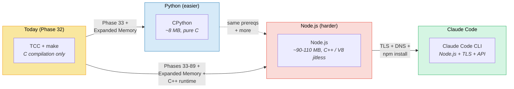
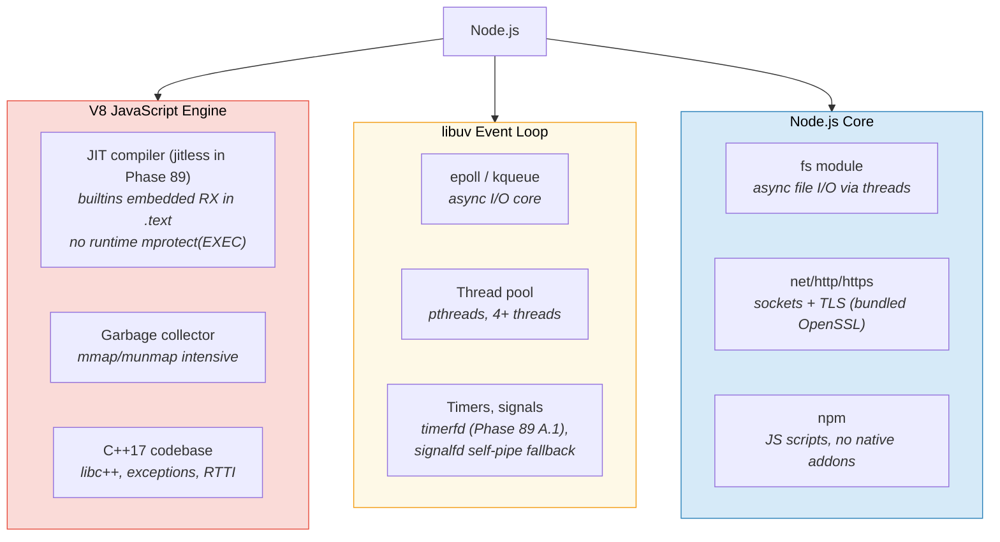
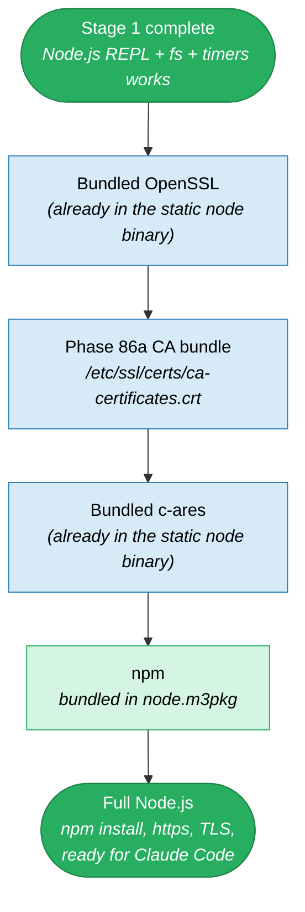

> Revived 2026-06-11 for **Phase 89 — Node.js**. This is the per-tool
> reference for the Phase 89 Node.js porting work. Its **Stage 1 (local
> runtime — fs/timers/console/event-loop/loopback HTTP, no npm networking)**
> is in Phase 89 scope (Tracks B + C); its **Stage 2 (TLS + DNS + `npm install`
> over HTTPS)** is Track D of Phase 89, opt-in (`M3OS_NODE_NET=1`) and the
> prerequisite for [Phase 90 — Claude Code](./roadmap/90-claude-code.md).
> Where this historical doc and the live phase docs disagree, the
> [Phase 89 design doc](./roadmap/89-nodejs.md) and
> [Phase 89 task list](./roadmap/tasks/89-nodejs-tasks.md) are authoritative.
>
> **As-built decisions (Phase 89):** Node.js v22.22.3 LTS; fully-static musl
> binary (no `PT_INTERP`, `dlopen` disabled); V8 `--v8-lite-mode` (jitless,
> Ignition interpreter only — the `mprotect` RW↔RX JIT path was removed from
> modern V8; PKU-backed JIT is the tracked follow-up); `--with-intl=small-icu`
> (en-US bundled); all deps bundled (OpenSSL, zlib, c-ares, nghttp2, ICU, etc.);
> npm kept (`/usr/bin/npm`); host clang + `build_llvm`'s musl `libc++.a` sysroot
> (no musl g++). Artifact: approximately 90–110 MB installed, gated behind
> `M3OS_WITH_NODE`.

# Road to Node.js on m3OS

This document details the path to running Node.js inside m3OS via
cross-compilation. Node.js is substantially harder to port than Python --
it requires a C++ runtime, a JIT compiler (V8), threading, and an event
loop (libuv) that expects `epoll`. But it's the prerequisite for the
ultimate goal: running Claude Code inside m3OS.

## Overview


```mermaid
flowchart LR
    subgraph TODAY ["Today (Phase 32)"]
        TCC["TCC + make<br/><i>C compilation only</i>"]
    end

    subgraph PYTHON ["Python (easier)"]
        PY["CPython<br/><i>~8 MB, pure C</i>"]
    end

    subgraph NODEJS ["Node.js (harder)"]
        direction TB
        NODE["Node.js<br/><i>~90-110 MB, C++ / V8 jitless</i>"]
    end

    subgraph GOAL ["Claude Code"]
        direction TB
        CC["Claude Code CLI<br/><i>Node.js + TLS + API</i>"]
    end

    TODAY -->|"Phase 33 +<br/>Expanded Memory"| PYTHON
    PYTHON -.->|"same prereqs<br/>+ more"| NODEJS
    TODAY -->|"Phases 33-89 +<br/>Expanded Memory +<br/>C++ runtime"| NODEJS
    NODEJS -->|"TLS + DNS +<br/>npm install"| GOAL

    style TODAY fill:#f9e79f,stroke:#f39c12,color:#000
    style PYTHON fill:#d6eaf8,stroke:#2980b9,color:#000
    style NODEJS fill:#fadbd8,stroke:#e74c3c,color:#000
    style GOAL fill:#d5f5e3,stroke:#27ae60,color:#000
```

## Why Node.js is Hard

Node.js combines three complex components, each with significant OS
requirements:


```mermaid
flowchart TD
    NODE["Node.js"]

    subgraph V8 ["V8 JavaScript Engine"]
        JIT["JIT compiler (jitless in Phase 89)<br/><i>builtins embedded RX in .text</i><br/><i>no runtime mprotect(EXEC)</i>"]
        GC["Garbage collector<br/><i>mmap/munmap intensive</i>"]
        CPP["C++17 codebase<br/><i>libc++, exceptions, RTTI</i>"]
    end

    subgraph LIBUV ["libuv Event Loop"]
        EPOLL["epoll / kqueue<br/><i>async I/O core</i>"]
        THREADS["Thread pool<br/><i>pthreads, 4+ threads</i>"]
        TIMERS["Timers, signals<br/><i>timerfd (Phase 89 A.1),<br/>signalfd self-pipe fallback</i>"]
    end

    subgraph NODECORE ["Node.js Core"]
        FS["fs module<br/><i>async file I/O via threads</i>"]
        NET["net/http/https<br/><i>sockets + TLS (bundled OpenSSL)</i>"]
        NPM["npm<br/><i>JS scripts, no native addons</i>"]
    end

    NODE --> V8
    NODE --> LIBUV
    NODE --> NODECORE

    style V8 fill:#fadbd8,stroke:#e74c3c,color:#000
    style LIBUV fill:#fef9e7,stroke:#f39c12,color:#000
    style NODECORE fill:#d6eaf8,stroke:#2980b9,color:#000
```

### Comparison with CPython

| Requirement | CPython | Node.js (Phase 89 config) |
|---|---|---|
| Language | C | C++ (V8 + Node core) |
| Binary size (static, installed) | ~8 MB | ~90–110 MB (measured) |
| C++ runtime | Not needed | Required (musl libc++ from `build_llvm` sysroot) |
| JIT / executable memory | No (bytecode interpreter) | **Jitless** — builtins in `.text` RX; no runtime `mprotect(EXEC)` |
| Threading (hard requirement) | No (GIL, single-threaded ok) | **Yes** (libuv thread pool) |
| epoll (hard requirement) | No (`select` fallback) | **Yes** (libuv event loop core) |
| Memory usage | ~50–100 MB | ~200–500 MB |
| mmap/munmap intensity | Moderate | Very high (V8 GC) |
| `mprotect()` | Not needed | RW→RX flips for JIT **deferred** (jitless in Phase 89); PKU-backed JIT is follow-up |
| `timerfd` | Not needed | **Yes** (libuv timer wheel — implemented Phase 89 A.1) |
| `signalfd` | Not needed | Self-pipe fallback (pipe2 + rt_sigaction, already present) |

## The V8 W^X Decision (Phase 89 specific)

The archived roadmap assumed V8's `mprotect` RW↔RX write-protection model
would be the primary shipped configuration. That model was **removed from
V8** before Node 22. Modern V8 uses Intel PKU (`pkey_mprotect`) where
available, or falls back to RWX pages — neither of which m3OS supports.

Phase 89 resolves this by building with `--v8-lite-mode`:

- V8 runs in **Ignition interpreter** mode only (no TurboFan/Maglev JIT).
- V8 builtins are embedded RX in `.text` at build time (via `mksnapshot`).
- Zero executable memory is allocated at runtime — W^X is satisfied by
  construction, not by the `wx-violation` regression gate.
- WebAssembly is disabled (`v8_enable_webassembly=false`).

The perf cost is roughly 40% on synthetic benchmarks but much smaller on
server I/O workloads (the Phase 90 Claude Code use case). PKU-backed JIT is
the tracked follow-up; it needs a kernel `pkey_mprotect`/MPK story.

## Current State Gaps (as of Phase 89 start)

| OS Feature | Status | Node.js Component |
|---|---|---|
| Working `mmap`/`munmap` | Done (Phase 33+) | V8 GC |
| Demand paging | Done (Phase 36) | V8 heap reservation |
| `mprotect()` RW→RX | Done (Phase 75) | V8 JIT commit pattern (jitless in Phase 89) |
| C++ runtime (libc++) | Done (Phase 85d sysroot) | All of Node.js and V8 |
| `epoll_create/ctl/wait` | Done (Phase 37) | libuv event loop |
| `clone(CLONE_THREAD)` | Done (Phase 40) | libuv thread pool |
| `futex()` | Done (Phase 40) | libuv synchronization |
| Thread-local storage | Done (Phase 40) | V8 isolates |
| `getrandom()` / `AT_RANDOM` | Done (Phase 86a) | crypto module, V8 entropy bootstrap |
| `eventfd()` | Done (Phase 86d) | libuv async handles |
| `pipe2()` | Done (Phase 86b+) | libuv IPC / signalfd self-pipe |
| `timerfd_create/settime` | **Phase 89 A.1** | libuv timer wheel |
| `signalfd4` | **Self-pipe fallback** (not implemented) | libuv signal dispatch |
| `mmap MAP_FIXED` + `PROT_NONE` | Done (Phase 86d) | V8 heap pre-reservation |
| Edge-triggered epoll / `epoll_pwait` | Done (Phase 86d) | libuv event loop |
| DNS resolution | Done (Phase 86 + bundled c-ares) | `dns` module, `net.connect()` |
| TLS/SSL | Done (bundled OpenSSL in Node) | `https`, `tls` modules |
| `/proc/self/exe` | Done | Node.js binary location |
| Symlinks | Done | npm, `node_modules` |

---

# Stage 1: Minimal Node.js (REPL + Scripts)

The goal: cross-compile a static Node.js binary on the host and run
JavaScript inside m3OS. Basic `fs`, `path`, `console`, `process`, `timers`
modules work. No npm networking.

## What Stage 1 Gives Us

```bash
# Node.js runs scripts
$ node /usr/src/node-probe.js
NODE_HELLO_OK
NODE_FS_OK
NODE_TIMER_OK
NODE_PROC_OK
NODE_EVENTLOOP_OK

# Loopback HTTP server
$ node /usr/src/node-http.js
NODE_HTTP_OK

# JSON processing
$ node -e "console.log(JSON.stringify({os: 'm3OS', runtime: 'node'}, null, 2))"
{
  "os": "m3OS",
  "runtime": "node"
}

# Intl works (small-icu)
$ node -e "new Intl.NumberFormat('en-US').format(1234567)"
1,234,567
```

## Host-Side Cross-Compilation (Phase 89 recipe)

Building a static Node.js for musl requires the host-clang C++ cross model
(same as Phase 85d Clang). `musl-tools` ships no C++ compiler, so `build_node`
in `xtask/src/port_build.rs` drives host `clang++` with
`--target=x86_64-unknown-linux-musl` and reuses the `target/llvm-musl-sysroot`
built by the `build_llvm` helper.

```bash
# Via xtask (recommended — handles sysroot assembly, pkgcache, sealing)
cargo xtask port build node

# Installs into m3OS via pkg:
M3OS_WITH_NODE=1 cargo xtask run
pkg install node
node --version  # v22.22.3
```

Key configure flags for Phase 89:

```sh
python3 configure.py \
  --prefix=/usr \
  --dest-cpu=x64 \
  --dest-os=linux \
  --cross-compiling \
  --fully-static \
  --enable-static \
  --with-intl=small-icu \
  --v8-lite-mode \
  --ninja \
  --openssl-no-asm \
  --without-corepack \
  --without-node-snapshot \
  --without-inspector
# npm is KEPT (no --without-npm)
# all deps bundled (no --shared-*)
```

### Expected Sizes

| Component | Approximate size |
|---|---|
| `node` binary (static, installed) | ~90–110 MB (measured once built) |
| `npm` / `npx` (JS scripts) | ~8–10 MB in `lib/node_modules/npm/` |
| **Total disk footprint** | **~100–120 MB** |

### What Gets Installed

```
/usr/
  bin/
    node              -- Node.js interpreter (static, no PT_INTERP)
    npm               -- npm CLI (JS script, runs via node)
    npx               -- npx CLI (JS script, runs via node)
  lib/
    node_modules/
      npm/            -- npm source (~8 MB)
```

## Kernel/OS Prerequisites for Stage 1

All prerequisites were cleared before Phase 89 except `timerfd_*`:

- Phase 37 (epoll) — hard blocker; cleared.
- Phase 40 (threading/futex/TLS) — hard blocker; cleared.
- Phase 75/76 (W^X mprotect, dynamic linker) — mprotect RW→RX cleared;
  jitless V8 means the JIT code-page path is bypassed entirely in Phase 89.
- Phase 86d (Go runtime) — cleared `mmap MAP_FIXED`, edge-triggered epoll,
  `eventfd2`, `SIGURG`/`tgkill`, `pipe2`; all reused by Node.
- **Phase 89 A.1** — `timerfd_create/settime/gettime` (the only new kernel
  primitive required for libuv's timer wheel).

## Stage 1 Acceptance Criteria

```
NODE_HELLO_OK       -- V8 starts, AT_RANDOM/getrandom entropy bootstrap
NODE_FS_OK          -- fs.writeFileSync/readFileSync round-trip
NODE_TIMER_OK       -- setTimeout/setInterval/setImmediate fire in order
NODE_PROC_OK        -- process.platform==='linux', process.versions, process.pid
NODE_EVENTLOOP_OK   -- Promise/microtask + queueMicrotask + nextTick ordering
NODE_HTTP_OK        -- loopback http.createServer + http.get over 127.0.0.1
NODE_EGRESS_OK      -- plaintext HTTP GET to SLIRP host at 10.0.2.100:80
```

---

# Stage 2: Full Node.js with Networking (npm install over HTTPS)

The goal: `npm install`, `https` requests, TLS, and the full Node.js package
path needed by the Phase 90 CLI-agent milestone.

## TLS Stack Decision (Phase 89)

Unlike the Phase 86c mbedTLS/curl chain used by git, Node bundles its own
**OpenSSL** (`--openssl-no-asm` for cross-build portability). TLS cert
verification uses the Phase 86a CA bundle at
`/etc/ssl/certs/ca-certificates.crt` via `NODE_EXTRA_CA_CERTS`. DNS uses
Node's bundled `c-ares` against the Phase 86 kernel resolver. The two TLS
stacks (Phase 86c curl/mbedTLS and Node/OpenSSL) coexist independently.

## npm and Package Path

npm is bundled with the `node` package (`DEPS=` empty). `npm install` requires:
- Node.js with networking (https, c-ares DNS) — provided by bundled OpenSSL
  and c-ares.
- Symlinks for `node_modules/.bin/` — present since Phase 38.
- Write access to the install prefix — `/tmp` or a user prefix for non-root
  installs.

## Stage 2 Dependency Graph


```mermaid
flowchart TD
    S1(["Stage 1 complete<br/><i>Node.js REPL + fs + timers works</i>"])

    TLS["Bundled OpenSSL<br/><i>(already in the static node binary)</i>"]
    CABUNDLE["Phase 86a CA bundle<br/><i>/etc/ssl/certs/ca-certificates.crt</i>"]
    DNS["Bundled c-ares<br/><i>(already in the static node binary)</i>"]
    NPM["npm<br/><i>bundled in node.m3pkg</i>"]
    DONE(["Full Node.js<br/><i>npm install, https, TLS,<br/>ready for Claude Code</i>"])

    S1 --> TLS
    TLS --> CABUNDLE
    CABUNDLE --> DNS
    DNS --> NPM
    NPM --> DONE

    style S1 fill:#27ae60,stroke:#1e8449,color:#fff
    style TLS fill:#d6eaf8,stroke:#2980b9,color:#000
    style CABUNDLE fill:#d6eaf8,stroke:#2980b9,color:#000
    style DNS fill:#d6eaf8,stroke:#2980b9,color:#000
    style NPM fill:#d5f5e3,stroke:#27ae60,color:#000
    style DONE fill:#27ae60,stroke:#1e8449,color:#fff
```

## Stage 2 Acceptance Criteria

```
# npm version (always-on, no network)
npm --version             -- reports bundled npm version

# TLS/DNS stack loads (always-on, no network)
node -e "require('tls'); require('dns')"  -- no throw

# Live bad-cert REJECT (opt-in: M3OS_NODE_NET=1)
-- https GET to self-signed host fails closed (cert verification on by default)

# Live npm install (opt-in: M3OS_NODE_NET=1)
npm install is-number     -- DNS -> TLS -> registry fetch -> tarball -> node_modules
node -e "require('is-number')(42)"  -- installed module requires correctly
```

## Effort Summary

| Stage | Tracks | Gate |
|---|---|---|
| **Stage 1: Minimal Node.js** | A (timerfd), B (build), C (local smoke) | `M3OS_NODE_REGRESSION=1` |
| **Stage 2: Full Node.js + npm** | D (TLS/DNS/npm) | `M3OS_NODE_REGRESSION=1` + `M3OS_NODE_NET=1` |

The live npm-registry arm (`M3OS_NODE_NET=1`) requires real egress and can
never be CI-bound — it is skip-with-reason when unset, mirroring
`git-https-smoke`/`tls-smoke`.

## What We Explicitly Do Not Support in Phase 89

- **node-gyp / native addons** — `--fully-static` disables `dlopen`; no
  on-device C++ toolchain contract.
- **Inspector / `--inspect`** — dropped via `--without-inspector`; not needed
  for the Claude Code use case.
- **WebAssembly** — disabled by `--v8-lite-mode`; needs PKU-backed V8 or a
  separate WASM runtime.
- **RWX JIT** — forbidden by m3OS W^X policy; PKU-backed TurboFan JIT is the
  tracked follow-up.
- **Multi-core `worker_threads` SMP** — `node-smoke` runs `-smp 1`; SMP
  validation is a follow-up once the single-core gate is stable.
- **Corepack** — dropped via `--without-corepack`; npm is enough.
- **V8 startup snapshot** — dropped via `--without-node-snapshot` to reduce
  cross-build surface during bring-up; removable once the base build is stable.
