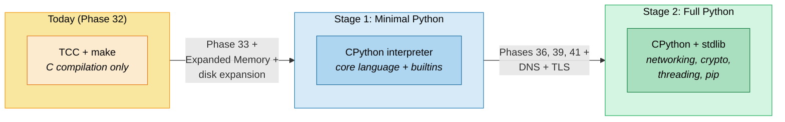
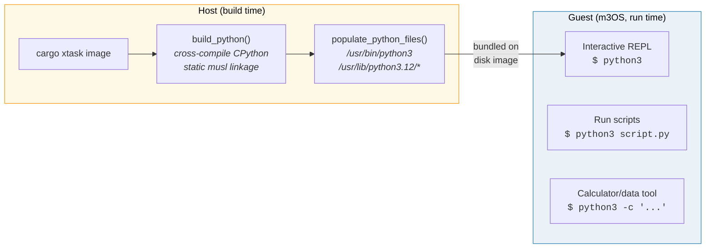
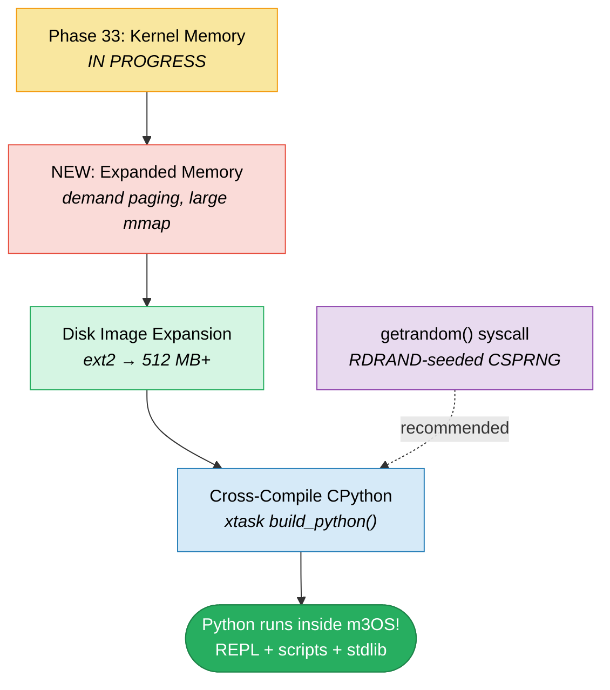
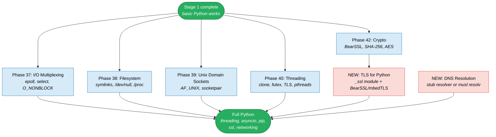

# Road to Python on m3OS

This document details the path to running CPython inside m3OS via
cross-compilation. Python is written in C and is one of the more portable
language runtimes -- it has been cross-compiled to musl/static targets many
times and has minimal hard dependencies.

## Overview



## Why Python?

Python is the most widely used scripting language and a natural target for
m3OS. Compared to Node.js or Ruby, CPython has significantly fewer hard OS
requirements:

| Property | CPython | Node.js | Ruby |
|---|---|---|---|
| Implementation language | C | C++ | C |
| Hard threading requirement | No (GIL, single-threaded ok) | Yes (libuv thread pool) | No |
| Hard epoll requirement | No (select fallback) | Yes (libuv event loop) | No |
| JIT / mmap(PROT_EXEC) | No (bytecode interpreter) | Yes (V8 JIT compiler) | No |
| Static binary size | ~5-8 MB | ~50-80 MB | ~15-20 MB |
| Stdlib disk footprint | ~30 MB (.py files) | ~25 MB (built-in modules) | ~40 MB |
| C++ runtime needed | No | Yes (V8) | No |

Python's bytecode interpreter means no JIT, no `mmap(PROT_EXEC)`, and no C++
runtime -- just a C program that reads `.py` files.

## Current State

What m3OS has today that Python can use:

- **File I/O** -- open, read, write, close, lseek, stat, fstat (all working)
- **Process management** -- fork, exec, wait, exit, getpid (all working)
- **Signals** -- sigaction, sigreturn, kill (Phase 19)
- **Pipes** -- pipe, dup2, pipe redirection (Phase 14)
- **Sockets** -- socket, bind, listen, accept, connect, send, recv (Phase 23)
- **Environment** -- getenv, setenv (working)
- **Working directory** -- getcwd, chdir (Phase 18)
- **brk/mmap** -- heap allocation (brk working, mmap partial)

What's missing:

| Missing feature | Python module affected | Severity |
|---|---|---|
| Working `munmap()` | Memory management | Critical -- Python leaks memory without it |
| Demand paging | Large allocations | Critical -- Python stdlib imports need ~50 MB |
| `select()`/`poll()` | `selectors`, `asyncio` | High -- needed for any I/O multiplexing |
| Threading | `threading`, `concurrent.futures` | Medium -- Python works single-threaded (GIL) |
| `/dev/null` | subprocess, testing | Medium -- many scripts redirect to /dev/null |
| `/dev/urandom` | `random`, `secrets`, `os.urandom()` | Medium -- needed for crypto/random |
| Symlinks | `os.symlink`, pip, venv | Medium -- virtualenvs rely on symlinks |
| DNS resolution | `socket.getaddrinfo()` | Low for Stage 1 -- needed for networking |
| TLS/SSL | `ssl`, `urllib`, `pip` | Low for Stage 1 -- needed for pip/https |

---

# Stage 1: Minimal Python Interpreter

The goal: cross-compile CPython on the host with musl, bundle it on the disk
image, and run Python scripts inside m3OS. No networking modules, no threading,
no pip -- just the core language.

## What Stage 1 Gives Us

```bash
# Interactive Python REPL
$ python3
>>> print("hello from m3OS!")
hello from m3OS!
>>> import sys
>>> sys.platform
'linux'
>>> [x**2 for x in range(10)]
[0, 1, 4, 9, 16, 25, 36, 49, 64, 81]

# Run scripts
$ python3 /usr/src/fibonacci.py
0, 1, 1, 2, 3, 5, 8, 13, 21, 34

# File I/O
$ python3 -c "open('/tmp/test.txt', 'w').write('hello\n')"
$ cat /tmp/test.txt
hello

# Use as a calculator / data processing tool
$ python3 -c "import json; print(json.dumps({'os': 'm3OS', 'phase': 33}))"
{"os": "m3OS", "phase": 33}
```

**Available stdlib modules (no OS dependencies):**
`json`, `re`, `math`, `collections`, `itertools`, `functools`, `dataclasses`,
`pathlib`, `textwrap`, `string`, `datetime` (without timezone DB),
`argparse`, `configparser`, `csv`, `io`, `os`, `os.path`, `sys`, `struct`,
`base64`, `hashlib` (built-in fallback), `copy`, `pprint`, `enum`, `typing`

**Unavailable modules (need OS features not yet present):**
`threading`, `multiprocessing`, `asyncio`, `ssl`, `urllib`, `http`,
`socket` (partially -- raw sockets work but no DNS), `subprocess` (partially
-- fork/exec work but no `/dev/null`), `venv`, `pip`

## Host-Side Cross-Compilation

### Building CPython

```bash
# Clone CPython
git clone --depth 1 --branch v3.12.0 https://github.com/python/cpython.git
cd cpython

# Step 1: Build a host Python (needed for cross-compilation)
mkdir build-host && cd build-host
../configure && make -j$(nproc)
cd ..

# Step 2: Cross-compile for musl static
mkdir build-target && cd build-target
CC=x86_64-linux-musl-gcc \
CXX=x86_64-linux-musl-g++ \
LDFLAGS="-static" \
../configure \
  --host=x86_64-linux-musl \
  --build=$(gcc -dumpmachine) \
  --prefix=/usr \
  --disable-shared \
  --disable-ipv6 \
  --without-ensurepip \
  --without-pymalloc \
  --with-build-python=../build-host/python \
  ac_cv_file__dev_ptmx=no \
  ac_cv_file__dev_ptc=no

make -j$(nproc)
strip python
```

Key decisions:
- **`--disable-shared`** -- fully static binary, no libpython.so
- **`--without-pymalloc`** -- use system malloc (simpler mmap requirements)
- **`--disable-ipv6`** -- m3OS only has IPv4
- **`--without-ensurepip`** -- pip needs networking, deferred to Stage 2
- **Static musl linkage** -- no dynamic linker needed

### Expected Sizes

| Component | Approximate size |
|---|---|
| `python3` binary | ~5-8 MB (static, stripped) |
| Python stdlib (`.py` files) | ~30 MB |
| Compiled bytecode (`.pyc`) | ~25 MB (optional, speeds up imports) |
| **Total disk footprint** | **~35-65 MB** |

### What Gets Bundled

```
/usr/
  bin/
    python3           -- CPython interpreter (~8 MB static)
  lib/
    python3.12/       -- stdlib .py files (~30 MB)
      os.py
      json/
      re/
      collections/
      ...
  src/
    fibonacci.py      -- test script
    hello.py          -- test script
```

### xtask Integration



## Kernel/OS Prerequisites for Stage 1

### Phase 33 -- Kernel Memory Improvements (in progress, assumed ready)

**Why Python needs it:** CPython's memory allocator uses `mmap()` and
`munmap()` for large allocations (arenas). Without working `munmap()`, every
Python process leaks memory. Without OOM retry, importing the stdlib panics
the kernel.

---

### NEW: Expanded Memory Phase (shared with Clang roadmap)

**Why Python needs it:** Importing Python's stdlib requires loading and
compiling dozens of `.py` files. The interpreter's working set during a
typical import reaches ~50-100 MB. Demand paging is essential -- Python
calls `mmap()` for large regions but only touches a fraction of the pages.

**Specific needs:**
- Demand paging (lazy `mmap` allocation)
- Large `mmap()` regions (64+ MB)
- QEMU RAM increase to 512 MB+

---

### Disk Image Expansion (shared with Clang roadmap)

The ext2 partition needs to grow to at least 512 MB to hold the Python
stdlib alongside TCC and other tools.

---

### `/dev/urandom` (Phase 38 or standalone)

Python's `os.urandom()` reads from `/dev/urandom` or calls `getrandom()`.
Without either, `import random` works (uses Mersenne Twister with time seed)
but `import secrets` fails. This is a prerequisite for any crypto-related
Python code.

**Minimal implementation:** A `getrandom()` syscall (318) backed by a
ChaCha20 CSPRNG seeded from RDRAND/RDSEED (available on all modern x86_64
CPUs). This is simpler than a full `/dev/urandom` device node.

---

## Stage 1 Dependency Graph



**Notably, Stage 1 Python does NOT require:**
- Threading (Phase 40) -- CPython has the GIL, works single-threaded
- epoll (Phase 37) -- Python falls back to `select()` or blocking I/O
- Symlinks (Phase 38) -- only needed for venv/pip
- C++ runtime -- CPython is pure C
- TLS/crypto -- only needed for pip/https

## Stage 1 Acceptance Criteria

```bash
# REPL works
$ python3 -c "print('hello from m3OS')"
hello from m3OS

# Math and data structures
$ python3 -c "import math; print(math.pi)"
3.141592653589793

# File I/O
$ python3 -c "
with open('/tmp/test.txt', 'w') as f:
    f.write('written by Python\n')
with open('/tmp/test.txt') as f:
    print(f.read(), end='')
"
written by Python

# JSON processing
$ python3 -c "import json; print(json.dumps({'os': 'm3OS'}, indent=2))"
{
  "os": "m3OS"
}

# Script execution
$ python3 /usr/src/fibonacci.py
0, 1, 1, 2, 3, 5, 8, 13, 21, 34

# sys.platform reports Linux (we implement the Linux ABI)
$ python3 -c "import sys; print(sys.platform)"
linux
```

---

# Stage 2: Full Python with Networking and Threading

The goal: Python with `threading`, `asyncio`, `socket` (with DNS), `ssl`,
`pip`, and `venv`. This makes Python a real development environment inside
m3OS.

## What Stage 2 Adds

| Module | Requires | Phase |
|---|---|---|
| `threading` | `clone(CLONE_THREAD)`, `futex()`, TLS | Phase 40 |
| `asyncio` | `epoll` or `select` | Phase 37 |
| `selectors` | `epoll` or `select` | Phase 37 |
| `socket` (DNS) | DNS resolver (stub or full) | New |
| `ssl` | TLS library (BearSSL or mbedTLS) | Phase 42 + new |
| `http.client` | `socket` + `ssl` | Phase 42 + new |
| `urllib` | `http.client` + `ssl` | Phase 42 + new |
| `pip` | `urllib` + `ssl` + symlinks + `/tmp` | Phase 38 + 41 + new |
| `venv` | symlinks | Phase 38 |
| `subprocess` | `/dev/null`, robust pipe handling | Phase 38 |
| `multiprocessing` | Unix domain sockets, `fork` | Phase 39 |

## Additional Prerequisites

### Phase 37 -- I/O Multiplexing

**Why:** Python's `asyncio` module uses `epoll` on Linux (with `select` as
fallback). Without `epoll`, asyncio works but performs poorly. More
importantly, any async networking (HTTP servers, concurrent downloads) needs
multiplexed I/O.

### Phase 38 -- Filesystem Enhancements

**Why:** `pip` creates virtualenvs using symlinks. `subprocess` needs
`/dev/null`. Many Python tools expect `/proc/self/fd/` for file descriptor
introspection.

### Phase 40 -- Threading Primitives

**Why:** `import threading` calls `clone(CLONE_THREAD)`. Python's GIL means
only one thread runs Python code at a time, but threads are used for:
- `concurrent.futures.ThreadPoolExecutor`
- Background I/O in `asyncio`
- `threading.Timer`
- Libraries that release the GIL during C calls

### Phase 42 + NEW: TLS Support

**Why:** `pip install` requires HTTPS. Python's `ssl` module wraps a TLS
library (usually OpenSSL). Options:

1. **BearSSL** -- ~200 KB, minimal, portable. Already recommended in Phase 42.
   Build a Python `_ssl` extension module against BearSSL.
2. **mbedTLS** -- ~500 KB, more complete. Better compatibility with Python's
   `ssl` module expectations.
3. **LibreSSL** -- OpenSSL fork, ~2 MB. Most compatible but largest.

### NEW: DNS Resolution

**Why:** `socket.getaddrinfo('api.anthropic.com', 443)` needs DNS. Options:

1. **Hardcoded `/etc/hosts`** -- simplest, no network needed
2. **Stub resolver** -- send UDP DNS queries to a configured nameserver
   (e.g., the QEMU gateway at 10.0.2.3)
3. **musl's built-in resolver** -- if musl is linked with `resolv.conf`
   support, DNS works via musl's internal resolver

## Stage 2 Dependency Graph



## Effort Summary

```mermaid
gantt
    title Road to Python on m3OS
    dateFormat X
    axisFormat %s

    section Stage 1
    Phase 33 - Kernel Memory (in progress)     :active, p33, 0, 1
    NEW - Expanded Memory                      :crit, em, after p33, 1
    Disk Image Expansion (xtask)               :di, after em, 1
    Cross-Compile CPython (xtask)              :cc, after di, 1

    section Stage 2
    Phase 37 - I/O Multiplexing                :p36, after cc, 1
    Phase 38 - Filesystem Enhancements         :p37, after cc, 1
    Phase 39 - Unix Domain Sockets             :p38, after p37, 1
    Phase 40 - Threading Primitives            :p39, after cc, 1
    Phase 42 - Crypto Primitives               :p41, after cc, 1
    NEW - TLS for Python                       :crit, tls, after p41, 1
    NEW - DNS Resolution                       :crit, dns, after tls, 1
```



| Stage | Phases Required | Complexity |
|---|---|---|
| **Stage 1: Minimal Python** | Phase 33, Expanded Memory, disk expansion | Moderate |
| **Stage 2: Full Python** | Phases 36-39, 41, TLS, DNS | High |

**Stage 1 is the easiest runtime to port** -- CPython is pure C, works
single-threaded, no JIT, no C++ runtime. It shares prerequisites with the
Clang roadmap (Phase 33 + Expanded Memory + disk expansion).

## What We Explicitly Do Not Need

- **tkinter/Tcl** -- no GUI toolkit needed
- **IDLE** -- no GUI IDE needed
- **readline** -- nice to have for REPL but Python works without it
- **curses** -- would need terminfo database; deferred
- **ctypes/cffi** -- needs `dlopen()`; deferred until dynamic linking
- **distutils/setuptools** -- deprecated; pip handles this
- **NumPy/SciPy** -- C/Fortran extensions; requires a full compiler toolchain
