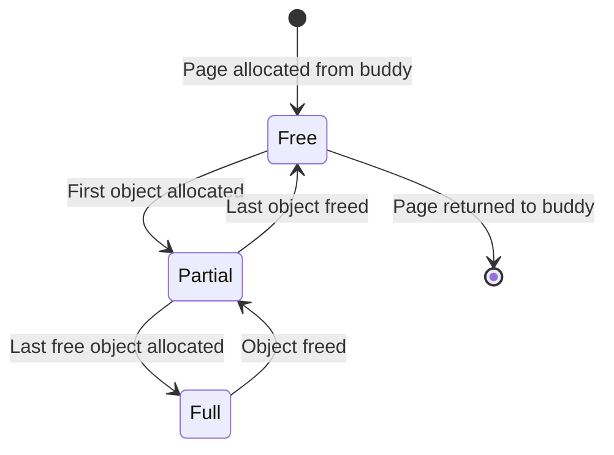
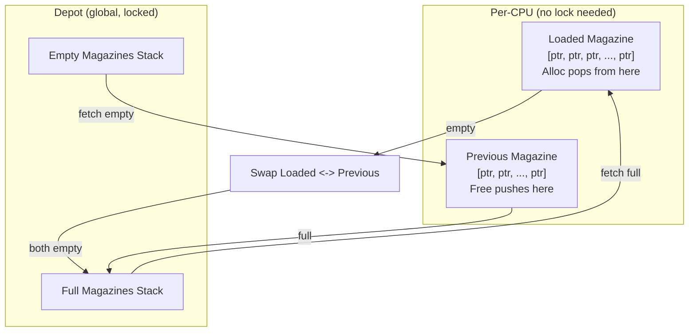
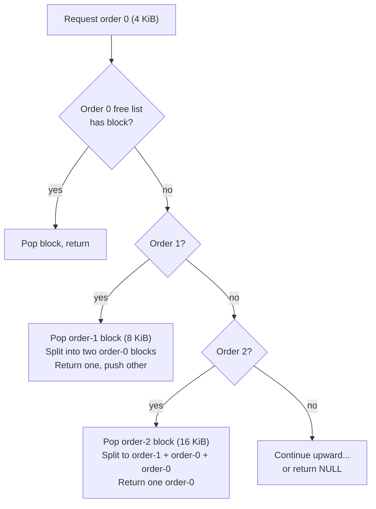
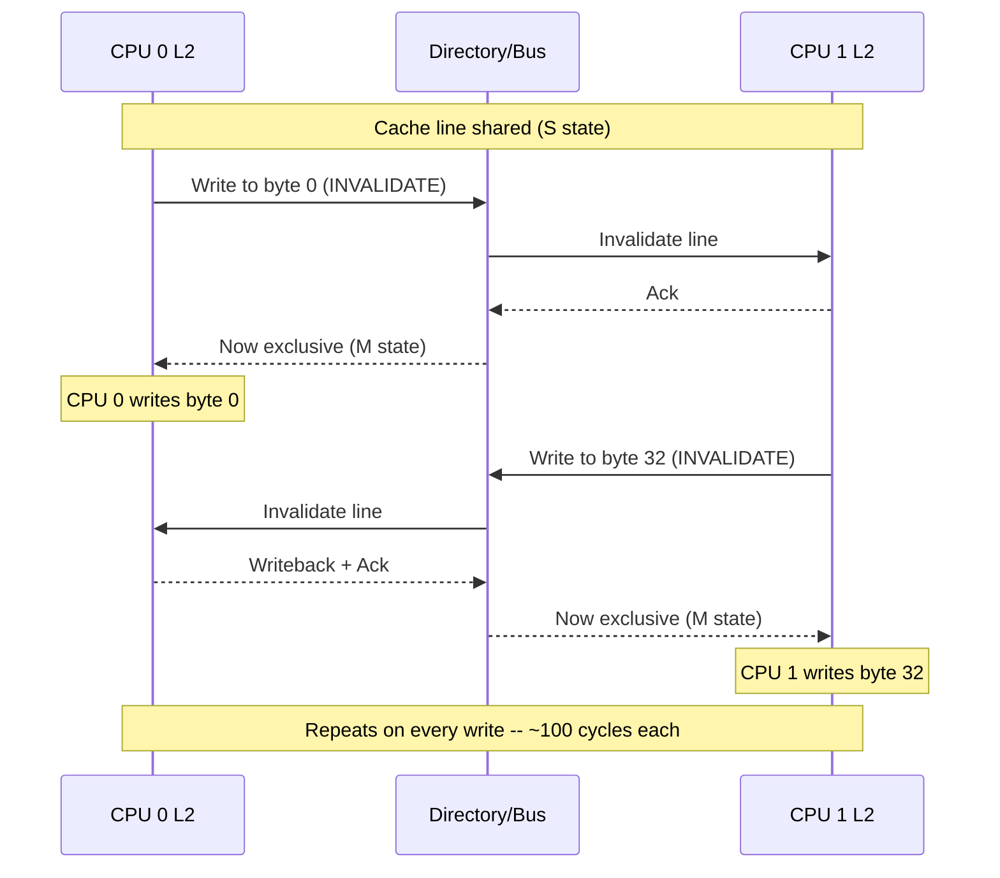
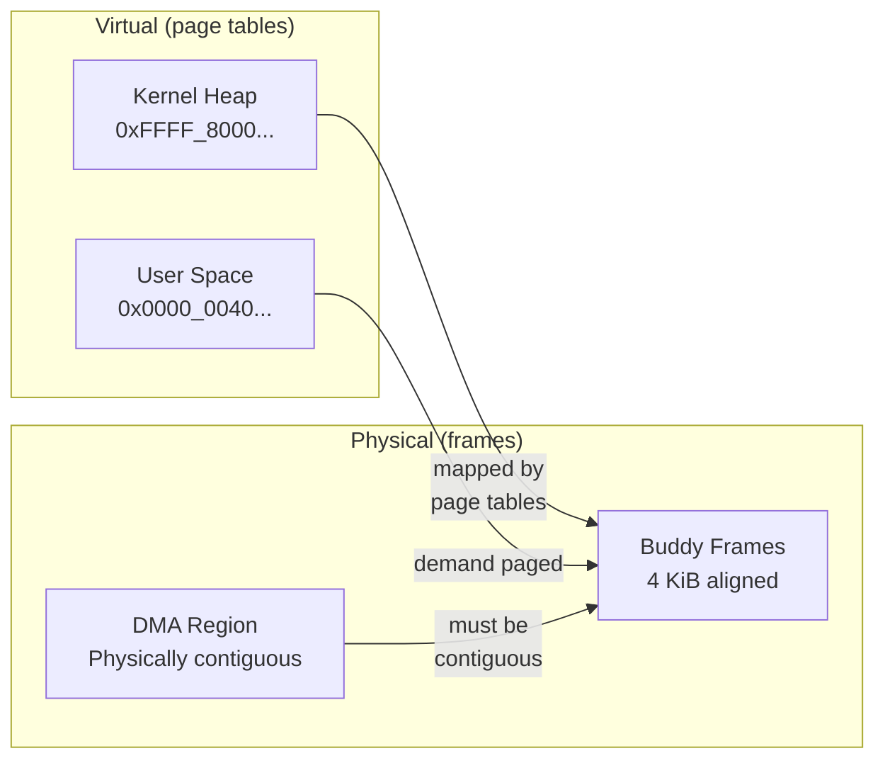
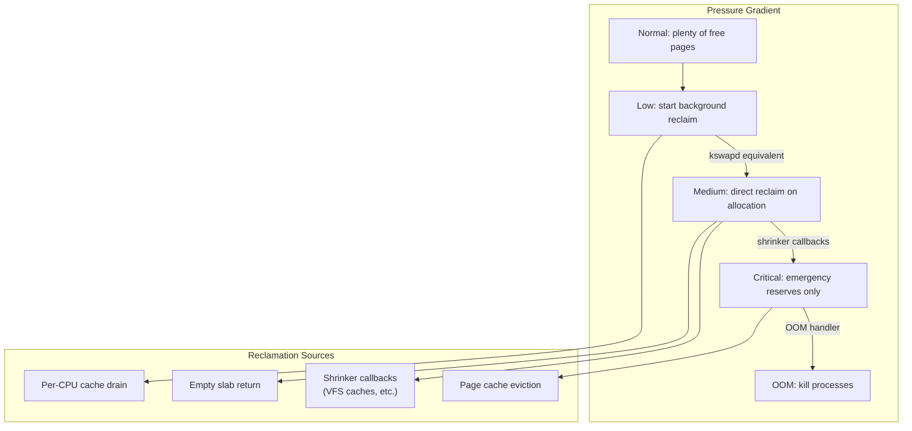
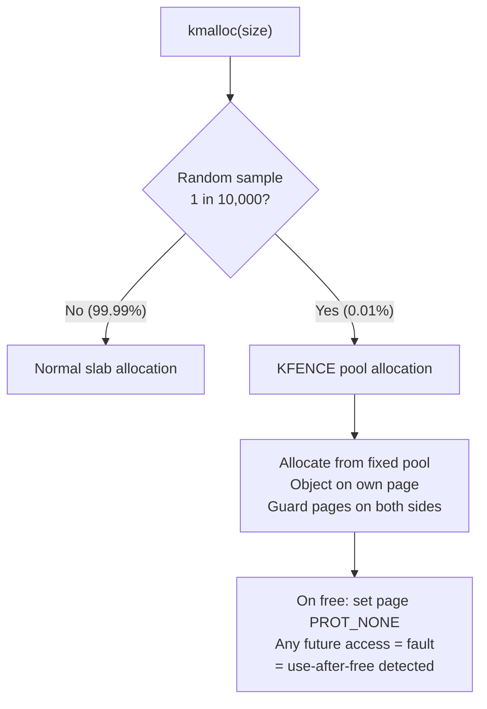
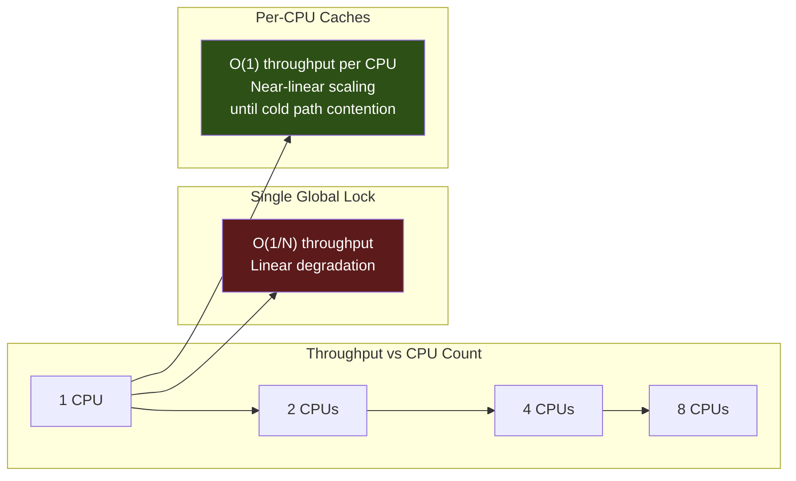

# Memory Allocator Theory and Design Patterns

**Status:** Draft
**Branch:** `research/memory-allocator`
**Scope:** Foundational theory, SMP concurrency, memory system integration, debugging, design decision framework

---

## Table of Contents

1. [Core Allocator Theory](#1-core-allocator-theory)
2. [SMP and Concurrency](#2-smp-and-concurrency)
3. [Memory System Integration](#3-memory-system-integration)
4. [Debugging and Diagnostics](#4-debugging-and-diagnostics)
5. [Design Decision Framework](#5-design-decision-framework)

---

## 1. Core Allocator Theory

### 1.1 Slab Allocator (Bonwick, 1994)

The slab allocator solved two problems that plagued general-purpose allocators for kernel objects:

**Object caching vs memory caching:** The most expensive part of object allocation isn't memory allocation -- it's object construction. Initializing locks, setting up vtables, linking into subsystem lists. The slab allocator caches fully constructed objects, so repeated alloc/free cycles skip initialization.

**Cache coloring:** Objects of the same type tend to hash to the same cache sets (same offset within a page, same low address bits). When multiple objects are accessed in sequence, they thrash the same cache lines. Slab coloring rotates the starting offset across slabs:

```
Slab 0: [color=0]  obj@0   obj@64  obj@128 ...
Slab 1: [color=16] obj@16  obj@80  obj@144 ...
Slab 2: [color=32] obj@32  obj@96  obj@160 ...
```

This distributes objects across cache sets, reducing conflict misses. Modern set-associative caches make this less critical but not irrelevant.

**Slab state machine:**



Allocation order: partial slabs first (fill existing pages), then free slabs, then request new pages. This minimizes page consumption and maximizes cache-line reuse.

**Bufctl management variants:**

| Variant | Metadata Location | Pros | Cons | Used By |
|---------|------------------|------|------|---------|
| Embedded freelist | Inside free objects | Zero overhead, O(1) alloc/free | Overwrites object on free | Linux SLUB |
| Bitmap | Separate bitmap per slab | Objects untouched on free | O(bits) scan for alloc | m3OS, Theseus |
| External array | Separate index array | Clean separation | Memory overhead | Original SLAB |
| Index-linked list | Indices in slab header | Objects untouched, O(1) | Header space | FreeBSD UMA |

### 1.2 Magazine Layer (Bonwick & Adams, 2001)

Added per-CPU caching to the slab allocator. The core abstraction is a "magazine" -- a fixed-capacity array of object pointers, like a firearm magazine.



**Allocation:**
1. Pop from loaded magazine (O(1), no sync)
2. If empty: swap loaded and previous
3. If both empty: exchange empty loaded for full from depot (1 lock acquisition)

**Deallocation:**
1. Push to previous magazine (O(1), no sync)
2. If full: swap loaded and previous
3. If both full: exchange full previous for empty from depot (1 lock acquisition)

**Amortized lock cost:** With magazine capacity M, the depot lock is acquired once per M allocations/frees. For M=32, this is a 32x reduction in lock contention.

**Influence on later systems:**

| System | Magazine Variant |
|--------|-----------------|
| Solaris slab | Original magazines |
| FreeBSD UMA | Buckets (alloc + free + cross) |
| jemalloc | tcache (per-thread bins) |
| Linux SLUB | Per-CPU freelist (single list, CAS) |

### 1.3 Buddy System Theory

The binary buddy system (Knuth, 1968) manages power-of-2 blocks via a simple XOR property: the buddy of block at address A of order N is at address `A ^ (1 << N)`.

**Allocation:** Find smallest available order >= requested. Pop block, split downward, push remainders.



**Deallocation:** Free block, check if buddy is also free (bitmap lookup = O(1)). If so, remove buddy from free list, merge, repeat at next order.

**Fragmentation bounds:** Under random allocation/free, Knuth showed expected utilization ~50% due to external fragmentation. In practice, migration-type grouping (Linux) significantly improves this by keeping movable and unmovable pages separate.

**Lazy coalescing:** Defer buddy merge on free; batch coalescing periodically. Reduces overhead for LIFO patterns. Not used in Linux or m3OS but worth considering for per-CPU page caches.

**Buddy variants:**

| Variant | Block Sizes | Merge | Use Case |
|---------|------------|-------|----------|
| Binary buddy | Powers of 2 | XOR | Universal (Linux, m3OS) |
| Fibonacci buddy | Fibonacci numbers | More complex | Better fit for some sizes |
| Weighted buddy | Mixed | Asymmetric split | Optimized for specific distributions |

### 1.4 Size Class Design

**Geometric spacing:** With N steps per doubling, maximum internal waste is bounded at 1/N:

| Steps/Doubling | Max Waste | Classes (32B-4KiB) | Used By |
|---------------|-----------|-------------------|---------|
| 1 (power-of-2) | 50% | 8 | Linux kmalloc (mostly) |
| 2 | 33% | 14 | Linux kmalloc (96, 192) |
| 4 | 20% | 24 | jemalloc |
| 8 | 11% | 40 | mimalloc |

**Span-tail waste:** For slab of P pages and object size S: `waste = (P * 4096) mod S`. Some classes have high waste with single-page slabs but near-zero with multi-page. Always verify.

**Recommended for m3OS:** 4 steps per doubling (13 classes, 32B-4KiB). Balances waste (<20%), metadata overhead, and coverage. See survey document for specific classes.

---

## 2. SMP and Concurrency

### 2.1 Lock-Free Allocation Techniques

**CAS-based free list (used by SLUB, mimalloc, all modern allocators):**

```
push(head, item):
    loop:
        old = atomic_load(head)
        item.next = old
        if CAS(head, old, item): return

pop(head):
    loop:
        old = atomic_load(head)
        if old == NULL: return NULL
        next = old.next
        if CAS(head, old, next): return old
```

**ABA problem:** Between thread A's load and CAS, if the head is popped and re-pushed, CAS succeeds but the list may be corrupted.

| Solution | Overhead | Complexity | Used By |
|----------|----------|-----------|---------|
| Tagged pointers (generation counter) | ~0 (x86_64 has 16 unused bits) | Low | SLUB tid |
| Hazard pointers (Michael, 2004) | Per-thread registry reads | High | Research |
| Epoch-based reclamation (Fraser, 2004) | Deferred free | Medium | FreeBSD SMR |

**Memory ordering for allocators:**

| Operation | Required Ordering | Why |
|-----------|------------------|-----|
| Magazine push/pop | None (per-CPU, preempt-off) | CPU-local, no other observer |
| Cross-CPU free list push | Release (CAS) | Ensure object writes visible to collector |
| Cross-CPU free list collect | Acquire (exchange) | Ensure we see all push effects |
| Refcount inc/dec | Acquire/Release | Ensure consistent with "count reaches 0" check |
| Statistics counters | Relaxed | Approximate is fine |

Most allocator atomics need only `Acquire`/`Release`, not `SeqCst`. m3OS currently uses `SeqCst` on all refcount operations (D-22) -- stronger than necessary.

### 2.2 Per-CPU Data Structures

| Method | Speed | Safety | Used By |
|--------|-------|--------|---------|
| APIC ID lookup | ~20 cycles | Must disable preemption | m3OS, Theseus |
| GS segment base | ~5 cycles | Must disable preemption | Linux |
| RSEQ (restartable sequences) | ~10 cycles | Restart on preemption | tcmalloc (userspace) |
| Disable interrupts | ~10 cycles | Prevents all preemption | FreeBSD (`critical_enter`) |

**m3OS-specific advantage:** No kernel preemption (cooperative scheduling). Per-CPU access via APIC ID is safe without explicit preemption disable. A core won't be rescheduled mid-allocation. This is the simplest possible per-CPU model.

**Preemption concern resolved:** Since m3OS schedules cooperatively (yield or blocking syscall), a per-CPU allocation that reads APIC ID, accesses per-CPU data, and updates it will always complete atomically with respect to scheduling. No CAS, no interrupt disable, no RSEQ needed.

### 2.3 False Sharing

When two CPUs write to different variables on the same cache line, the cache coherence protocol bounces the line between cores ("ping-pong"):



**Prevention:** Pad per-CPU structures to cache line boundaries:

```rust
#[repr(align(64))]
struct PerCpuAllocator {
    magazine: [*mut u8; 32],  // fits in one cache line
    count: u16,
    // ... padding to 64 bytes
}
```

**m3OS concern:** The global `ALLOC_COUNT` and `DEALLOC_COUNT` atomics in `heap.rs` are adjacent and written by all CPUs -- a false sharing candidate. These should be per-CPU counters aggregated on read.

### 2.4 Interrupt-Safe Allocation

**The deadlock scenario:**
1. Core holds frame allocator lock
2. Interrupt fires on same core
3. Interrupt handler calls `allocate_frame()`
4. Tries to acquire same lock -> DEADLOCK

**Solutions ranked for m3OS:**

| Solution | Interrupt Latency | Complexity | Recommendation |
|----------|------------------|-----------|----------------|
| Disable interrupts during per-CPU cache access | +10-20 cycles | Low | **Recommended** |
| GFP-like flags (fail-fast in atomic context) | None | Medium | For buddy access |
| Convention: no alloc in IRQ | None | Fragile | Current approach (insufficient) |
| Separate interrupt-safe pool | None | High | Overkill |

The recommended approach: disable interrupts for the ~15-instruction per-CPU magazine access (effectively free), and use a `GFP_ATOMIC`-like flag for deeper paths that might need buddy access.

---

## 3. Memory System Integration

### 3.1 Cache Coloring and Alignment

Slab coloring distributes objects across hardware cache sets by varying the starting offset within each slab page. With a direct-mapped cache, all objects at the same page offset map to the same cache set. Coloring rotates this offset:

```
Color stride = cache_line_size (64 bytes on modern x86)
Max colors = (page_size - slab_header - objects * object_size) / stride

Slab N: first object at offset (N % max_colors) * stride
```

Modern set-associative caches (8-16 way) make coloring less critical but not irrelevant for pathological access patterns. **Recommendation for m3OS:** implement coloring as a low-cost enhancement in Phase 5.

### 3.2 TLB and Hugepage Considerations

Each 4 KiB page requires a TLB entry. The TLB has limited capacity (typically 512-1536 entries for 4K pages, 32-64 for 2M pages). TLB misses cost ~10-100 cycles depending on page table depth.

**Allocator impact:** If slab objects are spread across many pages, accessing them causes TLB misses. Concentrating objects into fewer pages improves TLB hit rate. The "allocate from partial slab first" policy naturally achieves this.

**Hugepage-backed slabs:** m3OS buddy order 9 = 2 MiB = one x86_64 huge page. A slab allocator that allocates slab pages from within the same 2 MiB buddy block could use a single 2M TLB entry for all objects in that block. tcmalloc's hugepage-aware backend achieves >90% hugepage coverage this way.

### 3.3 Virtual vs Physical Memory

Kernel allocators bridge two domains:



**When physical contiguity matters:**
- DMA buffers (VirtIO, network cards) -- device has no MMU
- Large page mappings (2 MiB, 1 GiB)
- Hardware-defined structures (page tables, ACPI tables)

**When virtual contiguity suffices:**
- Kernel heap objects (accessed only through page tables)
- Process page tables (kernel can map any physical page anywhere)

m3OS should distinguish these paths: `alloc_frame()` for single physical pages, `alloc_contiguous(order)` for DMA, and the slab/heap for virtual-only objects.

### 3.4 Memory Pressure and Reclamation



**Shrinker interface (Linux model):**
```rust
trait Shrinker {
    fn count_objects(&self) -> usize;  // How many can you free?
    fn scan_objects(&self, nr: usize) -> usize;  // Free up to nr, return freed count
}
```

Kernel subsystems with reclaimable caches (VFS dentries, inode cache, network buffers) register shrinkers. Under pressure, the allocator calls them to free memory. m3OS currently has no shrinker system.

**OOM strategies:**

| Strategy | Latency | Fairness | Used By |
|----------|---------|----------|---------|
| Fail fast (return NULL) | None | Caller decides | `GFP_NOWAIT` |
| Retry with reclaim | Unbounded | System-wide | `GFP_KERNEL` |
| Kill worst offender | Process death | RSS-based scoring | Linux OOM killer |
| Panic | Fatal | None | Simple kernels |

---

## 4. Debugging and Diagnostics

### 4.1 Red Zones and Guard Pages

**Red zones:** Sentinel bytes before and after each allocated object. Verified on free. Detects buffer overflows and underflows.

```
┌──────────┬───────────────────┬──────────┐
│ Red zone │  Object (usable)  │ Red zone │
│ 0xBBBBBB │                   │ 0xBBBBBB │
│ 16 bytes │                   │ 16 bytes │
└──────────┴───────────────────┴──────────┘
            Verified on free:
            if red_zone != 0xBB: CORRUPTION DETECTED
```

**Guard pages (KFENCE model):** Allocate object on its own page, bounded by unmapped guard pages. Any overflow immediately faults. Very expensive per-object but effective when sampled.

| Technique | Memory Cost | CPU Cost | Detection Quality |
|-----------|-----------|---------|------------------|
| Red zones | 16-32 B per object | ~5% (verify on free) | Detects at free time only |
| Guard pages | 2 pages per object | ~0 (hardware-enforced) | Immediate fault on overflow |
| KFENCE sampling | 128-256 KiB fixed pool | <1% | Statistical (1-in-10K) |

### 4.2 Poison Patterns

Fill allocated/freed memory with known patterns to detect misuse:

| Event | Pattern | Detects |
|-------|---------|---------|
| Alloc (before return) | `0x5A` (POISON_INUSE) | Uninitialized read |
| Free (after return) | `0x6B` (POISON_FREE) | Use-after-free |
| Free (last byte) | `0xA5` (POISON_END) | Overwrite past end |

**Cost:** ~1 microsecond per 4 KiB page for memset. Acceptable for debug builds, too expensive for production. m3OS already does unconditional zeroing on frame free (D-11) -- this could be repurposed as poison fill in debug mode.

### 4.3 Freelist Pointer Hardening

Store obfuscated freelist pointers: `stored = real_FP ^ cache_random ^ &object`. Near-zero overhead (two XOR instructions). Defeats heap corruption attacks that overwrite freelist pointers. SLUB uses this by default (`CONFIG_SLAB_FREELIST_HARDENED`).

### 4.4 KFENCE-Style Statistical Sampling

Intercept 1-in-N allocations (default N=10,000), redirect to a dedicated guard-page pool:



**Cost:** Fixed pool of 128-256 KiB. <1% CPU overhead. Detects overflows and use-after-free in production. **Recommended for m3OS** as a Phase 5 enhancement.

---

## 5. Design Decision Framework

### 5.1 Fragmentation Metrics

**External fragmentation:** Free memory exists but cannot satisfy a request due to non-contiguous layout.

```
Metric: largest_free_block / total_free_memory
  1.0 = no external fragmentation (all free memory is contiguous)
  0.0 = maximally fragmented (free memory in tiny scattered pieces)
```

For buddy allocators, monitor the order distribution: if most free pages are at order 0 but order-4 allocations fail, external fragmentation is high.

**Internal fragmentation:** Memory wasted within an allocation due to size-class rounding.

```
Metric: sum(allocated_size - requested_size) / sum(allocated_size)
  0.0 = no waste (every byte used)
  0.5 = 50% waste (power-of-2 worst case)
```

### 5.2 Allocation Pattern Workloads

| Pattern | Description | Best Allocator | Worst Allocator |
|---------|------------|---------------|-----------------|
| LIFO | Stack-like: alloc, alloc, free, free | Any (fast path) | None |
| FIFO | Queue-like: alloc, ..., free oldest | Magazine/slab (reuse) | Linked-list (fragmentation) |
| Random lifetime | Alloc, random delay, free | Slab with size classes | First-fit linked-list |
| Bulk alloc/free | Alloc N, use all, free N | Magazine (batch) | Per-object lock |
| Producer-consumer | CPU A allocs, CPU B frees | Cross-CPU free list | Global lock |

### 5.3 Scaling Characteristics



**Bottleneck progression as core count increases:**
1. **1-2 cores:** Global lock is fine. Per-CPU overhead may not be justified.
2. **4 cores:** Global lock contention becomes measurable. Per-CPU caches provide 3-4x improvement.
3. **8+ cores:** Global lock is the dominant bottleneck. Per-CPU caches essential.
4. **16+ cores:** Per-CPU cold path (depot/slab lock) may become a bottleneck. Per-size-class locks help.
5. **64+ cores:** NUMA effects dominate. Per-domain caching essential.

**m3OS target: 1-8 cores.** Per-CPU caches are the sweet spot -- high benefit, manageable complexity. NUMA support is forward-looking but not critical.

---

## References

- Bonwick, J. (1994). "The Slab Allocator: An Object-Caching Kernel Memory Allocator." USENIX Summer.
- Bonwick, J. and Adams, J. (2001). "Magazines and Vmem: Extending the Slab Allocator." USENIX Annual.
- Knuth, D. (1997). "The Art of Computer Programming, Vol. 1: Fundamental Algorithms." (Buddy system analysis)
- Michael, M.M. (2004). "Hazard Pointers: Safe Memory Reclamation for Lock-Free Objects." IEEE TPDS.
- Fraser, K. (2004). "Practical Lock-Freedom." PhD Thesis, Cambridge.
- Leijen, D. et al. (2019). "Mimalloc: Free List Sharding in Action." ISMM.
- Evans, J. (2006). "A Scalable Concurrent malloc(3) Implementation for FreeBSD." BSDCan.
- Berger, E. et al. (2000). "Hoard: A Scalable Memory Allocator for Multithreaded Applications." ASPLOS.
- Wilson, P. et al. (1995). "Dynamic Storage Allocation: A Survey and Critical Review." IWMM.
- Marco Elver, Alexander Potapenko. (2020). "KFENCE: A Low-Overhead Sampling-Based Memory Safety Error Detector." Linux Kernel.
