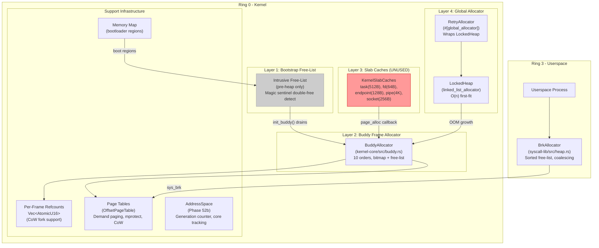
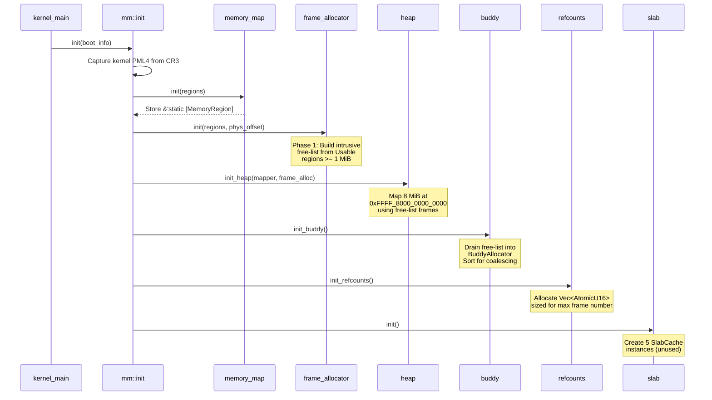
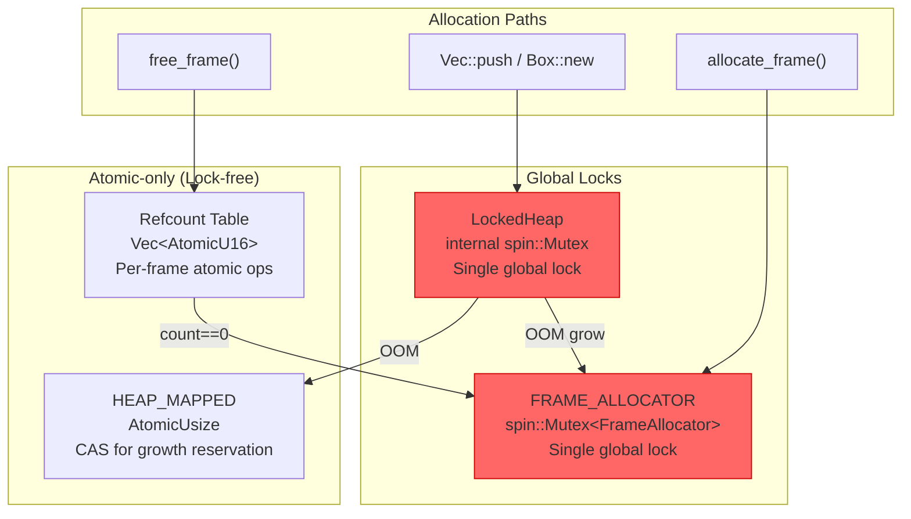
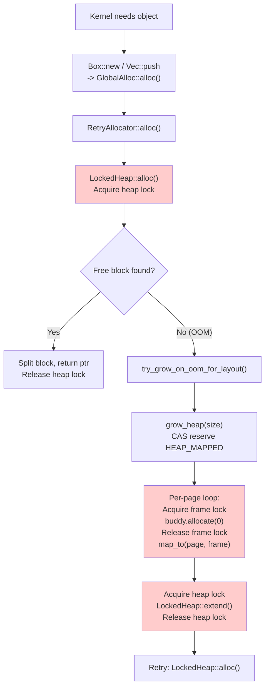
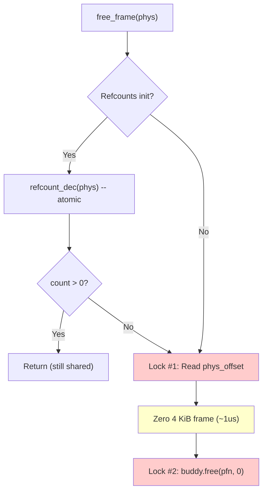
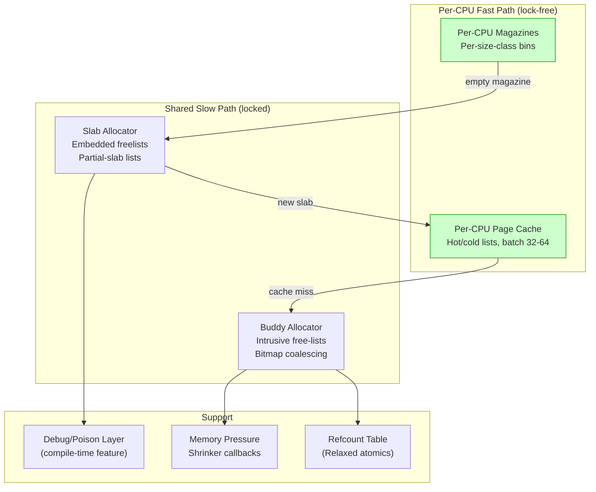

# m3OS Memory Allocator Analysis

**Status:** Draft
**Branch:** `research/memory-allocator`
**Scope:** Current state, architectural deficiencies, design constraints, improvement roadmap

---

## Table of Contents

1. [Executive Summary](#1-executive-summary)
2. [Current Architecture](#2-current-architecture)
3. [Allocator Layer Details](#3-allocator-layer-details)
4. [SMP Safety Analysis](#4-smp-safety-analysis)
5. [Allocation Path Analysis](#5-allocation-path-analysis)
6. [Deficiency Catalog](#6-deficiency-catalog)
7. [Constraint Inventory](#7-constraint-inventory)
8. [Design Recommendations](#8-design-recommendations)
9. [Migration Strategy](#9-migration-strategy)

---

## 1. Executive Summary

m3OS has a four-layer memory subsystem: bootstrap free-list, buddy frame allocator, linked-list heap, and slab caches. The design is correct for single-core workloads but has fundamental scalability limitations under SMP. Every allocation path funnels through a single global `spin::Mutex`, creating serialization points that will bottleneck as core count or allocation rate increases.

The slab caches are defined but unused. The heap allocator (`linked_list_allocator::LockedHeap`) is a general-purpose linked-list allocator with O(n) allocation in the worst case. There are no per-CPU structures, no lock-free fast paths, no allocation-context awareness (interrupt vs. sleepable), and no memory debugging infrastructure beyond basic assertions.

### Key Numbers (Current)

| Metric | Value |
|--------|-------|
| Heap start | `0xFFFF_8000_0000_0000` |
| Heap initial size | 8 MiB |
| Heap max size | 64 MiB |
| Buddy orders | 0..=9 (4 KiB to 2 MiB) |
| Slab caches defined | 5 (task/fd/endpoint/pipe/socket) |
| Slab caches in use | 0 |
| Per-CPU allocator structures | None |
| Lock-free allocation paths | None (refcounts only) |
| Frame zeroing on free | Yes (unconditional) |

---

## 2. Current Architecture



### Initialization Sequence



---

## 3. Allocator Layer Details

### 3.1 Bootstrap Free-List (`kernel/src/mm/frame_allocator.rs`)

**Purpose:** Provides frame allocation before the heap exists (chicken-and-egg: buddy needs `Vec`, heap needs frames).

**Data structures:**
- Intrusive singly-linked list stored in the frame data itself
- Each free frame: `[next_ptr: u64, magic: u64, ...]` at bytes 0..16
- `FREE_MAGIC = 0xDEAD_F4EE_F4EE_DEAD` for double-free detection

**Operations:** `push_frame(phys)`: O(1). `pop_frame()`: O(1).

**Lifetime:** Active only during early boot. Drained into buddy allocator by `init_buddy()`.

### 3.2 Buddy Frame Allocator (`kernel-core/src/buddy.rs`)

**Purpose:** Physical page frame management with O(log n) alloc/free and buddy coalescing.

**Data structures:**
```
BuddyAllocator {
    free_lists: [Vec<usize>; 10]     // Per-order free PFN stacks
    bitmaps:    [Vec<u64>; 10]       // Per-order free-bit bitmaps
    free_counts: [usize; 10]         // Per-order free block counts
    total_pages: usize               // Total managed PFNs
}
```

**Critical flaw -- `remove_free` is O(n):**
```rust
fn remove_free(&mut self, order: usize, pfn: usize) {
    if let Some(pos) = self.free_lists[order].iter().position(|&p| p == pfn) {
        self.free_lists[order].swap_remove(pos);  // O(n) scan
    }
}
```
This linear scan defeats the O(log n) guarantee during coalescing.

**Synchronization:** None internal. All external via `LockedFrameAllocator(Mutex<FrameAllocator>)`.

### 3.3 Kernel Heap (`kernel/src/mm/heap.rs`)

**Architecture:** `RetryAllocator` wraps `LockedHeap` (linked_list_allocator crate). On OOM, grows heap by mapping buddy frames with escalating sizes: `[layout-proportional, 1 MiB, 2 MiB, 4 MiB]`. Uses atomic CAS on `HEAP_MAPPED` for SMP-safe growth.

**Critical characteristics:**
- Allocation complexity: O(n) in number of free blocks (first-fit linked-list scan)
- Fragmentation: External fragmentation accumulates; no compaction
- Heap never shrinks: Memory mapped into heap is never returned to buddy

### 3.4 Slab Caches (`kernel-core/src/slab.rs` + `kernel/src/mm/slab.rs`)

**Current state: INFRASTRUCTURE ONLY -- NOT INTEGRATED**

| Cache | Object Size | Slots/Slab | Intended Use |
|-------|------------|------------|--------------|
| `task_cache` | 512 B | 8 | Task control blocks |
| `fd_cache` | 64 B | 64 | File descriptors |
| `endpoint_cache` | 128 B | 32 | IPC endpoints |
| `pipe_cache` | 4096 B | 1 | Pipe buffers |
| `socket_cache` | 256 B | 16 | Socket structures |

**Issues:** `allocate()` and `free()` are O(slabs) linear scans. No per-CPU caching layer. Single `Mutex` per cache. Slab pages are never returned to buddy.

### 3.5 Per-Frame Refcounts

`Vec<AtomicU16>` indexed by PFN. Atomic, lock-free operations for CoW fork. Uses `SeqCst` ordering (stronger than necessary -- `Acquire`/`Release` would suffice).

---

## 4. SMP Safety Analysis

### 4.1 Lock Topology



### 4.2 Key Issues

**All frame allocation serializes through one lock.** Every `allocate_frame()` and `free_frame()` acquires `FRAME_ALLOCATOR.0.lock()`. On N cores, all serialize.

**`free_frame` acquires the frame allocator lock twice:** Once to read `phys_offset` (a constant), once to call `free_to_pool()`.

**No interrupt-safety guarantees.** `spin::Mutex` disables nothing. If an interrupt fires while the frame allocator lock is held and the handler allocates, deadlock. Currently mitigated by convention ("no allocation in interrupt handlers") -- not enforced.

**No kernel preemption** (cooperative scheduling). This simplifies per-CPU design: no need for preemption-disable guards.

---

## 5. Allocation Path Analysis

### 5.1 Kernel Object Allocation (Hot Path)



### 5.2 Frame Free (Double Lock)



---

## 6. Deficiency Catalog

### Critical (Functional Correctness)

| ID | Deficiency | Location |
|----|-----------|----------|
| D-01 | No interrupt-safe allocation path -- deadlock risk | `frame_allocator.rs:276` |
| D-02 | `free_frame` acquires frame lock twice unnecessarily | `frame_allocator.rs:304-325` |
| D-03 | `remove_free` is O(n) in buddy -- coalescing degrades | `buddy.rs:231` |

### Scalability (SMP)

| ID | Deficiency | Location |
|----|-----------|----------|
| D-04 | Single global frame allocator lock | `frame_allocator.rs:226` |
| D-05 | Single global heap lock | `heap.rs:54-57` |
| D-06 | No per-CPU page cache | (missing) |
| D-07 | No per-CPU slab/object cache | (missing) |
| D-08 | Slab caches not integrated -- objects go through O(n) heap | `mm/slab.rs` |

### Efficiency

| ID | Deficiency | Location |
|----|-----------|----------|
| D-09 | Heap uses O(n) first-fit linked-list | `linked_list_allocator` crate |
| D-10 | Heap never returns memory to buddy | `heap.rs` |
| D-11 | Unconditional frame zeroing on free (~1us per frame) | `frame_allocator.rs:320-323` |
| D-12 | `phys_offset` read requires lock (it's a constant) | `frame_allocator.rs:319` |
| D-13 | No size-class-based allocation | `linked_list_allocator` |
| D-14 | Slab `free()` is O(slabs) linear scan | `slab.rs:151-167` |
| D-15 | Slab `allocate()` is O(slabs) linear scan | `slab.rs:129-145` |
| D-16 | Buddy free-list uses `Vec` (heap dependency) | `buddy.rs:29-30` |

### Missing Features

| ID | Deficiency | Location |
|----|-----------|----------|
| D-17 | No memory debugging infrastructure | (missing) |
| D-18 | No allocation-context tracking (no GFP equivalent) | (missing) |
| D-19 | No memory pressure callbacks (no shrinker interface) | (missing) |
| D-20 | No fragmentation metrics | (missing) |
| D-21 | No DMA-aware allocation | (missing) |
| D-22 | SeqCst ordering on refcounts (Acquire/Release suffices) | `frame_allocator.rs:436,454` |
| D-23 | No NUMA awareness | (design) |
| D-24 | No constructor/destructor caching in slabs | `slab.rs` |

### Architectural

| ID | Deficiency | Location |
|----|-----------|----------|
| D-25 | Heap allocator is an external crate (can't customize) | `linked_list_allocator` dep |
| D-26 | No separation of page vs object allocator APIs | (design) |
| D-27 | Buddy stores free-lists in `Vec` (should be intrusive) | `buddy.rs` |

---

## 7. Constraint Inventory

### Hard Constraints

| Constraint | Rationale |
|-----------|-----------|
| `no_std` throughout kernel | Cannot use `std` collections or OS primitives |
| Edition 2024 -- explicit `unsafe {}` blocks | All unsafe in unsafe fns must be wrapped |
| `#[global_allocator]` required for `alloc` crate | Must implement `GlobalAlloc` trait |
| No FPU/SIMD in kernel (`-mmx,-sse`) | No SIMD-optimized memset |
| Frame allocator must work before heap | Heap init maps pages from frame allocator |
| No kernel preemption (cooperative) | Simplifies per-CPU data access |
| Per-CPU data via APIC ID / GS segment | `smp::per_core()` returns per-core struct |

### Workload Characteristics

| Characteristic | Implication |
|---------------|-------------|
| Small core count (1-8) | Per-CPU caches effective; NUMA not critical |
| Mixed sizes (64B FDs to 4K pipes) | Size classes needed |
| Fork-heavy (shell, services) | Burst frame allocation; CoW refcounting |
| Long-running daemons | Fragmentation matters over time |
| VirtIO DMA | Need physically contiguous allocation |

---

## 8. Design Recommendations

### 8.1 Recommended Architecture



### 8.2 Implementation Priorities

**Phase 1: Foundation fixes (no architecture change)**
1. Fix `free_frame` double-lock (D-02) -- cache `phys_offset` in a static
2. Fix `remove_free` O(n) (D-03) -- use intrusive doubly-linked list in buddy
3. Fix SeqCst refcount ordering (D-22) -- use Acquire/Release
4. Integrate slab caches for actual kernel objects (D-08)

**Phase 2: Per-CPU page cache**
1. Per-CPU page list (hot pages, batch size ~64)
2. `allocate_frame()` checks per-CPU list first (no lock)
3. Batch refill from buddy when empty; batch drain on high watermark

**Phase 3: Slab redesign with per-CPU magazines**
1. Embedded-freelist slab (like SLUB)
2. Per-CPU magazine layer (2 magazines per CPU per cache)
3. Partial-slab list replaces linear scan

**Phase 4: Replace heap allocator**
1. Size-class allocator backed by slab caches
2. Replace `linked_list_allocator` with custom `GlobalAlloc`
3. Large allocations (>PAGE_SIZE) go directly to buddy

**Phase 5: Enhancements**
1. Memory debugging (red zones, poisoning -- behind feature flag)
2. Memory pressure callbacks (shrinker interface)
3. Allocation-context awareness (GFP-like flags)

### 8.3 Size Class Recommendation

| # | Size | Objects/Page | Waste |
|---|------|-------------|-------|
| 0 | 32 B | 128 | 0% |
| 1 | 48 B | 85 | 0.4% |
| 2 | 64 B | 64 | 0% |
| 3 | 96 B | 42 | 1.6% |
| 4 | 128 B | 32 | 0% |
| 5 | 192 B | 21 | 1.6% |
| 6 | 256 B | 16 | 0% |
| 7 | 384 B | 10 | 6.3% |
| 8 | 512 B | 8 | 0% |
| 9 | 768 B | 5 | 6.3% |
| 10 | 1024 B | 4 | 0% |
| 11 | 2048 B | 2 | 0% |
| 12 | 4096 B | 1 | 0% |

---

## 9. Migration Strategy

### Backwards Compatibility

The new allocator must maintain: `#[global_allocator]` via `GlobalAlloc` trait, `allocate_frame()` / `free_frame()` public API, `allocate_contiguous(order)` API, per-frame refcount semantics, and the boot sequence.

### Lock Acquisition Count per Operation

| Operation | Current | Target |
|-----------|---------|--------|
| `Box::new(small)` | 1 heap lock | 0 (per-CPU magazine pop) |
| `Box::new(small)` + OOM | N frame + 3 heap | 1 buddy (batch) + 1 slab |
| `allocate_frame()` | 1 frame lock | 0 (per-CPU page cache) |
| `free_frame()` | 2 frame locks | 0 (per-CPU page cache push) |

## Appendix: Source File Reference

| File | Lines | Role |
|------|-------|------|
| `kernel/src/mm/mod.rs` | 436 | Init sequence, page table helpers, AddressSpace |
| `kernel/src/mm/frame_allocator.rs` | 478 | Bootstrap + buddy wrapper, refcounts |
| `kernel/src/mm/heap.rs` | 276 | RetryAllocator, grow_heap, stats |
| `kernel/src/mm/slab.rs` | 62 | Kernel slab cache instances |
| `kernel/src/mm/paging.rs` | 208 | Page table init, mapper helpers |
| `kernel/src/mm/user_space.rs` | 163 | User memory mapping helpers |
| `kernel/src/mm/user_mem.rs` | 540 | Safe user-memory copy primitives |
| `kernel-core/src/buddy.rs` | 442 | Buddy allocator (pure logic + tests) |
| `kernel-core/src/slab.rs` | 326 | Slab cache (pure logic + tests) |
