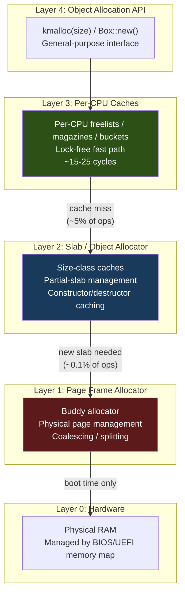
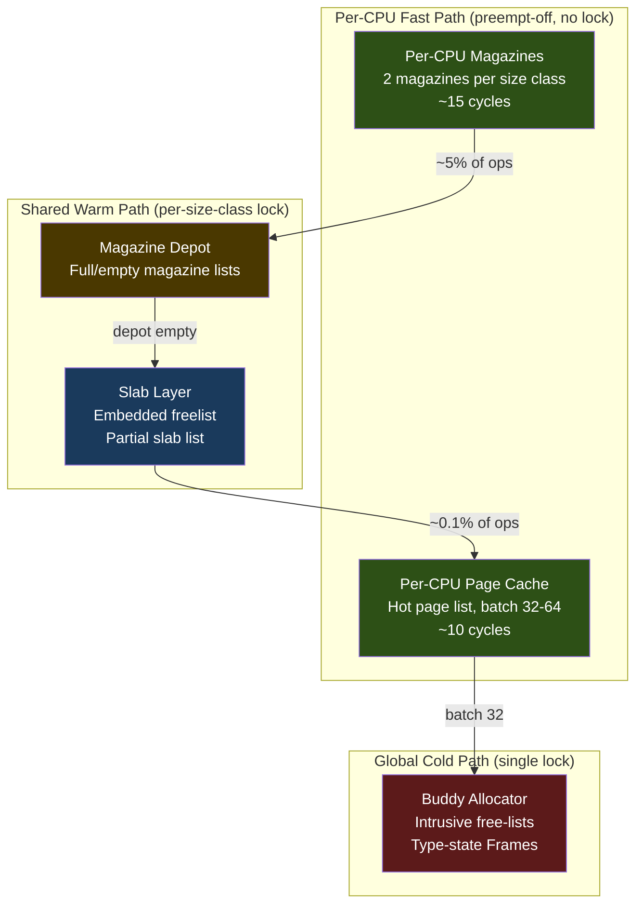

# Modern Memory Allocator Survey

**Status:** Draft
**Branch:** `research/memory-allocator`
**Purpose:** Comprehensive reference for designing a modern, SMP-safe kernel memory allocator for m3OS
**Companion doc:** [`m3os-allocator-analysis.md`](./m3os-allocator-analysis.md) -- current m3OS state and deficiencies

---

## Table of Contents

1. [Overview and Taxonomy](#1-overview-and-taxonomy)
2. [Linux Kernel Allocators](#2-linux-kernel-allocators)
3. [FreeBSD UMA](#3-freebsd-uma)
4. [Rust OS Allocators](#4-rust-os-allocators)
5. [Userspace Allocator Patterns](#5-userspace-allocator-patterns)
6. [Foundational Theory](#6-foundational-theory)
7. [Cross-System Comparison](#7-cross-system-comparison)
8. [Design Recommendations for m3OS](#8-design-recommendations-for-m3os)

---

## 1. Overview and Taxonomy

### 1.1 The Allocation Stack

Every modern OS kernel has a layered memory allocation stack. The layers exist because different allocation patterns have different performance requirements, and caching at each level amortizes the cost of accessing slower levels below.

### 1.2 Systems Surveyed

| System | Type | Key Innovation | Relevance to m3OS |
|--------|------|---------------|-------------------|
| **Linux (SLUB)** | Monolithic kernel | Lockless per-CPU freelist via CAS + tid | Per-CPU fast path design |
| **Linux (buddy)** | Monolithic kernel | Migration-type anti-fragmentation | Buddy allocator improvements |
| **FreeBSD (UMA)** | Monolithic kernel | Zone/keg/bucket model, constructor caching | Per-CPU bucket design, object caching |
| **Redox OS** | Microkernel (Rust) | Minimal kernel allocator, ralloc userspace | Microkernel allocation patterns |
| **Theseus OS** | Single-address-space (Rust) | Type-state frame ownership, per-CPU slab heaps | Rust safety patterns, compile-time guarantees |
| **jemalloc** | Userspace | Arena sharding, tcache, decay-based purging | Size classes, fragmentation control |
| **mimalloc** | Userspace | Free-list sharding, 3-list page model | O(1) metadata lookup, cross-CPU free |
| **tcmalloc** | Userspace | Per-CPU via RSEQ, transfer caches, hugepage-aware | Per-CPU cache design, batch transfers |

---

## 2. Linux Kernel Allocators

### 2.1 Buddy Allocator (Page Allocator)

**Source:** `mm/page_alloc.c` | **Orders:** 0-10 (4 KiB to 4 MiB)

Key features beyond classical buddy: **Zone architecture** (ZONE_DMA, ZONE_DMA32, ZONE_NORMAL, ZONE_MOVABLE), **migration types** (UNMOVABLE, MOVABLE, RECLAIMABLE, HIGHATOMIC, CMA) with per-type free lists at each order to prevent fragmentation, and **watermark-driven reclamation** (WMARK_HIGH/LOW/MIN triggering kswapd or direct reclaim).

**Per-CPU Page Cache (PCP):** Interposes between callers and zone lock for order 0-3. Batch refill/drain (default ~31 pages) amortizes zone lock contention by 31x.

### 2.2 SLUB Allocator

**Source:** `mm/slub.c` | **Status:** Sole slab allocator since Linux 6.8

Objects linked via **embedded freelist pointer** inside each free object. No external bitmap needed. Freelist pointer hardened: `stored_FP = real_FP ^ cache->random ^ &object`.

**Per-CPU structure:** `kmem_cache_cpu { freelist, tid, slab, partial }`. Allocation fast path is **lockless CAS** on `(freelist, tid)` pair -- ~15 cycles, no spinlock, no interrupt disable. tid encodes CPU number + sequence counter to prevent ABA on preemption.

**Slow path cascade:** per-CPU partial list (no lock) -> node partial list (`list_lock`) -> remote NUMA partials -> new slab from buddy.

**Deallocation:** Free to active slab is lockless CAS. Free to frozen slab on another CPU also lockless (CAS on slab's own freelist+counters).

**Cache merging:** Automatically merges compatible caches (same size, alignment) to reduce total count ~200 -> ~120.

### 2.3 kmalloc Size Classes

Power-of-two with intermediate 96 and 192 classes: 8, 16, 32, 64, **96**, 128, **192**, 256, 512, 1K, 2K, 4K, 8K. The 96/192 classes reduce worst-case waste from 50% to 33% for the common 65-96 and 129-192 byte ranges.

### 2.4 GFP Flags

| Flag | Can Sleep | Reclaim | Reserves | Use |
|------|-----------|---------|----------|-----|
| `GFP_ATOMIC` | No | No | Yes | IRQ handlers, spinlock holders |
| `GFP_NOWAIT` | No | No | No | Best-effort atomic context |
| `GFP_KERNEL` | Yes | Yes | No | Normal kernel allocation |
| `GFP_NOFAIL` | Yes (infinite) | Yes | No | Must succeed |

### 2.5 Memory Debugging

| Tool | Overhead | Detects | Production? |
|------|----------|---------|-------------|
| **SLUB debug** | 2-5x | Buffer overflow, use-after-free | No |
| **KASAN** | 2-3x CPU, 12.5% RAM | All memory errors | No (generic) |
| **KFENCE** | <1% | Sampled: overflow, UAF | **Yes** |
| **kmemleak** | Moderate | Memory leaks | Dev only |

---

## 3. FreeBSD UMA

### 3.1 Architecture: Zone / Keg / Slab

Three-tier separation: **Zone** (consumer API, ctor/dtor, per-CPU buckets) -> **Keg** (storage manager, slab geometry) -> **Slab** (pages divided into items, index-based freelist). Multiple zones can share a keg.

### 3.2 Per-CPU Bucket Caching

Each zone has per-CPU caches with alloc_bucket + free_bucket + cross_bucket (NUMA). Fast path (~20 cycles): preemption-disabled, pop from alloc bucket -- no mutex, no atomics. On miss: swap alloc/free -> fetch full bucket from zone cache (uz_lock) -> slab layer (uk_lock) -> VM.

Bucket sizing: 32 entries for <=256B items, 16 for <=1K, 8 for <=4K, 4 for >4K. 95%+ bucket hit rate in production.

### 3.3 Constructor/Destructor Object Caching

UMA caches **constructed objects**, not just memory. In steady state with effective bucket caching, neither ctor nor dtor runs. This is the key difference from SLUB (which stores the freelist pointer inside freed objects, destroying their state).

### 3.4 NUMA Support

Per-domain slab lists, per-domain bucket lists, cross-domain free bucket prevents wrong-domain memory migration. Policies: FIRSTTOUCH, ROUNDROBIN, domainset-based.

### 3.5 Synchronization

| Layer | Mechanism | Contention |
|-------|-----------|-----------|
| Per-CPU cache | `critical_enter()` (preempt disable) | Zero |
| Zone bucket cache | `uz_lock` mutex | Low |
| Keg / slab | `uk_lock` mutex | Low |
| VM subsystem | vm_page locks | Rare |

---

## 4. Rust OS Allocators

### 4.1 Redox OS

Microkernel: minimal kernel allocator (`linked_list_allocator` + `spin::Mutex`, 1 MiB initial, auto-grow). Same pattern as current m3OS. Production frame allocator uses true buddy with per-order doubly-linked lists and XOR buddy merge. Userspace: ralloc with sorted block pool, binary-search + coalescing, two-level global+per-thread design.

### 4.2 Theseus OS

**Type-state frames:** `Frames<{MemoryState::Free}>`, `Frames<{MemoryState::Allocated}>`, `Frames<{MemoryState::Mapped}>`. State transitions consume old type, produce new. Cannot `Clone` -- double-free is a compile error. `MappedPages` provides safe typed access via `as_type<T: FromBytes>()`.

**Per-CPU slab heaps:** `MultipleHeaps` indexed by APIC ID, each with `ZoneAllocator` (11 size classes, 8B-8KiB). Deallocation returns to originating CPU via embedded heap-ID in page metadata.

**Bootstrap:** `StaticArrayRBTree` -- fixed 32-element array for pre-heap, transitions to RBTree after heap init. Eliminates Vec dependency.

---

## 5. Userspace Allocator Patterns

### 5.1 jemalloc

**Arenas:** N arenas (4x ncpus), threads round-robin. Independent mutexes per arena. **tcache:** Per-thread, per-size-class stacks. Zero synchronization on fast path. Batch fill/flush from arena. **Size classes:** 4-steps-per-doubling geometric, <20% max waste. **Fragmentation:** Decay-based purging (dirty -> muzzy -> retained).

### 5.2 mimalloc

**Free-list sharding:** Per-page free lists for spatial locality. **Three free lists per page:** local (thread-local, no sync), thread-delayed (atomic CAS cross-thread), full (batch-collected). Same-thread alloc/free: zero atomics. Cross-thread free: single CAS. Collection: single `atomic_exchange` grabs entire queue. **O(1) address-to-metadata** via segment alignment masking.

### 5.3 tcmalloc

**Per-CPU caches** (evolved from per-thread). Uses RSEQ for lock-free per-CPU in userspace. **Transfer caches:** Bounded buffer between per-CPU and central, batch size ~32. **Hugepage-aware backend:** Concentrate allocations in 2 MiB regions, >90% hugepage coverage.

### 5.4 Kernel Applicability

All three converge on: **per-CPU lock-free fast path** as #1 imperative, **geometric size classes** for fragmentation, **batch transfers** to amortize locks, **O(1) metadata lookup** via address alignment. Per-CPU translates naturally to kernel (APIC ID + preempt-off, even simpler than userspace RSEQ).

---

## 6. Foundational Theory

### 6.1 Slab (Bonwick 1994)

Object caching (constructed state), cache coloring (distribute across cache sets), three slab states (free/partial/full). Allocate from partial first.

### 6.2 Magazine Layer (Bonwick & Adams 2001)

Per-CPU loaded+previous magazine. Depot (global, locked) of full/empty magazines. Amortized lock cost: 1/M per allocation. Magazine capacity M=32 -> 32x contention reduction.

### 6.3 Size Class Design

Geometric N-steps-per-doubling. Max waste 1/N. Recommended: 4 steps (20% max waste, 13 classes 32B-4KiB). Verify span-tail waste per size class.

### 6.4 Lock-Free Techniques

CAS-based free list with ABA prevention (tagged pointers/tid). Memory ordering: most allocator ops need only Acquire/Release, not SeqCst.

### 6.5 Per-CPU Data in Kernels

APIC ID lookup (~20 cycles). m3OS has no kernel preemption -> per-CPU access safe without explicit preempt-disable. Simplest of all approaches.

### 6.6 Interrupt-Safe Allocation

Disable interrupts during per-CPU cache access (effectively free for <20 instructions). GFP-like flags for deeper paths.

---

## 7. Cross-System Comparison

### 7.1 Feature Matrix

| Feature | Linux | FreeBSD | Redox | Theseus | m3OS |
|---------|-------|---------|-------|---------|------|
| Per-CPU page cache | PCP (batch 31) | N/A | No | No | **No** |
| Per-CPU object cache | SLUB freelist | UMA buckets | No | Per-CPU heaps | **No** |
| Lock-free fast path | CAS + tid | Preempt-off | No | No | **No** |
| Size classes | 13 | Per-zone | 9 | 11 | **5** |
| Constructor caching | ctor once | Full ctor/dtor | N/A | N/A | **No** |
| NUMA awareness | Per-node | Per-domain | No | No | **No** |
| Context flags (GFP) | Full | M_WAITOK/NOWAIT | No | No | **No** |
| Memory debugging | KASAN+KFENCE | UMA_DEBUG | None | None | **Assertions** |
| Type-safe frames | No | No | No | **Yes** | **No** |

### 7.2 Allocation Cost Comparison

| System | Fast Path Cycles | Lock | Mechanism |
|--------|-----------------|------|-----------|
| Linux SLUB | ~15 | None | cmpxchg_double |
| FreeBSD UMA | ~20 | Preempt-off | Array pop |
| Theseus | ~50 | IrqSafeMutex | Bitmap scan |
| m3OS current | ~200-1000+ | Global spin::Mutex | Linked-list scan |

---

## 8. Design Recommendations for m3OS

### 8.1 Target Architecture

Combine: UMA-style magazines (simplest per-CPU, no atomics on fast path), SLUB-style embedded freelist (minimal metadata), Linux PCP-style page cache (amortized buddy lock), Theseus type-state frames (compile-time safety), mimalloc cross-CPU atomic free list (lockless cross-CPU free).

### 8.2 Expected Performance

| Operation | Current | Target | Improvement |
|-----------|---------|--------|-------------|
| Object alloc (fast) | ~200-1000 cycles | ~15-25 cycles | 10-50x |
| Object free (same CPU) | ~200-1000 cycles | ~15-25 cycles | 10-50x |
| Object free (cross CPU) | Same | ~30-50 cycles | 5-20x |
| Frame alloc | ~50-100 cycles | ~10-20 cycles | 3-5x |

### 8.3 Open Questions

1. Magazine capacity: fixed or adaptive?
2. Constructor caching: worth complexity for m3OS?
3. Slab order: always 4 KiB or allow multi-page?
4. Frame zeroing: move from free-time to alloc-time?
5. NUMA: add per-domain lists now (cheap, forward-looking)?

---

## References

- Bonwick, J. (1994). "The Slab Allocator." USENIX Summer.
- Bonwick, J. and Adams, J. (2001). "Magazines and Vmem." USENIX Annual.
- Roberson, J. (2003). "UMA: A New Kernel Memory Allocator." BSDCan.
- Lameter, C. (2007). "SLUB: The Unqueued Slab Allocator." Linux Kernel Summit.
- Leijen, D. et al. (2019). "Mimalloc: Free List Sharding in Action." ISMM.
- Linux source: `mm/slub.c`, `mm/page_alloc.c`, `include/linux/gfp.h`
- FreeBSD source: `sys/vm/uma_core.c`, `sys/vm/uma_int.h`
- Theseus source: `kernel/frame_allocator/src/lib.rs`, `kernel/multiple_heaps/src/lib.rs`
