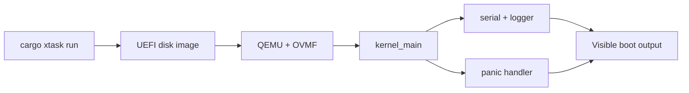

# Phase 01 — Boot Foundation

**Status:** Complete
**Source Ref:** phase-01
**Depends on:** None (first phase)
**Builds on:** N/A — this is the initial foundation
**Primary Components:** kernel crate, xtask build system, serial output, panic handler

## Milestone Goal

Boot the kernel through UEFI, print useful output over serial, and halt cleanly. This is
the first end-to-end proof that the workspace, toolchain, boot path, and panic path all
work together.

## Why This Phase Exists

Every OS project needs a trustworthy boot path before anything else can be built. Without
serial logging and a panic handler, debugging later phases would be guesswork. This phase
establishes the minimum viable kernel — one that boots, proves it is running, and fails
visibly when something goes wrong.

## Learning Goals

- Understand `#![no_std]` and `#![no_main]`.
- Learn how the bootloader transfers control to the kernel.
- Build confidence in serial logging as the primary debugging tool.
- Establish a repeatable build and run workflow.

## Feature Scope

- workspace layout with `kernel/` and `xtask/`
- bootable kernel image generation
- serial output macros and logger integration
- basic panic handler with readable output
- `cargo xtask run` and `cargo xtask image`

## Important Components and How They Work

### Serial Output

COM1 serial is initialized early in boot. Print macros (`serial_print!`, `serial_println!`)
write directly to the UART. A logger backend is installed so the `log` crate facade routes
through serial, giving all later phases structured log output for free.

### Panic Handler

The panic handler captures the panic location and message, emits them over serial, and
halts the CPU in a loop. This ensures that any early failure produces visible diagnostics
rather than a silent hang.

### xtask Build System

The `xtask` crate is a host-side Rust binary that orchestrates image generation and QEMU
launch. `cargo xtask run` builds the kernel, produces a UEFI disk image, and boots it in
QEMU with OVMF firmware.

## How This Builds on Earlier Phases

- N/A — this is the first phase and establishes the foundation for all subsequent work.

## Implementation Outline

1. Set up the kernel crate and host-side `xtask`.
2. Define the target and runner configuration used for OS builds.
3. Initialize COM1 serial and expose simple print macros.
4. Install a logger backend that writes through serial.
5. Add a minimal `kernel_main` entry point and `hlt` loop.
6. Add a panic handler that emits enough context to debug early failures.

## Acceptance Criteria

- The kernel boots in QEMU through UEFI.
- Serial output includes a clear startup message.
- Panics print a message and halt instead of silently freezing.
- Image generation is predictable and reproducible.

## Companion Task List

- [Phase 1 Task List](./tasks/01-boot-foundation-tasks.md)

## Implementation Document

- [Boot Process](../02-boot.md)

## How Real OS Implementations Differ

Production kernels usually support many boot environments, richer hardware discovery,
multiple log sinks, and more defensive boot diagnostics. A learning project can keep the
boot path narrow and explicit so the reader can see every step without being buried in
platform variation.

## Deferred Until Later

- framebuffer output
- test harness integration beyond basic smoke testing
- real hardware boot support beyond the documented QEMU path
