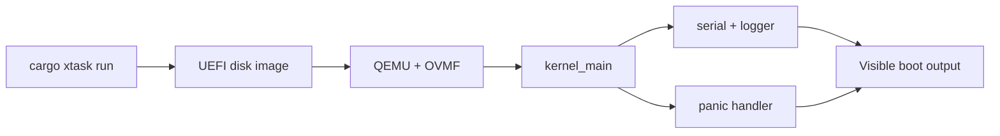

# Phase 1 - Boot Foundation

## Milestone Goal

Boot the kernel through UEFI, print useful output over serial, and halt cleanly. This is
the first end-to-end proof that the workspace, toolchain, boot path, and panic path all
work together.

## Learning Goals

- Understand `#![no_std]` and `#![no_main]`.
- Learn how the bootloader transfers control to the kernel.
- Build confidence in serial logging as the primary debugging tool.
- Establish a repeatable build and run workflow.

## Feature Scope

- workspace layout with `kernel/` and `xtask/`
- bootable kernel image generation
- serial output macros and logger integration
- basic panic handler with readable output
- `cargo xtask run` and `cargo xtask image`

## Implementation Outline

1. Set up the kernel crate and host-side `xtask`.
2. Define the target and runner configuration used for OS builds.
3. Initialize COM1 serial and expose simple print macros.
4. Install a logger backend that writes through serial.
5. Add a minimal `kernel_main` entry point and `hlt` loop.
6. Add a panic handler that emits enough context to debug early failures.

## Acceptance Criteria

- The kernel boots in QEMU through UEFI.
- Serial output includes a clear startup message.
- Panics print a message and halt instead of silently freezing.
- Image generation is predictable and reproducible.

## Companion Task List

- [Phase 1 Task List](./tasks/01-boot-foundation-tasks.md)

## Implementation Document

- [Boot Process](../02-boot.md)

## Documentation Deliverables

- explain the boot path from `xtask` to `kernel_main`
- document early logging and panic behavior
- record build prerequisites such as QEMU and OVMF

## How Real OS Implementations Differ

Production kernels usually support many boot environments, richer hardware discovery,
multiple log sinks, and more defensive boot diagnostics. A learning project can keep the
boot path narrow and explicit so the reader can see every step without being buried in
platform variation.

## Deferred Until Later

- framebuffer output
- test harness integration beyond basic smoke testing
- real hardware boot support beyond the documented QEMU path
