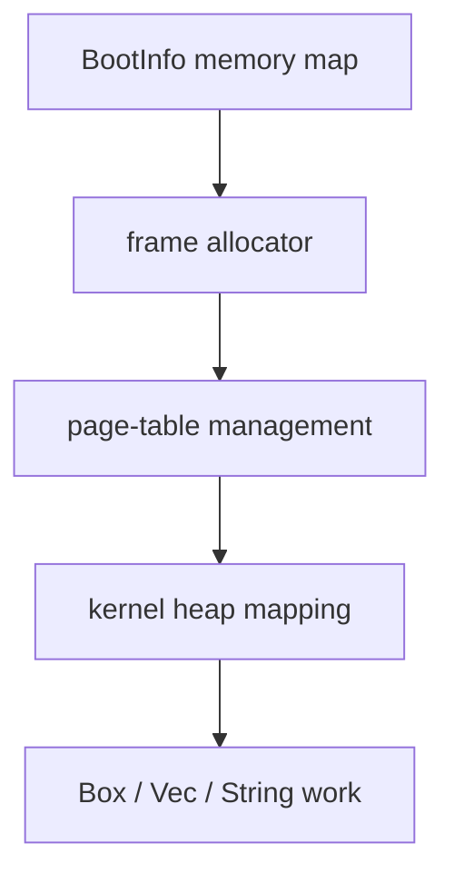

# Phase 02 — Memory Basics

**Status:** Complete
**Source Ref:** phase-02
**Depends on:** Phase 1 (Boot Foundation) ✅
**Builds on:** Phase 1's boot path and serial logging to add memory management
**Primary Components:** frame allocator, page-table management, kernel heap, global allocator

## Milestone Goal

Move from a static early kernel into a kernel that can allocate memory safely and reason
about physical and virtual address space.

## Why This Phase Exists

Phase 1 proved the kernel can boot and print, but everything was statically allocated.
Without dynamic memory, the kernel cannot create data structures of unknown size — no
task lists, no buffers, no driver state. This phase introduces the memory subsystem that
every later phase depends on: a frame allocator to hand out physical memory, page-table
helpers to map it, and a heap so Rust's `alloc` types (`Box`, `Vec`, `String`) work.

## Learning Goals

- Understand the memory map provided by the bootloader.
- Learn the difference between physical frames and virtual pages.
- Add a minimal heap without losing track of unsafe boundaries.

## Feature Scope

- parse bootloader memory regions
- simple physical frame allocator
- page mapping helpers
- fixed kernel heap region
- `#[global_allocator]` integration

## Important Components and How They Work

### Frame Allocator

The bootloader provides a memory map describing which physical regions are usable. The
frame allocator walks this map and hands out 4 KiB physical frames, tracking which frames
are already claimed to prevent double-allocation.

### Page-Table Management

Safe wrappers around the `x86_64` crate's page-table operations allow the kernel to map
virtual addresses to physical frames. These wrappers contain the `unsafe` boundary so
callers can map pages without writing unsafe code directly.

### Kernel Heap

A fixed-size virtual region is mapped and handed to a `linked_list_allocator`, which is
installed as the `#[global_allocator]`. After heap init, standard `alloc` types work
throughout the kernel.

## How This Builds on Earlier Phases

- Extends Phase 1's boot path by parsing `BootInfo` memory regions during `kernel_main` init.
- Reuses Phase 1's serial logging for memory subsystem diagnostics and debugging.
- Requires Phase 1's panic handler to catch early memory bugs visibly.

## Implementation Outline

1. Store a `'static` reference to the bootloader memory map (the regions slice is valid
   for the kernel's lifetime) and parse it into typed kernel structures.
2. Implement a simple frame allocator with conservative rules.
3. Expose page-table operations through safe wrappers around `x86_64`.
4. Map a small heap and initialize the allocator.
5. Add simple allocation tests and logging for confidence.

## Acceptance Criteria

- `Box`, `Vec`, and small dynamic data structures work after heap init.
- Frame allocation does not reuse already claimed memory.
- Known virtual addresses can be translated for debugging.
- Memory setup is documented clearly enough to revisit later.

## Companion Task List

- [Phase 2 Task List](./tasks/02-memory-basics-tasks.md)

## How Real OS Implementations Differ

Real kernels support far more memory states, NUMA, large pages, reclaim strategies,
copy-on-write, and demand paging. For a toy OS, a fixed heap and a simple allocator are
better because they teach the mechanics without hiding them behind complex policy.

## Deferred Until Later

- reclaiming freed physical frames
- demand paging
- sophisticated virtual memory policies
