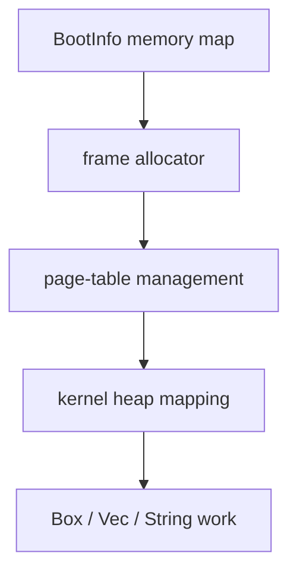

# Phase 2 - Memory Basics

## Milestone Goal

Move from a static early kernel into a kernel that can allocate memory safely and reason
about physical and virtual address space.

## Learning Goals

- Understand the memory map provided by the bootloader.
- Learn the difference between physical frames and virtual pages.
- Add a minimal heap without losing track of unsafe boundaries.

## Feature Scope

- parse bootloader memory regions
- simple physical frame allocator
- page mapping helpers
- fixed kernel heap region
- `#[global_allocator]` integration

## Implementation Outline

1. Store a `'static` reference to the bootloader memory map (the regions slice is valid
   for the kernel's lifetime) and parse it into typed kernel structures.
2. Implement a simple frame allocator with conservative rules.
3. Expose page-table operations through safe wrappers around `x86_64`.
4. Map a small heap and initialize the allocator.
5. Add simple allocation tests and logging for confidence.

## Acceptance Criteria

- `Box`, `Vec`, and small dynamic data structures work after heap init.
- Frame allocation does not reuse already claimed memory.
- Known virtual addresses can be translated for debugging.
- Memory setup is documented clearly enough to revisit later.

## Companion Task List

- [Phase 2 Task List](./tasks/02-memory-basics-tasks.md)

## Documentation Deliverables

- explain how usable frames are selected from the boot memory map
- explain the heap layout and why it is fixed-size at first
- document which parts of paging require `unsafe` and why

## How Real OS Implementations Differ

Real kernels support far more memory states, NUMA, large pages, reclaim strategies,
copy-on-write, and demand paging. For a toy OS, a fixed heap and a simple allocator are
better because they teach the mechanics without hiding them behind complex policy.

## Deferred Until Later

- reclaiming freed physical frames
- demand paging
- sophisticated virtual memory policies
