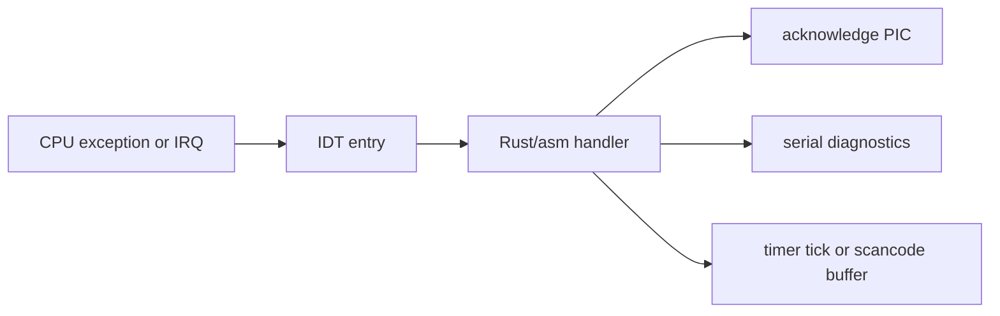

# Phase 03 — Interrupts

**Status:** Complete
**Source Ref:** phase-03
**Depends on:** Phase 1 (Boot Foundation) ✅, Phase 2 (Memory Basics) ✅
**Builds on:** Phase 2's memory management to set up interrupt descriptor tables and stacks
**Primary Components:** IDT, GDT/TSS, PIC, timer IRQ handler, keyboard IRQ handler

## Milestone Goal

Handle exceptions and hardware interrupts reliably enough to support timing, keyboard
input, and basic fault diagnosis.

## Why This Phase Exists

Without interrupts the kernel can only poll for events, which wastes CPU and cannot
respond to hardware in a timely manner. Exceptions (page faults, double faults) need
handlers to produce diagnostics instead of silent crashes. Timer interrupts are the
prerequisite for preemptive scheduling in Phase 4, and keyboard interrupts are the
prerequisite for interactive input. This phase builds the interrupt infrastructure that
nearly every later phase depends on.

## Learning Goals

- Understand the IDT, PIC, and interrupt stacks.
- Separate exception handling from device IRQ handling.
- Keep interrupt handlers minimal and deterministic.

## Feature Scope

- IDT setup for core exceptions
- TSS and IST support for double-fault safety
- PIC remap and EOI handling
- timer interrupt
- keyboard interrupt with scancode buffering

## Important Components and How They Work

### GDT and TSS

The Global Descriptor Table defines kernel and user code/data segments. The Task State
Segment provides Interrupt Stack Table (IST) entries so that critical exceptions like
double faults run on a known-good stack, preventing triple faults.

### IDT

The Interrupt Descriptor Table maps each interrupt vector to a handler function. Core
exceptions (breakpoint, page fault, double fault) get dedicated handlers that log
diagnostics. Hardware IRQ vectors are remapped above exception vectors to avoid conflicts.

### PIC

The 8259 PIC is remapped so IRQ 0-15 do not collide with CPU exception vectors. Each IRQ
handler must send an End-Of-Interrupt (EOI) signal to the PIC before returning. Handlers
are kept minimal: read the device register, buffer the data, send EOI, return.

### Timer and Keyboard Handlers

The timer handler increments a tick counter (used by Phase 4's scheduler). The keyboard
handler reads the scancode from the PS/2 port and pushes it into a ring buffer for later
consumption. Neither handler allocates memory or blocks.

## How This Builds on Earlier Phases

- Extends Phase 1's boot sequence by adding GDT, TSS, and IDT initialization.
- Uses Phase 2's frame allocator to allocate IST stacks for double-fault safety.
- Uses Phase 2's heap for dynamic data structures like interrupt handler registrations.
- Reuses Phase 1's serial logging for exception and IRQ diagnostics.

## Implementation Outline

1. Build the GDT, TSS, and IDT setup sequence.
2. Add exception handlers for breakpoint, page fault, and double fault.
3. Initialize the PIC with a clean vector layout.
4. Add timer and keyboard IRQ handlers.
5. Push non-trivial work out of the IRQ path into buffers or later phases.

## Acceptance Criteria

- Breakpoints and page faults produce readable diagnostics.
- Timer interrupts occur at the expected cadence.
- Keyboard input reaches a buffer or log output.
- Interrupt handlers do not allocate or block.

## Companion Task List

- [Phase 3 Task List](./tasks/03-interrupts-tasks.md)

## How Real OS Implementations Differ

Modern kernels often use APICs, MSI/MSI-X, more sophisticated interrupt routing, and
complex per-CPU data structures. This project should stay with the simpler PIC path
until the reader understands exceptions, IRQ acknowledgment, and stack discipline.

## Deferred Until Later

- APIC and SMP interrupt routing
- advanced driver interrupt models
- complex deferred work queues
