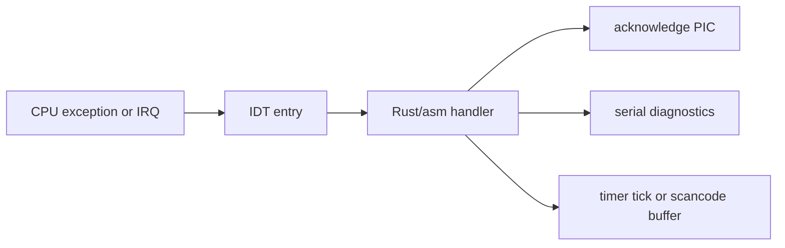

# Phase 3 - Interrupts

## Milestone Goal

Handle exceptions and hardware interrupts reliably enough to support timing, keyboard
input, and basic fault diagnosis.

## Learning Goals

- Understand the IDT, PIC, and interrupt stacks.
- Separate exception handling from device IRQ handling.
- Keep interrupt handlers minimal and deterministic.

## Feature Scope

- IDT setup for core exceptions
- TSS and IST support for double-fault safety
- PIC remap and EOI handling
- timer interrupt
- keyboard interrupt with scancode buffering

## Implementation Outline

1. Build the GDT, TSS, and IDT setup sequence.
2. Add exception handlers for breakpoint, page fault, and double fault.
3. Initialize the PIC with a clean vector layout.
4. Add timer and keyboard IRQ handlers.
5. Push non-trivial work out of the IRQ path into buffers or later phases.

## Acceptance Criteria

- Breakpoints and page faults produce readable diagnostics.
- Timer interrupts occur at the expected cadence.
- Keyboard input reaches a buffer or log output.
- Interrupt handlers do not allocate or block.

## Companion Task List

- [Phase 3 Task List](./tasks/03-interrupts-tasks.md)

## Documentation Deliverables

- explain the interrupt path and stack usage
- document why IRQ handlers must stay minimal
- document the vector layout and PIC configuration

## How Real OS Implementations Differ

Modern kernels often use APICs, MSI/MSI-X, more sophisticated interrupt routing, and
complex per-CPU data structures. This project should stay with the simpler PIC path
until the reader understands exceptions, IRQ acknowledgment, and stack discipline.

## Deferred Until Later

- APIC and SMP interrupt routing
- advanced driver interrupt models
- complex deferred work queues
