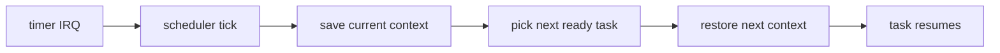

# Phase 04 — Tasking

**Status:** Complete
**Source Ref:** phase-04
**Depends on:** Phase 2 (Memory Basics) ✅, Phase 3 (Interrupts) ✅
**Builds on:** Phase 3's timer interrupt to drive preemptive scheduling
**Primary Components:** task struct, context-switch stub, ready queue, round-robin scheduler, idle task

## Milestone Goal

Introduce multiple concurrent execution contexts in the kernel and make timer-driven
preemption visible and understandable.

## Why This Phase Exists

Up to this point the kernel runs a single thread of execution. To support multiple
processes, drivers, or any form of concurrency, the kernel needs the ability to save one
execution context and restore another. Timer-driven preemption ensures no single task can
monopolize the CPU. This phase introduces the core scheduling loop that Phase 5's
userspace processes and all later phases rely on.

## Learning Goals

- Understand what a task context actually contains.
- Learn how timer interrupts interact with scheduling.
- Build intuition for cooperative versus preemptive execution.

## Feature Scope

- task struct and kernel stacks
- ready queue and task states
- context-switch assembly stub
- idle task
- round-robin scheduler

## Important Components and How They Work

### Task Struct and Kernel Stacks

Each task has a struct holding its saved register state, stack pointer, task ID, and
scheduling state (ready, running, blocked). Each task gets its own kernel stack allocated
from the frame allocator.

### Context-Switch Assembly Stub

The `switch_context(current, next)` function saves callee-saved registers (`rbx`, `rbp`,
`r12`-`r15`, `rsp`, `rip`) of the current task and restores them from the next task. This
is a narrow, carefully audited assembly boundary.

### Ready Queue and Scheduler

Tasks in the ready state sit in a FIFO queue. On each timer tick, the scheduler saves the
current task, picks the next ready task from the queue, and restores it. Round-robin
ensures fairness without complexity.

### Idle Task

When no tasks are ready, the idle task runs a `hlt` loop, yielding the CPU until the next
interrupt. This prevents busy-waiting and provides a clean base case for the scheduler.

## How This Builds on Earlier Phases

- Uses Phase 2's frame allocator to allocate per-task kernel stacks.
- Uses Phase 2's heap for task structs and the ready queue.
- Extends Phase 3's timer interrupt handler to trigger scheduler ticks.
- Reuses Phase 1's serial logging to make task interleaving visible.

## Implementation Outline

1. Define the task model and saved register layout.
2. Create kernel stacks for spawned tasks.
3. Implement the assembly context switch with a narrow ABI.
4. Add a ready queue and a simple scheduler.
5. Trigger rescheduling from timer interrupts.

## Acceptance Criteria

- At least two kernel tasks can run and interleave output.
- Register state survives task switches.
- The idle task runs when there is no ready work.
- Scheduler behavior is simple enough to explain from logs.

## Companion Task List

- [Phase 4 Task List](./tasks/04-tasking-tasks.md)

## How Real OS Implementations Differ

Mature schedulers handle priorities, CPU affinity, latency targets, and many blocking
sources. A toy round-robin scheduler is intentionally unsophisticated because it makes
context switching and task states easy to inspect and reason about.

## Deferred Until Later

- priorities and deadline scheduling
- sleep queues and timers beyond the basic tick
- SMP-aware run queues
