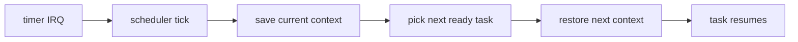

# Phase 4 - Tasking

## Milestone Goal

Introduce multiple concurrent execution contexts in the kernel and make timer-driven
preemption visible and understandable.

## Learning Goals

- Understand what a task context actually contains.
- Learn how timer interrupts interact with scheduling.
- Build intuition for cooperative versus preemptive execution.

## Feature Scope

- task struct and kernel stacks
- ready queue and task states
- context-switch assembly stub
- idle task
- round-robin scheduler

## Implementation Outline

1. Define the task model and saved register layout.
2. Create kernel stacks for spawned tasks.
3. Implement the assembly context switch with a narrow ABI.
4. Add a ready queue and a simple scheduler.
5. Trigger rescheduling from timer interrupts.

## Acceptance Criteria

- At least two kernel tasks can run and interleave output.
- Register state survives task switches.
- The idle task runs when there is no ready work.
- Scheduler behavior is simple enough to explain from logs.

## Companion Task List

- [Phase 4 Task List](./tasks/04-tasking-tasks.md)

## Documentation Deliverables

- explain the saved register set and stack layout
- document the task state machine
- explain how timer interrupts trigger preemption

## How Real OS Implementations Differ

Mature schedulers handle priorities, CPU affinity, latency targets, and many blocking
sources. A toy round-robin scheduler is intentionally unsophisticated because it makes
context switching and task states easy to inspect and reason about.

## Deferred Until Later

- priorities and deadline scheduling
- sleep queues and timers beyond the basic tick
- SMP-aware run queues
