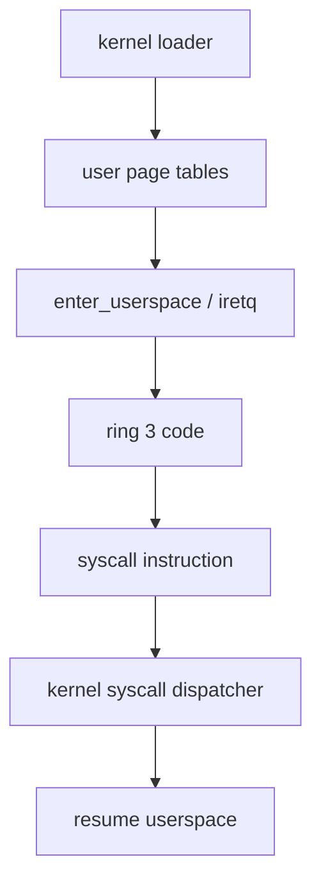

# Phase 05 — Userspace Entry

**Status:** Complete
**Source Ref:** phase-05
**Depends on:** Phase 2 (Memory Basics) ✅, Phase 3 (Interrupts) ✅, Phase 4 (Tasking) ✅
**Builds on:** Phase 4's task model to add ring-3 process support with privilege separation
**Primary Components:** per-process address spaces, segment setup, userspace entry trampoline, syscall gate, syscall dispatcher

## Milestone Goal

Run the first ring 3 program and prove that privilege separation, page permissions, and
basic syscalls work.

## Why This Phase Exists

All previous phases run code in ring 0 with full hardware access. A real OS must isolate
user programs from the kernel so that buggy or malicious code cannot corrupt kernel state
or access hardware directly. This phase introduces the privilege boundary — the most
important architectural invariant in the system. Without it, there is no meaningful
security or stability guarantee.

## Learning Goals

- Understand the boundary between ring 0 and ring 3.
- Learn the minimum pieces needed for a userspace process.
- Introduce the syscall ABI used by the project.

## Feature Scope

- per-process address spaces
- user and kernel segment setup
- userspace entry trampoline
- syscall gate and dispatcher
- simple syscalls such as debug print and exit

## Important Components and How They Work

### Per-Process Address Spaces

Each userspace process gets its own page table hierarchy. Kernel pages are mapped into
every address space (but marked supervisor-only), while user code and stack pages are
mapped with user-accessible permissions. This ensures the kernel is reachable on syscall
entry without a page-table switch.

### Segment Setup

The GDT is extended with user code and data segments (ring 3). The syscall/sysret
instructions rely on a specific segment layout — the kernel code segment, kernel data
segment, user data segment, and user code segment must appear in the correct GDT order.

### Userspace Entry Trampoline

`enter_userspace` uses `iretq` (or `sysretq`) to transition from ring 0 to ring 3. It
pushes the user stack pointer, user code segment, flags, and entry point onto the kernel
stack, then executes the interrupt return to land in userspace.

### Syscall Gate and Dispatcher

The `syscall` instruction is configured via MSRs to jump to a kernel entry point. The
dispatcher reads the syscall number from `rax` and arguments from `rdi`, `rsi`, `rdx`,
`r10`, `r8`, `r9` (note: `rcx` and `r11` are clobbered by `syscall`). Initial syscalls
include debug print (write to serial) and exit (terminate process).

## How This Builds on Earlier Phases

- Extends Phase 4's task struct to include per-process page tables and ring-3 state.
- Uses Phase 2's frame allocator and page-table helpers to build user address spaces.
- Uses Phase 3's IDT for exception handling when userspace faults.
- Extends Phase 3's GDT with user-mode segments.
- Reuses Phase 1's serial output for syscall-based debug printing.

## Implementation Outline

1. Create a process abstraction separate from kernel threads.
2. Build a minimal userspace address space with code and stack mappings.
3. Enter ring 3 through a carefully documented transition path.
4. Install the syscall entry point and argument convention.
5. Add one tiny userspace binary to exercise the path.

## Acceptance Criteria

- A userspace binary runs and returns control cleanly.
- Kernel pages are not writable from ring 3.
- The syscall path is documented and observable through logging.
- Faulting userspace code is reported without taking down the kernel silently.

## Companion Task List

- [Phase 5 Task List](./tasks/05-userspace-entry-tasks.md)

## How Real OS Implementations Differ

Production kernels have richer executable loading, memory permissions, security
policies, and per-thread user contexts. This milestone should focus on a tiny,
single-purpose userspace program so the privilege transition remains easy to follow.

## Deferred Until Later

- dynamic ELF loading
- shared libraries
- full process lifecycle management
