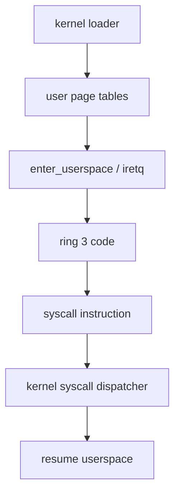

# Phase 5 - Userspace Entry

## Milestone Goal

Run the first ring 3 program and prove that privilege separation, page permissions, and
basic syscalls work.

## Learning Goals

- Understand the boundary between ring 0 and ring 3.
- Learn the minimum pieces needed for a userspace process.
- Introduce the syscall ABI used by the project.

## Feature Scope

- per-process address spaces
- user and kernel segment setup
- userspace entry trampoline
- syscall gate and dispatcher
- simple syscalls such as debug print and exit

## Implementation Outline

1. Create a process abstraction separate from kernel threads.
2. Build a minimal userspace address space with code and stack mappings.
3. Enter ring 3 through a carefully documented transition path.
4. Install the syscall entry point and argument convention.
5. Add one tiny userspace binary to exercise the path.

## Acceptance Criteria

- A userspace binary runs and returns control cleanly.
- Kernel pages are not writable from ring 3.
- The syscall path is documented and observable through logging.
- Faulting userspace code is reported without taking down the kernel silently.

## Companion Task List

- [Phase 5 Task List](./tasks/05-userspace-entry-tasks.md)

## Documentation Deliverables

- explain the syscall register convention
- document the ring transition path at a high level
- explain the first userspace memory layout

## How Real OS Implementations Differ

Production kernels have richer executable loading, memory permissions, security
policies, and per-thread user contexts. This milestone should focus on a tiny,
single-purpose userspace program so the privilege transition remains easy to follow.

## Deferred Until Later

- dynamic ELF loading
- shared libraries
- full process lifecycle management
