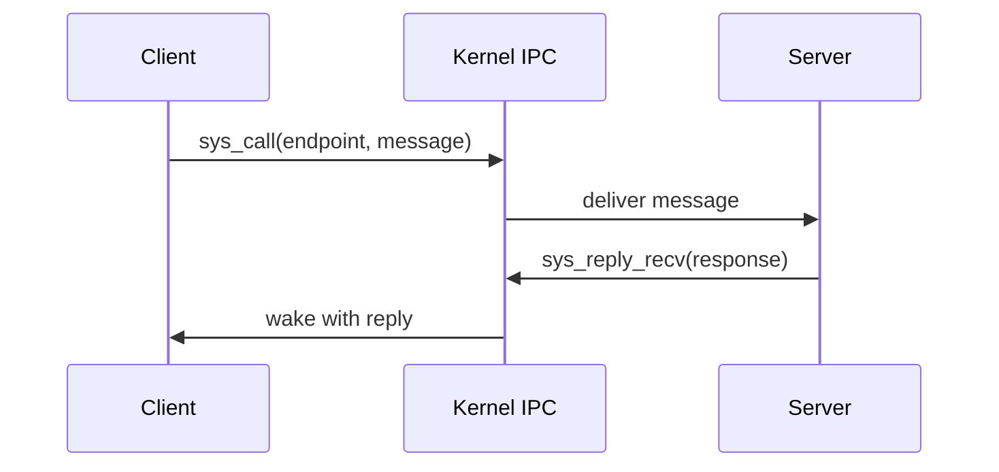

# Phase 6 - IPC Core

## Milestone Goal

Turn the kernel into a real microkernel by making userspace services communicate through
explicit message passing and capabilities.

## Learning Goals

- Understand why microkernels move services out of ring 0.
- Learn synchronous rendezvous IPC semantics.
- Introduce capability tables as the security boundary.

## Feature Scope

- endpoint kernel objects
- capability handles and validation
- `send`, `recv`, `call`, `reply`, `reply_recv`
- notification objects for asynchronous events
- IRQ registration through capabilities

## Implementation Outline

1. Define kernel IPC objects and task wait states.
2. Create a per-process capability table with explicit validation.
3. Implement synchronous message transfer first.
4. Add reply-and-wait server flow once the basic path is stable.
5. Add notification objects for interrupts and one-way signals.

## Acceptance Criteria

- A client can call a server and receive a reply.
- Invalid capabilities are rejected safely.
- Server loops use the intended `reply_recv` pattern.
- IRQ-driven notifications can wake a userspace task.

## Companion Task List

- [Phase 6 Task List](./tasks/06-ipc-core-tasks.md)

## Documentation Deliverables

- explain the rendezvous model and why it was chosen
- document the capability table model
- describe the difference between call/reply and notifications

## How Real OS Implementations Differ

Real microkernels often include more message registers, stronger formal models,
priority-aware scheduling interactions, and carefully tuned fast paths. This project
should keep the IPC contract small and explicit so the reader can trace every state
change during a message exchange.

## Deferred Until Later

- large page-grant transfers
- IPC timeouts and cancellation
- advanced scheduling policies around IPC
