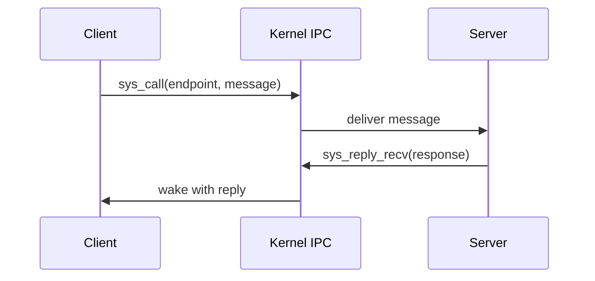

# Phase 06 — IPC Core

**Status:** Complete
**Source Ref:** phase-06
**Depends on:** Phase 5 ✅
**Builds on:** Extends the userspace process model from Phase 5 with inter-process communication primitives
**Primary Components:** kernel/src/ipc/, capability table, endpoint objects, notification objects

## Milestone Goal

Turn the kernel into a real microkernel by making userspace services communicate through
explicit message passing and capabilities.

## Why This Phase Exists

A microkernel moves services out of ring 0, but those services need a way to talk to each
other and to the kernel. Without an explicit IPC mechanism, the only communication path is
shared memory with ad hoc synchronization, which undermines the isolation guarantees that
motivated the microkernel architecture. This phase introduces the fundamental communication
primitives that all subsequent server-based phases depend on.

## Learning Goals

- Understand why microkernels move services out of ring 0.
- Learn synchronous rendezvous IPC semantics.
- Introduce capability tables as the security boundary.

## Feature Scope

- Endpoint kernel objects
- Capability handles and validation
- `send`, `recv`, `call`, `reply`, `reply_recv`
- Notification objects for asynchronous events
- IRQ registration through capabilities

## Important Components and How They Work

### Endpoint Objects

Endpoints are kernel-managed rendezvous points. A client calls into an endpoint and blocks
until the server replies. The kernel transfers the message inline without copying to an
intermediate buffer.

### Capability Table

Each process holds a per-process capability table. Every IPC handle is an index into this
table. The kernel validates the index on every syscall, preventing forged or out-of-range
references.

### Notification Objects

Notification objects provide a lightweight asynchronous signaling mechanism. They hold a
word-sized bitfield that can be signaled from interrupt handlers without blocking. This is
the path used for IRQ delivery to userspace.

## How This Builds on Earlier Phases

- **Extends** the scheduler and task model from Phase 5 with IPC-specific wait states
- **Reuses** the syscall gate from Phase 5 for new IPC syscall numbers
- **Introduces** capability tables as the security primitive that replaces direct kernel object access

## Implementation Outline

1. Define kernel IPC objects and task wait states.
2. Create a per-process capability table with explicit validation.
3. Implement synchronous message transfer first.
4. Add reply-and-wait server flow once the basic path is stable.
5. Add notification objects for interrupts and one-way signals.

## Acceptance Criteria

- A client can call a server and receive a reply.
- Invalid capabilities are rejected safely.
- Server loops use the intended `reply_recv` pattern.
- IRQ-driven notifications can wake a userspace task.

## Companion Task List

- [Phase 6 Task List](./tasks/06-ipc-core-tasks.md)

## How Real OS Implementations Differ

- Real microkernels often include more message registers, stronger formal models,
  priority-aware scheduling interactions, and carefully tuned fast paths.
- Production systems like seL4 use formal verification to prove IPC correctness.
- This project keeps the IPC contract small and explicit so the reader can trace every state
  change during a message exchange.

## Deferred Until Later

- Large page-grant transfers
- IPC timeouts and cancellation
- Advanced scheduling policies around IPC
