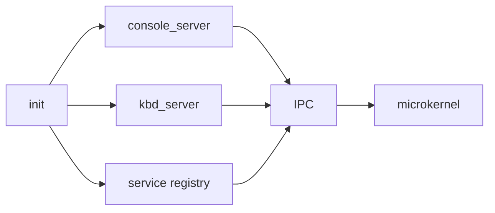

# Phase 7 - Core Servers

## Milestone Goal

Use IPC to assemble the first useful userspace services and prove that the system can be
structured as cooperating servers rather than one large kernel.

## Learning Goals

- Understand service-oriented bootstrapping in a microkernel.
- Learn how names, endpoints, and capabilities are handed out.
- Practice separating policy from mechanism.

## Feature Scope

- `init` as the first userspace process
- service registration or simple nameserver
- `console_server`
- `kbd_server`
- enough bootstrap logic to start and connect services

## Implementation Outline

1. Decide what the kernel launches directly and what `init` launches afterward.
2. Build the service registration model used for early discovery.
3. Move serial console behavior behind a console server.
4. Route keyboard notifications into a dedicated keyboard server.
5. Keep restart and crash handling simple but visible.

## Acceptance Criteria

- `init` starts the first service set successfully.
- Clients can discover the console service and send output to it.
- Keyboard events flow through `kbd_server` rather than directly into the kernel UI path.
- Service startup ordering is documented and easy to follow.

## Companion Task List

- [Phase 7 Task List](./tasks/07-core-servers-tasks.md)

## Documentation Deliverables

- explain the server startup sequence
- explain service discovery at a high level
- explain why console and keyboard are split into separate services

## How Real OS Implementations Differ

Production microkernels often have richer process managers, supervision trees, restart
policies, and dynamic service discovery. The toy design should use a very small service
set and a transparent bootstrap flow so the architecture is easier to learn.

## Deferred Until Later

- automatic service restart policies
- complex capability delegation tooling
- dynamic driver loading

---

## Implementation Notes

### What was actually built

Phase 7 implements the core server infrastructure as **kernel tasks running in ring 0**, not
as ring-3 userspace processes. This is a deliberate scope decision:

- `init_task` runs as a kernel thread; it creates endpoints, populates the service registry,
  and spawns the two server tasks before yielding to the scheduler.
- `console_server` runs as a kernel thread; it loops on `recv`, writes strings to serial, and
  replies with an acknowledgement.
- `kbd_server` runs as a kernel thread; it waits on the IRQ1 notification object and logs the
  notification bits. Scancode reading and forwarding key events to clients are Phase 8+ work.
- The service registry is a static array of 8 entries with 32-byte names; no heap allocation.

Moving servers to ring-3 processes requires an ELF loader and per-process page table setup,
which are Phase 8 deliverables. The IPC plumbing, capability model, and service registry
designed here will work identically when servers are real ring-3 processes.

### Why not wait for ring-3 processes?

The IPC subsystem needs to be exercised end-to-end before the ELF loader is built. Kernel
tasks are the smallest increment that lets us verify the full message-passing path: endpoint
creation, registry lookup, `call`/`reply_recv` server loops, and notification-driven IRQ
delivery. Bugs found here are much cheaper to fix than bugs found after adding process
isolation.

### Acceptance criteria status

| Criterion | Status | Notes |
|---|---|---|
| `init` starts the first service set successfully | Met | `init_task` creates the console endpoint, registers it in the service registry, and spawns both server tasks; the kbd endpoint is managed internally by `kbd_server` via its notification object and is not registered in Phase 7 |
| Clients can discover the console service and send output to it | Met | `lookup("console")` returns a valid `EndpointId`; `call(console_ep, WRITE)` delivers text to serial |
| Keyboard events flow through `kbd_server` | Partial | IRQ1 wakes `kbd_server` via notification and logs the notification bits; scancode reading and client forwarding are Phase 8+ |
| Service startup ordering is documented and easy to follow | Met | Boot log emits one `log::info!` line per step; `docs/07-core-servers.md` documents the sequence |

### Not met in Phase 7 (deferred)

- Servers run in ring 0, not ring 3 — no memory isolation between servers and kernel
- String pointers in IPC payloads are kernel addresses — page grants needed for ring-3
- No service deregistration or restart policy
- Registry syscalls 9 and 10 are wired but unused (no ring-3 callers yet)

## Companion Documentation

- [docs/07-core-servers.md](../../docs/07-core-servers.md) — full design explanation: service
  registry internals, bootstrap sequence, server loop designs, limitations, and comparison with
  production systems
