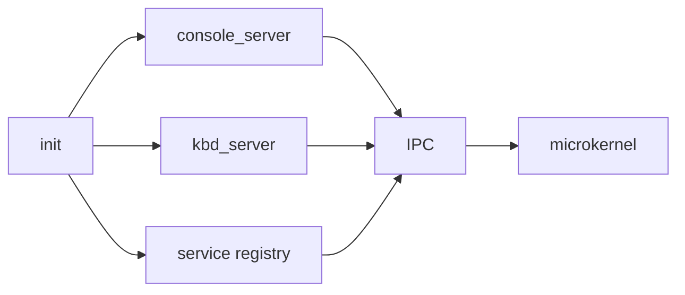

# Phase 7 - Core Servers

## Milestone Goal

Use IPC to assemble the first useful userspace services and prove that the system can be
structured as cooperating servers rather than one large kernel.

## Learning Goals

- Understand service-oriented bootstrapping in a microkernel.
- Learn how names, endpoints, and capabilities are handed out.
- Practice separating policy from mechanism.

## Feature Scope

- `init` as the first userspace process
- service registration or simple nameserver
- `console_server`
- `kbd_server`
- enough bootstrap logic to start and connect services

## Implementation Outline

1. Decide what the kernel launches directly and what `init` launches afterward.
2. Build the service registration model used for early discovery.
3. Move serial console behavior behind a console server.
4. Route keyboard notifications into a dedicated keyboard server.
5. Keep restart and crash handling simple but visible.

## Acceptance Criteria

- `init` starts the first service set successfully.
- Clients can discover the console service and send output to it.
- Keyboard events flow through `kbd_server` rather than directly into the kernel UI path.
- Service startup ordering is documented and easy to follow.

## Companion Task List

- [Phase 7 Task List](./tasks/07-core-servers-tasks.md)

## Documentation Deliverables

- explain the server startup sequence
- explain service discovery at a high level
- explain why console and keyboard are split into separate services

## How Real OS Implementations Differ

Production microkernels often have richer process managers, supervision trees, restart
policies, and dynamic service discovery. The toy design should use a very small service
set and a transparent bootstrap flow so the architecture is easier to learn.

## Deferred Until Later

- automatic service restart policies
- complex capability delegation tooling
- dynamic driver loading
