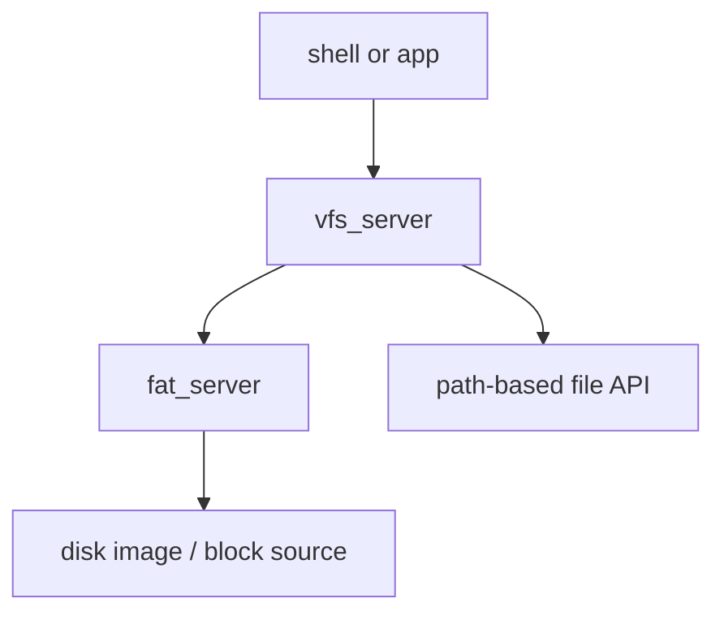

# Phase 8 - Storage and VFS

## Milestone Goal

Expose files through userspace services so programs can read named resources instead of
relying on embedded data or ad hoc kernel hooks.

## Learning Goals

- Understand how a microkernel can provide filesystem access through servers.
- Learn path routing and mount-like behavior without building a full POSIX layer.
- Keep storage read-only at first to reduce complexity.

## Feature Scope

- simple file open and read protocol
- `vfs_server` for path dispatch
- `fat_server` or other minimal read-only filesystem backend
- enough disk-image structure to hold a few files for the shell

## Implementation Outline

1. Define a small file-oriented IPC protocol.
2. Build `vfs_server` as a router instead of a full filesystem implementation.
3. Add one filesystem backend with a narrow scope.
4. Place a few test files in the boot media and verify they can be read.
5. Keep caching and mutation out of the first milestone.

## Acceptance Criteria

- A userspace program can open a file by path and read its contents.
- The VFS and filesystem backend have clear ownership boundaries.
- Failures such as missing files are reported predictably.
- The disk-image content used for demos is documented.

## Companion Task List

- [Phase 8 Task List](./tasks/08-storage-and-vfs-tasks.md)

## Documentation Deliverables

- explain the VFS versus filesystem-server split
- document the first file IPC contract
- explain why the first storage milestone is read-only

## How Real OS Implementations Differ

Mature operating systems add caching, writeback, permissions, journaling, block-layer
abstractions, and many filesystem drivers. A toy OS should start with read-only access
because it teaches layering and naming without dragging in crash consistency problems.

## Deferred Until Later

- writable filesystems
- page cache and buffering
- permissions and access control
