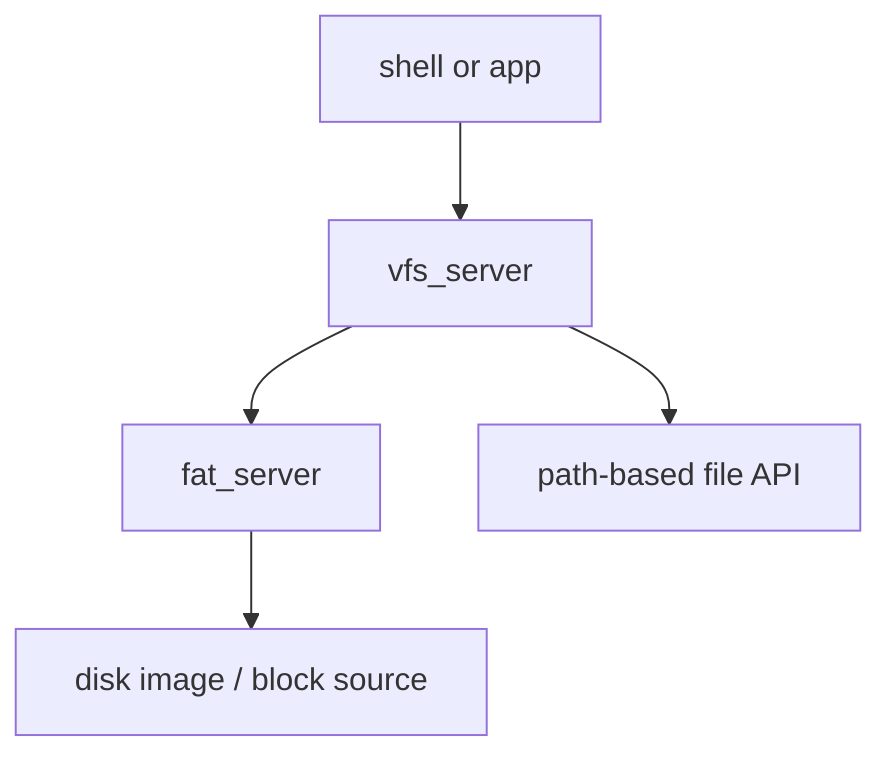

# Phase 08 — Storage and VFS

**Status:** Complete
**Source Ref:** phase-08
**Depends on:** Phase 7 ✅
**Builds on:** Uses the IPC server model from Phase 7 to implement filesystem access as userspace services
**Primary Components:** vfs_server, fat_server, block device layer, file IPC protocol

## Milestone Goal

Expose files through userspace services so programs can read named resources instead of
relying on embedded data or ad hoc kernel hooks.

## Why This Phase Exists

Without a filesystem layer, programs have no way to access persistent named data. Every
program must embed its own resources or use hardcoded kernel hooks. A VFS layer with a
real filesystem backend gives the system path-based file access, which is the foundation
for shell commands like `ls` and `cat`, configuration files, and eventually writable
storage. Structuring this as IPC servers validates the microkernel service model for a
complex, stateful subsystem.

## Learning Goals

- Understand how a microkernel can provide filesystem access through servers.
- Learn path routing and mount-like behavior without building a full POSIX layer.
- Keep storage read-only at first to reduce complexity.

## Feature Scope

- Simple file open and read protocol
- `vfs_server` for path dispatch
- `fat_server` or other minimal read-only filesystem backend
- Enough disk-image structure to hold a few files for the shell

## Important Components and How They Work

### vfs_server

Acts as a router rather than a full filesystem implementation. It receives file requests
by path, determines which filesystem backend owns the path, and forwards the request.
This separation keeps the VFS layer thin and allows multiple filesystem backends to
coexist.

### fat_server

A minimal read-only FAT filesystem backend. It reads directory entries and file contents
from a block device. Write support is deferred to reduce complexity in the initial
implementation.

### File IPC Protocol

A small set of IPC messages defines the contract between clients, the VFS, and filesystem
backends: open-by-path, read, and error reporting. The protocol is intentionally narrow
to keep the first milestone achievable.

### Block Device Layer

Provides the raw block I/O interface that filesystem backends use to read from disk
images. The boot media contains a few test files for verification.

## How This Builds on Earlier Phases

- **Extends** the IPC server model from Phase 7 with filesystem-specific servers
- **Reuses** the service registry from Phase 7 for VFS and filesystem server discovery
- **Reuses** the capability model from Phase 6 for file handle access control
- **Enables** Phase 9's shell commands (`ls`, `cat`) by providing path-based file access

## Implementation Outline

1. Define a small file-oriented IPC protocol.
2. Build `vfs_server` as a router instead of a full filesystem implementation.
3. Add one filesystem backend with a narrow scope.
4. Place a few test files in the boot media and verify they can be read.
5. Keep caching and mutation out of the first milestone.

## Acceptance Criteria

- A userspace program can open a file by path and read its contents.
- The VFS and filesystem backend have clear ownership boundaries.
- Failures such as missing files are reported predictably.
- The disk-image content used for demos is documented.

## Companion Task List

- [Phase 8 Task List](./tasks/08-storage-and-vfs-tasks.md)

## How Real OS Implementations Differ

- Mature operating systems add caching, writeback, permissions, journaling, block-layer
  abstractions, and many filesystem drivers.
- A toy OS starts with read-only access because it teaches layering and naming without
  dragging in crash consistency problems.
- Production VFS layers (Linux, BSD) support dozens of filesystem types, mount namespaces,
  and complex permission models.

## Deferred Until Later

- Writable filesystems
- Page cache and buffering
- Permissions and access control
